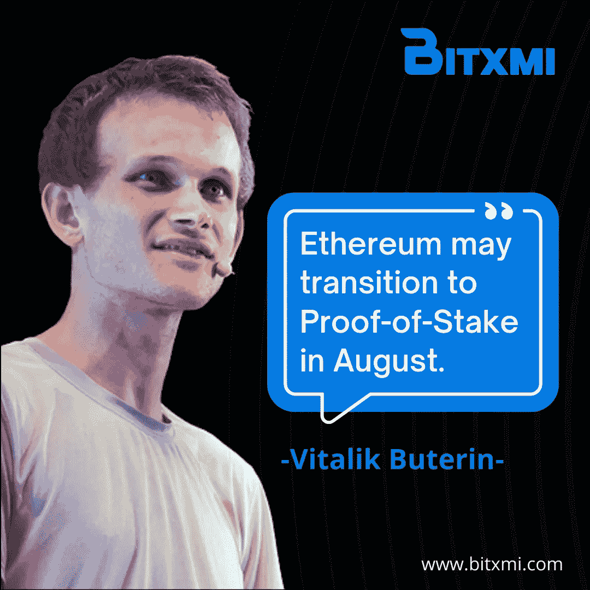
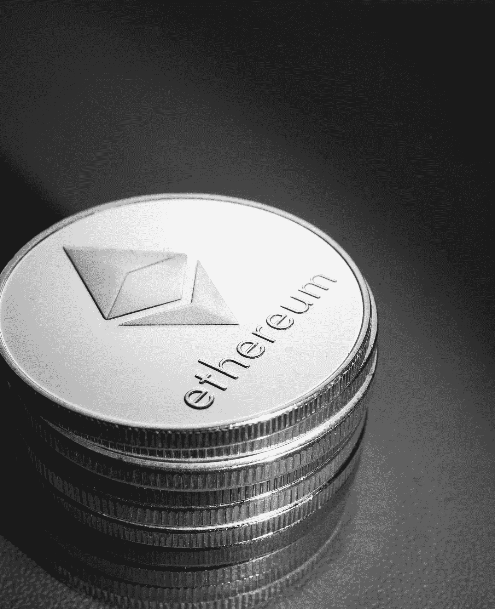

# 以太坊可能会在 8 月过渡到股权证明。

> 原文：<https://medium.com/coinmonks/ethereum-may-transition-to-proof-of-stake-in-august-b1908ee99df7?source=collection_archive---------15----------------------->

Source: [https://news.bxmi.io/](https://news.bxmi.io/)

第二大区块链网络以太坊(Ethereum)可能会在 8 月份转而使用股权共识证明算法。以太坊搬到区块链的计划可能会在 2022 年 8 月至 10 月间实施。这种转变在加密货币社区中通常被称为 Merge 或 ETH 2.0。

以太坊的联合创始人 Vitalik Buterin 周五在上海举行的以太坊开发者峰会上证实了这一消息。虽然 Buterin 表示合并很有可能在 8 月份进行，但他也强调可能会出现延迟。如果没有问题，集成将在 8 月进行，”Buterin 周四在 ETH 上海 Web 3.0 开发者峰会上表示。

> **参见:**[**Terra/Luna 会从崩溃中恢复吗？**](https://wire.insiderfinance.io/will-terra-luna-recover-from-the-crash-e9c304457f57)

以太坊的合并被期待已久

Source: Pixabay.com

这一合并是人们广泛期待的以太坊升级，如果一切按计划进行，它将把主要区块链从工作证明方法转变为利益证明机制。

目前，以太坊使用一种工作验证架构，其中矿工竞争解决困难的问题，以验证需要大量能源和计算机能力的交易。以太坊向股权证明(proof-of-stake)的转变旨在使其更加高效和环保，在股权证明中，交易由那些对网络做出贡献或“持有股份”的人进行认证。

> **参见:**[**NFT 股市是否正在走向崩盘？**](https://wire.insiderfinance.io/is-the-nft-market-headed-for-a-crash-47b4da7ffb83)

这一举措将是一项意义深远的重大变革。以太坊开发者多年来一直致力于向风险证明的过渡。尽管如此，整合被一再推迟，导致许多人认为合并不太可能发生。然而，“整合似乎迫在眉睫，”布特林补充说。以太坊最终将转变为一个利益攸关的网络。

上周宣布以太坊网络将达到一个“重要的测试里程碑”，Ropsten testnet 合并定于 6 月 8 日，之后再次承诺该计划。在 Ropsten 测试网合并期间，PoW 测试网将与新的 PoS 共识层测试网合并。

它旨在复制以太坊和信标链实际合并后会发生的情况，并且网络成为 PoS 网络。

假设合并在八月份成功执行。在这种情况下，以太坊(以前称为 Eth2)路线图上的最后一个里程碑是碎片链升级，预计将于 2023 年初上线。在此之前，该网络将继续依赖于第二层网络，如乐观和多边形，以管理高交易量和可扩展性。

> 加入 Coinmonks [电报频道](https://t.me/coincodecap)和 [Youtube 频道](https://www.youtube.com/c/coinmonks/videos)了解加密交易和投资

# 另外，阅读

*   [CBET 点评](https://coincodecap.com/cbet-casino-review) | [库币 vs 比特币基地](https://coincodecap.com/kucoin-vs-coinbase) | [拜比特 vs 比特币基地](https://coincodecap.com/bybit-vs-coinbase)
*   [折叠 App 回顾](https://coincodecap.com/fold-app-review) | [本地比特币回顾](/coinmonks/localbitcoins-review-6cc001c6ed56) | [Bybit vs 币安](https://coincodecap.com/bybit-binance-moonxbt)
*   [加密保证金交易交易所](/coinmonks/crypto-margin-trading-exchanges-428b1f7ad108) | [赚取比特币](/coinmonks/earn-bitcoin-6e8bd3c592d9) | [Mudrex 投资](https://coincodecap.com/mudrex-invest-review-the-best-way-to-invest-in-crypto)
*   [WazirX vs CoinDCX vs bit bns](/coinmonks/wazirx-vs-coindcx-vs-bitbns-149f4f19a2f1)|[block fi vs coin loan vs Nexo](/coinmonks/blockfi-vs-coinloan-vs-nexo-cb624635230d)
*   [比斯勒评论](https://coincodecap.com/bitsler-review)|[WazirX vs coin switch vs coin dcx](https://coincodecap.com/wazirx-vs-coinswitch-vs-coindcx)
*   [7 大副本交易平台](https://coincodecap.com/copy-trading-platforms) | [BuyCoins 点评](https://coincodecap.com/buycoins-review)