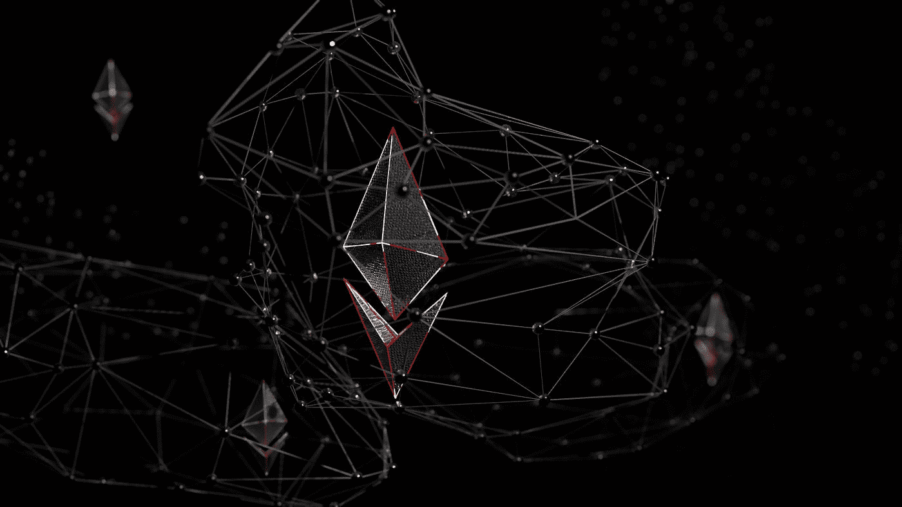

# 以太坊合并将于八月到来——这会对市场产生什么影响？

> 原文：<https://medium.com/coinmonks/ethereum-merge-coming-in-august-which-impact-will-it-have-on-the-market-6314df77859e?source=collection_archive---------6----------------------->

Photo by [Shubham Dhage](https://unsplash.com/@theshubhamdhage?utm_source=medium&utm_medium=referral) on [Unsplash](https://unsplash.com?utm_source=medium&utm_medium=referral)

以太坊核心开发者 [@preston_vanloon](http://twitter.com/preston_vanloon) 在无许可会议上谈到了期待已久的和即将到来的 ETH 1.0 和 ETH 2.0 链的合并(“合并”)，这将看到以太坊从工作证明转移到利益证明机制。开发人员表示，合并实际上已经准备好了，团队目前只是在测试。他预测…