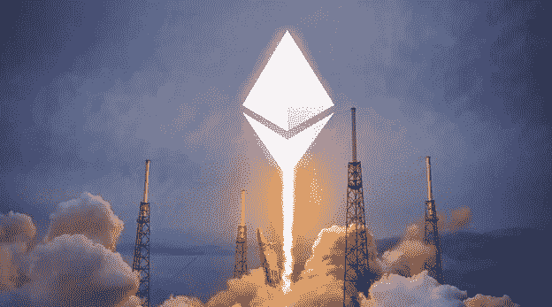

# 以太坊合并解释

> 原文：<https://medium.com/coinmonks/ethereum-merge-explained-3b82282417e?source=collection_archive---------30----------------------->

你可能听说过一个名为以太坊 2.0 的升级计划。以太坊基金会现在称之为以太坊合并。以太坊合并被描述为密码史上最重要的事件。

以太坊目前运行在两种机制上，即利害关系证明和工作证明。mainnet 继续受到工作证明的保护，即使在信标链

使用利害关系证明并行运行。合并是指这两个系统最终走到一起，两个层都在一个基于利益相关证明的链中。以太坊基金会为合并提供了一个易于理解的类比。想象以太坊是一艘没有准备好进行星际航行的宇宙飞船。有了灯塔链，社区已经建立了一个新的引擎和硬化船体。到时候，当前的飞船将与这个新系统对接，合并成一艘飞船，准备投入一些严重的光年，并接管宇宙。

# 那么，合并的好处是什么呢？

向股权证明的转变有望使以太坊更具可扩展性、安全性和可持续性。区块链的矿工将被淘汰，从而将网络的碳足迹和能源消耗减少 99.95%。

# 那么，这次合并预计什么时候进行？

合并最早是在 2016 年提出的。事实证明，这种转变比最初预期的要复杂得多。以太坊基金会的首席开发人员 Tim Beiko 表示，合并将在今年(2022 年)6 月后的几个月内发生。用他的话说，“有很多怀疑，因为以太坊已经承诺了五年的利害关系证明。”很难让人相信这次是真的。"

# 那么，为什么还有人买以太坊采矿设备呢？

因为合并在过去已经被延迟，许多人怀疑它是否会很快发生。人们对他们的保留不屑一顾，尽管他们有所保留，仍然继续购买以太坊采矿设备。建造一个以太采矿钻机可能需要数千美元的设备，包括特定的计算机、显卡和其他组件。矿商在设备上投入大量资金，希望从长远来看会有回报。这种策略近年来可能对他们很有效，但随着合并的临近，不能保证他们能从长期采矿中赚钱。

这是令人兴奋的消息，不是吗？所以，你可能会问以太坊合并会对你目前的以太坊股份产生什么影响。没什么。这只是简单的合并。没有宣布新的代币或硬币。如果您拥有任何 ETH，您不需要做任何事情。这是以太坊基金会逐步淘汰“以太坊 2”标签的原因之一，因为许多投资者被误导，认为将发行新的令牌，而骗子正在利用这一点。

我们相信，以太坊将成为世界上最强大、应用最广泛、最值得信赖、最节能的区块链网络。

> 加入 Coinmonks [电报频道](https://t.me/coincodecap)和 [Youtube 频道](https://www.youtube.com/c/coinmonks/videos)了解加密交易和投资

# 另外，阅读

*   [印度加密交易所](/coinmonks/bitcoin-exchange-in-india-7f1fe79715c9) | [比特币储蓄账户](/coinmonks/bitcoin-savings-account-e65b13f92451)
*   [Cloudbet 赌场评论](https://coincodecap.com/cloudbet-casino-review) | [点火赌场评论](https://coincodecap.com/ignition-casino-review)
*   [币安收费](/coinmonks/binance-fees-8588ec17965) | [僵尸加密审查](/coinmonks/botcrypto-review-2021-build-your-own-trading-bot-coincodecap-6b8332d736c7) | [热点审查](/coinmonks/hotbit-review-cd5bec41dafb)
*   [my constant Review](https://coincodecap.com/myconstant-review)|[8 款最佳摇摆交易机器人](https://coincodecap.com/best-swing-trading-bots)
*   [我的加密副本交易经历](/coinmonks/my-experience-with-crypto-copy-trading-d6feb2ce3ac5) | [AAX 交易所评论](/coinmonks/aax-exchange-review-2021-67c5ea09330c)
*   [逐位融资融券交易](/coinmonks/bybit-margin-trading-e5071676244e) | [币安融资融券交易](/coinmonks/binance-margin-trading-c9eb5e9d2116) | [超位审核](/coinmonks/overbit-review-9446ed4f2188)
*   [有哪些交易信号？](https://coincodecap.com/trading-signal) | [比特斯坦普 vs 比特币基地](https://coincodecap.com/bitstamp-coinbase)