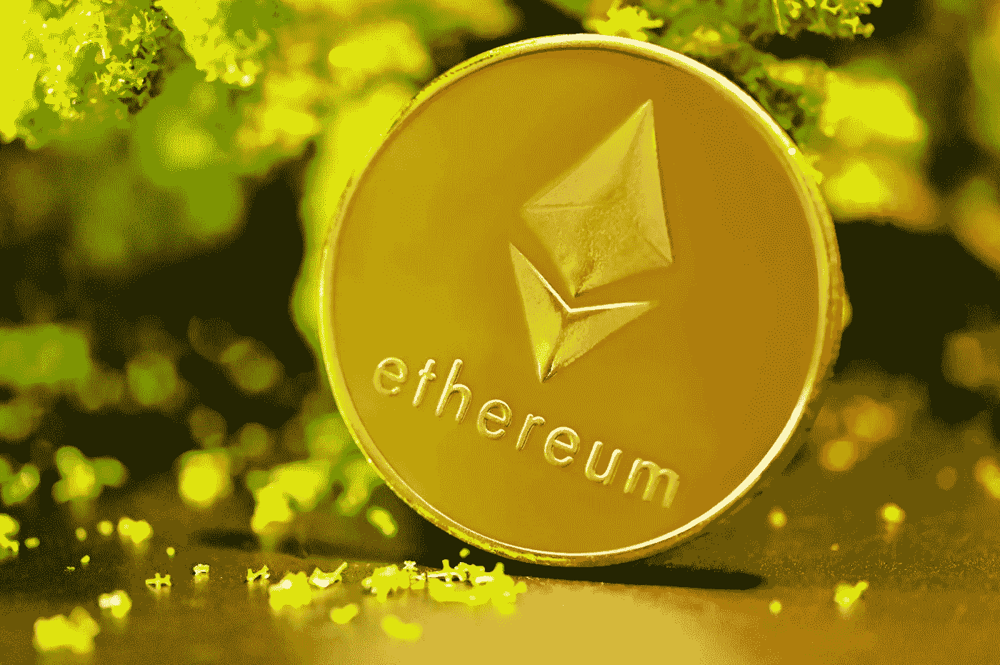

# 以太坊合并——何时、为什么和什么？

> 原文：<https://medium.com/coinmonks/ethereum-merge-when-why-and-what-376521086b5f?source=collection_archive---------15----------------------->

Source photo Unsplash.com

## 以太坊的问题

以太坊的问题已经广为人知。我有时会后悔，由于高昂的天然气价格，它已经变成了一个精英主义的区块链。你想花 50 万美元买一个 NFT 吗？然后，也许，100 美元的汽油费——0.02%的附加费——可以被吞掉。信用卡费用通常在 1%到 3%之间，这是可以接受的。