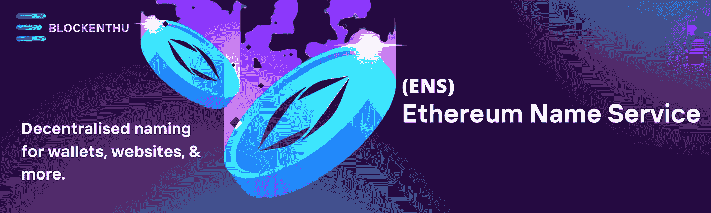
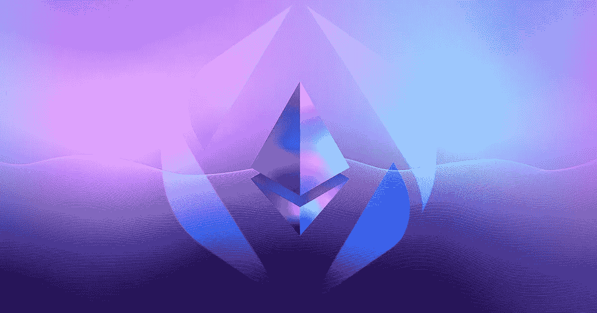
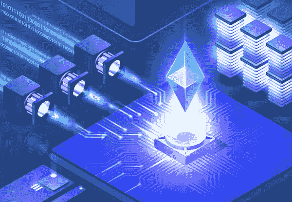
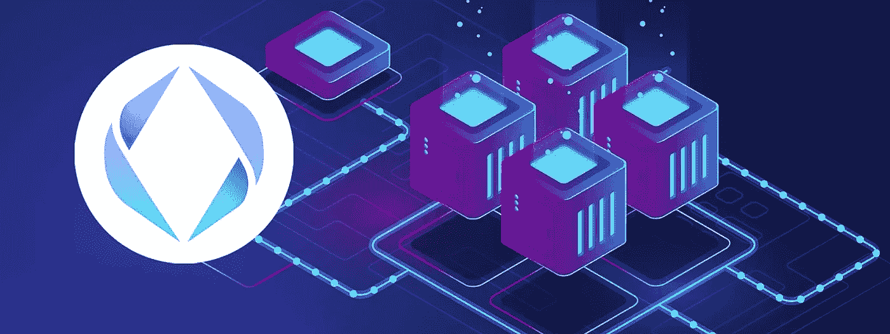

# 以太坊名称服务(ENS)

> 原文：<https://medium.com/coinmonks/ethereum-name-service-ens-d21459fb9e57?source=collection_archive---------16----------------------->

## *开放，* [分散，*命名*](http://blockenthu.com) *系统上以太坊。*

你可能遇到过以**结尾的名字。当探索社交媒体和所谓的 Web3 上的秘密世界时，主要使用头像作为个人资料图像。**

以太坊名称服务是以太坊最受欢迎的项目之一，理由很充分。据 ENS 网站称，“ENS 提供了一种安全的&去中心化机制，使用简单、人类可读的名称来处理区块链内外的项目。

换句话说，你可以命名你的以太坊(或喜欢的链)地址。这类似于 **DNS 在传统网络上的运行方式。**每个网站都有一个 IP 地址，但是没有人在自己的浏览器里输入；相反，我们键入 Amazon.com 这样的名字，而不是 205.251.242.103(试试看，它的工作！).ENS 有很多很酷的功能，但我将专注于注册和管理。本教程中的 eth 名称和子域。

# **ENS 简介**

以太坊名称服务是一个基于区块链的分布式、开放和可扩展的名称系统。 ENS 将 vitalik.eth 等人类可读的以太坊地址翻译成 Metamask 等钱包熟悉的机器可读的字母数字代码。**将元数据和机器可读以太坊地址转换回人类可读以太坊地址也是可行的。**

以太坊名称服务的目的是使基于以太坊的网络更容易被人类访问和理解，类似于域名服务如何使互联网更容易访问。与 DNS 一样，ENS 也使用域名，域名是以点分隔的分层名称，域名所有者可以完全控制其子域名。

2021 年 11 月，ENS 举行了一次非常成功的追溯空投，奖励在该项目令牌推出之前购买地址的用户。然而，在 2022 年 2 月，该公司因其运营总监发布的据称是仇视同性恋的推文而受到抨击。

# 它是如何工作的

ENS 基于**两个以太坊智能合约**。第一个智能合同是 **ENS registry** ，它跟踪在 ENS 上注册的所有域，并包含每个域的三个关键信息:域所有者、域的解析器和域下所有条目的缓存时间。**解析器**是第二个智能合约，它将域名转换成机器可读的地址，反之亦然。第二个智能合同将每个域连接到与之相关联的用户、网站或地址。

对创建 Web3 登录感兴趣的人应该去 ENS 应用程序寻找可用的域名。一旦你找到了一个，你现在要做的就是完成注册程序，这需要从你的钱包里确认两次交易，并为超过五个字符的名字支付每月 5 美元的费用。一旦你有了这个域名，你就可以把它连接到你的加密钱包、网站和许多子域名，比如 email.satoshi.eth 和 website.satoshi.eth，所有这些都在同一个 ENS 域名下。

因为 ENS 域是受限制的，加密本地人正在争先恐后地获取他们的昵称，就像他们在 DNS 名称首次引入时所做的那样。有些人甚至在从事 ENS 域名转换，这可能是一个利润丰厚的副业，因为在拍卖时，exchange.eth 的售价为 6，660 ETH，或 609，000 美元，而 weather.eth 的售价为 300 ETH，或 27，000 美元。

ENS 不仅支持。eth，但也是最常见的 DNS 域名，如 as.com，。组织，。木卫一，。app，以及其他。

> **购买一个 ENS 域名的费用是多少？**

ENS 域名的成本可以分为两部分:拍卖费用和租赁费用。在拍卖中，ENS 域名的价格取决于其受欢迎程度。简短的三个字母的术语通常是最贵的，而众所周知的名字如上帝、汽车或 ETH 吸引了更多的保险费。

一旦你购买了一个 ENS 域名，你就必须在 ETH 支付年费。费用以美元表示，但使用甲骨文的 Chainlink ETH/USD 汇率进行转换。五个或更多字符的名称每年续费为 5 美元，但随着字母数量的减少而增加。

# **ENS 的使用案例**

> **用于加密货币的钱包**

ENS 最普遍的应用是在钱包中存储和交易比特币。ENS 可用于购买、出售、传输和接收加密货币。ENS 支持任何硬币或区块链地址

> **网络去中心化**

有了 ENS，你可以创建抵制审查的分散式网站。这就像发布一个网站到一个 IPFS(星际文件系统)并使用一个 ENS 名称来查看它一样简单。

勇敢，歌剧，元面具，地位，以及其他，支持 ENS-IPFS 网站。用户可利用 EthDNS 添加”。在本身不支持 ENS-IPFS 网页的浏览器中链接到他们的. eth 网站名称。

2019 年，ENS 为分散式网站实现了 IPFS 和 Swarm 网络兼容性。同年引入了对 Tor.onion 和多硬币地址的支持，允许用户将任何加密货币地址放入他们的姓名记录中。

> **身份**

ENS 用户名可以与各种个人信息相关联，例如电子邮件地址或头像。因此，支持 ENS 的用户名可能会成为我们主要的在线身份。

> **谁管理 ENS？**

以太坊基金会的尼克·强森和 T2 领导了 ENS 的早期开发

该倡议于 2021 年 11 月向该服务的用户分发了 ENS 令牌，并创建了一个去中心化的自治组织(DAO)来运行它。(真名有限公司是与 DAO 关联的法人实体。)ENS 令牌持有者作为公司的股东，在定价、协议修改和资金管理方面做出选择。

ENS 代币的引入也导致项目的筹资战略从赠款转移。在加密交易所，ENS 代币可以兑换成美元和其他加密货币，这给了该项目的创造者一条财务生命线。

> **代币及其经济学**

平台的本机令牌 ENS 用于以下功能:

ENS DAO 负责系统的基本方面，例如定价和价格 oracle。只有具有至少 100K ENS 令牌的提案才能提交。要获得批准，法定人数至少为 1%的简单多数是必要的。

**国库拨款:【tokens 代币持有者将投票决定是否批准国库拨款和支出。财政部将获得未来的收入。**

官方网站允许以太坊名称服务协议的早期用户收集他们的 ENS 硬币。其他人可以在币安、Uniswap、Sushi 和 OKEx 等交易所购买加密货币。截至 2022 年 5 月 16 日，ENS 目前是排名第 152 位的加密货币，目前交易价格为**9.09 美元** (707.16 印度卢比)。而随着市场规模超过**1.8 亿美元。截至 2022 年 5 月，ENS 的流通供应量为**2020 万** **万代币**，总供应量为 **1 亿代币**。**

# **总结思路**

在去中心化网络领域，ENS 在使区块链互动更容易实现方面向前迈进了一步。由于它的使用和日益普及，我们可能会看到 ENS 名称的增加，就像我们不再需要 IP 地址来访问网络一样。在空投之后，加密货币生态系统对该项目表现出了越来越大的兴趣。

# 加入我们，轻松进入 WEB 3.0

> *我们的社区*

# WHATSAPP

 [## BLOCKENTHU

### WhatsApp 群邀请

chat.whatsapp.com](https://chat.whatsapp.com/FTKme4XzkOU73ZDv99Oatj) 

# 电报

 [## ⚡·布洛克登胡·⚡

### 可以马上查看并加入@blockenthu。

t.me](https://t.me/blockenthu) 

# 商务化人际关系网

 [## Blockenthu | LinkedIn

### LinkedIn 上有 522 名粉丝。“面向大众的 Web 3.0 福利”加密和区块链| BlockEnthu 是社区…

www.linkedin.com](https://www.linkedin.com/company/blockenthu/) 

# INSTAGRAM

[https://www.instagram.com/blockenthu/](https://www.instagram.com/blockenthu/)

使用印度最安全的外汇货币

 [## CoinDCX -加密交易所|购买、出售和交易比特币和顶级替代币

### CoinDCX 是印度最大、最安全的加密货币交易所，在这里你可以买卖比特币和其他…

coindcx.com](https://coindcx.com/) 

# blockenthu # ETH # BTC # coincxpathbreaker #比特币#以太坊#以太域名服务#域名服务#ENS

> 加入 Coinmonks [电报频道](https://t.me/coincodecap)和 [Youtube 频道](https://www.youtube.com/c/coinmonks/videos)了解加密交易和投资

# 另外，阅读

*   [BigONE 交易所点评](/coinmonks/bigone-exchange-review-64705d85a1d4) | [电网交易 Bot](https://coincodecap.com/grid-trading)
*   [氹欞侊贸易评论](https://coincodecap.com/anny-trade-review) | [CoinSpot 评论](https://coincodecap.com/coinspot-review)
*   [新加坡十大最佳加密交易所](https://coincodecap.com/crypto-exchange-in-singapore) | [购买 AXS](https://coincodecap.com/buy-axs-token)
*   [投资印度的最佳加密软件](https://coincodecap.com/best-crypto-to-invest-in-india-in-2021) | [WazirX P2P](https://coincodecap.com/wazirx-p2p)
*   [西班牙 5 大最佳文案交易平台](https://coincodecap.com/copy-trading-spain)
*   [Pionex 双重投资](https://coincodecap.com/pionex-dual-investment) | [AdvCash 审查](https://coincodecap.com/advcash-review) | [支持审查](https://coincodecap.com/uphold-review)