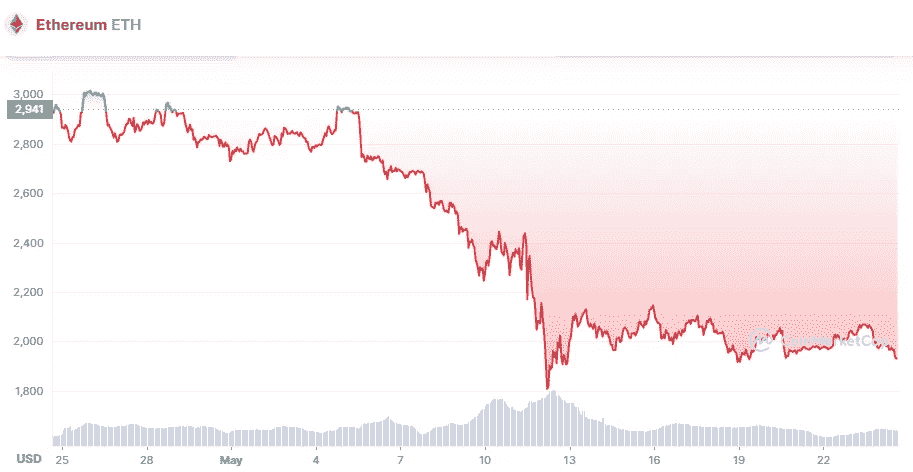

# 5 月 24 日以太坊价格分析

> 原文：<https://medium.com/coinmonks/ethereum-price-analyse-24th-of-may-f9902ec700b8?source=collection_archive---------52----------------------->

Source photo [Ethereum price today, ETH to USD live, marketcap and chart | CoinMarketCap](https://coinmarketcap.com/currencies/ethereum/)

另一个向上的挑战可能在本周中期出现，因为我们可以观察到在最后一个关键支撑位 1900 美元附近下跌速度放缓。

经过一个周末的不均衡运动，以太坊的价格在本周初恢复了上涨趋势。ETH/USD 在昨天晚些时候触及更大的高点后无法维持上涨趋势，当时触及 2100 美元。