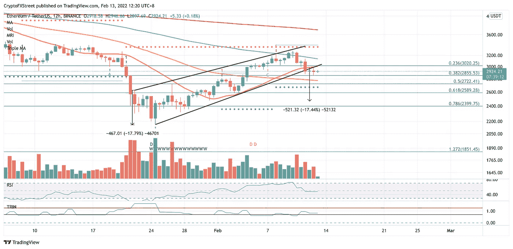

# 以太坊价格预测:看跌者预测以太坊将亏损 15%。

> 原文：<https://medium.com/coinmonks/ethereum-price-prediction-bears-forecast-a-15-loss-in-eth-ef5708a9685b?source=collection_archive---------26----------------------->

Source photo TradingView

随着看跌图表形态的出现，以太坊的价格可能会下跌 15%，至 2472 美元。在达到悲观目标之前，令牌可能能够发现并测试各种保护层。为了揭穿负面观点，以太坊的支持者必须瞄准 3020 美元以上的水平。