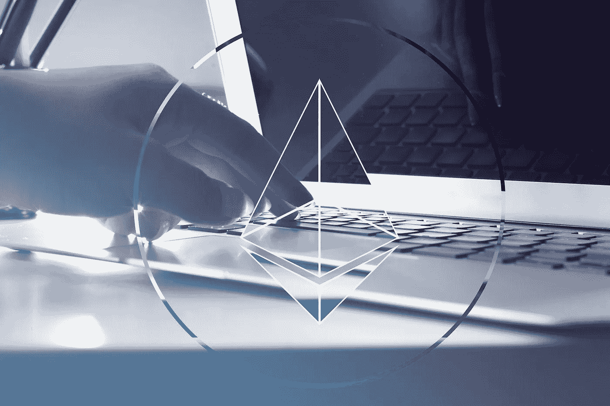

# 以太坊协议:简介

> 原文：<https://medium.com/coinmonks/ethereum-protocols-an-introduction-6d569612a8d8?source=collection_archive---------56----------------------->

协议是执行某些操作的标准化方法。以太坊协议通常指定平台将如何运行，并以发起它们的提案命名。三个主要的以太坊协议如下:

**ERC-20:** 该标准定义了智能合约和令牌分发的机制，从根本上永远改变了加密货币的世界。开发人员不再需要编写自己的软件，设置自己的节点，运行自己的区块链，现在令牌开发人员只需要熟悉以太坊使用的编程语言，就可以定义他们的令牌如何在 ERC 20 框架内运行。

**ERC-223:** 该标准对 ERC-20 中设计的转移函数进行了改进，特别是在将不受支持的令牌转移到智能合约方面。现在，如果某个令牌不受支持，交易就会被取消。这有助于降低向错误的合同发送错误的令牌的风险，以及可能遭受丢失相关令牌的风险。

**ERC-721:** 该标准引入了不可与合同定义的所有其他令牌互换的单个令牌的前景。因此，该标准定义了 NFT，这导致了围绕 NFT 的销售和持有而组织的全新 Dapps 集合，NFT 本身具有价值并且可以被收集。

以太坊协议一直在改进，以增加网络的安全性和实用性。因此，所有 Eth 协议都可以在以太坊基金会的网站上查看，网址为[https://www.ethereum.org](https://www.ethereum.org)。

> *加入 Coinmonks* [*电报频道*](https://t.me/coincodecap) *和* [*Youtube 频道*](https://www.youtube.com/c/coinmonks/videos) *了解加密交易和投资*

# 另外，阅读

*   [Bookmap 评论](https://coincodecap.com/bookmap-review-2021-best-trading-software) | [美国 5 大最佳加密交易所](https://coincodecap.com/crypto-exchange-usa)
*   最佳加密[硬件钱包](/coinmonks/hardware-wallets-dfa1211730c6) | [Bitbns 评论](/coinmonks/bitbns-review-38256a07e161)
*   [新加坡十大最佳加密交易所](https://coincodecap.com/crypto-exchange-in-singapore) | [收购 AXS](https://coincodecap.com/buy-axs-token)
*   [红狗赌场评论](https://coincodecap.com/red-dog-casino-review) | [Swyftx 评论](https://coincodecap.com/swyftx-review) | [CoinGate 评论](https://coincodecap.com/coingate-review)
*   [投资印度的最佳加密软件](https://coincodecap.com/best-crypto-to-invest-in-india-in-2021)|[WazirX P2P](https://coincodecap.com/wazirx-p2p)|[Hi Dollar Review](https://coincodecap.com/hi-dollar-review)
*   [加拿大最佳加密交易机器人](https://coincodecap.com/5-best-crypto-trading-bots-in-canada) | [库币评论](https://coincodecap.com/kucoin-review)
*   [火币的加密交易信号](https://coincodecap.com/huobi-crypto-trading-signals) | [HitBTC 审查](/coinmonks/hitbtc-review-c5143c5d53c2)
*   [如何在 FTX 交易所交易期货](https://coincodecap.com/ftx-futures-trading) | [OKEx vs 币安](https://coincodecap.com/okex-vs-binance)

封面图片归属:fabrikasimf 创作—[www.freepik.com](http://www.freepik.com)