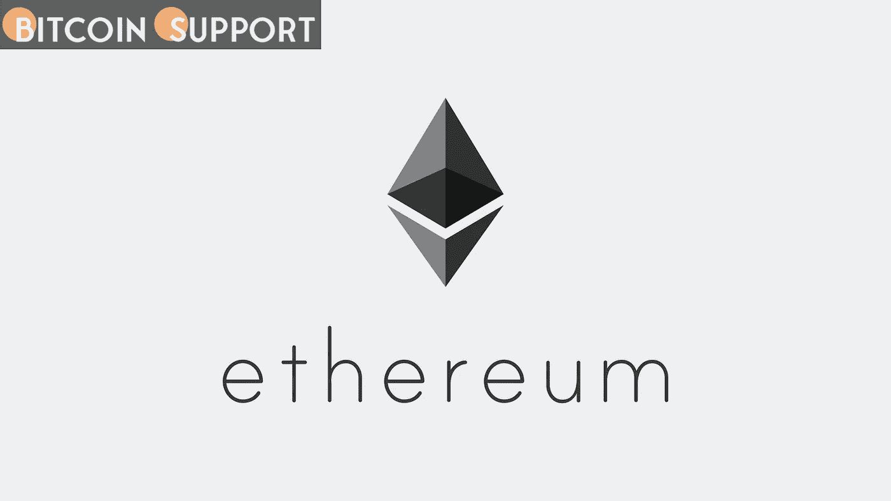
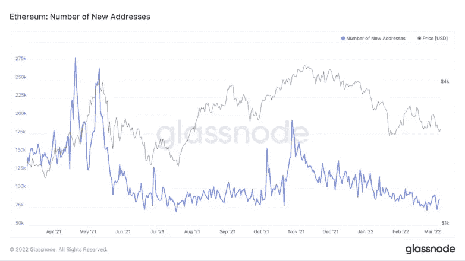

# 以太坊提供了市场复苏的迹象

> 原文：<https://medium.com/coinmonks/ethereum-provides-indications-of-market-recovery-9a8ec406390c?source=collection_archive---------81----------------------->

**Visit our website:-** [**https://bitcoinsupports.com/**](https://bitcoinsupports.com/)

以太坊的价格在一个狭窄的价格范围内保持稳定，但是网络的地址数量看起来在扩大。

—以太坊一直维持在 2500 美元到 3000 美元的交易区间。

——如果新地址数量继续增长，价格可能挑战 3100 美元的阻力位。以太坊网络似乎正在为价格反弹创造必要的活动。然而，以太坊尚未看到新地址数量的持续增长，以支持看涨的说法。

**合并前以太坊的盘整**

以太坊目前在 2500 美元至 3000 美元之间窄幅交易，几乎看不到未来走向的迹象。

第二大加密货币的市值保持稳定，尽管其网络上的活跃度继续减弱。网络扩张经常被认为是高度准确的价格预测。总的来说，随着时间的推移，特定区块链上发布的新地址数量的逐渐下降会导致价值下降，反之亦然。

根据 Glassnode 的链上分析，自 2021 年 11 月价格见顶以来，每日加入网络的新以太坊地址数量大幅减少。新创建的地址数量在 2021 年 10 月 28 日达到峰值 193，000 个，在 2 月 24 日达到峰值 70，600 个。

虽然每日创建的新地址数量似乎正在恢复，截至发稿时徘徊在 86000 个左右，但趋势仍未明显逆转。9.3 万个新地址的每日新高可能预示着新一轮热潮的开始。虽然对以太坊计划转换为股权证明共识(俗称“合并”)的预期可能有助于 ETH 反弹，但新的上升趋势几乎肯定需要网络增长的激增。该合并计划在 Q2 启动，但具体日期尚未公布。

**Visit our website:-** [**https://bitcoinsupports.com/**](https://bitcoinsupports.com/)

如果说以太坊期待已久的协议升级导致价格飙升，那么 ETH 最大的集中度是以平均 3100 美元的价格收购的。根据 IntoTheBlock 的全球进出资金模型，大约 440 万个地址已经以此价格购买了 1925 万个 ETH。只有决定性的日线突破 3100 美元的巨大供应墙，才有可能导致上升趋势的恢复。

值得注意的是，2160 美元的支撑位现在是一个坚实的底部，防止 ETH 遭受任何损失。尽管预期它将维持在这一价格点之上是现实的，但在 2，160 美元的任何疲软迹象都可能导致跌破 1，800 美元或也许 1，400 美元，以便创造一个市场底部。

**访问我们的网站:-**[**https://bitcoinsupports.com/**](https://bitcoinsupports.com/)

**免责声明:以上为作者观点，不应视为投资建议。读者应该自己做研究。**