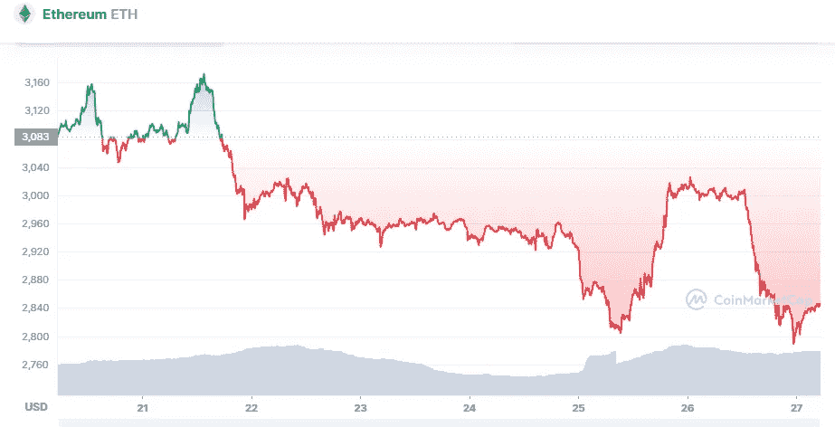

# 以太坊技术分析 4 月 27 日

> 原文：<https://medium.com/coinmonks/ethereum-technical-analyse-27th-of-april-7ef583be18c6?source=collection_archive---------28----------------------->

Source photo [Ethereum price today, ETH to USD live, marketcap and chart | CoinMarketCap](https://coinmarketcap.com/currencies/ethereum/)

以太坊无法突破 3030 美元的关口。当突破 2，950 美元支撑位时，ETH 开始严重跌破前期高点。

金价大幅跌破 2900 美元关口和 100 小时 SMA。甚至 2800 美元的支撑位也被乙醚价格突破。价格创下每周新低 2766 美元，目前…