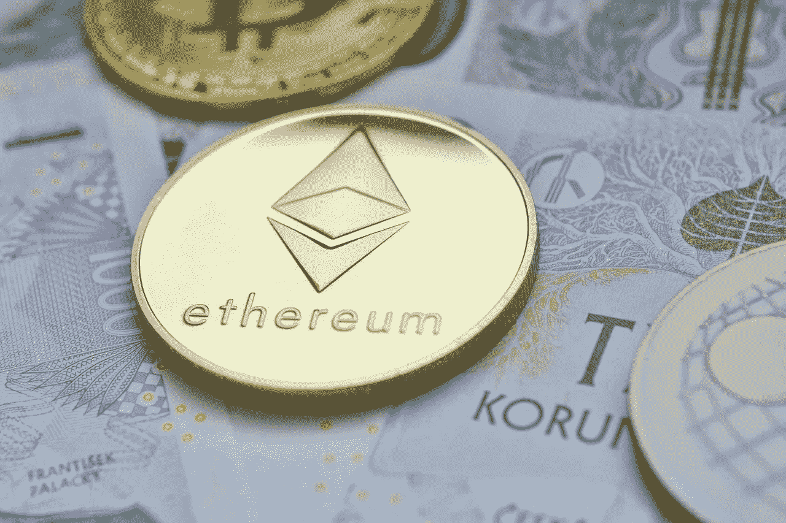

# 以太坊会翻转比特币。但是什么时候？

> 原文：<https://medium.com/coinmonks/ethereum-will-flip-bitcoin-but-when-9668051d5e91?source=collection_archive---------35----------------------->

每个加密货币投资者都有比特币被驱逐的随机想法。最古老的加密货币，区块链已经在排行榜上呆了整整一年。主导一个快速增长的空间，开创巨大的发展；“货币的未来”控制了超过 30%的加密市场总估值。排行榜是千变万化的，一些项目已经占据了精英联赛的位置。只有少数人在合理的时间内保持了这一职位。顶端的竞争是严峻的，但对于比特币来说；高处不胜寒。

除了阿尔法加密货币，只有一个项目在精英地位上花了很长时间——以太坊。维塔利克·布特林开发了一项赢得许多人喜爱的技术。自 2015 年首次亮相以来，以太坊已经成为空间中家喻户晓的名字。使用和模仿最多的项目，这是对以太坊在开发者和爱好者中的声誉的简单描述。也是发展最活跃的。

由于卓越的技术和广泛的采用，以太坊已经占据了仅次于比特币的位置。与曾经占据这一位置的其他项目不同，它保留了相对较长的时间，并被称为比特币的继任者。嗯，敢于梦想。如果说当前有任何加密货币项目有机会取代比特币，那就是 Vitalik 的创意。

以太坊是否具备走向绝对巅峰的条件？我会说是的。技术上来说。但是这些需要在那之前发生…

以太坊的提升将需要一点点比特币的关注份额。不仅仅是比特币狂热分子，整个空间都非常依赖比特币及其周围发生的事情。旧的“储备货币”目前是这一领域其他资产走向的唯一独裁者。只要比特币保持这种无可争议的统治地位，以太坊就很难爬到顶端。比特币的炒作需要停止，至少要停止一点。这并不容易，比特币升至第二位也将是一个奇怪的景象。

无论如何，比特币的炒作并不是以太坊崛起的唯一阻力。以太坊也有自己的问题。费用、速度……应有尽有。尽管是迄今为止最发达的区块链，智能合同链仍然无法用于许多人。如果任何加密货币要胜过比特币，它必须是特殊的。以太坊很特别，毫无疑问；它仍然需要一个全新的效率水平来超越第一的位置。很多发展都是传言要来链，也许这将是一场革命…谁知道。

与比特币不同，以太坊是为了几个目的而建立的。有一长串独特的东西可以建立在链条上。建立在以太坊上的项目质量对其成长有很大影响。以太坊上目前运行的大量项目是这些年来价格上涨的主要原因。只要以太坊上有知名项目推出，现有项目继续取得巨大进展，这种增长就会持续下去。然而，如果以太坊有朝一日超过比特币，主流机构将不得不在以太坊上建立正常产品或服务的替代品。

Visa 最近分享了在以太坊上建立支付解决方案的计划。这甚至更多在以太坊都是可能的。主流公司和品牌可以在以太坊上推出令人难以置信的服务。这将大大提高价格，并缓解以太坊的最终顶级之旅。

就像 Visa 的支付解决方案一样，中央银行数字货币(CBDCs)可以在以太坊区块链上推出。大多数加密货币爱好者不喜欢 CBDCs，但事实是；他们会留在这里。不只是停留在这里，他们比大多数正常的支付解决方案加密项目有更多的生存机会。大多数政府都在建造自己的区块链来启动 CBD。虽然这是显而易见的原因，但以太坊区块链可以轻松容纳尽可能多的 CBD。各国应该考虑走这条路，相对来说更便宜也更容易。以太坊作为 CBDCs 的一个中心，也将极大地推动其应用和价值。

你肯定有你的偏好，你希望看到他们在顶部。如果有人差点推翻比特币，以太坊是我的首选。这个空间是不可预测的，最合理的情况是比特币保持其地位。但是一切皆有可能，以太坊可以一直走下去。还是 XRP？好吧，尽情做梦吧！

[跟进加密货币脚本](https://linktr.ee/cryptoscripts)通过全面的文章和重要提示了解加密领域的最新动态。

> 加入 Coinmonks [电报频道](https://t.me/coincodecap)和 [Youtube 频道](https://www.youtube.com/c/coinmonks/videos)了解加密交易和投资

# 另外，阅读

*   [3 商业评论](/coinmonks/3commas-review-an-excellent-crypto-trading-bot-2020-1313a58bec92) | [Pionex 评论](https://coincodecap.com/pionex-review-exchange-with-crypto-trading-bot) | [Coinrule 评论](/coinmonks/coinrule-review-2021-a-beginner-friendly-crypto-trading-bot-daf0504848ba)
*   [莱杰 vs Ngrave](/coinmonks/ledger-vs-ngrave-zero-7e40f0c1d694) | [莱杰 nano s vs x](/coinmonks/ledger-nano-s-vs-x-battery-hardware-price-storage-59a6663fe3b0) | [币安评论](/coinmonks/binance-review-ee10d3bf3b6e)
*   [Bybit Exchange 评论](/coinmonks/bybit-exchange-review-dbd570019b71) | [Bityard 评论](https://coincodecap.com/bityard-reivew) | [Jet-Bot 评论](https://coincodecap.com/jet-bot-review)
*   [3 commas vs crypto hopper](/coinmonks/3commas-vs-pionex-vs-cryptohopper-best-crypto-bot-6a98d2baa203)|[赚取加密利息](/coinmonks/earn-crypto-interest-b10b810fdda3)
*   最好的比特币[硬件钱包](/coinmonks/hardware-wallets-dfa1211730c6) | [BitBox02 回顾](/coinmonks/bitbox02-review-your-swiss-bitcoin-hardware-wallet-c36c88fff29)
*   [BlockFi vs 摄氏](/coinmonks/blockfi-vs-celsius-vs-hodlnaut-8a1cc8c26630) | [Hodlnaut 点评](/coinmonks/hodlnaut-review-best-way-to-hodl-is-to-earn-interest-on-your-bitcoin-6658a8c19edf) | [KuCoin 点评](https://coincodecap.com/kucoin-review)
*   [Bitsgap 审查](/coinmonks/bitsgap-review-a-crypto-trading-bot-that-makes-easy-money-a5d88a336df2) | [Quadency 审查](/coinmonks/quadency-review-a-crypto-trading-automation-platform-3068eaa374e1) | [Bitbns 审查](/coinmonks/bitbns-review-38256a07e161)