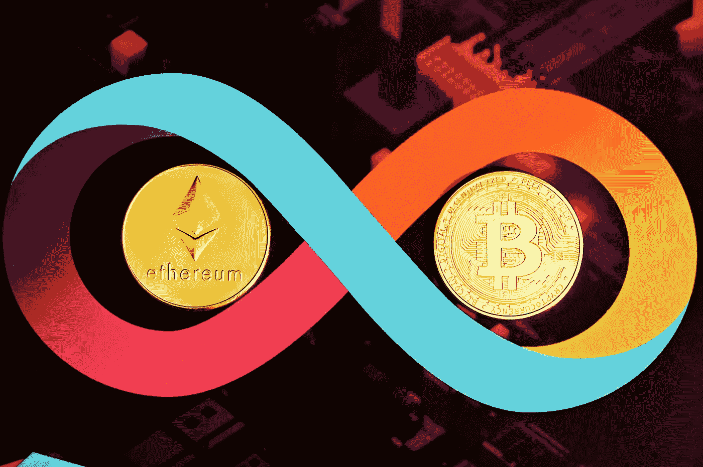

# 2022 年，以太坊的市值将超过比特币。

> 原文：<https://medium.com/coinmonks/ethereum-will-surpass-bitcoin-in-2022-981ad7f0d386?source=collection_archive---------37----------------------->

Source photo Unsplash.com

根据金融科技公司 Finder 的一项新研究，世界第二大加密货币以太坊(ETH)可能会在 2022 年击败其更大的同行比特币(BTC)。

这一消息传出之际，BTC 今年大部分时间都在窄幅波动。由于代币表现平平，许多交易者都损失了…