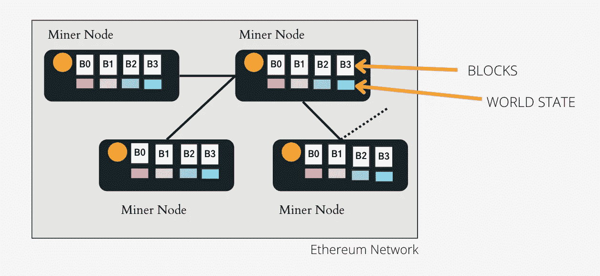
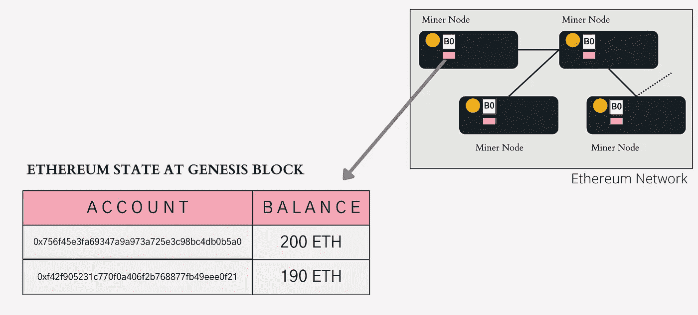
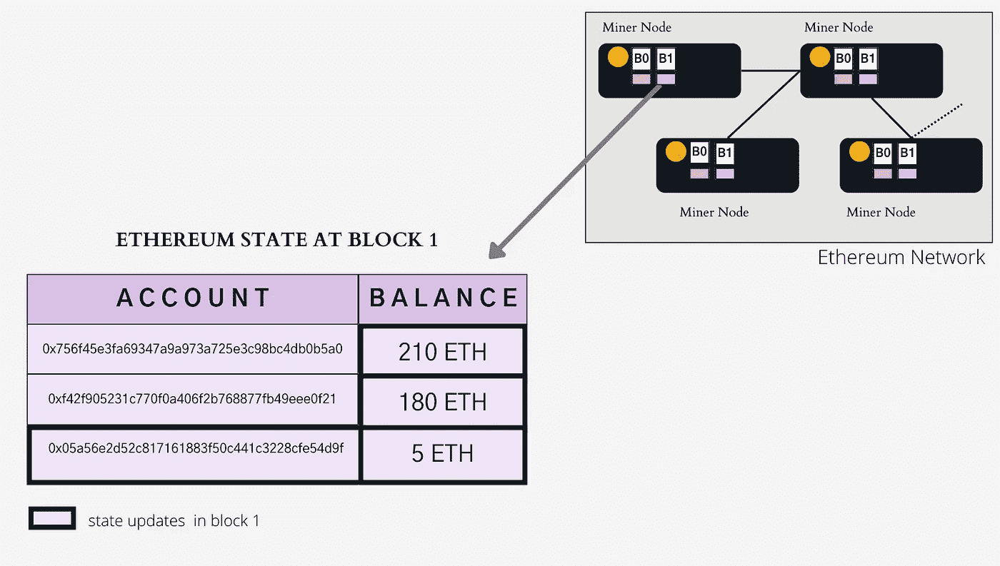
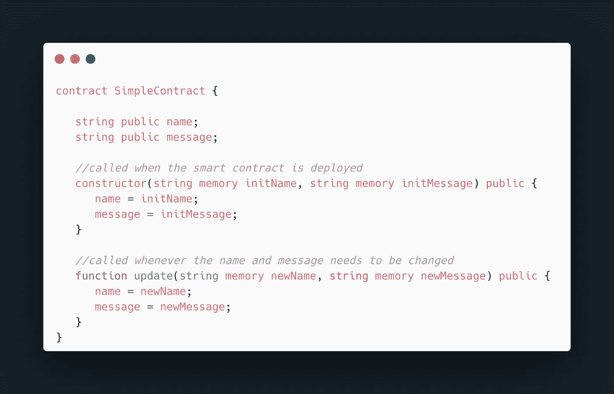
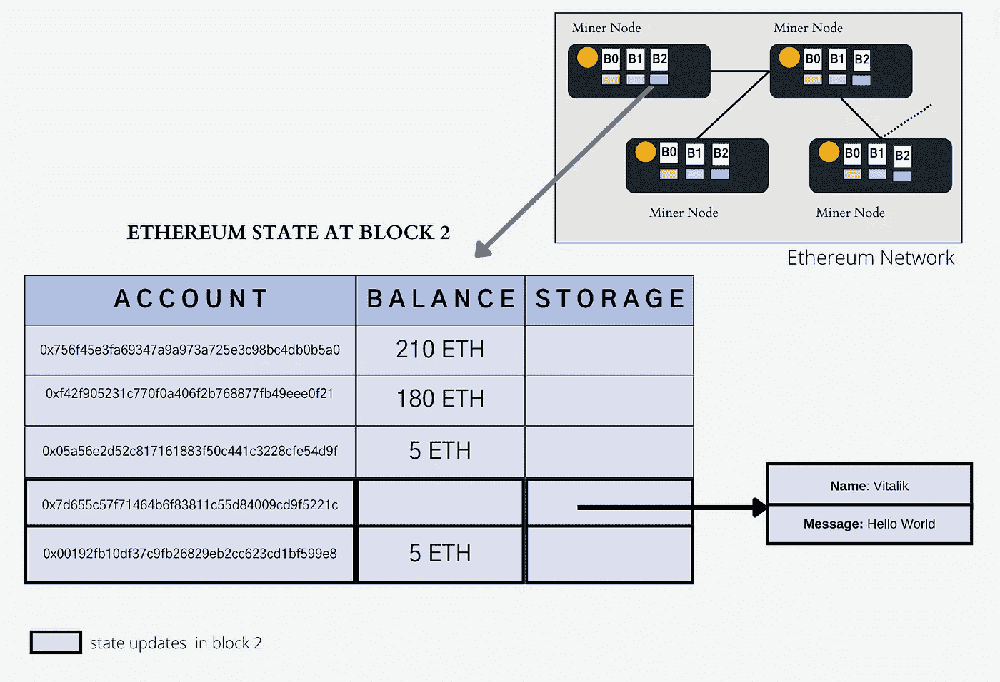
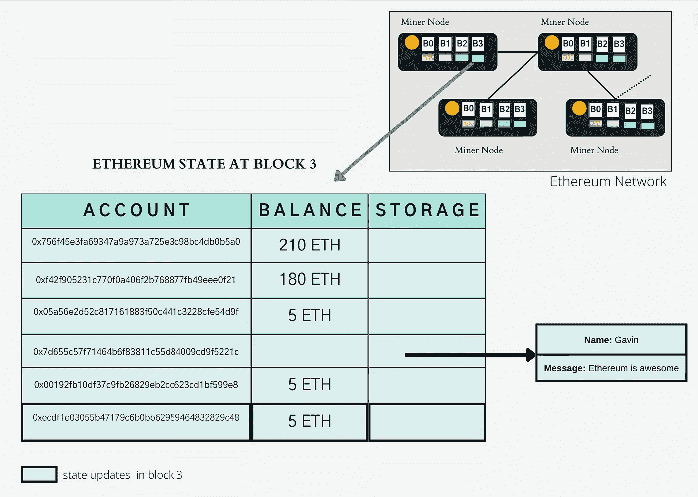
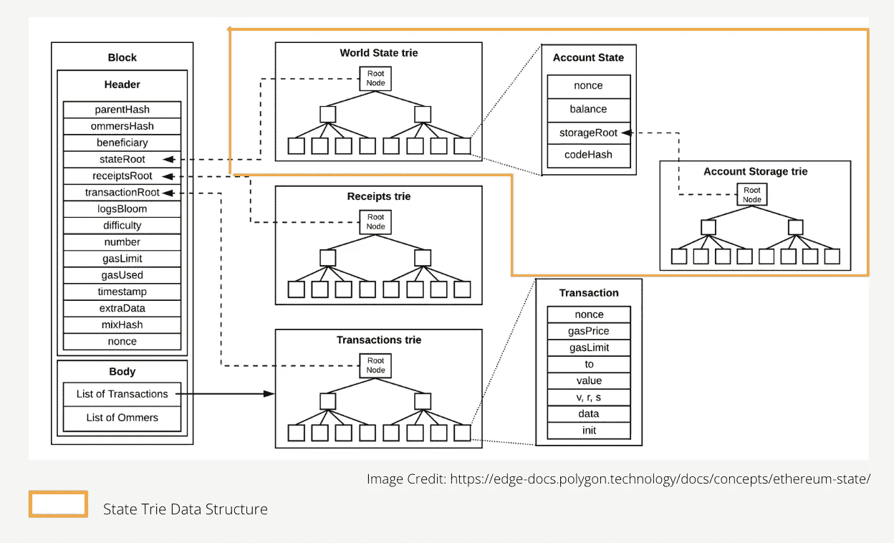

# 以太坊世界状态简化版

> 原文：<https://medium.com/coinmonks/ethereum-world-state-simplified-891219c406ae?source=collection_archive---------4----------------------->

以太坊是一台世界计算机，这意味着它可以被任何地方的任何人访问，他们都可以看到相同的信息。它有一个单一的全局状态，保存有关帐户余额和智能合约数据的信息。

它不是一台物理计算机，而是一台由所有参与节点组成的虚拟计算机。在撰写本文时，网络中有 [~2000 个节点](https://etherscan.io/nodetracker)。完整状态在这些节点中的每一个中维护，并且在执行事务时由**E**thereum**V**I virtual**M**achine(EVM)不断更新。没有关闭以太坊的选项，除非没有参与节点，这是极不可能的。

## **这一切是如何开始的，以太坊状态持有什么？**

以太坊网络于 2015 年上线。当创建起源块(即区块链的起始块)时，用分配给特定账户的 ETH 余额初始化状态。这些账号属于参与[以太坊预售](https://www.coindesk.com/markets/2020/07/11/sale-of-the-century-the-inside-story-of-ethereums-2014-premine/)的用户。

## **起源块(块 0)的状态**

想象一下，在预售期间，只有两个帐户注册接收特定的 ETH。当以太坊上线时，发送以太网到这些账户的交易被分组以创建创世纪块。块只不过是一组事务。创建块时，状态将初始化如下:

从那时起，每一个添加到区块链的区块都会改变全局状态。

## **程序块 1 的状态**

假设帐户所有者(从 0xf42 开始…)向另一个帐户(0x756…)转移 10 个 ETH，该交易将被所有节点接收和验证，但不会立即添加到区块链。相反，它会被添加到下一个块中，并以一定的间隔(~ 12–14 秒)更新到区块链。

当第一个块被添加到区块链时，上面的事务被包括在其中，并且当前状态将被更新如下:

等等什么？为什么 5 ETH 有新账户？

## **挖掘奖励**

需要有一种激励措施，让矿工花费计算精力来参与网络并保护区块链。区块链中每增加一个方块，矿工就会得到 5 ETH 作为奖励。奖励值随着时间的推移而变化，现在，矿工得到 2 ETH 作为奖励。除了奖励之外，矿工还会收到汽油费，这将在一个单独的博客中介绍。

## **智能合约**

以太坊是不是都是在账号之间转移 ETH？不完全是。除了以太网转账，以太坊还支持智能合同执行。类似于每个帐户都有一个 ETH 余额的方式，每个智能合约帐户都有一个 ETH 余额以及由其代码定义的数据。

让我们来看一个简单的智能合同，它存储一条消息，而引用这条消息的人。*构造函数*将在部署智能合约时执行，负责设置*名称*和*消息*的初始值。请注意，对这些字段的任何更新都必须通过调用 *update* 函数来进行。

## **程序块 2 的状态**

为了将上述契约部署到以太网，契约所有者必须调用一个事务并为数据字段提供初始值(即*名称*和*消息*)。一旦 EVM 执行交易，就为合同创建一个新帐户(0x7d65…)，并且用合同所有者提供的值初始化存储。假设这是下一个块中的唯一事务，则状态如下

有一个额外的帐户(0x0019…)被添加到状态中，现在你应该已经猜到这是对开采第二个区块的矿工的奖励。

## **第 3 块的状态**

假设另一个用户想要更新智能合约消息，他们可以通过启动一个新事务并为*名称*和*消息*传递新值来实现。当交易包含在区块链中时，它将相应地更新合同账户数据。

## 之前的消息“Hello world”怎么了？

如果您查看智能合约代码，就会发现它被设计为只存储最新的值。因此，先前的*名称*和*消息*被新值覆盖。但是，可以通过将历史数据作为数组存储在智能合约数据中，或者发出可以在以太坊之外跟踪的事件来访问历史数据。

例如，如果财产所有权存储在区块链，则可以通过查询智能合同事件来查看财产的前所有者。

## 帐户类型

正如您现在已经观察到的，有两种类型的帐户

*   合约帐户:这些帐户是在部署智能合约时创建的。它们有相关的代码和数据。任何人都可以通过调用事务来更改这些合同帐户的状态。
*   用户帐户(称为外部拥有的帐户或 EOA)。这些账户是在以太坊之外创建的(通常使用 metamask 等钱包)。他们有 ETH 天平，但没有与之相关的代码或存储。EOA 帐户可以进行转账、部署智能合约和调用合约方法。

## 区块链中存储了哪些不同类型的数据？

上面的智能契约很幼稚，只存储名称和消息。然而，以太坊区块链在其状态中持有由智能合约规定的各种数据，例如账户余额、令牌所有权、NFT 所有权、流动性池等等。

到目前为止，以太坊网络中已经处理了～1B 交易，并部署了数百万份智能合约。我会让你想象一下网络的现状有多广阔。

以上是世界状态的简化表示。状态存储在 trie 结构中。除了平衡和存储，它还持有 nonce 和代码哈希。让我们在另一篇文章中探索技术细节(如下所示)。

> 请随时让我知道评论中的任何问题。如果你喜欢这个内容，请关注更多的 web3 内容。

> 加入 Coinmonks [电报频道](https://t.me/coincodecap)和 [Youtube 频道](https://www.youtube.com/c/coinmonks/videos)了解加密交易和投资

# 另外，阅读

*   [如何在 FTX 交易所交易期货](https://coincodecap.com/ftx-futures-trading) | [OKEx vs 币安](https://coincodecap.com/okex-vs-binance)
*   [CoinLoan 评论](https://coincodecap.com/coinloan-review) | [YouHodler 评论](/coinmonks/youhodler-4-easy-ways-to-make-money-98969b9689f2) | [BlockFi 评论](https://coincodecap.com/blockfi-review)
*   [XT.COM 评论](https://coincodecap.com/profittradingapp-for-binance)币安评论 |
*   [SmithBot 评论](https://coincodecap.com/smithbot-review) | [4 款最佳免费开源交易机器人](https://coincodecap.com/free-open-source-trading-bots)
*   [比特币基地僵尸程序](/coinmonks/coinbase-bots-ac6359e897f3) | [AscendEX 审查](/coinmonks/ascendex-review-53e829cf75fa) | [OKEx 交易僵尸程序](/coinmonks/okex-trading-bots-234920f61e60)
*   [如何在印度购买比特币？](/coinmonks/buy-bitcoin-in-india-feb50ddfef94) | [瓦济克斯评论](/coinmonks/wazirx-review-5c811b074f5b)