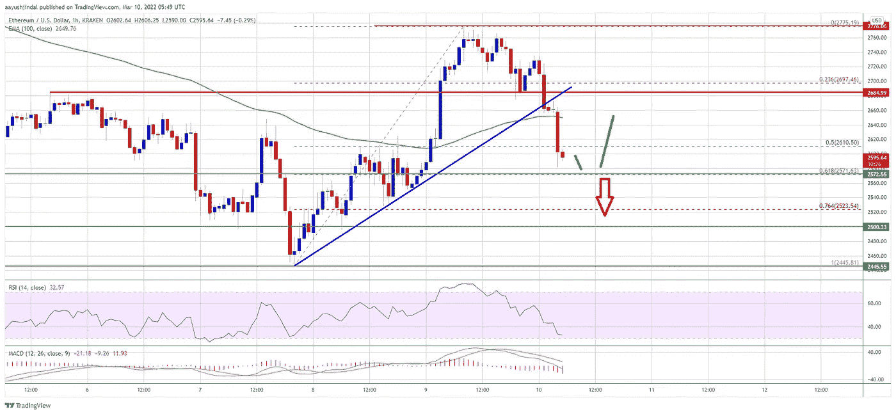

# 以太坊的收益正在减少，这可能会导致新一轮的上涨

> 原文：<https://medium.com/coinmonks/ethereums-gains-are-being-trimmed-which-might-lead-to-a-new-surge-3ed4c282c959?source=collection_archive---------71----------------------->

**Visit our website:-** [**https://bitcoinsupports.com/**](https://bitcoinsupports.com/)

以太坊未能突破 2780 美元，兑美元下跌。为了在短期内开始新的增长，ETH 的价格必须保持在 2570 美元以上。

以太坊奋力突破 2780 美元关口，节节败退。

价格已经跌破 2650 美元，目前在 100 小时简单移动平均线下方交易。

在 ETH/USD 小时图上，一条重要的看涨趋势线下方出现突破，支撑位在 2660 美元附近。(数据通过北海巨妖传送)。

如果该对未能保持在 2570 美元和 2550 美元上方，可能会继续下跌。

**以太坊价格下跌**

以太坊价格从近期高点 2700 美元下跌。尽管 ETH 突破了 2750 美元的阻力位，但它在 2780 美元附近遭遇了顽强的阻力。在 2775 美元附近创下高点，价格开始下跌。2700 美元和 2650 美元关口下方出现破位。乙醚价格跌破 2650 美元，100 小时简单移动平均线也是如此。价格跌破了从 2，445 美元的波动低点到 2，775 美元的高点向上运行的 50% Fib 回撤水平。

在 ETH/USD 的小时图上，在一条重要的看涨趋势线下方也出现了突破，支撑位在 2660 美元附近。该货币对正在逼近 2570 美元的支撑位。从 2，445 美元的波动低点到 2，775 美元的高点的上行接近 61.8%的 Fib 回撤水平。

如果乙醚价格维持在 2570 美元支撑位上方，则可能开始新的上升趋势。上行方面，初始阻力区位于 2620 美元附近。

**Visit our website:-** [**https://bitcoinsupports.com/**](https://bitcoinsupports.com/)

在 2650 美元和 100 小时简单移动平均线附近，发现了第一个实质性阻力。下一个大的阻力位在 2780 美元附近，在此之上价格可能会继续上涨。在前面提到的场景中，价格可能会跳到 2880 美元。

**还会有更多的 ETH 亏损吗？**

以太坊如果不在 2650 美元上方开始新的上升趋势，可能会继续下跌。下行方面，2570 美元是一个初始支撑位。

在 2550 美元水平附近，找到下一个大支撑。如果价格收于 2570 美元和 2550 美元支撑位以下，价格可能会跌得更深。在上面的场景中，成本可能会上升到 2，445 美元。

**技术卓越指标**

ETH/USD MACD 目前正以小时为单位进入看跌区域。

每小时的 RSI——ETH/USD 的 RSI 现在低于 50。

【2570 美元——主要支撑位

【2650 美元是主要阻力位。

**访问我们的网站:**【https://bitcoinsupports.com/】

****免责声明:这些是作者的观点，不应被视为投资建议。读者应该自己做研究。****