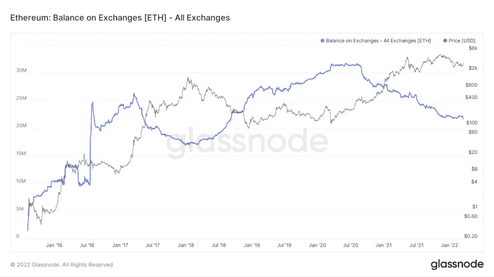
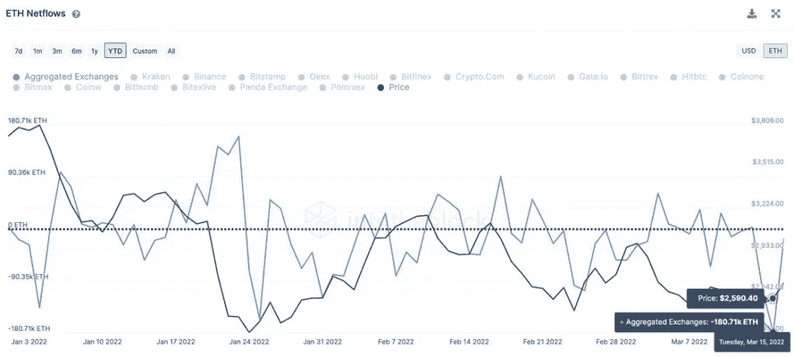
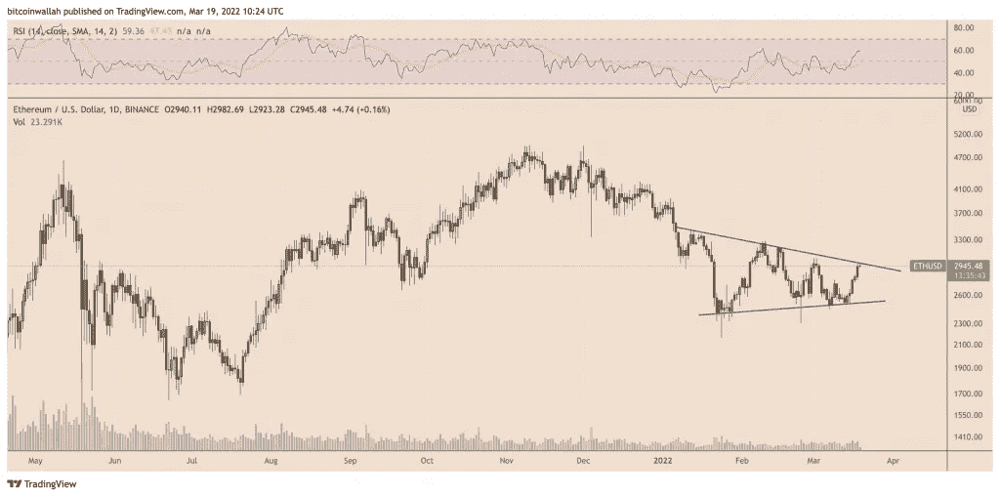

# 以太坊在加密货币交易所的市值已降至 2018 年以来的最低水平

> 原文：<https://medium.com/coinmonks/ethereums-market-capitalization-on-cryptocurrency-exchanges-has-dropped-to-its-lowest-level-since-f1e6ed47f6dd?source=collection_archive---------53----------------------->

**Visit our website:-** [**https://bitcoinsupports.com/**](https://bitcoinsupports.com/)

今年，价值近 16.1 亿美元的以太币令牌已从加密货币交易所中移除，赶在该协议可能于今年夏天完全转换为股权证明之前。

加密货币交易所持有的以太坊原生代币 Ether)数量降至 2018 年 9 月以来的最低水平，表明交易者希望持有代币，预计 2022 年价格反弹。

值得注意的是，根据 Glassnode 的数据，今年迄今为止，约有 55 万个 ETH——相当于约 16.1 亿美元——被从集中交易平台上移除。交易所的净以太网余额已从 2020 年 6 月的创纪录高位 3168 万以太网降至 2172 万以太网。

**Visit our website:-** [**https://bitcoinsupports.com/**](https://bitcoinsupports.com/)

自 2021 年 10 月以来，出现了最大的单周 ETH 流出量。

有趣的是，根据 IntoTheBlock 的统计数据，2022 年交易所的乙醚提取量中，近 30%发生在本周早些时候。3 月 15 日，近 180，000 个 ETH 离开了加密货币交易平台，截至 3 月 18 日，每周流出量超过 5 亿美元。

**Visit our website:-** [**https://bitcoinsupports.com/**](https://bitcoinsupports.com/)

Chainalysis 数据揭示了可比值，表明本周乙醚代币可能以每天约 120，000 单位的平均速度退出交易所，这是一个看涨指标。摘录:

**“如果更多的市场参与者希望卖出而不是买入，并且如果买家选择在交易所持有他们的资产，那么在交易所持有的资产就会增加。”**

IntoTheBlock 也有类似的看涨预测，引用了 2021 年 10 月的分形图，其中以太坊网络发现来自中央加密交易所的大量以太网传输后 10 天，以太价格上涨了 15%。

**一场以太坊的供应短缺已经开始。IntoTheBlock 表示，本周交易所乙醚提取量激增，与此同时，利多的“stETH liquid stakin”池增加了约 19 万个乙醚。

总而言之，Lido 是一项非托管的标桩服务，使用户能够规避与以太坊 2.0 信标链上的标桩相关的限制，例如必须标桩至少 32 ETH 或其倍数。此外，丽都试图通过发行 stETH 来解决资本效率问题，stETH 是 staked ETH 的象征性版本。

以太投资者在之前的 30 天内已经向以太坊 2.0 合约注入了近 100 万 ETH。此外，随着该协议准备在夏季完全过渡到利害关系证明(PoS)，继本周早些时候在窑炉测试网上“合并”之后，额外的乙醚令牌退出活跃供应的可能性增加了。

[https://twitter.com/superphiz/status/1504205069440499714](https://twitter.com/superphiz/status/1504205069440499714)

**ETH 的价格回升仍在继续。由于围绕以太坊走向股权证明的看涨情绪，以太本周进入复苏模式。详细来说，ETH 的价格本周迄今已上涨超过 17%，至约 3000 美元。令人惊讶的是，上涨回撤从技术层面开始，上升趋势线支撑最近遏制了以太的熊市，如下图所示。****

**Visit our website:-** [**https://bitcoinsupports.com/**](https://bitcoinsupports.com/)

乙醚的进步可能会受到另一个技术水平的限制，这一次是下降的趋势线障碍，这也是自 2022 年 1 月以来限制其上行尝试的一个因素。这些趋势线似乎共同创造了一个被称为对称三角形的延续模式，表明以太极有可能继续沿着与之前趋势相同的方向前进，即向下。就目前而言，ETH 可能会在从阻力趋势线下跌后回到三角形的支撑趋势线。

**访问我们的网站:-**[**https://bitcoinsupports.com/**](https://bitcoinsupports.com/)

**免责声明:以上为作者观点，不应视为投资建议。读者应该自己做研究。**

> 加入 Coinmonks [电报频道](https://t.me/coincodecap)和 [Youtube 频道](https://www.youtube.com/c/coinmonks/videos)了解加密交易和投资

# 另外，阅读

*   [比斯勒评论](https://coincodecap.com/bitsler-review)|[WazirX vs coin switch vs coin dcx](https://coincodecap.com/wazirx-vs-coinswitch-vs-coindcx)
*   [7 大副本交易平台](https://coincodecap.com/copy-trading-platforms) | [BuyCoins 点评](https://coincodecap.com/buycoins-review)
*   [XT.COM 评论](https://coincodecap.com/profittradingapp-for-binance)币安评论 |
*   [SmithBot 评论](https://coincodecap.com/smithbot-review) | [4 款最佳免费开源交易机器人](https://coincodecap.com/free-open-source-trading-bots)
*   [杠杆令牌](/coinmonks/leveraged-token-3f5257808b22) | [最佳密码交易所](/coinmonks/crypto-exchange-dd2f9d6f3769) | [Paxful 点评](/coinmonks/paxful-review-4daf2354ab70)
*   [加密套利](/coinmonks/crypto-arbitrage-guide-how-to-make-money-as-a-beginner-62bfe5c868f6)指南| [如何做空比特币](/coinmonks/how-to-short-bitcoin-568a2d0b4ae5)