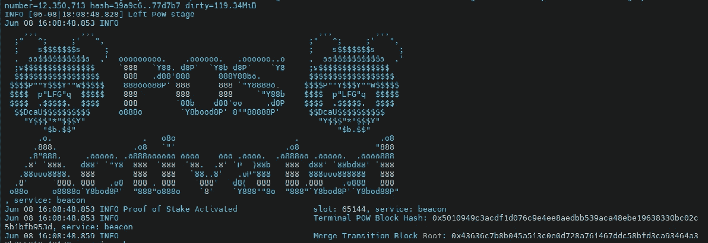

# 以太坊的合并越来越近了——为什么这很重要

> 原文：<https://medium.com/coinmonks/ethereums-merge-is-getting-closer-and-why-it-matters-955bcb226615?source=collection_archive---------36----------------------->

据报道，以太坊的 Ropsten Testnet 最近完成了与小错误的合并，并被开发人员迅速修复。这意味着我们更接近于将以太坊视为赌注证明(PoS)加密货币。但它真正的含义是什么？

几年前，以太坊基金会宣布，以太坊区块链将从工作证明(PoW)的共识机制(与比特币一样，需要挖掘)过渡到股权证明(PoS)。这将代表从 ETH 到所谓的 ETH 2.0 的变化。

*注意:ETH 2.0 这个术语已被弃用，这个过渡现在被称为“合并”。*

它最初计划在 2019 年发射，但被推迟了几次，年复一年，这种延迟开始在加密领域提出关于区块链寿命的问题。投资者担心这个项目的可行性，这也可能严重影响整个市场，因为以太坊是第二大加密货币。

**简单的技术解释**

以太坊运行在 PoW 执行链中(矿工发生的地方),还有一个信标链——在 PoS 模型中工作——与之并行。一旦后一个链经过充分的测试、保护和验证，这两个链将合并，ETH 将继续作为 PoS 区块链安全，这两个链将合并，以太坊将继续作为 PoS 区块链。

*   ***Testnet*** :区块链项目的工作原型。它有作为主网的主要功能，但不使用真正的钱；
*   ***【Mainnet】***:执行实际交易，并存储在区块链中。

**合并的后果**

*   随着代币发行数量的减少，供应可能会下降，而 7%的预期收益率可能会增加需求；
*   PoS 比 power 更环保；
*   PoS 提供了一个更便宜更快捷的网络，这也是目前的批评之一。

我们应该从这条新闻中期待什么？

这表明 ETH 核心开发人员正在成功过渡到 PoS。以太坊 Goelri 和 Sepolia 网络将在 mainnet 出现之前进行测试网合并。

尽管市场本身每周都在融化，但从技术角度来看，这一事件是以太坊历史上的一个相关标志——从长远来看，可能会对整个加密行业产生影响。

[*乔·罗伯特*](https://joerobert.com/) *现任罗伯特风险投资公司首席执行官，拥有超过 20 年的资产管理经验。自从乔开始创业以来，他已经为投资者和合伙人创造了可预见的两位数回报。Joe 已经投资了股权和代币的种子轮，以及比特币、以太坊和其他顶级加密货币的投资组合。*

*如果您是合格投资者，并想了解更多关于我们产品的信息，请联系我们。*

> 加入 Coinmonks [电报频道](https://t.me/coincodecap)和 [Youtube 频道](https://www.youtube.com/c/coinmonks/videos)了解加密交易和投资

# 另外，阅读

*   [AscendEx 保证金交易](https://coincodecap.com/ascendex-margin-trading) | [Bitfinex 赌注](https://coincodecap.com/bitfinex-staking) | [bitFlyer 点评](https://coincodecap.com/bitflyer-review)
*   [Bitget 回顾](https://coincodecap.com/bitget-review)|[Gemini vs block fi](https://coincodecap.com/gemini-vs-blockfi)cmd |[OKEx 期货交易](https://coincodecap.com/okex-futures-trading)
*   [AscendEx Staking](https://coincodecap.com/ascendex-staking)|[Bot Ocean Review](https://coincodecap.com/bot-ocean-review)|[最佳比特币钱包](https://coincodecap.com/bitcoin-wallets-india)
*   [霍比审核](https://coincodecap.com/huobi-review) | [OKEx 保证金交易](https://coincodecap.com/okex-margin-trading) | [期货交易](https://coincodecap.com/futures-trading)
*   [电网交易机器人](https://coincodecap.com/grid-trading) | [Cryptohopper 审核](/coinmonks/cryptohopper-review-a388ff5bae88) | [Bexplus 审核](https://coincodecap.com/bexplus-review)