# 以太坊的沃森，多边形

> 原文：<https://medium.com/coinmonks/ethereums-watson-polygon-bdcf7d11dd6b?source=collection_archive---------1----------------------->

多边形是以太坊的右手，有时是节目的明星，就像约翰·华生对于夏洛克·福尔摩斯一样。多边形和沃森一样，是让事情发生的家伙。没有约翰·沃森，夏洛克的神奇将不复存在。以太坊，像夏洛克一样，有着所有令人向往的潜力，最终，它是拥有答案的那个。

普通消费者不容忍价格波动和缓慢的交易时间(我们都是没有耐心和可预测的存在)。因此，当以太坊的天然气价格波动或交易时间超过几秒钟时，企业就不可能依赖以太坊。Polygon 凭借其设计用于扩展以太坊的**第 2 层**解决方案来拯救我们。

Polygon 的天然气价格更低，交易时间更快。这意味着**你可以在 Polygon 上快速廉价地创建可替换和不可替换的代币，同时还能把它提交给以太坊。**

# 首先，让我们谈谈第 2 层解决方案

第 2 层是以太坊的扩展愿景的一部分；这是链外扩展解决方案之一。

Polygon 的网络使用了等离子和侧链设计模式，多年来，他们采用了多种类型的第 2 层解决方案，如 Hermez 的 ZK 汇总和 Miden 等基于 STARK 的汇总。

现在让我们来详细了解一下上卷、状态通道、侧链和等离子体链。

## 汇总

Rollups 将块捆绑起来并发布到主链上。

**它们是如何工作的？**(处于高电平)

根据汇总是 ZK 汇总还是乐观汇总，证明将是不同的(SNARK 或欺诈证明)并在不同的步骤交付:

*   他们使用一套部署在主链(以太坊)上的智能合约
*   处理事务并将其添加到第 2 层链中的块中
*   在第 2 层验证之后，在 Merkle 树中总结了块的子集
*   树的 Merkle 根致力于主区块链(以太坊)

 [## 不完整的汇总指南

### 首先，Bob 将 1 美元(或一些 ETH 或 stablecoin 等价物)放入智能合约。向爱丽丝支付他的第一笔钱…

vitalik.ca](https://vitalik.ca/general/2021/01/05/rollup.html) 

**Zk-上卷😎**

ZK 总结使用零知识；它将块捆绑在一起，产生一个有效性证明，通常称为 SNARK(简洁的非交互式知识论证)，并将其发布到主区块链上。ZK 汇总的例子有 Loopring、zkTube、Aztec 2.0、Hermez 和 Starkware。

**乐观向上😃**

乐观汇总假设诚实，它假设所有交易在默认情况下都是有效的，并且只在交易需要被质疑时才生成防欺诈凭证。如果质询是正确的，他们将恢复该批次以及之后的所有批次。

乐观累计的示例有 Arbitrum、optimistic、Boba、Fuel Network 和 Cartesi。

## 国家频道

状态通道与比特币的闪电网络(Lightning Network)或雷电网络(Raiden Network)等支付通道非常相似，但它不仅处理支付，还处理“状态更新”。状态更新的一个例子是在一个状态通道中收集投票，并在选举完成后发布到以太网。

> **状态通道**是支付通道的一般形式，将相同的思想应用于通常在区块链上执行的任何类型的状态改变操作。

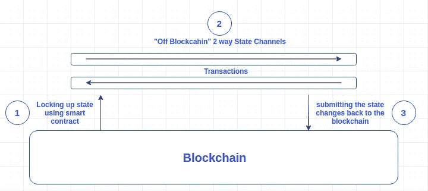

Image from [https://hackernoon.com/difference-between-sidechains-and-state-channels-2f5dfbd10707](https://hackernoon.com/difference-between-sidechains-and-state-channels-2f5dfbd10707)

## 侧链

侧链是独立的区块链，与主区块链(以太坊)平行运行，有自己的共有和阻断参数。它们是 EVM 兼容的，并且使用两个桥与以太坊兼容。流行的侧链是 SKALE 或 POA 网络。Polygon 使用侧链作为他们的 PoS (proof of stake)解决方案，但是当他们向以太坊链提交检查点时，除了以太坊的验证器之外，他们还使用他们自己的一组验证器。

> **侧链**是一个独立的区块链，通过双向栓与其母链区块链(主链)相连。

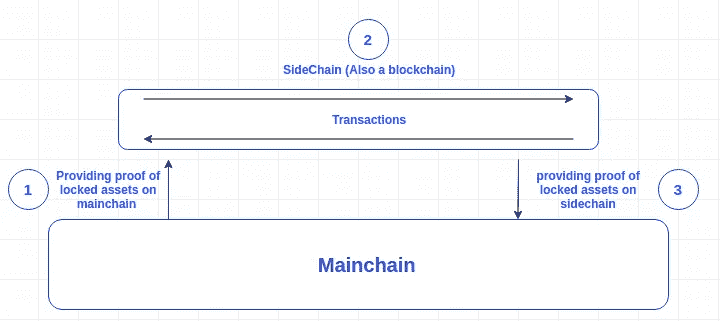

## 血浆

等离子体链是主要区块链(以太坊)的副本，当交易受到挑战时，使用欺诈证据(就像我们的朋友乐观汇总一样)。这些副本被称为“孩子”，其中有多个连接到以太坊。每个“孩子”都有一个智能契约，它被绑定到充当“桥梁”的主链上，使用一个称为根链的智能契约。

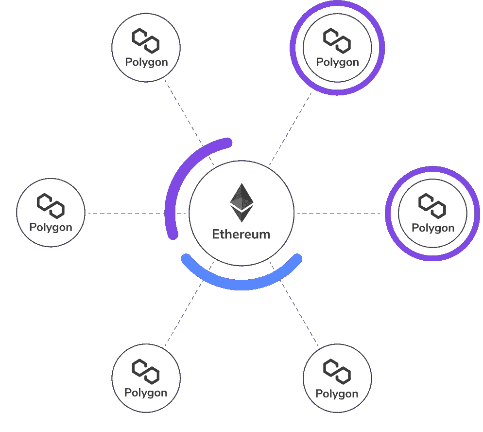

如果你想深入了解这一点，请查看关于第二层缩放的 [Finematics](https://medium.com/u/9ca737b2db54?source=post_page-----bdcf7d11dd6b--------------------------------) 视频。

# 多边形是谁？剥开这些层

多边形有四层，以太坊，安全，多边形网络，和执行层。前两层以太坊和安全是可选的，与以太坊互操作性相关。

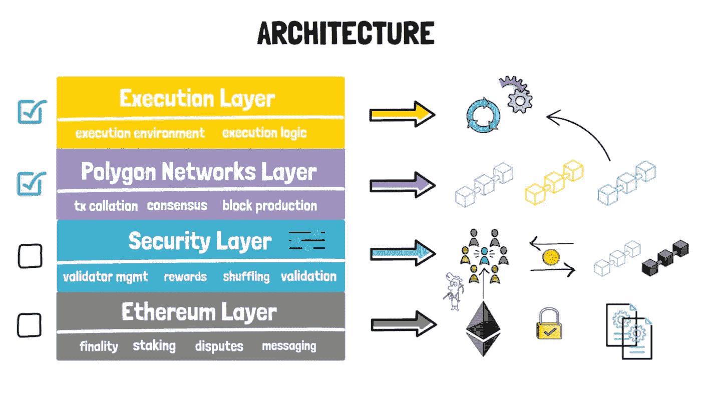

Image from [https://finematics.com/polygon-commit-chain-explained/](https://finematics.com/polygon-commit-chain-explained/)

## 以太坊层(可选)

以太坊层是部署在以太坊网络上的智能合约。这些智能合约处理终结、标桩、争议和消息传递。

## 安全层(可选)

这一层管理一组验证器，这些验证器可以定期检查任何付费多边形链的有效性，这就是验证器即服务。

## 面网络层(必需)

这是一个不同区块链网络的集合，每个网络都履行交易整理、本地共识、批量生产等功能。多边形协议连接所有这些网络。

## 执行层(必需)

执行层的目标是确定性、可终止性和隔离性，同时支持图灵完全智能契约和管理共享网络。

## 可以跳过某些层的场景

需要速度的游戏可以使用他们自己的共识，跳过以太坊和安全层

需要低交易成本的 NFT 市场可以跳过以太坊层，只使用安全层来利用共享的验证器集

需要以太坊和安全层的用例将是大多数**金融**用例。

# 多边形中的成分

如果你查看官方的 Polygon Github 库，你会注意到几个主要的项目，Bor，Heimdall，PoS portal，MaticJS。

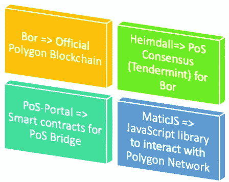

Bor 是多边形区块链网络，它是以太坊围棋程序的克隆。这代表了前面提到的**多边形网络**层。

海姆达尔是一致的，它是 Tendermint 的克隆，有一些修改。这代表前面提到的**安全层**。

PoS-Portal 是部署到以太坊的所有智能合约的位置。这代表了前面提到的**以太坊层**。

PoS-Portal 这个名字很容易混淆，因为它不仅有 PoS 智能合约，还有 Plasma 智能合约。

# 通向互操作性的道路——桥梁

Image from [https://www.aliexpress.com/item/33013153151.html](https://www.aliexpress.com/item/33013153151.html)

> 桥是一个应用程序，它使用跨链通信来表示来自另一个链的可替换和不可替换的令牌，从而实现互操作性。

## 什么是桥？

桥是神奇的🕺，它们允许代币存在于它们被创造出来的网络之外，将比特币主义者、电子人、索兰主义者完美地融合在一起。有许多类型的桥梁(即 RSK 智能，虫洞，和谐等。)将世界凝聚在一起。下面只是其中的一部分。

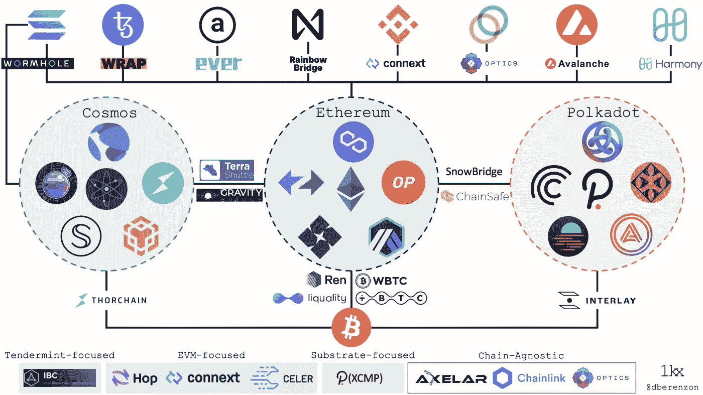

从技术上讲，大多数桥梁(不包括宇宙 IBC)都是在两个域(链)上使用智能合同建造的。这些智能合约的工作是**在它们离开网络时燃烧和释放**它们的本地令牌，以及**锁定和铸造**(包装)进入网络的外部令牌。桥的工作是调用两个域(链)上的智能契约。

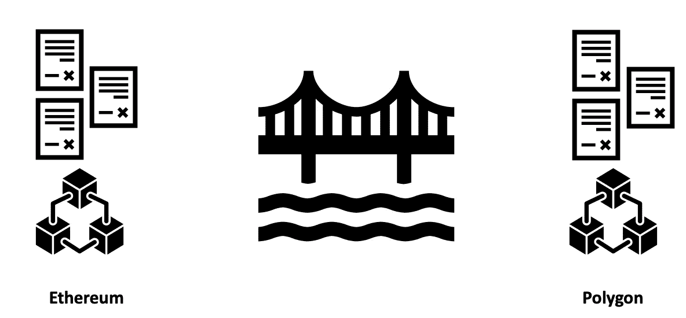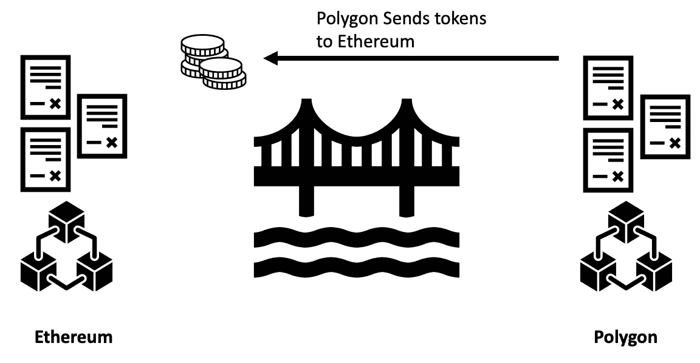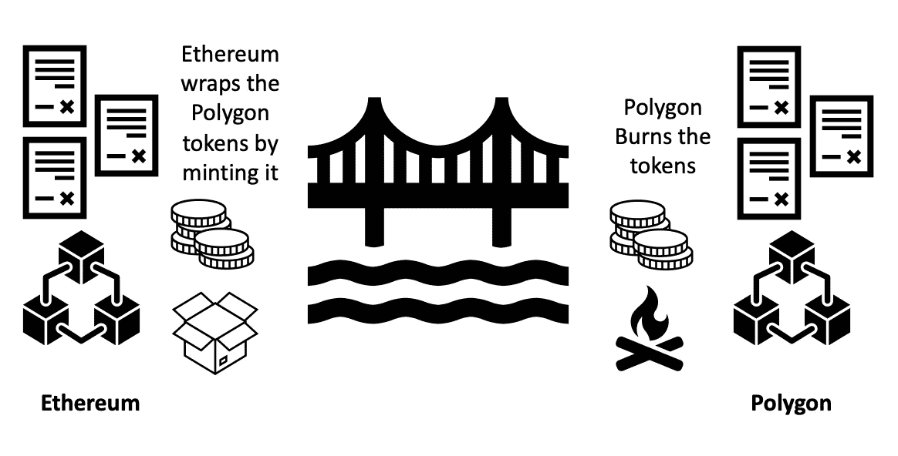

上面的图片是信任桥梁如何工作的高级视图。在两个领域(链)之间协调的部分通常是一个集中式系统。Polygon 还有一个名为令牌映射器([https://mapper.polygon.technology/](https://mapper.polygon.technology/))的集中式系统，它处理 Matic 团队对以太坊和 Polygon 之间的 ERC20、ERC721 和 ERC1155 令牌传输的批准。

从本质上讲，Polygon 是一个第 2 层解决方案，有两种桥接以太坊的方式，它有一个 Stake (PoS)证明和一个等离子网桥。以下是 PoS 和血浆之间的一些差异:

*   Plasma bridge 在提款/退出前需要一个质询期，因为它使用欺诈证据(来自乐观汇总)
*   PoS bridge 在取款/退出前需要等待长达 3 小时，因为它需要在提交检查点后等待
*   PoS bridge 是新生事物，而 Plasma 则有些过时。PoS 而非 Plasma 支持 ERC1155 等更新的标准。

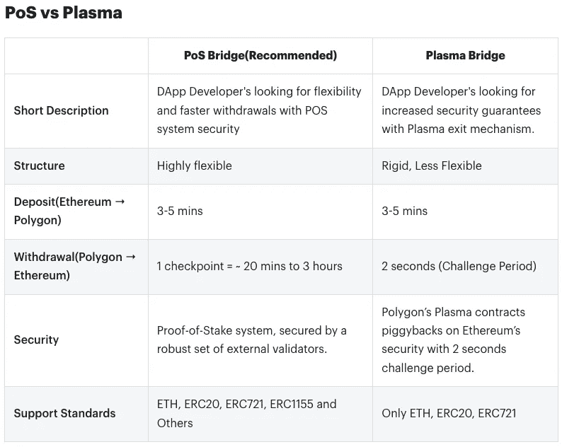

Image from [https://docs.polygon.technology/docs/develop/ethereum-polygon/getting-started/](https://docs.polygon.technology/docs/develop/ethereum-polygon/getting-started/)

从基本意义上来说，这是两个多边形桥的工作方式，虽然有一些细微差别，但总的想法是它使用了这些*检查点*的概念:

1.  ***提议者验证从最后一个检查点*** 开始的多边形链中的块的子集

有一个独立的区块链叫做博尔，那是多边形的区块链，它是以太坊的复制品。时不时地，多边形链中随机选择的块提议器将验证自上一个检查点以来的块子集

***2。产生一个新的检查点***

在块被验证之后，提议者创建一个检查点。这个检查点是一个 Merkle 根，它是通过将自上一个检查点以来的所有块放入 Merkle 树中而得到的。

***3。提议者将检查点广播到多边形标注网络进行签名***

***4。利益相关者在检查点上签字，如果他们批准***

***5。如果三分之二的利益相关者同意，那么在以太坊根合同*** 上提出检查点

下面是以太坊上的根契约和所使用的实现的快照:

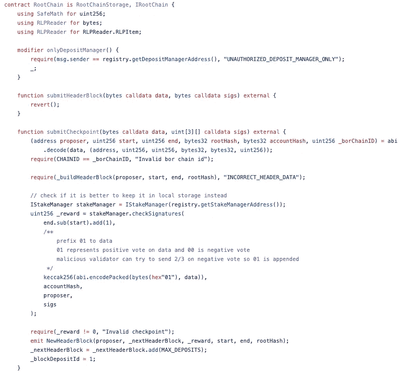

Image screenshotted from [https://github.com/maticnetwork/contracts/blob/main/contracts/root/RootChain.sol](https://github.com/maticnetwork/contracts/blob/main/contracts/root/RootChain.sol)

***6。现在，检查点被推送到以太坊，如果它被提交，它就是一个有效的检查点***

## 桩柱证明桥

PoS bridge 是灵活的，具有更快的撤销速度，因为它使用一组健壮的验证器，并且可以在一个检查点间隔内退出。

**股权担保模式证明**

作为一名 DApp 开发者，要构建 PoS 安全，过程非常简单，只需将智能合约部署到 Polygon 上。这是可能的，因为基于帐户的架构使 EVM 兼容侧链。

以下是官方 PoS 桥接文档。

 [## PoS 桥|多边形技术|文档

### 桥基本上是一组帮助将资产从根链转移到子链的契约。有…

文档.多边形.技术](https://docs.polygon.technology/docs/develop/ethereum-polygon/pos/getting-started) 

## 等离子桥

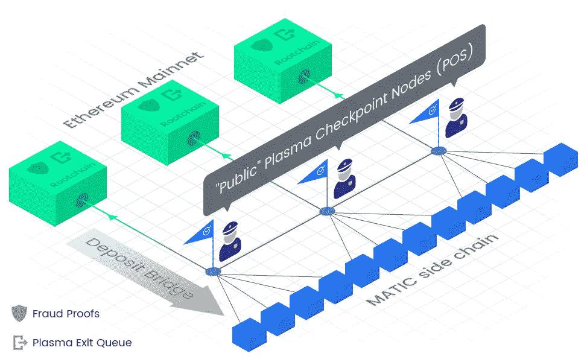

Image from [https://docs.polygon.technology/docs/home/architecture/polygon-architecture/](https://docs.polygon.technology/docs/home/architecture/polygon-architecture/)

等离子体桥由于其退出机制而提供了增强的安全性保证。Polygon 使用了一个 MoreVP(更有活力的血浆)版本，它是基于最少的活力血浆，而不是最初的基于帐户。

**MoreVP(更有活力的血浆)**

> MoreVP 基于 MVP(最小可行血浆)，它设计了用户如何退出和撤回他们的资金到根链。MoreVP 保证诚实的用户总是能够在坏人之前提取他们在血浆链上持有的资金。
> 
> Polygon 使用基于帐户的 MoreVP 版本。参见下面的官方研究建议:
> 
> [https://ethresear.ch/t/account-based-plasma-morevp/5480](https://ethresear.ch/t/account-based-plasma-morevp/5480)

以下是基于账户的 MoreVP 的官方提案:

 [## 基于帐户的等离子体|多边形技术|文档

### Polygon Plasma 遵循一个类似于 Plasma MoreVP 的模型，但是与其他……

文档.多边形.技术](https://docs.polygon.technology/docs/contribute/contracts/plasma_contracts/account_based_plasma) 

**安全模式**

作为一名 DApp 开发人员，如果您想在 Polygon 上构建一个 Plasma 安全保证，您必须为您的智能契约编写自定义谓词。这意味着编写处理由 Polygon plasma 构造设置的争议条件的外部契约。

# 共识— PoS

部署到以太坊中的智能合约处理 PoS(利益证明)的利益管理和委托管理，包括验证器份额。

**标桩层的标桩管理**

stake manager 是处理验证器活动的主要契约，比如检查点签名验证、奖励分配、削减和股份管理。

 [## 打桩管理器|多边形技术|文档

### 对于多边形的安全证明的基础上的共识，所有的⅔+1 证明验证和处理的赌注，奖励…

文档.多边形.技术](https://docs.polygon.technology/docs/contribute/contracts/stakingmanager) 

**委托管理，包括验证器共享**

每个验证者(负责参与共识的人)都有自己的共享令牌，有点像公司共享。如果委托人(告诉验证者代表他们参与 PoS 的人)希望验证者代表他们参与，他们将被发给验证者的令牌。如果有 PoS 奖励，发给他们的验证器令牌对 MATIC (Polygon 的官方令牌)的汇率值会更高。如果有 PoS 削减了验证器令牌，那么它们将具有较低的对 Matic 的汇率值。查看下面的插图来直观地了解它。

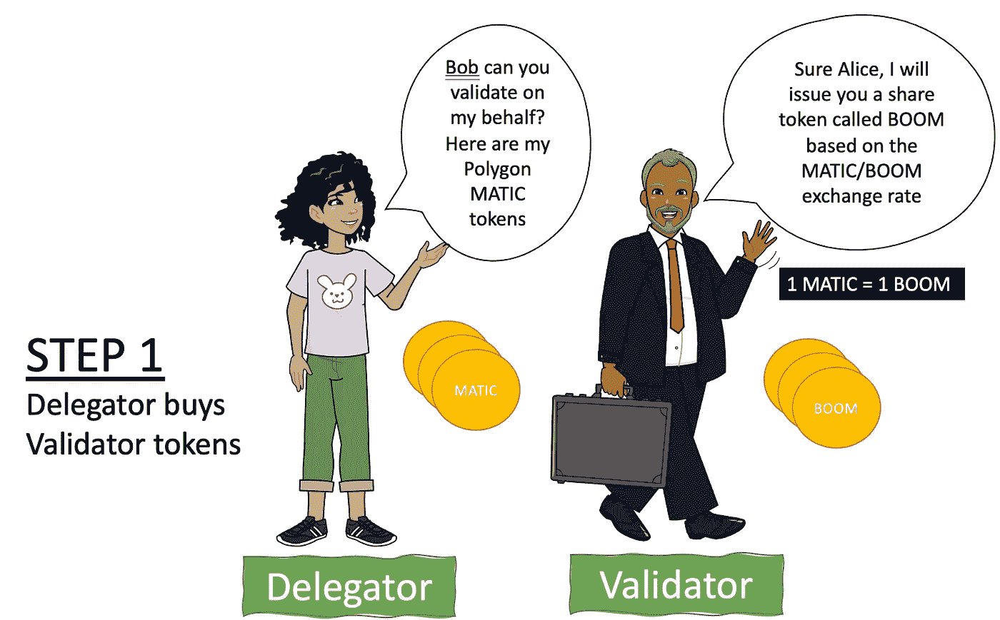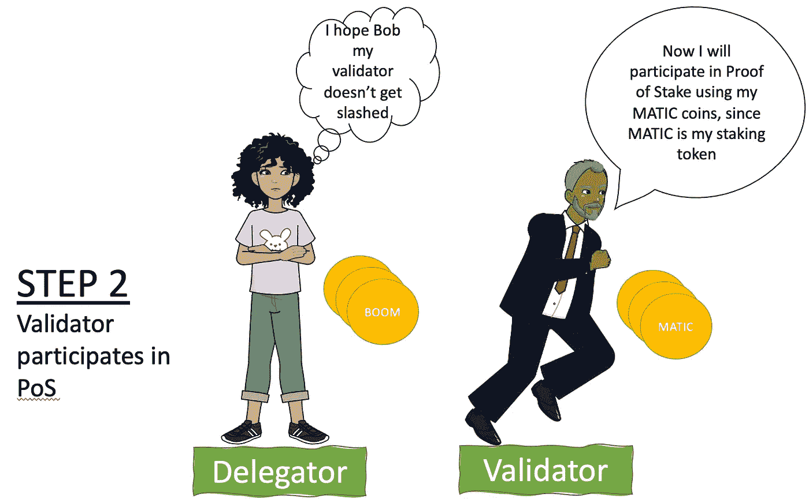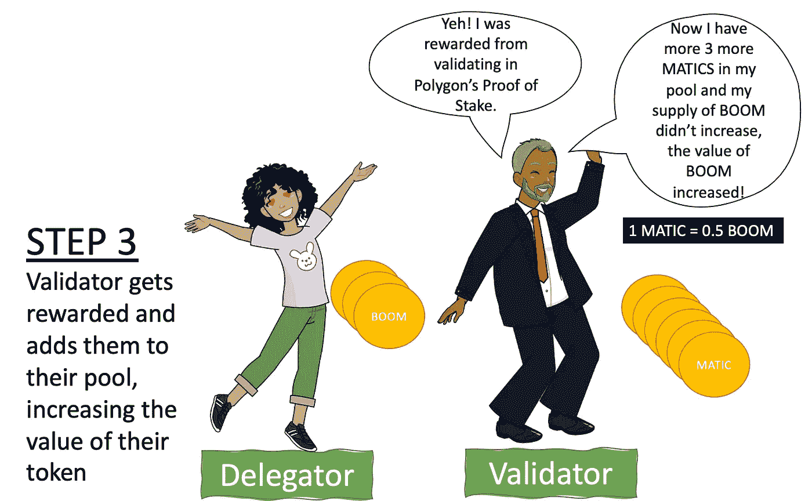 [## 委托(验证器共享)|多边形技术|文档

### Polygon 支持通过验证器共享进行委托。通过使用这种设计，更容易分配奖励和削减…

文档.多边形.技术](https://docs.polygon.technology/docs/contribute/contracts/delegation) 

# 伴随桥梁而来的风险——互操作性梦想

在过去的几年中，互操作性已经成为一个令人兴奋的话题。比特币、比特币和 sol 可以互相交易的想法听起来像是一个美好的未来。目前，多个桥梁连接不同的区块链，像夹层，雪桥，荆棘链，和臭名昭著的虫洞。类似 Polygon 的桥的实现是我们实现这个梦想的方式。

桥梁在区块链的生态系统中很有价值，但也有一定的风险。一月份，以太坊的创始人 Vitalik Buterin 提出了他对桥梁安全的担忧。在一月下旬，我们看到了虫洞最大的 Defi 黑客之一。

**维塔利科的担忧——51%攻击后的密码**

如果有 51%，那么通过桥梁传输的加密货币对另一个区块链网络来说仍然是有效的。

> **维塔利克关于 51%攻击保证的注释**
> 
> 许多人都有这样的心态，“如果一个区块链受到 51%的攻击，一切都会崩溃，所以我们需要尽全力防止 51%的攻击发生一次”。我真的不同意这种思维方式；事实上，即使在遭受 51%的攻击后，区块链仍然保持了他们的许多保证，保持这些保证真的很重要。

一个示例场景是，如果以太坊受到 51%的攻击，但用户仍然拥有他们的 100 个以太坊。他们把它带到一座桥上，转换成 Solana-wETH(包裹在 Sol's 里的以太坊)。然后拥有 51%控制权的攻击者只要索拉纳确认交易，就在以太坊上还原交易。索拉纳-韦瑟的合同现在不再是完全支持，也许你的 100 索拉纳-韦瑟现在只值 60 埃特。即使有一个完美的基于 ZK-斯纳克的桥完全验证了共识，它仍然容易受到像这样的 51%的攻击。

上面的例子听起来像一个牵强的场景，但 51%的攻击比我们意识到的更常见，随着我们获得越来越多的第 2 层链，这种情况尤其可能发生。

看看 Vitalik 在 Reddit 上的帖子:

[https://old . Reddit . com/r/ether eum/comments/rwojtk/ama _ we _ are _ the _ EFS _ research _ team _ pt _ 7 _ 07 _ January/hrngyk 8/](https://old.reddit.com/r/ethereum/comments/rwojtk/ama_we_are_the_efs_research_team_pt_7_07_january/hrngyk8/)

**虫洞破解**

2 月 2 日，黑客通过利用以太坊和索拉纳之间的桥梁虫洞中的一个 bug，窃取了超过 3.23 亿美元的加密货币。黑客通过暴露虫洞的索拉纳合同中的漏洞，使用假签名铸造了 120，000 个 wet(wet 是索拉纳中代表 ETH 的固定令牌)。现在用他们编造的代币，他们能够把 93，750 英镑转回以太坊，转到他们的钱包里，黑客把剩下的转到他们的索拉纳钱包里。

虫洞无法捕捉这些伪造的签名，因为在那个时候，他们没有办法正确地验证所有的输入帐户。

你可以从 samczsun 的一系列推文中找到逆向工程分析。

虫洞不是唯一被黑客攻击的桥接协议。在过去，ThorChain、Poly Network(不是 Polygon)、ChainSwap 和 AnySwap 也是黑客攻击的受害者。

当资产跨链移动时，它们依赖一个链来成功地烧毁-释放令牌，而另一个链来锁定令牌。除了使用事件监视之外，没有好的方法来知道另一个链是否正确地完成了它的工作。在虫洞的场景中，以太坊方面假设来自索拉纳的虚假签名令牌是合法的。由于以太坊没有索拉纳的基础设施或共识，所以在他们那边不容易验证。多链网桥的信任大多是假设的，但不是保证的，因为没有共同的共识。

有关跨链(桥接)最佳实践的更多指导，请查看 EEA 的跨链指南草案:

 [## 技术条件

### EEA 的世界级规范和即将推出的测试和认证计划将确保互操作性…

entethalliance.org](https://entethalliance.org/technical-specifications/) 

# 使用的数据库和消息协议

由于 Polygon 是以太坊的副本，所以以太坊中使用的许多组件也在 Polygon 中使用。

Polygon ledger 中使用的数据库是 LevelDB，键值数据库在区块链网络中相当常见，比特币也使用 LevelDB。

节点之间使用的消息协议是 LibP2P 这是一个由 IPFS (Filecoin)开发的复杂的信息模块。LibP2P 在区块链平台中变得越来越普遍，一些使用 LibP2P 的著名项目是使用 Substrate 和 Polkadot 构建的 para-chains。

# 在多边形上展开

Polygon 最好的一点是，开发与从以太坊开发 DApp 没有太大区别。这意味着你可以使用常规的松露沙拉、安全帽沙拉、Web3JS 沙拉、EtherJS 沙拉和 Metamask 沙拉。主要区别在于部署。

你可以抓取或创建一个普通的以太坊 Dapp，也许抓取一个松露盒。将元掩膜钱包设置到面网络。当您要部署它时，您所使用的只是…

块菌迁移—网络自动

或者如果你想建立一个 dapp，允许客户选择他们想在哪个网络中交易，他们可以利用一个叫做 Magic 的库。下面是一个很好的入门教程。

 [## 如何用魔法在多边形和以太坊上搭建去中心化的 App

### 随着以太坊油价的上涨，许多开发人员正在寻找提供更多可扩展性的其他选择…

神奇. link](https://magic.link/posts/magic-polygon) 

# 它在区块链三难中处于什么位置？

## 分散

我对 Polygon 的去中心化不足感到惊讶，运行一个节点很容易，用 Polygon 有批量开发，但是网络上的验证器数量缺乏。目前只有 80 个验证者生活在网络上(【https://wallet.polygon.technology/staking/validators/】T2)。

考虑到所有令牌(可替换和不可替换的)都需要注册和批准，跨越以太坊和多边形的桥接也是相当集中的。

## 可攀登的

Polygon 是在考虑可扩展性的基础上构建的，但它没有其他区块链网络好。目前，Polygons 具有大约 10k TPS(每秒事务数)，这个数字表示移动资产所需的时间。在提交检查点后，几个资产退出并跨链移动所需的时间可能会增加到 3 个小时。

## 安全性

考虑到 Polygon 没有很多验证器，这就给网络带来了风险。它的设计是可靠的，因为它采用了以太坊的最佳实践和架构，我认为这是最安全的网络之一。Polygon 的桥接功能自动成为安全风险，因为区块链桥接在这一点上还不够成熟。

Polygon 的一个最大优势是它采用了以太坊的基础设施，并允许开发人员编写 Solidity 智能合同。已经有大量的安全最佳实践、审计、测试和框架来确保 Solidity 合同是安全的。根据我最近对所有流行网络的黑客分析，失败通常不是源于网络设计，而是源于写得不好的智能合同。因此，能够以更便宜、更可扩展的方式从以太坊获得已经过验证和测试的解决方案是一个必然的胜利。

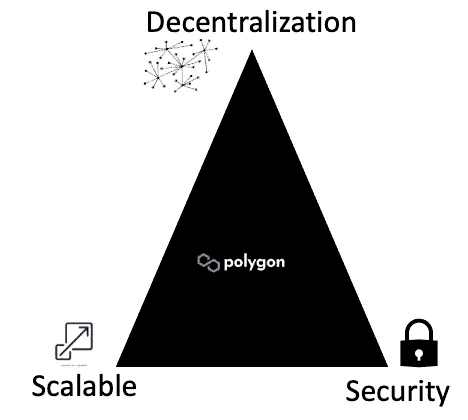

# 如果你喜欢这个帖子，那么你可以请我喝咖啡，先谢谢你了！

# 如果你现在痴迷于这些资源，那就投入其中吧。

**关于标桩的指标**

 [## 多边形

### 多边形

polygon 钱包.多边形.技术](https://wallet.polygon.technology/staking/) 

**CargoX 用例**

 [## CargoX 宣布推出区块链文档传输平台(BDT) #BuiltonEthereum 和…

### CargoX 平台帮助企业在不信任的环境中为物流、制造、金融…

博客.多边形.技术](https://blog.polygon.technology/cargox-announces-the-platform-for-blockchain-document-transfer-bdt-builtonethereum-and-7957009c22f2/) 

**包裹的代币——桥梁**

 [## 包装令牌解释

### 令牌组学包装的令牌是与另一种加密货币的价值挂钩的加密货币令牌，该加密货币连接…

blog.reef.io](https://blog.reef.io/untitled-4/) 

**Polygon 的官方文档**

 [## 多边形应用程序开发|多边形技术|文档

### 欢迎来到最令人兴奋和创新的平台，在多边形区块链上构建您的区块链应用程序…

文档.多边形.技术](https://docs.polygon.technology/docs/develop/getting-started/) 

**关于在多边形上构建社交媒体 Dapp 的虚拟教程**

 [## 虚构学习|构建一个社交媒体 dApp 并将其部署在 Polygon 上

### 构建一个社交媒体 dApp 并将其部署在 Polygon 上。建立一个更好的互联网

learn . figument . io](https://learn.figment.io/tutorials/build-a-social-media-dapp-and-deploy-it-on-polygon) 

**使用魔法(本库)构建多边形和以太坊 DApp**

 [## 如何用魔法在多边形和以太坊上搭建去中心化的 App

### 随着以太坊油价的上涨，许多开发人员正在寻找提供更多可扩展性的其他选择…

神奇. link](https://magic.link/posts/magic-polygon) 

> 加入 Coinmonks [电报频道](https://t.me/coincodecap)和 [Youtube 频道](https://www.youtube.com/c/coinmonks/videos)了解加密交易和投资

## 也阅读

 [## 杠杆代币[多头代币]终极指南

### 杠杆化令牌是具有杠杆化风险敞口的 ERC20 令牌，不考虑保证金、要求、管理…

medium.com](/coinmonks/leveraged-token-3f5257808b22)  [## 最佳加密交易所| 2022 年十大加密货币交易所| CoinCodeCap

### 哪一个是最好的加密交换？在本文中，我们将根据多种加密货币列出 10 大加密货币交易所

coincodecap.com](https://coincodecap.com/crypto-exchange)  [## 2022 年 2 月值得关注的三大游戏代币| CoinCodeCap

### 排名前 3 位的游戏也占交易总量的 85%以上。Defi 王国、Axie Infinity 和 Pegaxy…

coincodecap.com](https://coincodecap.com/top-3-gaming-tokens-to-look-out-for-in-february-2022)  [## 2022 年最佳加密交换平台| CoinCodeCap

### 随着时间的推移，我们大多数人将转向 dex 以获得更好的安全性和隐私。因此。在这里，我们将讨论…

coincodecap.com](https://coincodecap.com/best-swap-platforms)  [## 10 大最佳在线赌场|赢得并赢取免费 BTC 2022 | CoinCodeCap

### 接收、支付和赚取加密货币| |有各种各样的最佳在线赌场可供选择，有可能…

coincodecap.com](https://coincodecap.com/best-online-casinos)  [## 加密交易机器人——19 款最佳免费加密交易机器人

### 2022 年币安、比特币基地、库币和其他密码交易所的最佳密码交易机器人。四进制，位间隙…

medium.com](/coinmonks/crypto-trading-bot-c2ffce8acb2a)  [## 2022 年 5 大最佳社交交易平台

### 5 个最佳社交交易平台阅读加密产品评论和比较，了解比特币交易和…

coincodecap.com](https://coincodecap.com/best-social-trading-platforms)  [## BlockFi 评论:2022 年的利弊和利率

### 今天，我们提出了一个全面的 BlockFi 评论，这是一个成立于 2017 年的加密贷款平台，拥有其…

coincodecap.com](https://coincodecap.com/blockfi-review)  [## 如何在印度购买比特币？2021 年购买比特币的 7 款最佳应用[手机版]

### 如何使用移动应用程序购买比特币印度

medium.com](/coinmonks/buy-bitcoin-in-india-feb50ddfef94)  [## 9 个 2022 年最值得购买的密码| CoinCodeCap

### 9 个 2022 年最值得购买的加密产品阅读加密产品评论和比较，了解比特币交易和…

coincodecap.com](https://coincodecap.com/crypto-to-buy-in-2022) 

> 加入 Coinmonks [电报频道](https://t.me/coincodecap)和 [Youtube 频道](https://www.youtube.com/c/coinmonks/videos)了解加密交易和投资

# 另外，阅读

*   [如何在 Uniswap 上交换加密？](https://coincodecap.com/swap-crypto-on-uniswap) | [A-Ads 评论](https://coincodecap.com/a-ads-review)
*   [WazirX vs CoinDCX vs bit bns](/coinmonks/wazirx-vs-coindcx-vs-bitbns-149f4f19a2f1)|[block fi vs coin loan vs Nexo](/coinmonks/blockfi-vs-coinloan-vs-nexo-cb624635230d)
*   [本地比特币审核](/coinmonks/localbitcoins-review-6cc001c6ed56) | [加密货币储蓄账户](https://coincodecap.com/cryptocurrency-savings-accounts)
*   [什么是保证金交易](https://coincodecap.com/margin-trading) | [美元成本平均法](https://coincodecap.com/dca)
*   [支持卡审核](https://coincodecap.com/uphold-card-review) | [信任钱包 vs 元掩码](https://coincodecap.com/trust-wallet-vs-metamask)