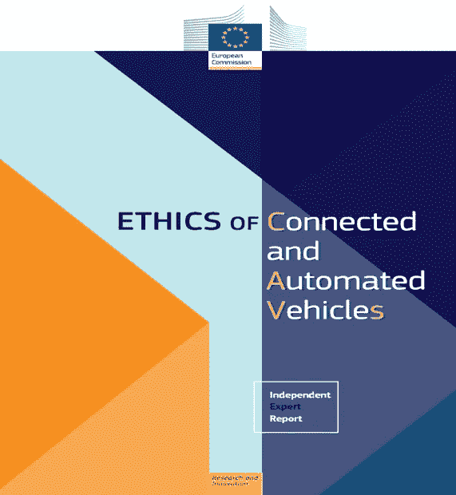
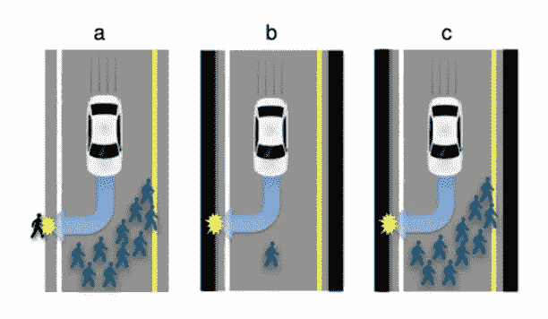

# 联网自动车辆的伦理

> 原文：<https://medium.com/coinmonks/ethics-of-connected-automated-vehicles-e01b04aae591?source=collection_archive---------35----------------------->

**简介**

A 自主车辆是指在不需要人为因素的情况下，通过感知道路、交通状况和环境条件来驾驶的汽车，这要归功于人工智能和深度学习算法支持的自动控制系统硬件。[在 2020 年 9 月欧盟委员会发布的名为《CAVs 的伦理》的研究中，](https://op.europa.eu/en/publication-detail/-/publication/89624e2c-f98c-11ea-b44f-01aa75ed71a1/language-en)软件开发者、工具制造商和用户；在建议的小标题下讨论了在开发、生产和使用自动驾驶汽车软件时应该考虑的问题。在相关研究的第一部分，驾驶安全、风险和困境，在第二部分数据和算法伦理；安全，公正，可解释性，最后，第三部分的责任。我将借助欧洲委员会名为《CAVs 伦理》的工作来阐述自动驾驶汽车和伦理。

**路线安全、风险和困境**

我们掌握的科学研究表明，即使自动驾驶汽车在可预见的未来进入我们的生活，事故也不会结束。虽然自主系统将比人类更安全地驾驶车辆，但研究表明，事故不会结束。然而，在这种情况下，谁将负责任，我们如何分配风险并最大限度地提高路线安全性，在算法驾驶自动驾驶汽车时将经历的困境中，可以做些什么？

*“防止或最大限度地减少可能发生在人身上的物理伤害”*

在编写欧盟委员会报告时，各节中讨论的主题的小标题是根据建议形成的。本节讨论的最重要的问题是如果自动驾驶汽车在旅程中陷入困境该怎么办的问题，并指出作为一种解决方案，应在软件开发商和车辆制造商的共同努力下在自动驾驶系统上确定政策，这些政策应强调路线安全和低风险。有人指出，自主系统应该对所有人适用伤害最小的可能性，尽管它们会看到，如果在旅程中遇到困境，它们和外面的乘客不会受到身体伤害。

*“防止危险驾驶的安全设计”*

已经指出，软件开发者和车辆制造商应该为自主系统配备直觉，以确保用户安全中心的安全性，从而防止危险的使用。已经说明，在使用阶段，用户将不可避免地偏离危险的使用路径，但自主系统的算法应该防止危险的使用，并以其直觉切换到安全驾驶模式。此外，有人指出，为了使算法发展直觉，数据集应该从用户经验中透明地创建，并且应该通过使用深度学习方法在具有这些数据集的算法中发展直觉。

*“自主系统安全出行新交通规则”*

系统的开发者和决策者应该更新现有的规则，并制定新的规则，以确保自动驾驶汽车的安全行驶。开发者和制造商应该遵守这些规则，因为当前的规则不允许自主系统安全行驶。政策制定者和开发者应该在这个问题上合作。

*“旅途中可能出现的不平等”*

自主车辆和其他行驶车辆之间有时会出现差异。在这种情况下，自动驾驶汽车可能需要允许有利于其他车辆的不平等，最好的例子是行驶以应对紧急情况的车辆，如救护车和消防队。为了防止自动驾驶汽车将会产生的不平等，开发人员需要将紧急情况下不平等有利于其他车辆的行为带到自动驾驶汽车的算法中。

*“通过分享道德原则和分散风险来管理困境”*

正如我在上面的段落中提到的，困扰人们关于自动驾驶汽车的问题是，在进退两难的情况下，他们会怎么做。这是许多伦理课程讨论的主题。正如我上面提到的，如果自治系统经历了这样的困境，人们根本不会受到伤害，如果没有这样的选项，他们应该选择对他们所有人造成伤害最小的选项。但是在另一个人导航而不是两个平等的导航员弱于自主系统的场景下会发生什么，如果其中一个导航员是救护车或者是骑自行车的小孩会发生什么？在这种情况下，伦理原则开始发挥作用。政策制定者、开发者和制造商将定义道德原则，并与所有系统制造商和开发者分享。

**数据和算法伦理:安全性、公平性和可解释性**

在自动驾驶汽车的开发和生产过程中，需要静态和动态数据。由于这些数据集，错误和可能的问题得以纠正，系统得以开发。由于这些数据集，机器学习可以添加到自动驾驶汽车的算法中。由于这些数据集，测试、改进活动和研究得以完成。这些数据集的收集和存储应以透明的方式进行。必要时，当数据所有人就数据的安全性和公平性与其对话者进行沟通时，他们的活动应以透明的方式进行。

*“数据安全与透明”*

在欧盟委员会编写的报告中，它指出，在这些活动的数据存储、使用和透明度方面，应遵守 GDPR 标准。有人指出，在收集和使用数据时，应告知数据所有人和其他人，每个活动阶段都应以透明的方式进行。此外，这些数据的保存也应根据 GDPR 标准进行。有人指出，在开发、生产和测试自治系统时与第三方共享数据应遵守严格的条件，并且所有阶段都应透明。在这方面，有人指出，决策者应更新现有规则，并在必要时确定新的规则，以确保这种个人数据的安全。

*“个人喜好应该得到承认”*

据称，其数据被使用的人应始终有权不选择要确定的政策和原则，开发者、生产者、决策者和研究人员应根据人民的意愿研究替代方法，个人自由不应受到损害，人民的偏好应得到尊重。

*“制定透明度战略，告知道路使用者有关数据收集和相关权利的信息”*

有人指出，被收集数据的人应该知情，在使用他们的数据的每个阶段都必须透明。还有人指出，有必要对使用个人数据可能产生的后果保持透明。有人指出，未经个人同意，也不应使用他们的数据。

*“监控自主车辆算法”*

已经说明，算法的开发、测试和使用过程应当由决策者或者由决策者确定的独立机构单独审核。非常重要的是，他们在执行机器学习或工作算法时使用的数据集不包含歧视。因此，已经说明了数据集应该在执行学习和工作活动之前被审计，算法应该在活动之后被审计。还有人表示，应根据使用过程中的反馈，定期检查算法。

*“确保算法决策透明”*

开发者和制造商应该透明地满足用户在自动驾驶汽车所有权期间对算法决策的需求。开发者和制造商应该以用户为中心生产和开发自动驾驶汽车。这些工具的算法是以用户为中心的方式开发和生产的，在用户做出决策时，它们应该是透明的。

Pixabay

**责任**

讨论的另一个问题是责任。自动驾驶车辆事故造成生命或财产损失，谁来负责？谁将对损害负责并寻求他们的权利，自动驾驶汽车用户，制造商还是软件开发商？

*“应明确自主车辆上的责任”*

在确定原则时，应该在工具的开发、生产和测试过程中详细定义每个参与者的职责。车辆批量生产完成并开始使用后，如果因为传感器的错误而发生事故，应该用这些原则来确定谁来承担责任。如果是软件相关问题，应联系软件开发商，如果是机械问题，应联系厂商。

*“必须保证无障碍”*

在由自动驾驶车辆引起的问题中，可访问性非常重要。在这方面，问题产生于哪个生产阶段，无论是软件、生产还是测试，当需要接触演员并被追究责任时，这应该迅速完成。可及性正义也具有确立它的特征。

*“自治系统行为后连接公平系统的建立”*

自主系统可能会造成物质或精神上的损害，有时是由于算法中的错误，有时是机械系统中的错误，或者是测试过程中跳过的细节。如果我们举一个例子，如果算法的学习是以歧视老年人的方式实现的，并且在测试过程中没有考虑到这种情况。应该建立一个公平的系统，以便与导致错误的行为者建立联系，这些行为将在这种错误之后发生。

*“应建立公平机制补偿自动驾驶汽车造成的损害”*

政策制定者、开发者、生产者和研究人员需要建立一个公平的损害赔偿制度。应建立一个保险系统，该系统将公平透明地对自动驾驶汽车活动后可能出现的损害进行赔偿。同样，应该建立一个司法系统，在该系统中，将以公平和透明的方式评估赔偿、责任和损害的各方，并做出决定。为此，应首先进行立法研究，填补现有法律的空白，更新过时的法律，并在有缺陷的地方制定新的法律。

Pixabay

**结论**

贯穿本文的路线安全、风险和自动驾驶汽车的困境；我评估了数据和算法伦理和责任的问题，同时欧洲委员会发布了一份名为 CAVs 伦理的报告。我谈到了未来不可避免地将成为我们生活一部分的自动驾驶汽车，这些汽车将带来的问题，以及如何解决这些问题。像每一项新技术一样，自动驾驶汽车也存在问题。重要的是关注这些问题并尽快解决它们，将我们的生活交付给它带来的繁荣。

[*你可以访问链接阅读土耳其语的文章……*](https://www.ikonionhukukvekariyerdernegi.com/post/otonom-ara%C3%A7lar-ve-etik)

**参考:**

1.  [联网和自动化车辆的伦理，Avrupa Konseyi，2020 年](https://op.europa.eu/en/publication-detail/-/publication/89624e2c-f98c-11ea-b44f-01aa75ed71a1/language-en)

> *加入 Coinmonks* [*电报频道*](https://t.me/coincodecap) *和* [*Youtube 频道*](https://www.youtube.com/c/coinmonks/videos) *了解加密交易和投资*

# 另外，阅读

*   [加密保证金交易交易所](/coinmonks/crypto-margin-trading-exchanges-428b1f7ad108) | [赚取比特币](/coinmonks/earn-bitcoin-6e8bd3c592d9)
*   [WazirX vs coin dcx vs bit bns](/coinmonks/wazirx-vs-coindcx-vs-bitbns-149f4f19a2f1)|[block fi vs coin loan vs Nexo](/coinmonks/blockfi-vs-coinloan-vs-nexo-cb624635230d)
*   [BlockFi 信用卡](https://coincodecap.com/blockfi-credit-card) | [如何在币安购买比特币](https://coincodecap.com/buy-bitcoin-binance)
*   [火币交易机器人](https://coincodecap.com/huobi-trading-bot) | [如何购买 ADA](https://coincodecap.com/buy-ada-cardano) | [Geco。一次回顾](https://coincodecap.com/geco-one-review)
*   [加密复制交易平台](/coinmonks/top-10-crypto-copy-trading-platforms-for-beginners-d0c37c7d698c) | [五大 BlockFi 替代品](https://coincodecap.com/blockfi-alternatives)
*   [CoinLoan 点评](https://coincodecap.com/coinloan-review)|[Crypto.com 点评](/coinmonks/crypto-com-review-f143dca1f74c) | [火币保证金交易](/coinmonks/huobi-margin-trading-b3b06cdc1519)
*   [Bybit vs 币安](https://coincodecap.com/bybit-binance-moonxbt)|[stealth x 回顾](/coinmonks/stealthex-review-396c67309988) | [Probit 回顾](https://coincodecap.com/probit-review)
*   [顶级付费加密货币和区块链课程](https://coincodecap.com/blockchain-courses)
*   [CBET 评论](https://coincodecap.com/cbet-casino-review) | [库科恩 vs 比特币基地](https://coincodecap.com/kucoin-vs-coinbase)