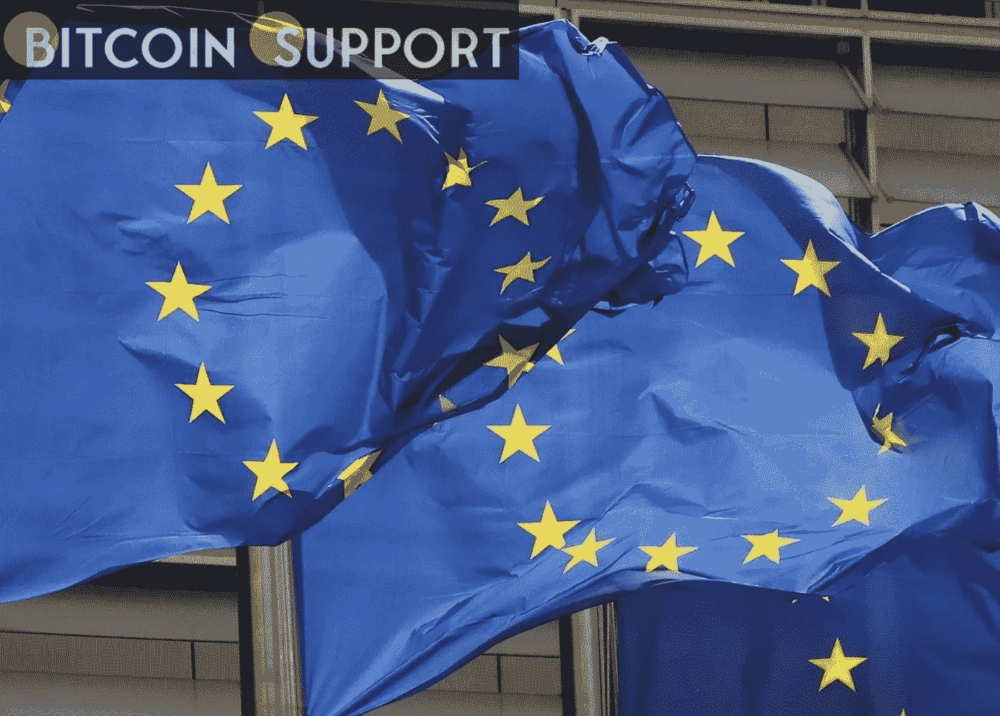

# 欧盟扩大对俄罗斯和白俄罗斯的制裁

> 原文：<https://medium.com/coinmonks/eu-extends-sanctions-against-russia-and-belarus-to-crypto-96834c797e0b?source=collection_archive---------75----------------------->

**Visit our website:-** [**https://bitcoinsupports.com/**](https://bitcoinsupports.com/)

欧盟表示，加密货币资产属于“可转让证券”类别，因此明确涵盖在制裁范围内。

欧盟(EU)已经明确表示，对俄罗斯和白俄罗斯的制裁包括数字资产。

加密资产被归类为“可转让证券”，因此显然包括在因俄罗斯入侵乌克兰而对其实施的制裁范围内，也包括因白俄罗斯的参与而对其实施的制裁范围内。

“贷款和信贷可以以多种方式扩展，包括通过使用加密资产，”欧盟周三表示。

此外，欧盟宣布增加对白俄罗斯的现有金融制裁，以配合已经实施的对俄罗斯的制裁。

这些措施包括限制向三家白俄罗斯银行及其子公司提供 SWIFT 服务，禁止与白俄罗斯中央银行进行交易，以及禁止在欧盟交易交易所上市与白俄罗斯国有企业股份相关的证券。

美国政界人士表达了对俄罗斯可能利用加密来规避制裁的担忧，但这种情况在多大程度上存在争议。

**访问我们的网站:-**[**https://bitcoinsupports.com/**](https://bitcoinsupports.com/)

**免责声明:以上为作者观点，不应视为投资建议。读者应该自己做研究。**