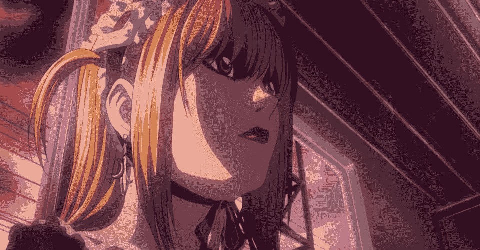
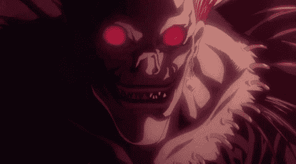

# 欣快感。

> 原文：<https://medium.com/coinmonks/euphoria-477347eb20b9?source=collection_archive---------13----------------------->

> "牛市在悲观中诞生，在怀疑中成长，在乐观中成熟，在兴奋中死亡."—约翰·邓普顿

交易教会了我很多东西。在某种程度上，它增强了我的意志。当谈到赚钱的时候，我变得非常冷漠，天哪，我知道如何保持耐心。

在上一轮牛市中，令我震惊的是社交媒体上发生的 180 度大转变。当然，人们仍然偶尔会有不满，但在大多数情况下，似乎大多数小紧张局势都神秘地解除了。灵感飙升到空前的高度，氦成为我们的日常交流。

然后……嗯，我们为希望而紧紧抓住的同样的兴奋，毫不犹豫地冷血地杀死了市场。

“I Told You In The Very Beginning That I Would Be The One Writing Your Name In The Notebook When You Die.” — Ryuk from Death Note (2006).

# 过度兴奋会致命

事情是这样的:兴奋不是你的朋友；更像是一个喜欢派对的悠闲恶魔。我们见过他很多次了。

事实上，当你注意到市场变得越来越不理性，越来越妄想，越来越缺乏怀疑时，你应该变得越来越警惕。这就是兴奋的力量。欣快感来自你的多巴胺。人们会在短暂的高点上乘虚而入，极度兴奋小心翼翼地注入市场，太沉醉于自己的情绪，以至于没有注意到发生了什么。

在很大程度上，牛市中有两种人——无知的人和冷漠的人。不幸的是，对于那些一无所知的人来说，他们更容易被利用。如果你在这些时候不密切关注，你会失去所有的钱——而且你可能没有恢复所需的心理弹性。

没有感情的人也没有完全搞清楚:他们有时被自己的怀疑态度弄得太麻木了。对市场的恐惧让他们变得无用，他们也失去了承担风险的能力。

我不是悲观主义者，我是现实主义者。让我们就这个话题聊一会儿。

# 有目的的共鸣

> *知道什么时候抓住*他们。*知道什么时候收起*它们。知道什么时候该走开。——肯尼·罗杰斯。

要成为一个好的交易者，你需要知道什么时候承担好的风险。你的风险必须冷静、有计划、有条理。最后，你需要知道何时降低风险，最重要的是:从桌上拿走一些筹码。就是这样。

那么，为什么那么多人失败呢？我相信这是因为他们变得太依恋他们的包了，因为他们的包通常是某种形式的崇拜。

爱上你的资产是一个零和游戏。当你变得情绪化时，逻辑和理性就会离开这个建筑。没有它们你就不能正常交易。很多时候，情绪交易者发现自己回到了起点。

那么解决办法是什么？

# 像水一样

> “水可以采取任何形式。这一刻，它毫不费力地漂浮着，下一刻，它就像洪水一样倾泻而下。”—斯派克·斯皮格尔

像水一样，你必须变得无形。水可以采取任何形式，成为任何情感，适应任何环境。水可以像你早上喝的茶一样让人心旷神怡，也可以像席卷城市的飓风一样让人如饥似渴。

在交易方面，这涉及到。

*   **计算风险(基于你的信念、趋势或技术分析)。**
*   **获利回吐**
*   **适应市场**
*   **目标设定**
*   **情感超脱(从你的 JPEGs、微大写等。)**

*论情感超脱:我不是让你做精神病。我要你考虑到 99%的东西明年都不会在这里了。仅此而已。*

这句箴言拯救了我的投资组合，也让我的心态平和了无数次。我能够从小盘股交易(这是我的专长)转向非交易股。

我的小盘股朋友告诉我，如果我做了这个转换，我会失去所有的钱。如果我听了他们的话，这两个月我会很无聊。我在这只熊身上赚的钱比我在上一轮牛市中赚的还多。他们害怕改变。我没有。

# 结束语

这篇文章很短，但就环境而言是及时的。情况开始再次好转，但我们还没有完全达到确认牛市的标准。我鼓励你谨慎行事，同时在此之前保持你的信心。

这是为自己设定一些目标的好时机。记住:如果你没有目标，你会错过 100%的时间。

负责任地投资。— Lite。

> 加入 Coinmonks [电报频道](https://t.me/coincodecap)和 [Youtube 频道](https://www.youtube.com/c/coinmonks/videos)了解加密交易和投资

# 另外，阅读

*   [block fi vs Celsius](/coinmonks/blockfi-vs-celsius-vs-hodlnaut-8a1cc8c26630)|[Hodlnaut 点评](/coinmonks/hodlnaut-review-best-way-to-hodl-is-to-earn-interest-on-your-bitcoin-6658a8c19edf) | [KuCoin 点评](https://coincodecap.com/kucoin-review)
*   [Bitsgap 审查](/coinmonks/bitsgap-review-a-crypto-trading-bot-that-makes-easy-money-a5d88a336df2) | [Quadency 审查](/coinmonks/quadency-review-a-crypto-trading-automation-platform-3068eaa374e1) | [Bitbns 审查](/coinmonks/bitbns-review-38256a07e161)
*   [加密复制交易平台](/coinmonks/top-10-crypto-copy-trading-platforms-for-beginners-d0c37c7d698c) | [Coinmama 评论](/coinmonks/coinmama-review-ace5641bde6e)
*   [印度的加密交易所](/coinmonks/bitcoin-exchange-in-india-7f1fe79715c9) | [比特币储蓄账户](/coinmonks/bitcoin-savings-account-e65b13f92451)
*   [OKEx vs KuCoin](https://coincodecap.com/okex-kucoin) | [摄氏替代品](https://coincodecap.com/celsius-alternatives) | [如何购买 VeChain](https://coincodecap.com/buy-vechain)
*   [币安期货交易](https://coincodecap.com/binance-futures-trading)|[3 comas vs Mudrex vs eToro](https://coincodecap.com/mudrex-3commas-etoro)