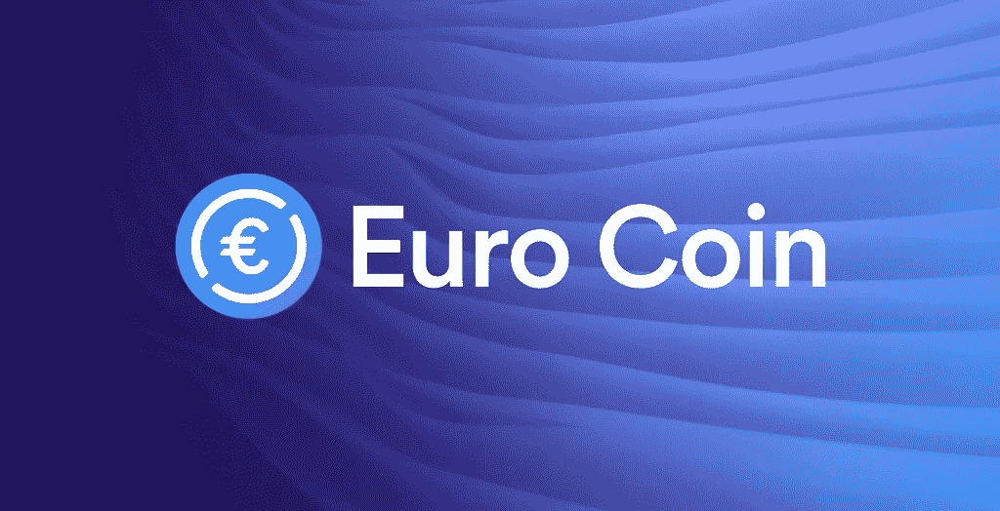

# 欧元启动，这是一种 100%以欧元结算的稳定货币

> 原文：<https://medium.com/coinmonks/euroc-is-launched-a-stablecoin-with-100-coverage-in-euros-adf77dc2dfdf?source=collection_archive---------10----------------------->

世界第二大稳定币——美元币(USDC)的发行者“ [Circle Internet Financial](https://www.circle.com/en/) ”公司推出了一种与欧元(EUROC)挂钩的完全绑定稳定币，这向市场表明，尽管该行业最近出现了动荡，但对加密货币兑换服务的需求仍然很高。

这种新的稳定币被称为**欧元币**或**欧元币**，将于 6 月 30 日**开始交易。**

像 USDC 一样，欧元硬币是一种受监管的稳定货币，完全由储备支持，在这种情况下是欧元。这意味着每一枚流通中的欧元硬币都将有一笔相当于欧元的储备，由美国控制的金融机构持有。

加密货币友好型金融机构 Silvergate Bank 被引入作为稳定货币 EUROC 的初始托管机构。

EUROC 为企业提供了更广泛的欧元流动性，可用于支付、交易、借贷。稳定币最初将在[以太坊区块链](https://bitnewsbot.com/ethereum-wiki-what-is-ethereum/)发行。

# 关于欧元

根据国际清算银行(BIS)的数据，欧元是世界上第二大法定货币。国际清算银行 2019 年三年期央行调查发现，欧元在所有货币交易中占 32%。

1999 年推出的欧元是由 19 个成员国组成的欧元区的共同货币。其作为贸易伙伴的主导地位进一步反映在美元指数(DXY)中，其权重保持在 57.6%。

# 马厩里的鸡

由于银行对数字资产的限制，Stablecoins 最初旨在为加密货币交易者提供流动性。

然而，随着时间的推移，它们的效用已经显著扩大。Stablecoins 现在服务于没有银行账户或不从事传统银行交易的人群，以及由于资本管制或制裁而无法获得美元的国家的用户。

Circle 最近发布了 USDC 交易的专用商业账户，突显出企业对稳定的硬币支付日益增长的需求。

*原载于 2022 年 6 月 17 日 https://bitnewsbot.com***。**

> *加入 Coinmonks [电报频道](https://t.me/coincodecap)和 [Youtube 频道](https://www.youtube.com/c/coinmonks/videos)了解加密交易和投资*

# *另外，阅读*

*   *[如何使用 Solidity 在以太坊上创建 DApp？](https://coincodecap.com/create-a-dapp-on-ethereum-using-solidity)*
*   *[币安 vs FTX](https://coincodecap.com/binance-vs-ftx) | [最佳(SOL)索拉纳钱包](https://coincodecap.com/solana-wallets)*
*   *[如何在 Uniswap 上交换加密？](https://coincodecap.com/swap-crypto-on-uniswap) | [A-Ads 审查](https://coincodecap.com/a-ads-review)*
*   *[加密货币储蓄账户](/coinmonks/cryptocurrency-savings-accounts-be3bc0feffbf) | [YoBit 审核](/coinmonks/yobit-review-175464162c62)*
*   *[Botsfolio vs nap bots vs Mudrex](/coinmonks/botsfolio-vs-napbots-vs-mudrex-c81344970c02)|[gate . io 交流回顾](/coinmonks/gate-io-exchange-review-61bf87b7078f)*
*   *[CoinFLEX 评论](https://coincodecap.com/coinflex-review) | [AEX 交易所评论](https://coincodecap.com/aex-exchange-review) | [UPbit 评论](https://coincodecap.com/upbit-review)*