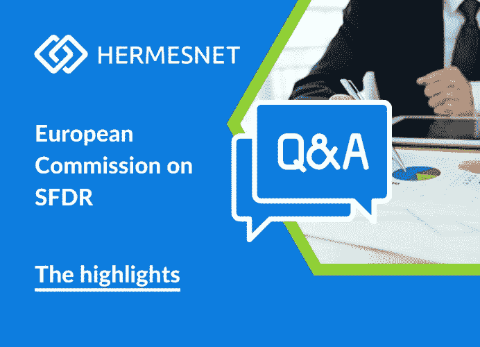

# 欧盟委员会关于 SFDR 的问答及要点

> 原文：<https://medium.com/coinmonks/european-commission-q-a-on-sfdr-and-the-highlights-90c45cb3e52b?source=collection_archive---------54----------------------->

## 欧盟委员会在 5 月 25 日回答了欧洲监管当局(esa)提出的许多关于欧盟可持续财务披露条例(SFDR)和欧盟分类条例(Q&A)的解释的问题。在委员会的问答中有许多见解和澄清。

在 [Hermesnet](https://www.hermesnet.co.uk/) 上，我们欢迎这一点，因为大部分努力都是试图正确解释 SFDR 和分类监管对金融产品的影响、范围和实用性。

**在阅读 Q & A 时，我们想到了以下亮点和发现:**

*   第一个问题很重要，我们 [Hermesnet LTD](https://www.linkedin.com/company/hermesnet/?viewAsMember=true) 认为主要不利影响(PAI)是委员会在产品层面包含的几个指标之一。这是为了让金融市场参与者可以解释他们如何考虑或已经考虑金融产品对可持续性因素的主要不利影响，以及如何捕捉和监控环境因素。采用这些因素的目的是显示金融产品对负外部性的贡献有多大，并给出具体的指标来监控和减轻这些外部性。
*   金融市场参与者必须明白两件事:当 SFDR 规定金融产品的义务时，如 SFDR 所概述的，当 SFDR 提及金融工具时，如 MiFID 法规。
*   关于定期披露，SFDR 仍然适用于《SFDR》生效前已经平仓的金融产品。
*   金融市场参与者不需要在实体和产品层面上披露 PAI，如果他们愿意，他们可以在产品层面上告诉它。
*   问答中说，良好治理实践适用于第 8 条和第 9 条产品。然而，他们的评估方式不同，但底线是在这两种情况下都需要满足 G 方面。
*   不允许金融市场参与者声称他们与分类法一致，如果他们不能用可靠的分类法数据来支持，那么他们就不能进行可持续的投资。

*风险免责声明:本文中的信息仅为方便起见而提供，并非任何类型的建议，在考虑您的行动时可能不会依赖这些信息。我们对本文所含信息的准确性或完整性不做任何陈述，也不承担更新信息的义务。本文仅供参考。你应该仔细考虑和评估与论文中信息相关的所有风险和不确定性，并在必要时寻求外部建议。HERMESNET LTD 管理 HERMESNET，这是一家在英格兰和威尔士注册的公司，注册号为 13250243。*

> 加入 Coinmonks [电报频道](https://t.me/coincodecap)和 [Youtube 频道](https://www.youtube.com/c/coinmonks/videos)了解加密交易和投资

# 另外，阅读

*   [BlockFi vs Celsius](/coinmonks/blockfi-vs-celsius-vs-hodlnaut-8a1cc8c26630)|[Hodlnaut 回顾](/coinmonks/hodlnaut-review-best-way-to-hodl-is-to-earn-interest-on-your-bitcoin-6658a8c19edf) | [KuCoin 回顾](https://coincodecap.com/kucoin-review)
*   [Bitsgap 审查](/coinmonks/bitsgap-review-a-crypto-trading-bot-that-makes-easy-money-a5d88a336df2) | [Quadency 审查](/coinmonks/quadency-review-a-crypto-trading-automation-platform-3068eaa374e1) | [Bitbns 审查](/coinmonks/bitbns-review-38256a07e161)
*   [密码本交易平台](/coinmonks/top-10-crypto-copy-trading-platforms-for-beginners-d0c37c7d698c) | [Coinmama 评论](/coinmonks/coinmama-review-ace5641bde6e)
*   [印度的加密交易所](/coinmonks/bitcoin-exchange-in-india-7f1fe79715c9) | [比特币储蓄账户](/coinmonks/bitcoin-savings-account-e65b13f92451)
*   [OKEx vs KuCoin](https://coincodecap.com/okex-kucoin) | [摄氏替代品](https://coincodecap.com/celsius-alternatives) | [如何购买 VeChain](https://coincodecap.com/buy-vechain)
*   [币安期货交易](https://coincodecap.com/binance-futures-trading)|[3 commas vs Mudrex vs eToro](https://coincodecap.com/mudrex-3commas-etoro)
*   [如何购买 Monero](https://coincodecap.com/buy-monero) | [IDEX 评论](https://coincodecap.com/idex-review) | [BitKan 交易机器人](https://coincodecap.com/bitkan-trading-bot)