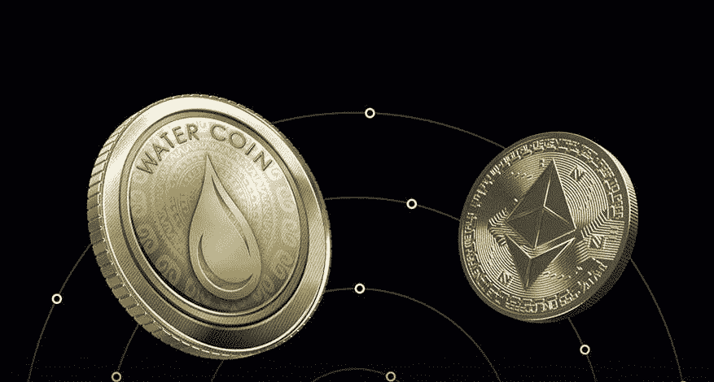

# 欧盟卷起袖子监管加密货币，打击欺诈

> 原文：<https://medium.com/coinmonks/european-union-rolls-up-its-sleeves-to-regulate-cryptocurrencies-and-crack-down-on-fraud-d7cc302a727b?source=collection_archive---------97----------------------->

它的税收仍然缺乏明确的规定，交易平台必须向西班牙银行注册

欧盟希望有一个单一的、协调的法规来管理加密货币世界。一周前，欧洲议会朝着这个方向迈出了决定性的一步，批准了 MiCA(加密资产市场)监管提案，该提案禁止或限制比特币的流通。

专家们一致认为这项法规尽快出台非常重要。这一想法是在他们召开的第七次会议上，在洗钱的加密风险讨论桌上提出的。正如 Prosegur 主管 Miguel Soler Ruiz-Boada 指出的那样，到 2021 年，总计 86 亿美元的加密货币最终落入黑客手中。

缺乏关于虚拟货币的共同法律是“机构投资者和巨额财富进入该行业”的一个障碍。这是加密货币买卖平台 2gether 的风险和监管合规部主任 Lorena Martínez Romero 的观点。

对他来说，确保跨地区共同监管框架的监管将消除仍对加密货币世界保持警惕的投资者的疑虑。然而，这样的标准可能需要几年才能达到。

在此之前，数字资产会带来许多法律挑战。“至少在欧洲联盟内部，法律的确定性和统一性是必要的。主要的不情愿是高波动性、缺乏政府支持，以及以我的经验来看，监管是如此之少。

税务部门
加密货币也代表了西班牙财政部的灰色空间。西班牙银行律师、防止洗钱和金融犯罪委员会(SEPBLAC)执行处成员拉斐尔·阿巴德·彼尔托在 Cumplen 组织的会议上说。虽然目前的法律对防止洗钱作出了规定，但仍有一些税务方面的问题悬而未决，应更准确地加以界定。例如，模型 720 用于国外账户的申报。“如果我在国外有超过 50000 欧元的加密货币，我是否需要提交 720 模型？原则上，这不在条例中，”法律专家说。本周，财政部澄清说，至少在今年，不需要报告这些位于国外的价值。然而，这个问题在未来几年仍然悬而未决。

被黑客攻击的可能性是另一个令人担忧的问题。在这方面，Abad 回忆起 2013 年 Mt. Gox 平台是如何成为一场抢劫的受害者，这场抢劫导致 4.6 亿美元的比特币损失，并迫使当时的市场领导者供应商破产。

为了打击网络犯罪，每个国家的监管机构都密切关注所谓的虚拟资产服务提供商(VASP)的活动，这些公司允许虚拟货币的买卖和托管。自 2021 年以来，这些加密货币服务提供商必须在西班牙银行的官方名单上注册，并通过强有力的措施过滤，以防止资本外逃和恐怖主义融资。不这样做可能导致数百万的罚款。

在这个意义上，Lorena Martínez 解释说，为了确保加密货币平台的合法性，合规官的角色变得至关重要。但她哀叹道，“初创公司并不总是拥有良好合规所需的资源。”此外，他补充说，并非所有国家都“在相同的需求水平下”采用了欧洲反洗钱法律，这描绘了一幅分散而不清晰的监管地图。

*原载于【https://www.reddit.com】**。***

> *加入 Coinmonks [电报频道](https://t.me/coincodecap)和 [Youtube 频道](https://www.youtube.com/c/coinmonks/videos)了解加密交易和投资*

# *另外，阅读*

*   *[最佳网上赌场](https://coincodecap.com/best-online-casinos) | [期货交易机器人](/coinmonks/futures-trading-bots-5a282ccee3f5)*
*   *[分散交易所](https://coincodecap.com/what-are-decentralized-exchanges) | [比特 FIP](https://coincodecap.com/bitbns-fip) | [宾邦评论](https://coincodecap.com/bingbon-review)*
*   *[用信用卡购买密码的 10 个最佳地点](https://coincodecap.com/buy-crypto-with-credit-card)*
*   *[加拿大最佳加密交易机器人](https://coincodecap.com/5-best-crypto-trading-bots-in-canada) | [Bybit vs 币安](https://coincodecap.com/bybit-binance-moonxbt)*
*   *[阿联酋 5 大最佳加密交易所](https://coincodecap.com/best-crypto-exchanges-in-uae) | [SimpleSwap 评论](https://coincodecap.com/simpleswap-review)*