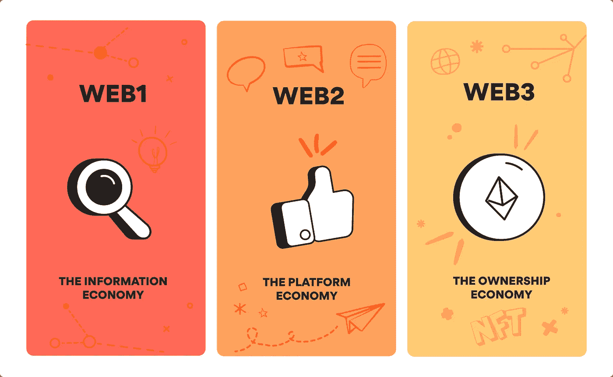
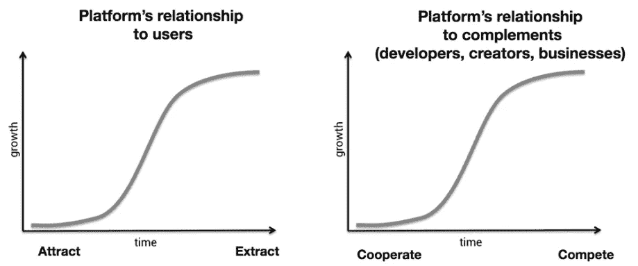
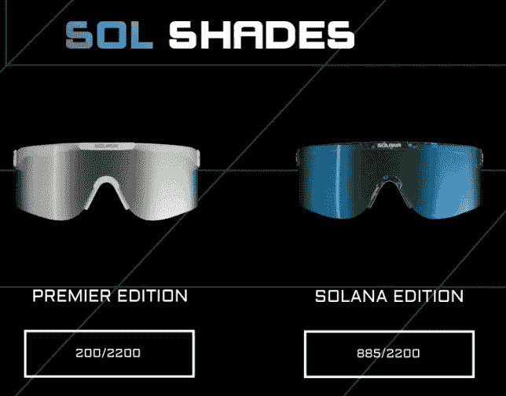
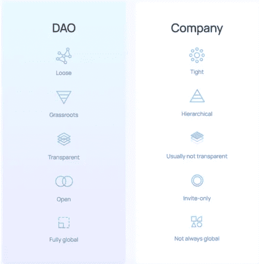
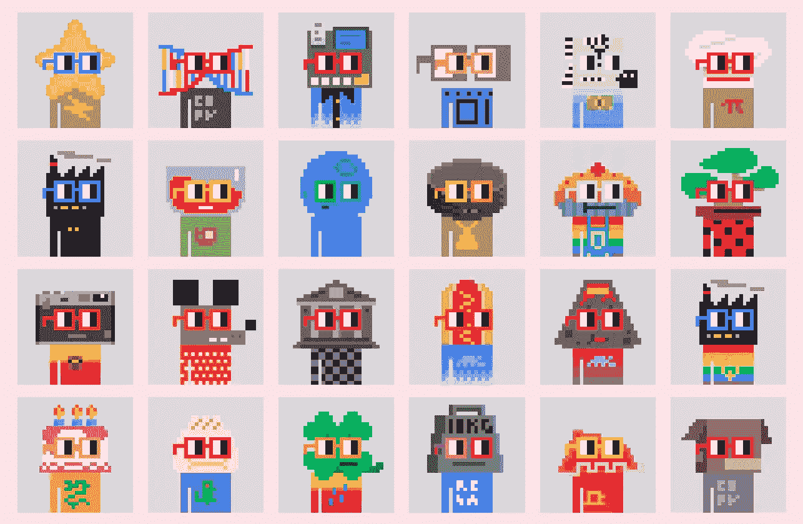
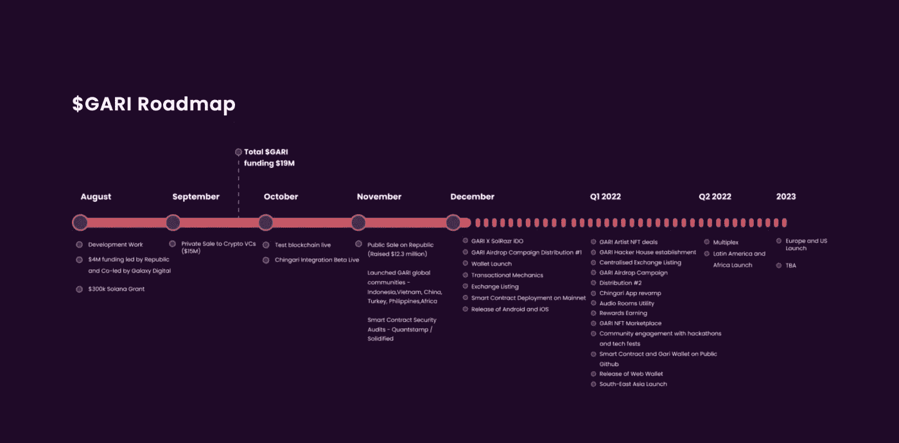

# 评估 Web3 项目-深入探讨

> 原文：<https://medium.com/coinmonks/evaluating-web3-projects-a-deep-dive-edecf0df7fdd?source=collection_archive---------7----------------------->

Made by author using [Canva](https://medium.com/u/46cb8d4ce352?source=post_page-----edecf0df7fdd--------------------------------)

网页 3，网页 3，网页 3！它出现在新闻中，出现在当地政客的舌尖上，出现在每一次董事会议的议程上，无所不在。您可能已经以这样或那样的方式使用了它的信息，您也可能遇到过诸如“DAOs”、“NFTs”等术语。

通过这篇文章，我将尽力向您介绍这些概念，并最终深入了解您如何选择投资/购买 Web3 项目，并确保它值得您的金钱和时间。

Taken from [Adobe](https://medium.com/u/f112906f26fb?source=post_page-----edecf0df7fdd--------------------------------)

**免责声明:**这绝不是*的理财建议*归根结底，这是你的钱。自己做研究，知道自己的风险偏好，只投自己能承受损失的钱！话虽如此，让我们直接进入主题，让您快速了解这些流行词汇，探索 Web3 的世界！

# 术语:相信我，它们很简单！

首先也是最重要的；什么是 Web3？同样，如果不看《蜘蛛侠 1》和《蜘蛛侠 2 》,你就无法理解《蜘蛛侠 3》的所有内容，除非我们接触到《蜘蛛侠 1》和《蜘蛛侠 2 》,否则你也很难理解《蜘蛛侠 3》。

那么，什么是 Web1？最简单的说法是，Web1 是“ ***只读*** ”互联网。它由静态网页组成，大多数用户在这些静态网页上以博客、文章等形式消费内容。

Web2 指的是万维网(WWW)的更高级版本，其中内容是以“*读写”的形式，也就是说，用户不仅可以消费信息，还可以与信息进行交互，并生成自己的内容。所有的社交媒体、动态网页、API 交互等都属于 Web2。*

*Web3 指的是更新更好的互联网版本，其中利用了区块链技术以及加密货币、NFT 等，允许用户完全拥有自己的数据。它本质上是“ ***读写自有*** ”版本的互联网！*

**

*Taken from [**Bueno Art**](https://www.bueno.art/blog)*

*我知道，你可能对所有权和为什么是 Web3 有疑问，让我们也来解决这个问题吧！*

# *为什么选择 Web3？*

*Web3 使**去中心化**。为什么去中心化很重要？正如 Chris Dixon 在一篇文章中精彩解释的那样，集中式平台遵循一个可预测的生命周期，在这个周期中，它们从招募用户开始，并与第三方(如开发人员、企业和组织)建立合作伙伴关系。尽管所有这些最初都很好，但集中式平台最终会获得权力，并开始控制他们的用户、第三方和其他一切。在达到“ ***S 曲线*** 的某个点之后，这些平台能够增长或超越其合作伙伴的唯一方式就是与他们竞争并损害用户数据。这种情况的一些非常著名的例子有**谷歌对 Yelp，脸书对 Zynga** 等等。*

**

*Taken from [Chris Dixon](https://medium.com/u/a8e3741de9e2?source=post_page-----edecf0df7fdd--------------------------------)’s blog on “Why Decentralization Matters”*

*用户最终不愿意放弃他们的个人数据和隐私，使他们更容易受到安全漏洞的影响。*

*这种情况已经持续了几十年，这也是权力下放出现的充分理由。Web3 建立在区块链的基础上，由于该技术的工作方式，该技术还可以兼作各种共识机制，从而允许更公平的权力分配，并因此实现了某种程度的分权，这是我们以前没有见过的，至少在规模上没有。*

# *非功能性测试及其重要性*

*NFTs 它们是什么？嗯，最简单的说法是:*

> *不可替代代币(NFT)是指可以在区块链上找到的任何数字商品。*

*是的，它们不仅仅是 jpegs！jpegs 格式的艺术/图片恰好是 NFTs 的一种较简单的实现方式，因此有很多这样的实现方式！为了更好、更深入地了解 NFTs，请查看我在同一上的 [**上一篇文章**](https://praatibhsurana.medium.com/understanding-nfts-through-a-tweet-8be1a3dcd56e) 或观看我的播客的 [**这一集**](https://youtu.be/5H3BCZuAyek) 。*

*现在，由于我们周围的高度金融化，有一种普遍误解 Web3，特别是 NFTs 的空气。然而，当看更广泛的叙述时，我们意识到非功能性测试是前进的方向。正如克里斯·狄克逊所写的，*

> ***“NFTs 增加了一个新的价值层——数字所有权，这在 NFTs 之前是不存在的”***

**

*The Mona Lisa from [Wikipedia](https://medium.com/u/108319a4c14d?source=post_page-----edecf0df7fdd--------------------------------)*

*很简单，一会儿想到 ***蒙娜丽莎*T3。《蒙娜丽莎》的真迹永远只有一幅，而且在某个时候，它只能被在拍卖会上以最高价购得的人所拥有。现在，由于它的名气很大，可以找到很多蒙娜丽莎的复制品，从而进一步提高了它的名气和价值。NFTs 也是如此，可能会有一个拥有杰出艺术作品的 NFT，在互联网上流传。然而，有一段时间，它只能在一个单独的加密钱包中找到，更重要的是，不像《蒙娜丽莎》,每当有人新买下它时，达芬奇没有/不会获得版税，每次 NFT 的作品转手时，最初的 NFT 艺术家/创作者总是会获得版税。***

*这样，*数字所有权*将以一种可信的方式存在，同时也促进了*创造者经济*！有了这些基本的想法，我们可以开始研究 Web3 中的项目，以及如何评估它们。*

# *网站中的项目 3*

*今年大部分时间我都在这个领域，我理解为什么人们会犹豫是否要把钱或时间投入到一个 Web3 项目中。我敢肯定，你会看到风险投资家和各种投资者在项目上挥霍金钱的报道，这些项目甚至很少提到 Web3。这种被高估的、不合理的支出在很大程度上导致了围绕财务意识的广泛错误信息，不仅在空间之外，而且在空间内的人们之间！*

*我可以告诉你的是，在这个时候，Web3 项目是新的人工智能，它们是炒作机器，空间，总的来说，价格相当膨胀，处于泡沫之中。至少 95%，如果不是 99%，这些项目从长远来看是没有价值的，是噱头。这些项目中的大多数都是为了快速赚钱，然后让 NFT 作品的购买者无所事事。*

*那么，我为什么要投资一个 Web3 项目呢？我买加密货币不是更好吗？事情是这样的，这里没有非黑即白。有做得成倍增长的好项目，有做得不好的好项目，有做得不好的坏项目，但也有开始很糟糕然后做了惊人的事情的项目。挑选一个 Web3 项目需要大量的研究和尽职调查。我将尝试总结一些关键的东西，以确保你下次做出更好的选择！*

## *社区和透明度*

*随着我们走向这个权力下放的时代，我们人民成为变革的驱动力，此外，我们拥有前所未有的力量。这就要求*大规模的协作*，协作的成功取决于协作者和他们之间的关系。因此，社区在 Web3 中扮演着相当重要的角色，事实上，我甚至可以说它是 Web3 和其中所有项目的主要驱动力。*

**

*Taken from Shutterstock*

*所以我首先关注的是项目周围的社区。像在 ***Twitter*** 和 ***Discord*** 这样的平台上与社区互动，直接了解人们，能够衡量项目周围的总体能量，以及人们对项目创始人和项目潜力的看法是一个很好的起点。*

*通常情况下，你会发现最有前途的 Web3 项目有一个辉煌的社区，并得到周围一些最聪明的头脑的支持。在我看来，这是决定是否买入一个项目的最佳指标之一。*

**

*Taken from [**TechWiser**](https://techwiser.com/use-discord-bots-post-tweets-twitter)*

*我参与的一些最有前途的 Web3 项目都定期进行 Twitter 空间、Discord 聊天、ama 等等。在这方面，您可以查看一些项目，如每两周或每月举办一次 Twitter spaces 和 IRL Web3 meetups 的 Swaraj Projekt 。甚至像[**noussdao**](https://nouns.wtf/)这样一些最著名的项目也有一个非常活跃的 Discord 社区，围绕如何改进项目和充分利用 Web3 的潜力不断地输入想法和讨论。这也是一种透明的方式，因为它允许成员/投资者了解社区中的其他人，增加他们的信任和合作的表面积。*

## *效用*

*虽然我觉得这是非常主观的，因人而异，但在寻找长期项目时，效用是绝对要考虑的因素。现在，效用可以是真实的，也可以是在线的。*

*我关注效用有几个原因:*

*   *首先，我没有足够的资金仅仅依靠 jpegs 图片，希望它们的底价会暴涨。*
*   *第二，也是更重要的一点，具有良好效用的项目自然会吸引更好的社区，从而提供更多获得高投资回报的机会。*

*当我在这里提到投资回报时，并不仅仅是从财务的角度。我还从成长、学习和人际交往等方面提到了它。*

**

*Taken from the [SolShades](https://medium.com/u/73a1d61cc78e?source=post_page-----edecf0df7fdd--------------------------------) website*

*基于效用的 Web3 项目的几个有趣的例子是**和 [**GARI 熊猫 NFTs**](https://gari.network/) 。SolShades 让你可以为你购买的每一款 SolShade NFT 拥有一副真正的墨镜，如果你拥有他们的一副墨镜，GARI 熊猫 NFTs 会给你在他们的平台上免费投放广告的权利。还有更多这样的项目将现实世界的公用事业与 NFTs 联系起来，从而使投资物有所值。***

## ***权力分配/治理结构方面的项目类型***

***Web3 项目的另一个关键方面是围绕决策的权力分配。由于分散化，大量的这些项目形成了所谓的*分散自治组织*或者简称为**道**。DAO 的一般概念是指拥有一定数量的成员或股东的实体，这些成员或股东可能拥有 67%的多数(或至少 51%，可以有所不同)，有权花费实体的资金并修改其代码。成员集体决定各种决策，如组织的发展方向、资金的使用等，拥有平等的发言权或投票权。***

******

***DAO vs Company (Source: Aragon DAO)***

***我上面描述的是刀的最普通版本。有许多项目都有有趣的模型，随着这个空间的增长，我们将见证越来越多的创造性方法来适应更多的治理模型。在寻找 Web3 项目时，这也是一个关键指标。***

***如果你想为一个项目做出贡献，并推进你的想法，那么看看 DAOs 可能是一个不错的选择。这些地方也是合作和开发新产品/服务的好地方，因为每个人都有平等的权力(一般来说)。***

******

***Taken from [Global Coin Research](https://medium.com/u/ad00598aecd4?source=post_page-----edecf0df7fdd--------------------------------)***

***一个成功的 DAO 创造现实世界影响的最好例子是 NounsDAO。每个 NounsNFT 持有者都有一票的权利来决定如何使用国库这个名词。国库通过拍卖每天出售的债券来充实。任何 NounsNFT 的所有者都可以就如何使用国库提出建议。到目前为止，NounsDAO 在成功执行这个治理模型方面做得非常好；他们向慈善机构捐款，为技术和创新提供资助，资助他们的设计师和工程师，还在持续的战争中向乌克兰捐款。***

## ***了解路线图和白皮书***

***大量 Web3 项目的当前趋势或标准是拥有各种路线图和白皮书，其中他们描述了技术的使用，是什么使他们的项目脱颖而出，以及关于 NFT 版本、使用的区块链等其他重要信息。***

***虽然在我看来这些并不重要，但是路线图是一个很好的指示器，可以指示项目的发展方向，前提是你已经对他们的社区和透明度有了信心。白皮书可以帮助您做出更明智的决策，并帮助回答您可能会有的许多问题，如 [**令牌组学**](https://every.to/almanack/tokenomics-101#:~:text=%E2%80%9CTokenomics%E2%80%9D%20has%20become%20a%20popular,affect%20its%20value%20long%20term.) 、组织结构等等！***

***这里有一个路线图的例子，我选择了 GARI 道路线图，因为它是我一直密切关注的。***

******

***[GARI](https://medium.com/u/ffd23e2343cf?source=post_page-----edecf0df7fdd--------------------------------) Roadmap***

# ***最后的想法和快速总结***

***因此，在选择合适的 Web3 项目时，这里有几个关键点。这是一个简单而有效的框架，可以帮助你选择下一个蓝筹项目。我们谈到了社区、透明度、效用、治理结构、白皮书和路线图。除此之外，永远支持你的直觉，但要确保你对你将要进入的领域有一个好的想法。随着空间非常新，诈骗猖獗，精心制作。最后一组快速检查可以包括查看项目内部和周围的社交媒体活动、支持者和合作伙伴，以及是否有让项目脱颖而出的东西。***

***Web3 有着巨大的潜力，如果你正在阅读这篇文章，我会说你还为时过早。充分利用你的机会，走出去，探索一些坚实的项目，我希望在路上的某个地方遇见你:')***

# ***参考***

1.  ***[https://gabygoldberg . opinion . site/f 7050 e 62461143d 49345 e 7 b 46 EB 5576 b？v = c 02511 c 4230 c 44 ce 9 a1 a03c 9757 da 524](https://gabygoldberg.notion.site/f7050e62461143d49345e7b46eb5576b?v=c02511c4230c44ce9a1a03c9757da524)***
2.  ***[https://名词.概念.网站/探索-名词-a2 a9 dceeb 1d 54 e 10 b 9 CBF 3 f 931 c 2266 f](https://nouns.notion.site/Explore-Nouns-a2a9dceeb1d54e10b9cbf3f931c2266f)***
3.  ***[https://www . cryptolithis . org/blog/the-good vs-the-bad-questions-to-questions-questions-to-question-yourself-evaluation-projects-and-potential-partners-in-web 3](https://www.cryptoaltruism.org/blog/the-good-vs-the-bad-questions-to-ask-yourself-when-evaluating-projects-and-potential-partners-in-web3)***
4.  ***[https://gari.network/](https://gari.network/)***
5.  ***[https://www.swaraj.art/](https://www.swaraj.art/)***
6.  ***[https://cdixon . mirror . XYZ/0 gbv 9 wri-lqe 6 f 4 r 2g gczg 6 aveflnuvt 3 hethz 5a 93 u](https://cdixon.mirror.xyz/0GBv9WRI-LQE6F4r2gGczG6AVeFlNuvt3HETHZ5A93U)***
7.  ***[https://cdixon . mirror . XYZ/_ oon 7 o 8 hrzcqf 8 hjyxaqm 7 a 5 umadefzbiv 6 mxpj _ EKI](https://cdixon.mirror.xyz/_OOn7o8hRzcQF8HJYxaQM7a5uMaDeFzBIv6mxpJ_EKI)***
8.  ***https://www.bueno.art/blog/whats-web3***
9.  ***【https://www.solshades.io/ ***

> ****加入 Coinmonks* [*电报频道*](https://t.me/coincodecap) *和* [*Youtube 频道*](https://www.youtube.com/c/coinmonks/videos) *了解加密交易和投资****

# ***另外，阅读***

*   ***[3 商业评论](/coinmonks/3commas-review-an-excellent-crypto-trading-bot-2020-1313a58bec92) | [Pionex 评论](https://coincodecap.com/pionex-review-exchange-with-crypto-trading-bot) | [Coinrule 评论](/coinmonks/coinrule-review-2021-a-beginner-friendly-crypto-trading-bot-daf0504848ba)***
*   ***[莱杰 vs n rave](/coinmonks/ledger-vs-ngrave-zero-7e40f0c1d694)|[莱杰 nano s vs x](/coinmonks/ledger-nano-s-vs-x-battery-hardware-price-storage-59a6663fe3b0) | [币安评论](/coinmonks/binance-review-ee10d3bf3b6e)***
*   ***[Bybit Exchange 审查](/coinmonks/bybit-exchange-review-dbd570019b71) | [Bityard 审查](https://coincodecap.com/bityard-reivew) | [Jet-Bot 审查](https://coincodecap.com/jet-bot-review)***
*   ***[3 commas vs crypto hopper](/coinmonks/3commas-vs-pionex-vs-cryptohopper-best-crypto-bot-6a98d2baa203)|[赚取加密利息](/coinmonks/earn-crypto-interest-b10b810fdda3)***
*   ***最好的比特币[硬件钱包](/coinmonks/hardware-wallets-dfa1211730c6) | [BitBox02 回顾](/coinmonks/bitbox02-review-your-swiss-bitcoin-hardware-wallet-c36c88fff29)***
*   ***[block fi vs Celsius](/coinmonks/blockfi-vs-celsius-vs-hodlnaut-8a1cc8c26630)|[Hodlnaut 点评](/coinmonks/hodlnaut-review-best-way-to-hodl-is-to-earn-interest-on-your-bitcoin-6658a8c19edf) | [KuCoin 点评](https://coincodecap.com/kucoin-review)***