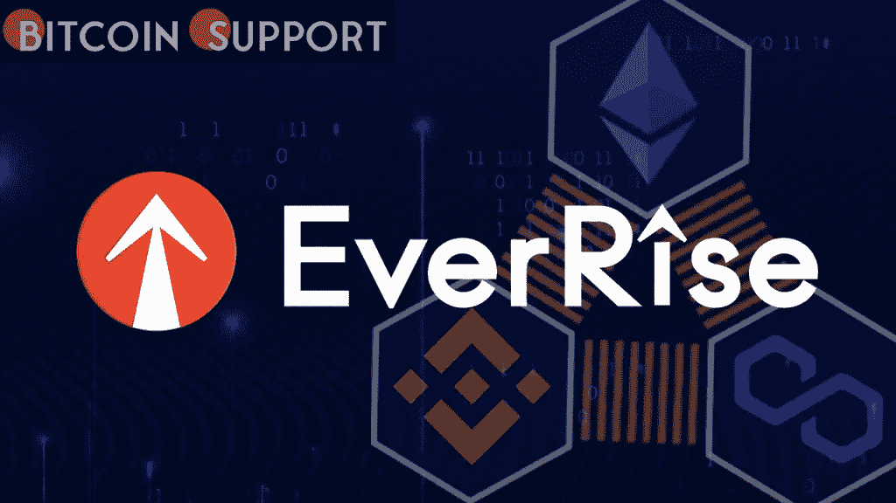

# EverRise 的 DeFi 协议为链上 NFTs 引入了一个新的实用程序

> 原文：<https://medium.com/coinmonks/everrises-defi-protocol-introduces-a-new-utility-for-on-chain-nfts-9a51df978521?source=collection_archive---------32----------------------->

**Visit our website:-** [**https://bitcoinsupports.com/**](https://bitcoinsupports.com/)

开创加密货币回购的区块链科技初创公司 EverRise 发布了一种新的智能合约，支持 VeNomics(一种投票托管的令牌模型)和链上公用事业不可替代令牌。EverRise 协议已经过修改，包括增强的安全功能和由链上实用程序 NFTs 支持的独特的赌注平台。上升硬币在以太坊、BNB 链、多边形、Fantom 和 Avalanche 上可用，它们都使用 EverRise 的 EverBridge 桥接系统。由于使用了链上 NFT，区块链上的赌注合同现在是完全安全的。今天，大多数的非功能性网络交易都是离线保存在一个中央服务器上，区块链只包含一个序列号和重定向链接。合同部署者将来可能会更改这些服务器上的 NFT。通过 EverRise NFT 股份实验室保护生成 NFT 股份所需的信息，EverRise 充分利用了公共账本和智能合同的不变性。

ever rise NFT 股权的元数据和图片都直接保存在区块链上，不依赖区块链以外的任何外部数据源。NFT 的属性和图像是使用每个独立木桩的精确数据生成的。

崛起的象征和真正的治理象征是 NFT 的股份。如果 NFT 被转移，代币也被转移。当一个 NFT 从一个区块链连接到另一个时，它的所有元数据和包含的硬币都被转移到另一个链，在那里它们成为 NFT 的股份。

EverRise 拥有自主回购和股份的方法，加强了 EverRise 的流动性池并补偿了利益相关者。从市场上自动购买并交付到赌注奖励池，上升代币被分发到赌注奖励池。当持有者下注他们的代币并与 EverRise NFT 赌注实验室的一系列服务互动时，他们可以铸造 EverRise NFT 赌注。与链上 NFTs 一起，与 RISE 有利害关系的人获得投票权托管 RISE(“veRISE”)，这使他们有权获得 EverRise 协议治理投票。

得益于增强的智能合约，现在的赌注比以往任何时候都更加灵活。每份赌注合同都是区块链上的不可替代代币(NFT ),与锁定上涨代币相关联。EverRise 的新颖赌注协议的关键创新在于，持有赌注 Rise 代币的 NFT 股份可以转移、交易和桥接到 BNB 链、以太坊、多边形、Fantom 和 Avalanche。虽然每项投资都代表着在特定时期锁定上涨权的承诺，但持有人有能力以其他方式使用他们的资产。除了转让、交易和搭桥之外，EverRise NFT 股份持有者可以使用分散的 NFT 赌注实验室计划来分割、增加和延长他们的赌注合同。截至 2022 年 4 月 4 日星期一，EverRise 已经下注超过 70%的总供应量。

得益于增强的 smart contract，下注比以往任何时候都更加灵活。每份赌注合同都是区块链上的不可替代代币(NFT ),与锁定上涨代币相关联。EverRise 的新颖赌注协议的关键创新在于，持有赌注 Rise 代币的 NFT 股份可以转移、交易和桥接到 BNB 链、以太坊、多边形、Fantom 和 Avalanche。虽然每项投资都代表着在特定时期锁定上涨权的承诺，但持有人有能力以其他方式使用他们的资产。除了转让、交易和搭桥之外，EverRise NFT 股份持有者可以使用分散的 NFT 赌注实验室计划来分割、增加和延长他们的赌注合同。截至 2022 年 4 月 4 日星期一，EverRise 已经下注超过 70%的总供应量。

**访问我们的网站:-**[**https://bitcoinsupports.com/**](https://bitcoinsupports.com/)

**免责声明:以上为作者观点，不应视为投资建议。读者应该自己做研究。**

> 加入 Coinmonks [电报频道](https://t.me/coincodecap)和 [Youtube 频道](https://www.youtube.com/c/coinmonks/videos)了解加密交易和投资

# 另外，阅读

*   [瓦济里克斯 NFT 评论](https://coincodecap.com/wazirx-nft-review) | [比茨盖普 vs 皮奥克斯](https://coincodecap.com/bitsgap-vs-pionex) | [坦吉姆评论](https://coincodecap.com/tangem-wallet-review)
*   [如何使用 Solidity 在以太坊上创建 DApp？](https://coincodecap.com/create-a-dapp-on-ethereum-using-solidity)
*   [币安 vs FTX](https://coincodecap.com/binance-vs-ftx) | [最佳(SOL)索拉纳钱包](https://coincodecap.com/solana-wallets)
*   [如何在 Uniswap 上交换加密？](https://coincodecap.com/swap-crypto-on-uniswap) | [A-Ads 审核](https://coincodecap.com/a-ads-review)
*   [加密货币储蓄账户](/coinmonks/cryptocurrency-savings-accounts-be3bc0feffbf) | [YoBit 评论](/coinmonks/yobit-review-175464162c62)