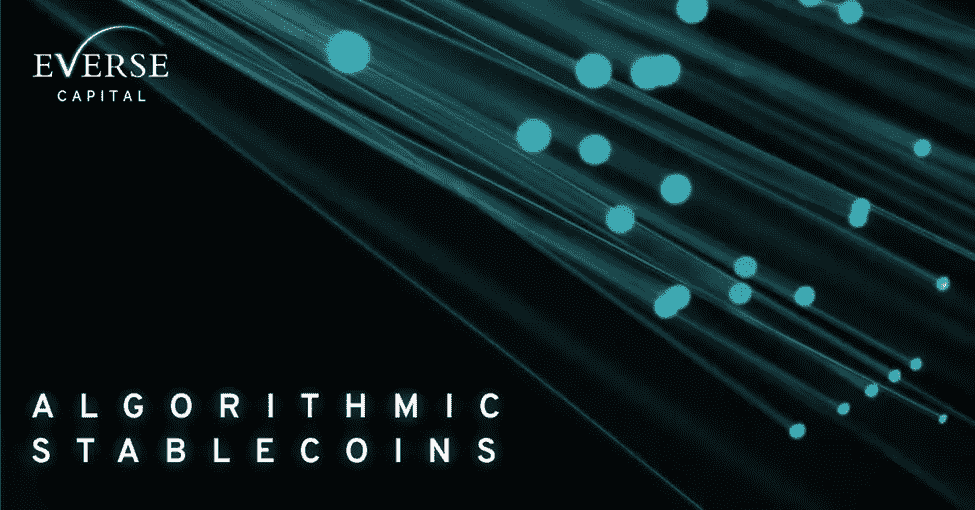
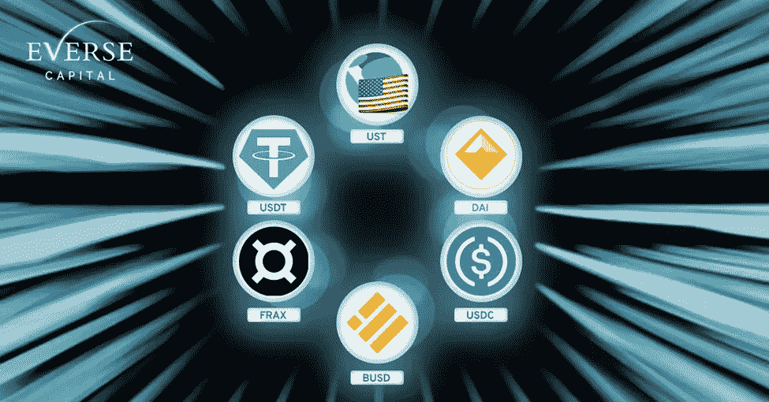
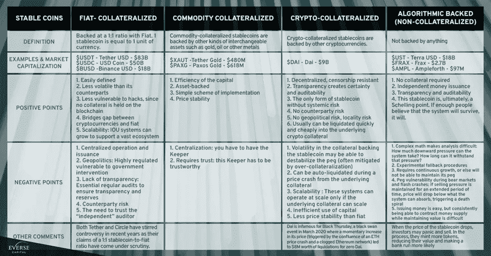
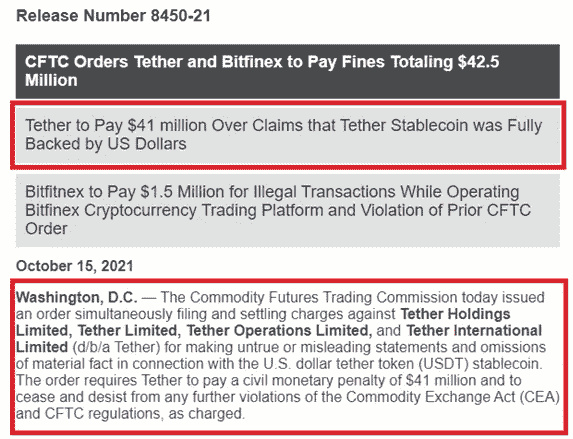
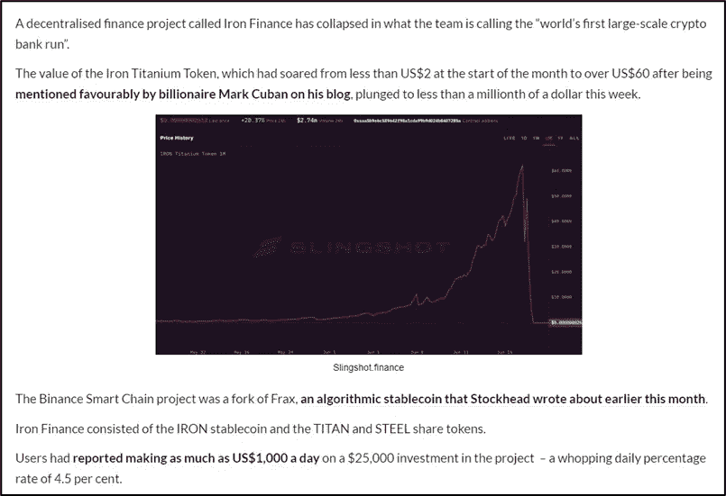
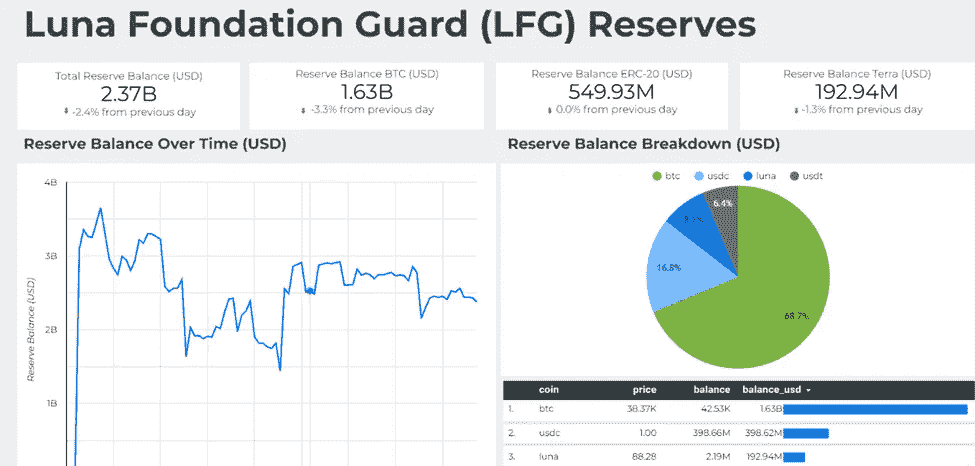
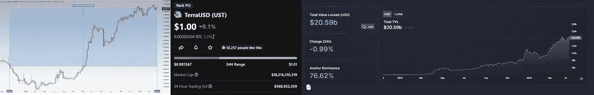
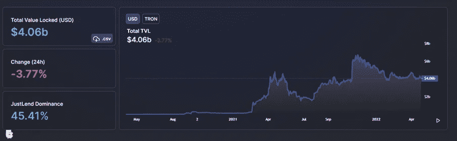
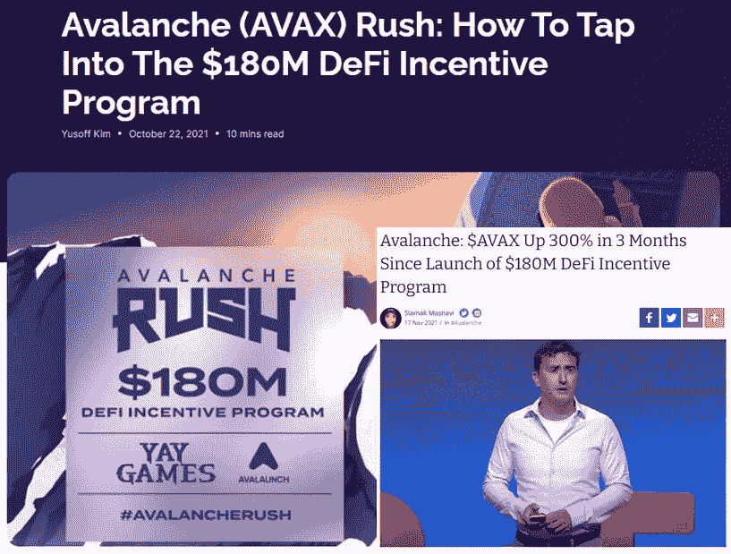

# Everse Capital Insights 算法稳定积分

> 原文：<https://medium.com/coinmonks/everse-capital-insights-algorithmic-stablecoins-305acaa095c8?source=collection_archive---------33----------------------->

加密作为一个整体已经定位于透明，分散和安全，使用区块链技术创造主权

🔹比特币引入了 P2P 支付

🔹以太坊开创了智能合约平台

🔹Tether 建立了与美元挂钩的数字货币

随着 crypto 的普及，飞轮将继续旋转。让我们更进一步，看看对*算法稳定积分*的兴趣

稳定币是通常以美元与法定货币挂钩的代币。它们是加密货币价格波动的避风港。例如、、、法克斯和戴等等

Stablecoin examples

稳定密码在市场中发挥着重要作用，投机者、交易者或机构可以在无需离开密码空间的情况下降低风险。

🔹牛市->高回报与风险->投资密码的最佳时机

🔹熊市->高风险与回报->通过稳定的收入降低风险

稳定的竞争对手是**，1900 亿美元的加密市场**，USDC 和 USDT 占据前 2 名，UST 位居第 3。

这是为什么上面的句子被这样分组的原因，也是为什么我们相信 UST 作为一个算法稳定的核心，尽管有风险，在加密中扮演着重要的角色。下面是一个表格，供您熟悉各种类型的稳定代码。

Types of Stablecoins

**菲亚特&商品抵押债券**

法定货币和商品抵押的稳定货币由一个中央实体控制，以维持储备和减轻脱钩(稳定货币失去 1 美元价值)。该实体将通过法定货币或黄金、石油或重金属等商品来创造储备，以便能够创造稳定的货币。

然而，透明度一直是一个问题，因为储备操作是链外的(在区块链上看不到)。

[Source](https://www.cftc.gov/PressRoom/PressReleases/8450-21#:~:text=The%20order%20requires%20Tether%20to,and%20CFTC%20regulations%2C%20as%20charged.&text=The%20order%20requires%20Bitfinex%20to%20pay%20a%20%241.5%20million%20civil%20monetary%20penalty)

**加密抵押的稳定存款**

Stablecoins 的一个更分散的努力是加密抵押应用程序，如 DaoMaker 的$DAI 都是通过智能合约完成的。

借出您的加密资产作为抵押债务头寸(CDP)合约，以借入$DAI Stablecoin。

$戴通过以下方式维持联系汇率:

🔹市场价格和 CDP 合约价格之间的套利

🔹稳定费用(借款费用调整)

🔹$MKR 代币稀释

MakerDAO 如何在这里工作的清晰解释:

 [## 戴为什么稳定？

### 通过发布您的第一个 DAI 来学习 MakerDAO 的基础知识

medium.com](/icovo/why-is-dai-stable-9a9fa84feca7) 

MakerDAO 提供了一种更加分散的方法。然而，$DAI 增长的障碍是它是一个过度抵押的平台(平均而言，你只能从你的贷款资产中借到 66% $DAI，抵押率为 150%)，这阻碍了市场在设定条件下的增长。

$UST 不需要抵押，因为它是纯粹的算法。

**算法稳定积分**

算法稳定资本不依赖抵押品增长，也没有链外资产(如菲亚特或大宗商品)支持。

支持这些稳定货币的算法就像“中央银行”一样管理供应，这取决于如何制定智能合约来维持联系汇率。

由于以下原因，各种已启动但未能维持钉住汇率的稳定货币项目:

🔹无法创造需求与膨胀的供给

🔹没有法律义务的不良行为者因此滥用协议(黑客、诈骗、强制清算等)。)

🔹银行挤兑造成永久的脆弱性(投资者突然套现)

[source](https://stockhead.com.au/cryptocurrency/from-64-to-zero-mark-cuban-fred-schebesta-caught-out-as-iron-finance-defi-project-collapses/)

尽管如此，UST 作为一个 180 亿美元的市场持续增长。尽管遇到一些困难，UST 还是设法在保持联系汇率的同时创造了市场需求。

🔹套利:从$LUNA 开始燃烧/创造(燃烧$1 Luna 换取$1 UST，反之亦然)

🔹Terra 生态系统(Anchor、Astroport 等)和 CEX(币安、FTX 等)的 UST 需求

🔹通过购买美元 BTC 作为储备，消除死亡螺旋或银行挤兑，创造稳定的货币

Luna Foundation Guard (LFG) Purchases BTC as reserve to maintain $UST’s Peg

UST 培育了特拉生态系统。图表显示了 Stablecoins 作为 DeFi Lego 来发展生态系统的重要性。

自 2020 年 9 月 UST 发射以来:

🔹Terra 生态系统:206 亿美元 TVL 增长

🔹Luna 增长 8.981%

🔹UST 18B 市值

Growth for Terra since UST’s inception

时间将会告诉我们 Terra 生态系统能发展到什么程度，但它从一开始就一直在发展。

从这些参考资料中，我们可以看到在加密领域还有什么开始引起注意，并把我们的努力转向它。

**算法稳定的最新消息:**

USDD——算法稳定币在 Tron 推出

USN —算法稳定币即将推出

**USDD**

最新将 Stablecoin 乐高整合到区块链的是 Justin Sun 的 Tron Network。

$USDD 是 Tron 网络的算法稳定币，遵循$UST 的机制，将于 5 月 5 日推出，以利用 Tron 网络生态系统的增长。这一宣布得到了 UST 创始人 Do Kwon 的积极评价。

Tron 网络已经进入加密领域 4 年了(自 2017 年 12 月起)，市值为 63 亿美元。

🔹根据 DefiLlama 的数据，目前持有 40.6 亿美元的 TVL

🔹一旦 USDD 上市，Tron 计划提供 30%的固定利率

🔹USDD 也将在 BSC 和以太坊上推出

Tron Network’s Total Value locked (TVL) currently at $4.06B

**美国海军**

同时宣布的 Near Network 是$USN，其设计和激励结构与 Terra 的 UST 相似。

🔹1 美元近烧伤薄荷 1 美元 USN

🔹链上套利

🔹稳定波动

为了推动 USN 成为生态系统乐高，将提供 3 . 5 亿美元作为 DeFi 激励和拨款。与 Avax 如何通过 Avalanche Rush(1.8 亿美元)成长为一个著名协议相同的程序。

How Avalanche grew their Ecosystem with Avalanche Rush ($180M incentive program)

Near 生态系统已经构建了各种应用程序，TVL 目前为 17.2 亿美元，这使得 USN 成为其现有 DeFi 产品可用性的一个令人信服的案例，例如:

🔹Bastion(稳定互换和借贷协议)——11 亿美元 TVL

🔹Aurigami(借贷平台)——7.13 亿美元 TVL

🔹Aurora(近期的 EVM 协议)——2.28 亿美元 MC

**思想**

在生态系统中有一个稳定的乐高积木的增长被证明是巨大的，因此我们看到其他区块链建筑在他们周围。更有可能的是，USDD 和 USN 的推出，加上正确的机制，可以刺激增长，并为投资其生态系统内的应用提供机会。

用不了多久，就会看到更多的算法稳定币项目从 UST 的成功中诞生。

喜欢我们的线吗？跟随我们来到这里:[https://twitter.com/EverseHQ](https://twitter.com/EverseHQ)

***参考文献及教育线索***

https://www . CFTC . gov/press room/press releases/8450-21 #:~:text =该% 20 订单% 20 需要% 20 乙醚%20to 和% 20CFTC %法规% 2C % 20as %费用。&text =该%20 订单% 20 要求% 20 bitfinex % 20 to % 20 pay % 20a % 20% 241.5% 2000 万% 20 民事% 20 货币% 20 罚金。

[https://twitter.com/danku_r/status/1509173542268645377](https://twitter.com/danku_r/status/1509173542268645377)

[https://fortune . com/2022/04/19/what-are-algorithm-stable coins/#:~:text = algorithm % 20 stable coins % 2C % 20 与%20regular%20stablecoins 不同，交易者% 20 to % 20 maintain % 20 the % 20 price](https://fortune.com/2022/04/19/what-are-algorithmic-stablecoins/#:~:text=Algorithmic%20stablecoins%2C%20unlike%20regular%20stablecoins,traders%20to%20maintain%20the%20price)。

 [## 算法稳定:初学者指南

### Stablecoins 已经成为密码世界中最突出的干预手段之一，用于解决…

101blockchains.com](https://101blockchains.com/algorithmic-stablecoins/) 

> 加入 Coinmonks [电报频道](https://t.me/coincodecap)和 [Youtube 频道](https://www.youtube.com/c/coinmonks/videos)了解加密交易和投资

# 另外，阅读

*   [MoonXBT 副本交易](https://coincodecap.com/moonxbt-copy-trading) | [阿联酋的加密钱包](https://coincodecap.com/crypto-wallets-in-uae)
*   [MoonXBT vs Bybit vs 币安](https://coincodecap.com/bybit-binance-moonxbt) | [硬件钱包](/coinmonks/hardware-wallets-dfa1211730c6)
*   [雷米塔诺评论](https://coincodecap.com/remitano-review)|[1 英寸协议指南](https://coincodecap.com/1inch)
*   [十大最佳加密货币博客](https://coincodecap.com/best-cryptocurrency-blogs) | [YouHodler 评论](https://coincodecap.com/youhodler-review)
*   [KuCoin vs 币安](https://coincodecap.com/kucoin-vs-binance) | [Bitrue 点评](https://coincodecap.com/bitrue-review) | [Jet-Bot 点评](https://coincodecap.com/jet-bot-review)
*   [买 PancakeSwap(蛋糕)](https://coincodecap.com/buy-pancakeswap)|[matrix export Review](https://coincodecap.com/matrixport-review)