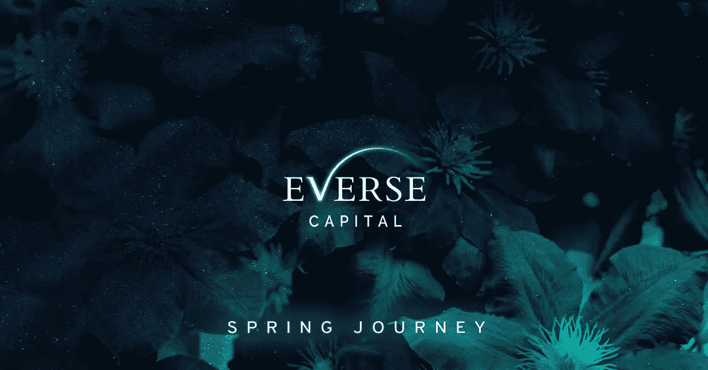
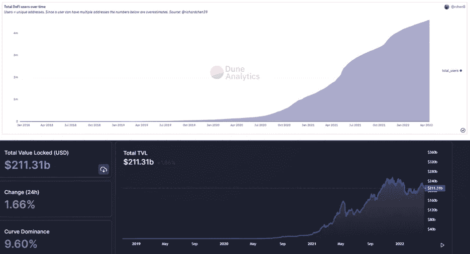
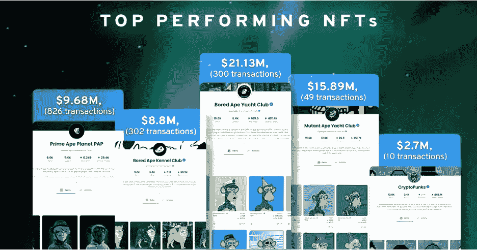
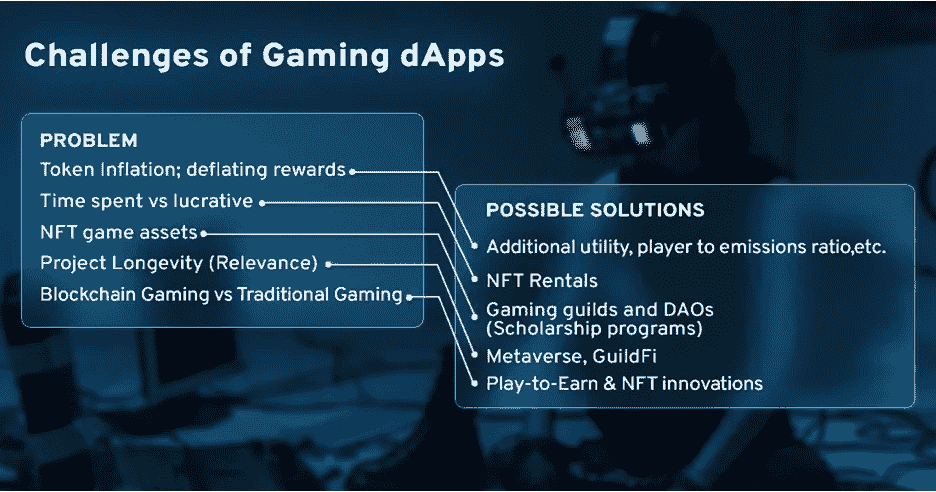

# 反向资本；春天的旅程

> 原文：<https://medium.com/coinmonks/everse-capital-spring-journey-b80ed92ed253?source=collection_archive---------42----------------------->

2022 年风投之旅

2021 年对于 Crypto 来说是硕果累累的一年，以 1.7 万亿美元的市场收盘

尽管 2022 年伊始，零售业避开了市场不确定性带来的空间，但我们仍着眼于长期机遇和发展

关于我们和 2022 年见解的快速更新

我们的愿景保持不变，成为改变数字生态系统的精明风险投资公司，成为区块链和 Web 3.0 创业公司的支柱。我们已经开始这样做了，并且很快会有公告

我们热衷于创新，一种从发散思维中可视化出来的产品或服务，然后汇聚成一个明确的解决方案/产品。我们目前的兴趣包括但不限于:

1.挑战

2.NFTs

3.赌博

4.虚拟空间

5.基础设施

**开启定义**

去中心化的道路正在打破进入壁垒，尤其是金融服务业。今年 4 月，DeFi 的唯一地址增长到 400 万个，总价值锁定在 2113 亿美元(TVL)，这一点显而易见

令人难以置信的是，缺少的是可用的组件来扩展和消除滥用空间的不良行为者

▫️Decentralized 法律/监管层

▫️Consumer 保护

▫️Effortless 接口和执行

▫️Manageable 出口匝道和入口匝道服务

**在 NFTs 上**

不可替代代币(NFTs)是 2021 年最受欢迎的叙事，源于数字艺术、游戏经济、实物商品、Simps 或 Metaverses。仅 Opensea 就获得了 140 亿美元的收入，是 2020 年(2170 万美元)的 646 倍

从实用性的角度来看，通过 NFTs 完成的创造性数字识别仅仅是个开始。我们很高兴看到 NFTs 的发展过程，动态的，依赖于时间的属性或整合定义

示例线程:由 chain link【https://twitter.com/chainlink/status/1513987068250112001 解释的动态 NFTs】

**上游戏**

菲亚特(Play-to-Earn)的代币奖励无疑是区块链游戏指数增长的原因，通过额外的收入吸引了游戏玩家和非游戏玩家。排名第一的区块链 2021 游戏 Axie Infinity 创造了 13 亿美元的收入。

尽管利润丰厚，但事实是对游戏 dApps 的需求增长将是一个挑战，因为开放经济模式是一个新的原则(除了 Runescape)，增加了用户活动、注意力等因素。

期待 dApps 如何为以下方面提供解决方案:

**关于元宇宙**

术语元宇宙是 2021 年的年度词典词汇之一(和非功能性词汇一起)，但除了与数字空间的相关性之外，它还有一个广泛的定义

宏观而言，Metaverses 为整合社交活动的 NFT 和加密货币带来了动力。元宇宙的未来依赖于创造性的愿景，结合最先进的技术，能够吸引眼球。元宇宙不可避免地拥有:

▫️NFT 可组合性

▫️Seamless 过渡到虚拟世界

▫️Quality 渲染

一号玩家准备好了吗？

**在基础设施上**

从 Vitalik 的线程解释:“未来会是多链但不会是跨链”——[https://Twitter . com/vitalikbuterin/status/1479501366192132099？lang=en](https://twitter.com/vitalikbuterin/status/1479501366192132099?lang=en)

下一阶段的基础设施是利用各种 dApps 和一个可行的系统来对抗区块链·特里勒玛的能力

✅Decentralized

✅Scalable

✅Secured

最终，愿景都由一个充满激情的团队来实现。

每件事都需要适当的程序，但是兴奋充满了我们的火焰，把未来带到现在。**有主意吗？联系我们**

网址:[https://eversecapital.com/](https://eversecapital.com/)

推特:[https://twitter.com/EverseHQ](https://twitter.com/EverseHQ)

其他信息:

[https://coin telegraph . com/press-releases/everse-capital-launchs-30m-we B- 30-区块链-博彩-元宇宙-基金](https://cointelegraph.com/press-releases/everse-capital-launches-30m-web-30-blockchain-gaming-metaverse-fund)

[https://medium . com/seedify/introducing-everse-capital-cooperating-to-bring-the-future-of-gaming-into-present-9e6f 6493060 c](/seedify/introducing-everse-capital-collaborating-to-bring-the-future-of-gaming-into-the-present-9e6f6493060c)

[https://tracxn.com/d/investor-news/eversecapital.com](https://tracxn.com/d/investor-news/eversecapital.com)

 [## Everse Capital 将成为区块链和 Web3.0 初创企业的杰出风险投资公司

### 加密货币是创新、去中心化和无许可交易的一个不可否认的类别。这些表格…

newslanes.com](https://newslanes.com/2022/02/19/everse-capital-to-become-a-distinguished-venture-capital-firm-for-blockchain-and-web3-0-start-ups/) 

> *加入 Coinmonks* [*电报频道*](https://t.me/coincodecap) *和* [*Youtube 频道*](https://www.youtube.com/c/coinmonks/videos) *了解加密交易和投资*

# 另外，阅读

*   [Bookmap 点评](https://coincodecap.com/bookmap-review-2021-best-trading-software) | [美国 5 大最佳加密交易所](https://coincodecap.com/crypto-exchange-usa)
*   最佳加密[硬件钱包](/coinmonks/hardware-wallets-dfa1211730c6) | [Bitbns 评论](/coinmonks/bitbns-review-38256a07e161)
*   [新加坡十大最佳加密交易所](https://coincodecap.com/crypto-exchange-in-singapore) | [购买 AXS](https://coincodecap.com/buy-axs-token)
*   [红狗赌场评论](https://coincodecap.com/red-dog-casino-review) | [Swyftx 评论](https://coincodecap.com/swyftx-review) | [CoinGate 评论](https://coincodecap.com/coingate-review)
*   [投资印度的最佳密码](https://coincodecap.com/best-crypto-to-invest-in-india-in-2021)|[WazirX P2P](https://coincodecap.com/wazirx-p2p)|[Hi Dollar Review](https://coincodecap.com/hi-dollar-review)
*   [加拿大最佳加密交易机器人](https://coincodecap.com/5-best-crypto-trading-bots-in-canada) | [库币评论](https://coincodecap.com/kucoin-review)