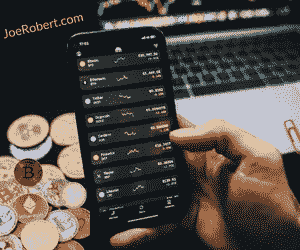

# 每个人都会接触到密码

> 原文：<https://medium.com/coinmonks/everyone-will-have-crypto-exposure-b8ffa5f7f7ac?source=collection_archive---------53----------------------->

读者们好，

随着加密货币变得越来越普遍，很难一天不听说它们在社交媒体、体育甚至传统金融领域的使用。然而，尽管它们已成为主流，但许多投资者在将它们视为投资时仍持谨慎态度，这是可以理解的，因为它们具有波动性和高度投机性。大多数人没有意识到他们很可能已经暴露在加密之下，甚至没有注意到。此外，如果你仍然不确定投资数字资产，也有办法不用通过交易所购买。

**Crypto.com 竞技场——此举表明 crypto 开始留下来了**

几个月前，Crypto.com 交易所宣布，通过价值约 7 亿美元的昂贵交易，斯台普斯中心将更名为 Crypto.com 竞技场，为期 20 年，这是有史以来为体育场馆冠名权支付的最大金额之一。

更名象征着主流加密技术已经走了多远，并吸引了许多不从事加密业务的人进入他们的空间。

**无需实际购买即可获得密码曝光**

即使你对购买和持有真实的加密货币不感兴趣，仍然有间接投资的方式。很有可能你已经接触了某种加密货币，但却不知道。因此，如果你想要一个间接投资 crypto 的机会，但还没有准备好投资，这里有一些方法。

这里有几个选择，你可以考虑间接接触

*   密码技术
*   加密 ETF
*   信托基金

**密码技术**

一种不投资加密货币而获得风险敞口的方法是投资涉及加密技术的公司，如区块链、跨境交易和采矿。

这个领域有几家公司，如特斯拉(TSLA)、贝宝(PYPL)和 Square，这些公司主要为普通传统投资者所知，并不仅仅专注于加密。另一方面，有一些公司，如比特币基地(COIN)、Riot Blockchain (RIOT)和 Hut 8 Mining (HUT)，它们的商业模式与加密相关。

除了把你的钱放在某些有内在风险的股票上，还有分散投资组合和投资指数基金或交易所交易基金的可能性。

**加密 ETF**

交易所交易基金(ETF)是共同基金和股票的混合物，因为当你购买 ETF 时，你就拥有了该基金投资组合的股份。这种结构为投资者提供了在不同市场交易的证券的股权所有权，同时还通过持有不同的精选股票来实现多样化。它们提供了快速进出头寸的能力，而不一定需要加密交易账户。

目前可供您投资的领先加密 ETF 有 BLOK、BLCN、LEGR、BITO、BTF、XBTF、BITS、GBTC、BITW、SPBC、BITQ。

**信托基金**

你总是可以选择委托你的资产管理信托基金。加密主题信托将你的投资组合与数字资产捆绑在一起，而没有直接所有权，因此你可以在这个市场进行首次尝试，而无需积极参与。虽然这些信托要求的最低投资额从 25，000 美元到 100，000 美元不等，但您的资产将由该领域有良好记录的专家管理。

**一如既往:做好自己的尽职调查**

你有很多选择来将你的投资组合暴露给加密货币，而不需要实际购买硬币。不过，这是至关重要的，你要谨慎行事，并使用同样的勤奋，你会当任何其他投机性投资。

就像你做的任何投资一样，你应该愿意接受它的风险，所以做你自己的研究，了解什么是危险的。如果你不打算跟随市场，但仍然希望定位于某些资产，最好的替代方案是将你的钱投入投资基金。

在 Robert Ventures，我们一直在关注市场，同时也与该领域的领先企业保持联系。

[*乔罗伯特*](https://joerobert.com/) *现任罗伯特风险投资公司首席执行官，拥有超过 20 年的资产管理经验。自从乔开始创业以来，他已经为投资者创造了可预见的两位数回报。Joe 已经投资了股权和代币的种子轮，以及比特币、以太坊和其他顶级加密货币的投资组合。*

*如果您是合格投资者，并想了解更多关于我们产品的信息，请联系我们。*

> 加入 Coinmonks [电报频道](https://t.me/coincodecap)和 [Youtube 频道](https://www.youtube.com/c/coinmonks/videos)了解加密交易和投资

# 另外，阅读

*   [币安 vs FTX](https://coincodecap.com/binance-vs-ftx) | [最佳(索尔)索拉纳钱包](https://coincodecap.com/solana-wallets)
*   如何在 Uniswap 上交换加密？ | [A-Ads 评论](https://coincodecap.com/a-ads-review)
*   [加密货币储蓄账户](/coinmonks/cryptocurrency-savings-accounts-be3bc0feffbf) | [YoBit 审核](/coinmonks/yobit-review-175464162c62)
*   [Botsfolio vs nap bots vs Mudrex](/coinmonks/botsfolio-vs-napbots-vs-mudrex-c81344970c02)|[gate . io 交流回顾](/coinmonks/gate-io-exchange-review-61bf87b7078f)
*   [CoinFLEX 评论](https://coincodecap.com/coinflex-review) | [AEX 交易所评论](https://coincodecap.com/aex-exchange-review) | [UPbit 评论](https://coincodecap.com/upbit-review)