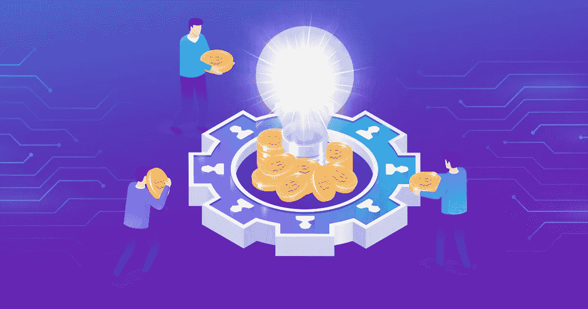

# 所有关于加密众筹和为你的项目选择正确的一个

> 原文：<https://medium.com/coinmonks/everything-about-crypto-crowdfunding-ce2f00126358?source=collection_archive---------48----------------------->

区块链正在入侵几乎每个领域，从金融到健康热线。如今，它正在金融领域掀起一场金融去中心化的革命。据估计，金融业约占区块链总市值的 60%。区块链的去中心化特性每天都会带来大量的新用户。这促使企业家和区块链爱好者提出创新的区块链项目。

反过来，区块链项目的开发过程也需要资金。IPO 是一种适合企业的传统众筹模式，但对于建立在区块链网络上的项目，我们并不推荐这种模式。这就是加密众筹模式出现的时候。如果你是一名企业家，准备好了区块链项目的创意并正在寻找资金，这里有你需要知道的关于加密众筹发展的一切，以及最适合你项目的模式。

## **密码众筹的演变**

区块链是二十年前提出来的，现在已经到了顶点。比特币随后问世，并慢慢吸引了大众。那是区块链工业的艰难时期，确实急需资金。就在那时，人们开始向公众筹集资金，有史以来第一个加密众筹模式——初始硬币发行被引入。2017 年，ico 的受欢迎程度大幅上升，人们开始逐渐投资 crypto。它有自己的缺点，所以很快，更多的众筹模式开始出现，人们自学如何明智地在区块链投资。你将读到三种主要的密码众筹模式，它们对区块链社区做出了巨大的贡献。

## **首发币**

首次发行硬币于 2013 年首次推出，并于 2017 年普及。这是一个成功的筹款模式，2017 年筹集了约 56 亿美元。需要资金的项目持有人铸造他们的代币，并在他们的网站上首次发行硬币。他们可以在网站上匿名，而不透露他们的身份数据和项目的其他细节。他们所要做的就是铸造代币并举办代币义卖。投资者投资这些项目要自担风险。这造成了一种情况，即 2018 年举办的大约 80%的 ico 都是骗局，项目持有人甚至没有一份好的白皮书和项目说明。这在整个区块链行业造成了很大的不信任，区块链的极客们想出了一个解决方案来克服这种情况。

## **首发上市**

最初的交易所上市是为了清理 ICO 骗局造成的混乱。首次公开募股是一种控制区块链项目融资的模式。在这种模式下，基金是通过在集中交易所而不是私人场所进行象征性销售来筹集的。这样就有了集中控制。这种方法为投资者创造了一个可靠的投资环境。但是筹资过程的中央集权给项目持有人带来了各种挑战。他们对在其平台上托管其 IEO 征收上市费，代币的流动性依赖于中央权威机构。在 CEX(集中交易所)上市的项目有一些限制，这些项目不应在任何其他平台上市。这是对项目的过度控制，它剥夺了区块链网络分散化的全部意义。

## **首次 DEX 发售**

区块链网络的出现是为了消除交易的中央集权。尽管 IEO 被带来将骗子从网页上带走，但它强加了自己的规则和条例，阻止一些项目筹集他们应得的资金。那就是当初人们想出了 [**最初的 DEX 祭**](https://www.appdupe.com/ido-development?utm_source=google&utm_medium=medium&utm_campaign=monika) 。在这种模式下，该项目将在一个分散的交易平台上推出其代币销售，该平台不对项目征收任何上市费或监管。这也照顾到了流动性，这是 AMM。另一方面，能支持它为投资者创造一个可靠的环境。

## **为什么说 IDO 是最好的密码众筹模式？**

最初的 DEX 发行出现在 2021 年初，现在是最受欢迎的众筹模式。参与分散交易所密码交易的密码极客现在正把注意力转向投资 IDO 代币，这将为他们的投资带来更好的回报。赚取被动收入已经成为加密世界的一种趋势，人们有兴趣在预售时购买令牌。当代币的价值增加时，他们出售这些代币，从而通过向代币提供即时流动性来促进筹款过程。

当你问 IDO 是否只有利弊时，答案是否定的，目前出现的每一个密码众筹平台都面临一些挑战和劣势。许多区块链的项目正在涌现，每个项目都有自己的需求。一种融资模式不可能适合所有的新兴项目。除了 ICO，IEO，IEO，还有其他模式可以适用，但我现在满足几乎所有的项目。

## **I do 的缺点你必须知道**

*   在 IDO 中，代币的价值随着人们购买而增加，随着人们出售而下降。恐慌性抛售将在很大程度上影响代币价值，因为代币价值不稳定，对投资者和企业家来说风险很高。
*   泵和转储漏洞是如此之高，以至于它给了交易者使用机器人购买大量代币的空间。这将在很大程度上影响价格，影响整体功能。

## **可以支持你的项目的 IDOs 的优点**

到现在为止，你一定已经知道为什么 IDO 是区块链几乎每个项目都喜欢的完美筹资模式。下面提到了一些没有提到的优点。

*   它克服了之前的模型 ICO 和 IEO 所面临的每一个挑战。
*   无需严格的上市流程即可在交易所快速上市
*   向全球所有投资者开放，没有任何限制
*   与 CEX 的 IEO 相比，上市费用低得多
*   投资者通过能够访问智能合约获得透明度。

## **外卖**

希望这几分钟的阅读一定让你对加密众筹有了简要的了解，以及为什么 [**初始 DEX 产品开发**](https://www.appdupe.com/ido-development?utm_source=google&utm_medium=medium&utm_campaign=monika) 将是你的项目的最佳模式。其他模式，如证券代币发行、初始流动性发行等，都是在 IDO 之后出现的，但 IDO 并未受到影响。

> 加入 Coinmonks [电报频道](https://t.me/coincodecap)和 [Youtube 频道](https://www.youtube.com/c/coinmonks/videos)了解加密交易和投资

# 另外，阅读

*   [3 商业评论](/coinmonks/3commas-review-an-excellent-crypto-trading-bot-2020-1313a58bec92) | [Pionex 评论](https://coincodecap.com/pionex-review-exchange-with-crypto-trading-bot) | [Coinrule 评论](/coinmonks/coinrule-review-2021-a-beginner-friendly-crypto-trading-bot-daf0504848ba)
*   [莱杰 vs Ngrave](/coinmonks/ledger-vs-ngrave-zero-7e40f0c1d694) | [莱杰 nano s vs x](/coinmonks/ledger-nano-s-vs-x-battery-hardware-price-storage-59a6663fe3b0) | [币安评论](/coinmonks/binance-review-ee10d3bf3b6e)
*   [Bybit 交易所评论](/coinmonks/bybit-exchange-review-dbd570019b71) | [Bityard 评论](https://coincodecap.com/bityard-reivew) | [Jet-Bot 评论](https://coincodecap.com/jet-bot-review)
*   [3 commas vs crypto hopper](/coinmonks/3commas-vs-pionex-vs-cryptohopper-best-crypto-bot-6a98d2baa203)|[赚取加密利息](/coinmonks/earn-crypto-interest-b10b810fdda3)
*   最好的比特币[硬件钱包](/coinmonks/hardware-wallets-dfa1211730c6) | [BitBox02 回顾](/coinmonks/bitbox02-review-your-swiss-bitcoin-hardware-wallet-c36c88fff29)