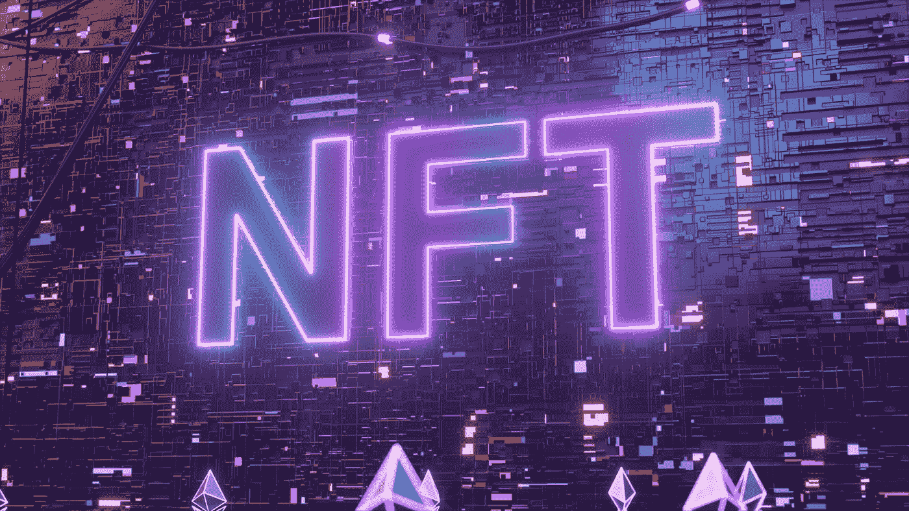
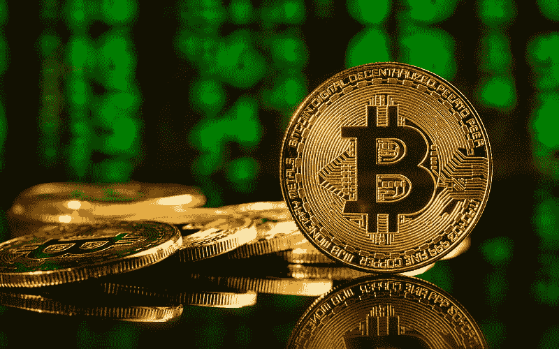

# 每个品牌都需要了解元宇宙

> 原文：<https://medium.com/coinmonks/everything-brands-need-to-know-about-the-metaverse-ed1271e4b829?source=collection_archive---------64----------------------->

尽管 metaverses 并不新鲜，但我们开始听到比以往任何时候都多的关于未来虚拟现实世界的嗡嗡声，据称这些虚拟现实世界可以补充或扩展我们自己。

随着越来越多的人开始深入在线游戏、社交媒体，并购买虚拟现实耳机和配件，元宇宙的机会变得更加有趣。

在本帖中，作者将引导你了解“元宇宙”的概念，即你可以进入无数的虚拟世界，以及在这个快速发展的领域中品牌的可能性。

# 什么是元宇宙？

简单地说，元宇宙是宇宙中的宇宙。在虚拟现实空间中，它指的是一个虚拟现实世界，在这个世界中，人们可以探索、接触人们，并建立替代的现实、外观或生活方式。

尽管任何虚拟世界都可以被认为是一个“元宇宙”，元宇宙通常是指所有的虚拟现实或 Meta 的地平线世界，这是由于运行它的组织的名称。

# 梅塔拥有元宇宙吗？

因为脸书更名为 Meta，并拥有一个蓬勃发展的虚拟现实平台，你可能会认为该公司拥有“元宇宙”

在现实和虚拟现实中，Meta 拥有众多 metaverses 中的一个。虽然 Meta 的 VR 宇宙被称为 Meta Horizon Worlds，并通过该公司的 Meta VR 耳机(正式名称为 Oculus)访问，但早期采用者已经使用了许多年的其他 Meta vers。

# 元宇宙发生了什么？

为了解释在元宇宙发生了什么，我们将深入一些类型的元经文，并解释你或你的品牌在每一种中可以做什么。

# 元宇宙术语要知道

**区块链**

交易、证书和合同的数字分类账。

**NFT**

备受关注的不可替代代币是一种有限或独特的数字代币，如数字艺术、虚拟服装或基于虚拟现实的物体，你可以购买其所有权或股份。

在它基于区块链的编码深处，有一个证书表明你拥有或拥有该物品的所有权。

**NFT 房地产**

元宇宙不可替代的数字房屋或土地，可以投资、出售甚至出租。买家得到一个数字契约或证书，表明他们拥有房地产。

**加密货币**

您可以投资、出售或用于在线或在元宇宙购买产品的数字货币。每种数字货币都有不同的价值。常见的例子包括比特币、以太和 Dogecoin。

**开源**

对所有用户开放进行编辑，通常不受品牌或单一实体的控制。开源 metaverses 可以由在世界上进行营销和维护的开发人员创建，但可能没有一个明显的公司拥有它们——或者当出现问题时没有客户服务。然而，它们通常给用户更多的自由。

你应该投资元宇宙吗？

今天，元宇宙的观众仍在增长，用户仍在学习，某些企业和观众将很快无法投资虚拟世界。

但是，重要的是要记住，当 MySpace 和脸书开始推出时，元宇宙就像社交媒体一样受到了大肆宣传和质疑。

在一个技术快速发展和进步的世界里，今天不能为所有人所用的东西将来会被大多数人所用。

在未来的一年里，一些事情可能会改变虚拟现实领域的品牌游戏，包括:

**更便捷的技术**

VR 用户目前需要强大的互联网连接和一台计算机，而 Horizon Worlds 用户需要一个 Oculus 或 Meta 耳机。

虽然全球大多数人都可以访问互联网，但数百万人仍在努力获得虚拟现实所需的高速网络。

但是，随着虚拟现实获得更多的兴趣，我们看到 5G 和 Web3 等技术在全球许多地区的推出，这些体验可能需要更少的机器和更低的资金。

**元宇宙竞赛**

像社交媒体平台一样，也有新的元诗句不断涌现，它们的创作者都希望它们是优越的，以吸引更多的用户。

这可能会造成元宇宙的竞争，这些世界可能会看到旨在吸引更多用户的新功能，以及各种品牌的更多赚钱机会。

同样，专注于虚拟现实的大公司可以决定远离分散世界的使用。相反，他们可以跟随 Meta 的脚步开发他们的世界。

> 加入 Coinmonks [电报频道](https://t.me/coincodecap)和 [Youtube 频道](https://www.youtube.com/c/coinmonks/videos)了解加密交易和投资

# 另外，阅读

*   [OKEx vs KuCoin](https://coincodecap.com/okex-kucoin) | [摄氏替代品](https://coincodecap.com/celsius-alternatives) | [如何购买 VeChain](https://coincodecap.com/buy-vechain)
*   [币安期货交易](https://coincodecap.com/binance-futures-trading)|[3 comas vs Mudrex vs eToro](https://coincodecap.com/mudrex-3commas-etoro)
*   [如何购买 Monero](https://coincodecap.com/buy-monero) | [IDEX 评论](https://coincodecap.com/idex-review) | [BitKan 交易机器人](https://coincodecap.com/bitkan-trading-bot)
*   [CoinDCX 评论](/coinmonks/coindcx-review-8444db3621a2) | [加密保证金交易交易所](https://coincodecap.com/crypto-margin-trading-exchanges)
*   [红狗赌场评论](https://coincodecap.com/red-dog-casino-review) | [Swyftx 评论](https://coincodecap.com/swyftx-review) | [CoinGate 评论](https://coincodecap.com/coingate-review)
*   [Bookmap 评论](https://coincodecap.com/bookmap-review-2021-best-trading-software) | [美国 5 大最佳加密交易所](https://coincodecap.com/crypto-exchange-usa)