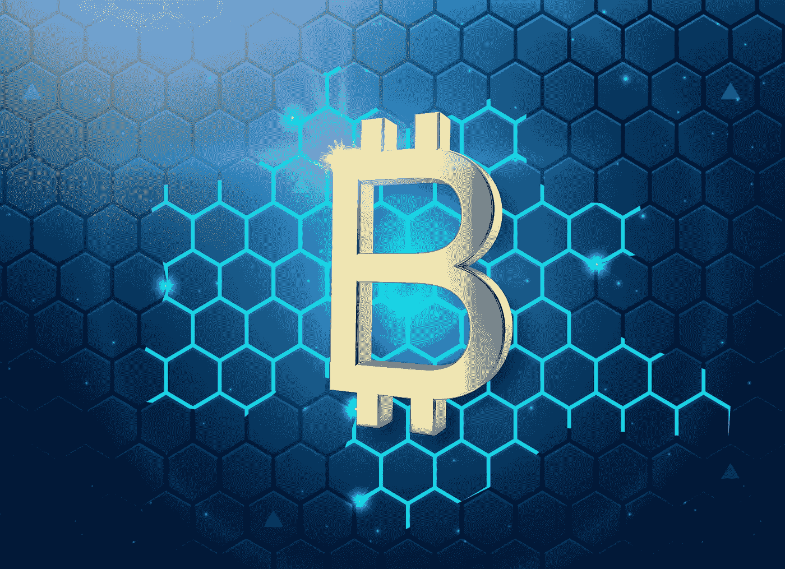

# Crypto 解释的一切

> 原文：<https://medium.com/coinmonks/everything-crypto-explained-2b4ddad7e6ac?source=collection_archive---------24----------------------->

## Cryptos、区块链、NFTs 和 Web 3.0 都有解释。

“哟你听说过比特币吗？”

“Web 3.0 因为区块链而安全！”

"以太坊 2.0 有一个利益证明系统！"

你可能听人说过这句话。很多次。毕竟，这就是你在这里的原因。即使你什么都不知道，一切都将在这里得到解释。NFTs、区块链、Web 3.0 等。一切。

# **区块链**

一切都由区块链提供动力。Cryptos、NFTs 和 Web 3.0。

## 什么是区块链？

区块链就像一个数据库或数字账本。它只是一个记录列表，所有记录都链接在一起。

## 什么是积木？

Each block contains data (transaction data), a hash, and the hash of the previous block.

区块是区块链上的单个记录。每个区块包含:

*   **数据** —这可能是交易数据等
*   **哈希** —代表加密数据的 16 进制数
*   **前一个散列** —前一个块的散列，从而创建一个块链

## 为什么是区块链？

创建区块链是为了将数据存储在分散的环境中。这意味着没有人独自拥有所有的数据。相反，每个人都有自己的区块链副本，每次添加一个新块，每个人的区块链也会得到新的更新。

## 关于分权

权力下放。区块链是分散的，也就是说，没有人拥有，每个人都有一份区块链的拷贝。每个副本都与另一个副本同步。

## 钱包

如果区块链上运行着一种加密货币(更多信息参见加密部分)，那么区块链的每个参与者(称为节点)都有一个钱包地址。他们有一个接收交易的公共钱包地址和一个消费的私人钱包地址。公共钱包地址是公共的，但是私有钱包地址应该总是私有的。您可以将公共钱包地址视为用户名，将私有钱包地址视为密码。

它是如何工作的？

The process for adding a block to the blockchain

1.  **请求** —有人请求交易，并用其私人钱包地址签名。
2.  **广播** —区块链网络中的所有节点都收到事务通知
3.  **工作证明** —节点通过“挖掘”事务来验证事务。他们试图强力生成满足特定要求的散列，比如在散列的开头有 X 个零。随着更多的节点加入竞争，这个计算问题变得更加困难，从而消除了垄断的风险。第一个解决问题的节点将获得加密货币奖励(参见加密部分了解更多信息)。这个处理时间因难度不同而不同，但对于比特币来说，是 10 分钟。
4.  **共识** —在块最终被添加到区块链之前，网络的所有节点验证块的私有钱包地址的签名没有被篡改并且是有效的。
5.  **添加** —一旦达成共识，交易完成并添加到区块链中

## 它们有多安全？

*   **哈希** —所有的块都经过哈希处理，并且加密安全。如果您更改了其中一个数据块的数据，那么哈希将会改变，因此下一个数据块上的前一个哈希将是错误的，从而使所有后续数据块无效
*   **工作验证** —工作验证是通过“开采”一个区块来完成的。由于采矿困难且耗时，它确保了区块链的安全。例如，如果黑客更改了块上的交易数据，它会使所有后续块无效，因此黑客必须再次挖掘每个后续块，从而减慢黑客的速度
*   即使黑客以某种方式挖掘了后面的每一个区块，使他们的区块链再次有效，记住每个人都有一个区块链的副本。因此，黑客只篡改了他们的区块链，要向所有参与者广播这些更改，他们必须控制 51%的区块链，这几乎是不可能的。

# Cryptos

加密货币只是数字货币。然而，它与美元或任何其他货币的不同之处在于它不需要中间人。例如，如果你想给某人汇一些美元，你的交易会通过一个像你的银行这样的中间人，然后再汇给其他人。

Here, the bank is the middleman. We need to trust the bank to order our transaction to the other party, instead of just taking our money and keeping it.

同时，在加密中没有中间人，因此你不需要相信任何人。你的交易直接给对方。让 cryptos 安全的是底层的区块链技术。

# NFTs

The Bored Ape NFT collection is one the most popular collection

啊。NFTs。狂热。大多数人甚至不知道它代表什么，仍然试图进入它。

NFT 代表不可替换令牌，这意味着每个 NFT 令牌都是不可替换的。这意味着一个 NFT 不等于另一个 NFT，不像一个比特币与另一个比特币具有相同的价值。NFT 是一种独特的数字资产，主要是数字艺术品，人们用一种叫做以太坊的加密货币来竞标。竞标的获胜者将获得 NFT，并成为正式所有者。现在，是的，任何人都可以在他们的浏览器中对 NFT 进行截图，然而，他们不是 NFT 的正式所有者，这意味着它不会有任何价值。这就像口袋妖怪卡，如果你打印出一张口袋妖怪卡的副本，没有人会想要它，因为它只是在普通的纸上。

NFTs 也在区块链运行。

## NFT 收藏

这就是狂热开始的地方。NFT 集合就像它们听起来的那样:包含许多 NFT 的集合。这些 NFT 系列由几个基础层组成，如眼睛、头发、嘴巴、鼻子、衬衫等。然后，这些基层结合起来，使一个独特的 NFT。

但有趣的是，某些基层有不同的稀有性，比如某种稀有的头发。这种稀有性和稀缺性推动了 NFT 的价值。

OpenSea 是一个受欢迎的 NFT 市场。

要了解更多关于 NFTs 的信息，请看我写的[这篇](/coinmonks/nfts-for-dummies-8c2d8c846183)博客。

# Web 3.0

Web 3.0 是在区块链运行的下一代网络的概念。Web 3.0 的工作方式是你拥有你所有的数据。在现代技术时代，垄断企业和科技巨头会收集你的数据并出售给第三方公司。同时，在 Web 3.0 中，你拥有你所有的数据。你可以选择卖掉它，也可以随时删除它。

为了激励用户，Web 3.0 承诺“令牌化”每一个可能的交互。这意味着每一个可能的行动都将奖励用户某种类型的令牌，要么是加密货币，要么是 NFT。然后，用户将拥有一批加密货币和 NFT，并可以在这个庞大的代币生态系统中出售。

要了解更多关于 Web 3.0 的信息，请查看我写的[这篇](https://learn.block6.tech/an-intro-to-web-3-0-a10b9520e690)博客。

# 总结:

没人知道密码的未来。没有人知道 NFTs 的未来。没有人知道 Web 3.0 的未来。但有一点是肯定的，区块链技术将继续被使用，并将对我们的生活产生巨大影响。

> 查看我的[个人网站](http://nagelia.com)
> 
> 加入 Coinmonks [电报频道](https://t.me/coincodecap)和 [Youtube 频道](https://www.youtube.com/c/coinmonks/videos)了解加密交易和投资

# 另外，阅读

*   [火币加密交易信号](https://coincodecap.com/huobi-crypto-trading-signals) | [HitBTC 审核](/coinmonks/hitbtc-review-c5143c5d53c2)
*   [如何在 FTX 交易所交易期货](https://coincodecap.com/ftx-futures-trading) | [OKEx vs 币安](https://coincodecap.com/okex-vs-binance)
*   [OKEx vs KuCoin](https://coincodecap.com/okex-kucoin) | [摄氏替代品](https://coincodecap.com/celsius-alternatives) | [如何购买 VeChain](https://coincodecap.com/buy-vechain)
*   [ProfitFarmers 回顾](https://coincodecap.com/profitfarmers-review) | [如何使用 Cornix 交易机器人](https://coincodecap.com/cornix-trading-bot)
*   [如何匿名购买比特币](https://coincodecap.com/buy-bitcoin-anonymously) | [比特币现金钱包](https://coincodecap.com/bitcoin-cash-wallets)