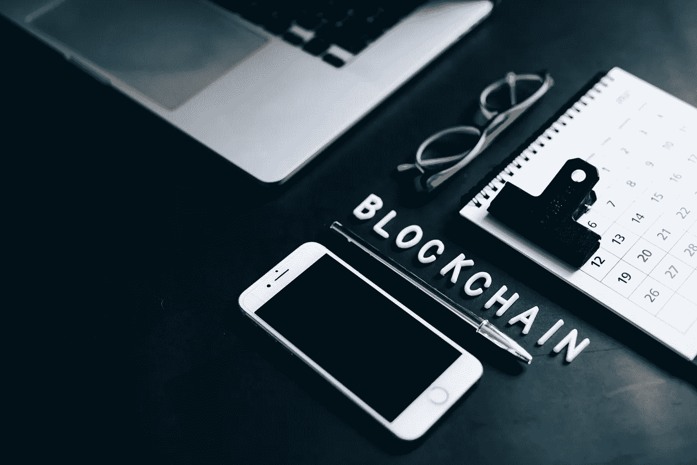
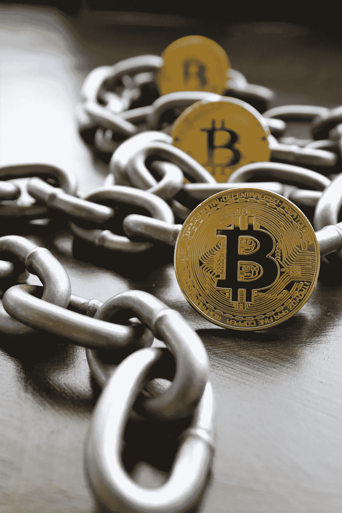

# 关于区块链你需要知道的一切

> 原文：<https://medium.com/coinmonks/everything-you-need-to-know-about-blockchain-9aae00726d36?source=collection_archive---------19----------------------->

大多数人一想到区块链，就会想到比特币。尽管比特币是区块链技术最广为人知的应用，但它远非唯一的应用。区块链是一种加密安全的数据库，允许对两方或多方之间的交易进行透明和防篡改的记录。这项技术最初是由一个名叫中本聪的匿名个人或团体在 2008 年提出的，不久后他发布了比特币的概念，这是世界上第一种去中心化的数字货币。区块链是一个分布式数据库，可以用于加密货币交易之外的多种用途。

Photo by [Shubham Dhage](https://unsplash.com/@theshubhamdhage?utm_source=medium&utm_medium=referral) on [Unsplash](https://unsplash.com?utm_source=medium&utm_medium=referral)

# 什么是区块链？

区块链本质上是一个交易的数字账本，在区块链的整个计算机系统网络中复制和分布。链条中的每个区块都有无数的交易，每次区块链中增加新的交易，每个人的总账都会以分散的方式记录。由多个参与者管理的分散式数据库被称为分布式账本技术(DLT)。

该系统确保每个人都有所有交易的最新副本。这种体系结构无需集中管理即可实现数据共享，因为没有一个实体同时控制或管理所有副本。只有在这个对等网络中的大多数用户达成一致意见后，才能更新信息。这种结构使公共区块链中的每个人都能够审计所有活动。

对于区块链网络中双方之间的数据或货币转移(交易),必须满足所有四个方面:

*   多个参与者(访问控制)—没有单个用户控制数据库。这意味着如果黑客想要访问你的个人信息，他们没有一个中心点可以攻击。这也有助于区块链技术的分散。
*   加密安全性—数据通过加密技术进行存储和验证，因此可以在不被篡改的情况下进行身份验证。
*   验证节点(共识)—这些是网络中的计算机，它们存储区块链的副本，帮助验证新的事务，并通过拒绝任何无效块来维护系统的整体完整性。
*   双方同意的时间戳—网络中的所有参与者必须就交易发生的时间达成一致；这可以防止人们为了自己的利益重写历史或回溯交易。

# 区块链的类型

虽然有几种不同类型的区块链，但最受欢迎的是公共、私人和财团或混合区块链。

# 公有区块链。

公共区块链对任何想使用它的人开放。这是未经许可的。这种类型的区块链通常用于加密货币，因为它允许任何人参与网络并验证交易。比特币是公开区块链的最好例子。

# 私有区块链

私人区块链仅限于特定的人群或组织。这是一个被允许的区块链。私人区块链上的交易由经批准的参与者验证，该网络不对公众开放。以太坊是私人区块链的一个例子。

# 财团区块链

区块链联盟类似于私人区块链，但它由一组预先选择的节点控制。财团的成员通常是合作并有共同利益的公司，如金融机构。区块链财团比公共或私人区块链更快。这是因为控制它的节点组是可信的。Hyperledger Fabric 是区块链财团的一个例子。

# 使用区块链的好处

更大的信任度—由于区块链上的每笔交易都必须经过几个参与者的验证，篡改条目变得非常困难，因为每项更改都必须在多个系统上进行。这使得区块链成为需要在合作伙伴或客户之间共享数据的企业的理想选择，因为它增加了信任和透明度。

更快的交易—因为不需要第三方来验证交易，所以交易完成所需的时间大大减少了。这使得区块链非常适合需要快速、安全交易的行业，如金融行业。

更低的交易成本—使用区块链来验证和处理交易还消除了对第三方的需求，从而大大降低了成本。这在与无法负担与双方之间转移资金或数据相关的传统费用的小公司打交道时尤其有用。

更高的安全性—由于区块链分布在多个节点上，黑客很难在不被发现的情况下访问敏感信息和篡改记录。随着时间的推移，网络攻击变得越来越复杂，这一点尤为重要。

# 那么你能用区块链做什么呢？

可能性是无限的！但是一些例子包括:

*   在没有太多基础设施的偏远地区记录病人的医疗记录。
*   供应链管理——在整个生产过程中跟踪货物和材料的移动。
*   创造一种可以用来购买商品和服务的数字货币。
*   无需通过第三方提供商支付账单或水电费。
*   购买和销售产品/服务，不涉及任何中间商。
*   提供小额贷款或进行其他点对点金融投资。
*   不通过中央机构登记土地所有权或地契。

# 结论

区块链不仅仅用于加密货币交易。它在金融、医疗保健、供应链管理甚至保险行业都有许多其他潜在的应用！区块链技术可以用来防止重复消费或在没有 PayPal 等第三方的情况下转移资金，从而提高点对点支付的效率。这可能有助于防止交易双方的欺诈，同时也降低了与跨境转移相关的成本。你考虑过区块链会对你的生意产生什么影响吗？这项新技术可能会以哪些方式颠覆你的行业？请在下面的评论中告诉我们你的想法！

> 加入 Coinmonks [电报频道](https://t.me/coincodecap)和 [Youtube 频道](https://www.youtube.com/c/coinmonks/videos)了解加密交易和投资

# 另外，阅读

*   最佳[密码借贷平台](/coinmonks/top-5-crypto-lending-platforms-in-2020-that-you-need-to-know-a1b675cec3fa) | [杠杆令牌](/coinmonks/leveraged-token-3f5257808b22)
*   最佳[加密制图工具](/coinmonks/what-are-the-best-charting-platforms-for-cryptocurrency-trading-85aade584d80) | [最佳加密交易所](/coinmonks/crypto-exchange-dd2f9d6f3769)
*   [比斯勒评论](https://coincodecap.com/bitsler-review)|[WazirX vs coin switch vs coin dcx](https://coincodecap.com/wazirx-vs-coinswitch-vs-coindcx)
*   [7 大副本交易平台](https://coincodecap.com/copy-trading-platforms) | [BuyCoins 点评](https://coincodecap.com/buycoins-review)
*   [my constant Review](https://coincodecap.com/myconstant-review)|[8 款最佳摇摆交易机器人](https://coincodecap.com/best-swing-trading-bots)
*   [Godex.io 审核](/coinmonks/godex-io-review-7366086519fb) | [邀请审核](/coinmonks/invity-review-70f3030c0502) | [BitForex 审核](https://coincodecap.com/bitforex-review)