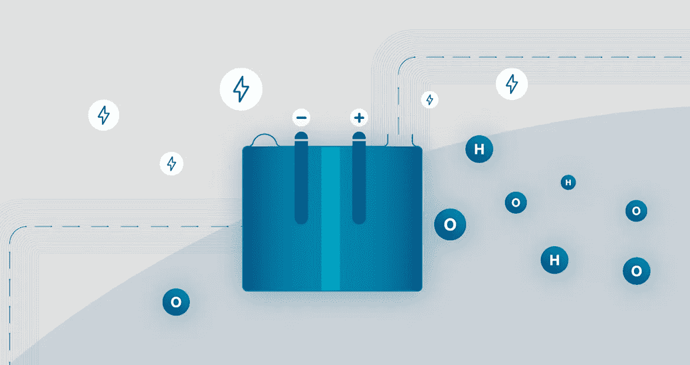

# 你需要知道的关于电解槽的一切:它们如何工作，类型，等等

> 原文：<https://medium.com/coinmonks/everything-you-need-to-know-about-electrolyzers-how-they-work-types-and-more-e67ac47ac82f?source=collection_archive---------32----------------------->

电解槽是一种用电将水分解成氢气和氧气的装置。这个过程被称为电解，是制造绿色氢气的重要部分。根据所用膜的类型，有不同类型的电解槽以不同的方式发挥作用。在这篇文章中，我们将讨论电解槽如何工作，不同类型的电解槽，以及使用绿色氢的好处。

电解槽的工作原理是让电流通过水基溶液。这个过程导致水分子分裂成氢原子和氧原子。然后氢气被收集并储存起来以备后用。电解槽有各种尺寸和形状，但它们都有一个共同的目标:生产氢气。

电解槽可以分为两种主要类型:碱性电解槽和质子交换膜(PEM)电解槽。碱性电解槽使用氢氧化钾溶液作为电解液，而质子交换膜电解槽使用水。这两种类型的电解槽都能够产生高纯度的氢气。

电解是绿色制氢过程的重要组成部分，因为它不会产生任何碳排放。绿色氢可用于各种应用，包括为燃料电池提供动力和为工业过程提供能源。电解槽是绿色氢经济中的关键设备，其重要性预计在未来几年还会增加。

如果你有兴趣了解更多关于电解槽的知识，一定要看看我们的博客文章[电解槽的类型](/@hydrogencoin/types-of-electrolyzers-dcd9aae73a94)。在本帖中，我们将更详细地介绍电解器的工作原理以及各种可用的电解器。我们还讨论了使用绿色氢的好处，以及为什么它在各种应用中越来越受欢迎。感谢阅读！

你对电解器或绿色氢有什么疑问吗？请在下面的评论中告诉我们！

 [## Hydrogencoin -基于 Solana 区块链的 DeFi 基金

### Hydrogencoin.io 是全球首个绿色氢的 DeFi 基金

氢币. io](http://hydrogencoin.io/) 

> 加入 Coinmonks [电报频道](https://t.me/coincodecap)和 [Youtube 频道](https://www.youtube.com/c/coinmonks/videos)了解加密交易和投资

# 另外，阅读

*   [如何在 Bitbns 上购买柴犬(SHIB)币？](https://coincodecap.com/buy-shiba-bitbns)
*   [最佳加密分析或链上数据](https://coincodecap.com/blockchain-analytics) | [Bexplus 评论](https://coincodecap.com/bexplus-review)
*   [Coinmetro 评论](https://coincodecap.com/coinmetro-review) | [VirgoCX 评论](https://coincodecap.com/virgocx-review)
*   [法国 4 大最佳加密副本交易平台](https://coincodecap.com/copy-trading-platforms-france)
*   [从 WazirX 切换到 CoinDCX 的 5 个理由](https://coincodecap.com/reasons-to-switch-from-wazirx-to-coindcx)
*   [NFT 十大市场造币集锦](https://coincodecap.com/nft-marketplaces)