# 关于分形协议你需要知道的一切

> 原文：<https://medium.com/coinmonks/everything-you-need-to-know-about-fractal-protocol-abccb79963d6?source=collection_archive---------26----------------------->

*Fractal 是一个开源的零利润协议，旨在取代 ad cookies，让用户完全掌控自己的数据。*

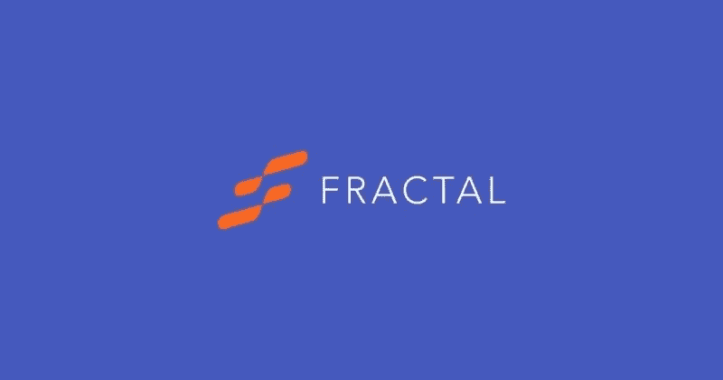

## 由 [Polkadot](https://polkadot.network/) 提供支持，Fractal 是一个开源的零利润协议，旨在设计一个数据标准化流程，确保、维护和交换高质量的用户数据。该平台旨在取代广告 cookies，并让用户完全控制自己的数据。它帮助用户以公平和透明的方式收集、验证和私下交换数据。该协议还确保了对出版商的奖励。

[分形](https://protocol.fractal.id/)协议在协议中构建了一个身份层。因此，使用分形协议，用户可以决定当他们访问网站时是否要与验证者共享他们的凭证。如果用户愿意分享他们的凭证，则验证者竞争以赢得由广告商张贴的广告购买。

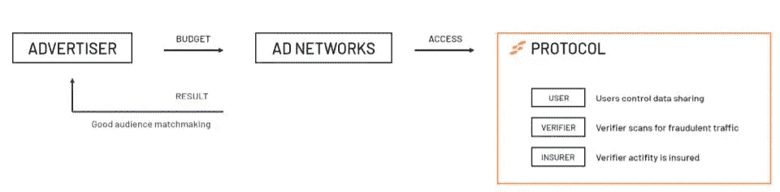

平台认为，如果所有参与实体的基本利益都与其在议定书中的作用相关，那么这将是一个双赢的局面。用户将可以控制他们的数据，这是以前所没有的。他们可以自由选择可用的服务，并会因为分享他们的数据而获得金钱上的好处。另一方面，广告客户相信他们的预算在无欺诈流量的目标标准上是值得的。因此，数字广告生态系统中的所有参与者都将受益于彼此，并将被引导至透明和公平的数据交换过程。

**协议实体**

分形协议提出了一种对协议中不同角色/用户交互的激励机制。该协议的主要目标是通过参与者(即验证者、保险者和证明者)的网络连接广告商和用户。

**广告商**

这些人/组织或实体想要为他们的产品或服务做广告。广告商支付并张贴他们的广告，以便信息可以到达目标受众。

**用户**

用户是通过互联网冲浪和互动的普通人。从协议的角度来看，用户将他们的数据提交给证明者进行验证，并决定是否与验证者或广告商的广告共享。

**验证者**

验证者是连接广告商和用户的人。验证者可以是发布者、广告网络、广告交易所等等。它们通过验证用户的广告声明来与协议交互。

**保险公司**

保险公司是为协议提供流动性的实体。任何能够提供流动性的实体都可以扮演保险公司的角色，作为回报，它们可以获得回报。基于个人的信誉，流动性被提供给个人验证者(需要验证用户的广告主张)。

**证明人**

证明者是协议中发布凭证以证明用户数据声明的实体。证明者可以是能够验证个人身份的任何服务提供者。

**使用指南**

进入[分形网站](https://protocol.fractal.id/)。

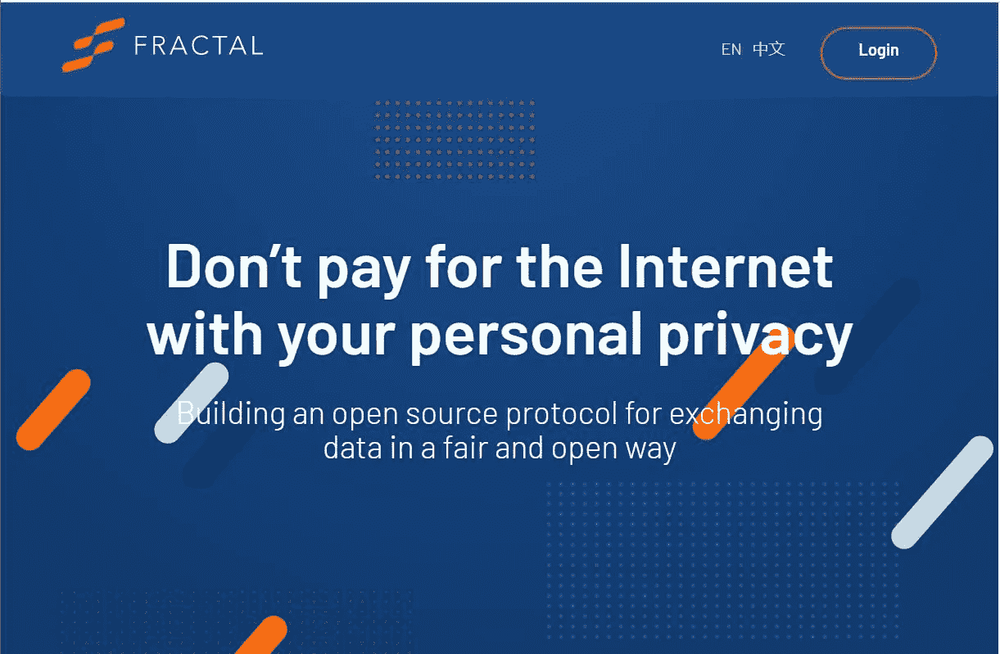

点击**登录**，会将你重定向到这个[页面](https://fractal.id/login) **。**

首先，用户需要通过一个身份验证过程。您可以提供您的电子邮件 ID 或电话号码。

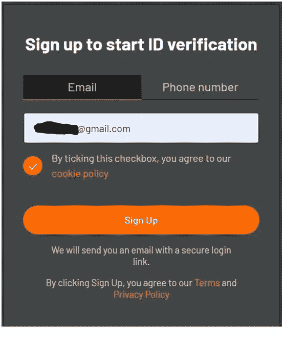

该应用程序将向您发送一封验证电子邮件，其中包含一个登录链接和密钥短语详细信息。

使用您的验证电子邮件中提供的链接登录。然后，应用程序将询问您希望设置的账户类型，即**个人**或**组织**。

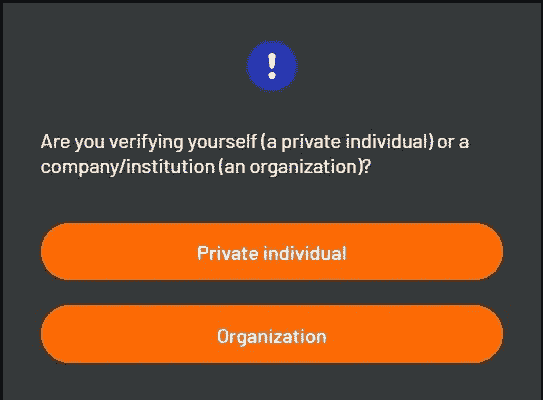

选择你想要的选项。我们正在为个人制作这个指南。

现在，您可以看到为您创建了一个空白仪表板。

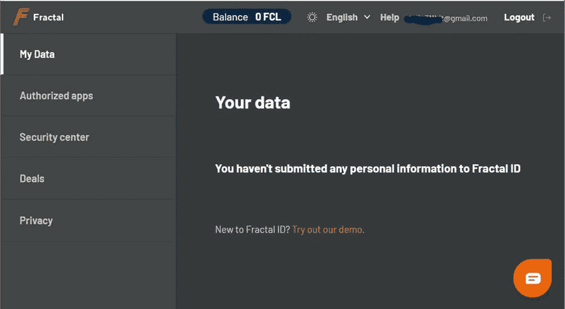

**安全中心**

您可以检查您的秘密密钥短语，并从这里启用 2FA。我们建议您在进行任何交易/活动之前启用 2FA，以确保您的帐户高度安全。

要启用 2FA，用户需要用 Google authenticator 应用扫描分形应用上显示的二维码。Google authenticator 应用程序将向您显示一个代码，您需要在 Fractal 应用程序中填写该代码。

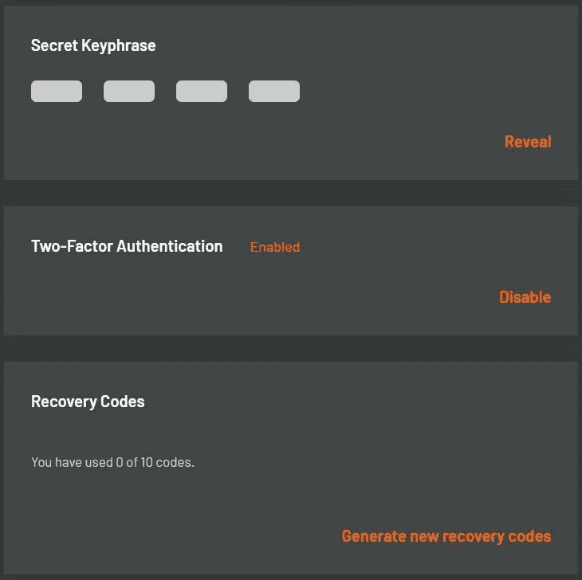

启用 2FA 后，应用程序将显示 10 个恢复代码列表，您可以保存这些代码以备将来使用。如果提供的 10 个恢复码列表用尽，您可以通过提供保密码来生成新的恢复码。

**交易**

从**交易**选项卡，您可以查看当前可用的交易，通过与您的朋友/亲戚共享推荐链接，您可以用这些交易来赢取奖励。每笔交易都有不同的标准，您需要满足这些标准才能获得奖励。

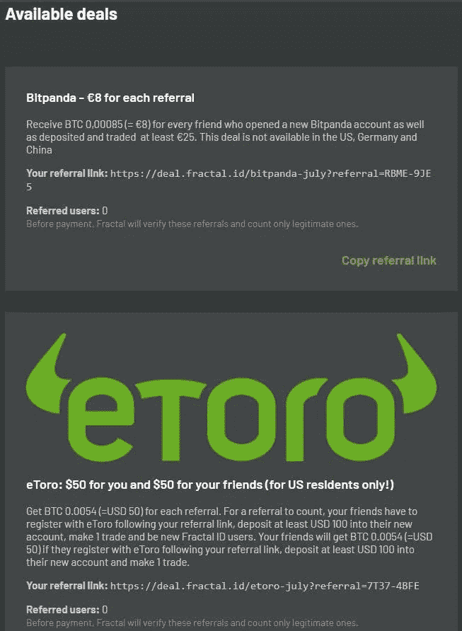

为了获得奖励，用户需要提供他们的[比特币](https://www.altcoinbuzz.io/cryptocurrency-news/spotlight/raoul-pal-reveals-latest-news-on-bitcoin-investments/)钱包地址，奖励将在那里累积。此外，您的帐户应该验证分形 ID 接收付款。

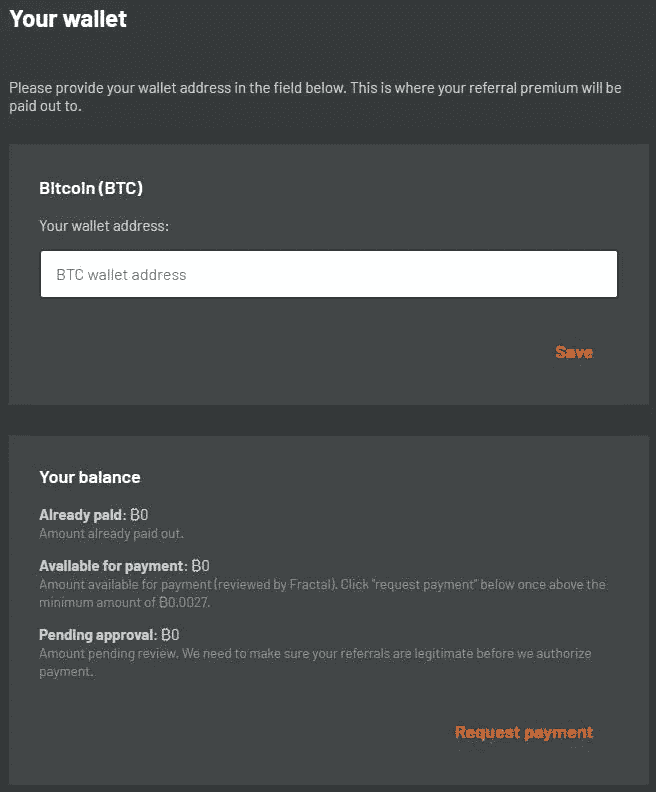

**如何验证您的帐户**

用户需要强制验证他们的帐户才能获得奖励。对于身份验证，分形平台考虑以下文档:

*   驾驶执照(仅限澳大利亚、加拿大或美国)
*   国民身份证
*   护照

**重要提示:**为了加快验证过程，平台建议用户使用护照进行身份验证。

您可以选择任何一个并开始验证过程。

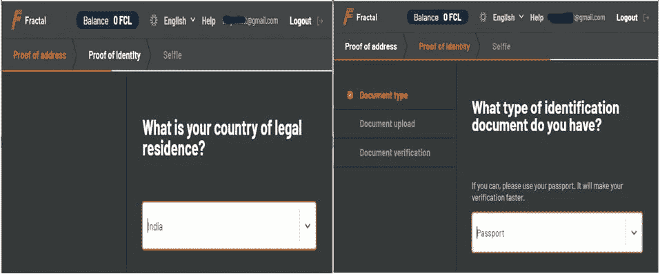

接下来，应用程序会要求您上传文档，它会自动从上传的文档中提取并显示您需要确认的信息。

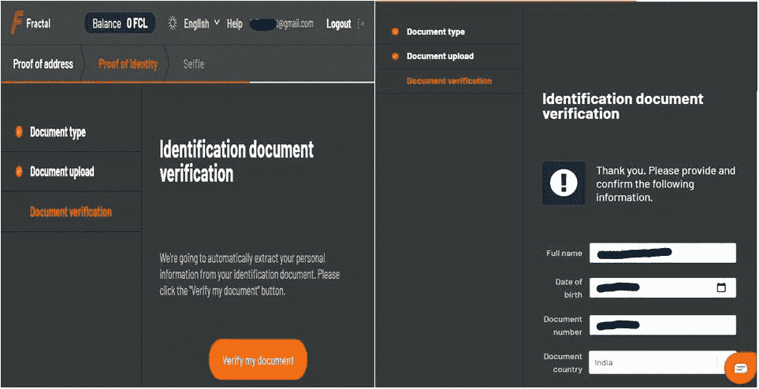

之后，应用程序会要求现场自拍。一旦完成，你的申请将被提交给分形团队进行验证。您可以从**我的数据**选项卡查看申请状态。

身份验证完成后，您将收到一封电子邮件通知。您的**我的数据**部分应该是这样的:

您还可以随时从**我的数据**选项卡更新您的现有数据。

**如何参与交易**

以下是参与交易需要遵循的步骤:

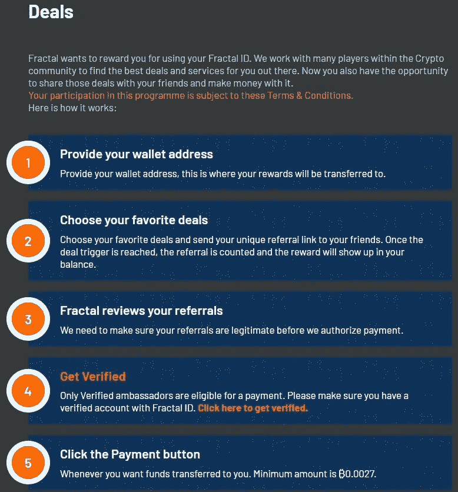

**第一步:**用户需要设置自己的 [BTC](https://www.altcoinbuzz.io/cryptocurrency-news/product-release/morgan-stanley-to-offer-bitcoin-funds/) 钱包地址。奖励将被转移到用户提到的钱包地址。

**第 2 步:**查看可用的交易，并与您的朋友/亲戚分享您独特的推荐链接。一旦您的朋友符合交易标准，您将获得奖励。

**第三步:**分形平台在进行支付之前，会检查你推荐的合法性。此外，您的帐户应该验证一个有效的分形 id。请按照上面的说明来验证您的帐户。

**第四步:**一旦您的奖励余额超过₿0.0027 值，您可以按下**请求付款**按钮请求付款。累积的奖励将添加到您的[钱包](https://www.altcoinbuzz.io/tag/wallet/)余额中。

**如何在 MetaMask 中添加 FCL 平衡**

用户可以将出现在分形应用程序上的 FCL 代币余额添加到他们的[元掩码](https://www.altcoinbuzz.io/reviews/wallet/how-to-use-the-metamask-ethereum-mobile-wallet/)钱包中。

为此，您只需点击**天平**选项卡(在下面的截图中突出显示)。

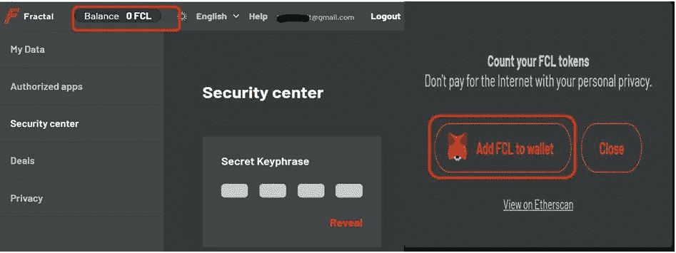

应用程序会给你一个选项——**将 FCL 添加到钱包**——你需要选择。

这只会将 FCL 代币和余额(如果有的话)直接添加到您的 [MetaMask](https://www.altcoinbuzz.io/bitcoin-and-crypto-guide/metamask-tips-and-tricks-you-can-use/) 钱包中。

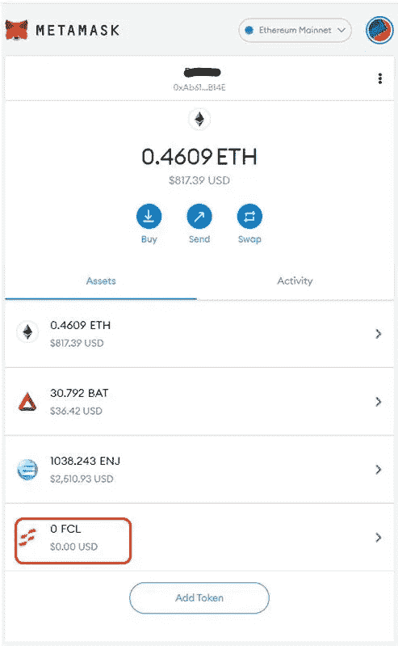

**社交场合**

[网站](https://protocol.fractal.id/)

[中等](https://medium.com/frctls)

[电报](https://t.me/fractal_protocol)

[推特](https://twitter.com/fractalprtcl)

**结论**

分形协议是一个创新的平台，旨在克服在线广告或数据共享系统中存在的问题。它让用户有权决定是否要分享他们的个人或行为数据。该平台还引入了一种激励机制，为所有协议参与者提供好处。通过纳入不同的数据共享空间，该协议希望通过有价值的用户、数据和可信广告，与市场双头垄断形成公平竞争。

**资源:** [分形白皮书](https://uploads-ssl.webflow.com/600c8c2ee034d32f97280917/6019512c99096e2be8251212_Fractal%20Protocol%20White%20Paper_01022021.pdf)

***注:*** *本帖首发* [*此处*](https://www.altcoinbuzz.io/bitcoin-and-crypto-guide/fractal-protocol-everything-you-need-to-know/) *同 Altcoinbuzz.io.*

跟我来吧

**👉** [推特](https://twitter.com/rumadas123)

**👉**[**Linkedin**](https://www.linkedin.com/in/ruma-das-a1439320/)

> **加入 Coinmonks [电报频道](https://t.me/coincodecap)和 [Youtube 频道](https://www.youtube.com/c/coinmonks/videos)了解加密交易和投资**

# **另外，阅读**

*   **[最佳加密分析或链上数据](https://coincodecap.com/blockchain-analytics) | [Bexplus 评论](https://coincodecap.com/bexplus-review)**
*   **[NFT 十大市场造币集锦](https://coincodecap.com/nft-marketplaces)**
*   **[AscendEx Staking](https://coincodecap.com/ascendex-staking)|[Bot Ocean Review](https://coincodecap.com/bot-ocean-review)|[最佳比特币钱包](https://coincodecap.com/bitcoin-wallets-india)**
*   **[Bitget 回顾](https://coincodecap.com/bitget-review)|[Gemini vs block fi](https://coincodecap.com/gemini-vs-blockfi)|[OKEx 期货交易](https://coincodecap.com/okex-futures-trading)**
*   **[美国最佳加密交易机器人](https://coincodecap.com/crypto-trading-bots-in-the-us) | [不断回顾](https://coincodecap.com/changelly-review)**
*   **[在印度利用加密套利赚取被动收入](https://coincodecap.com/crypto-arbitrage-in-india)**