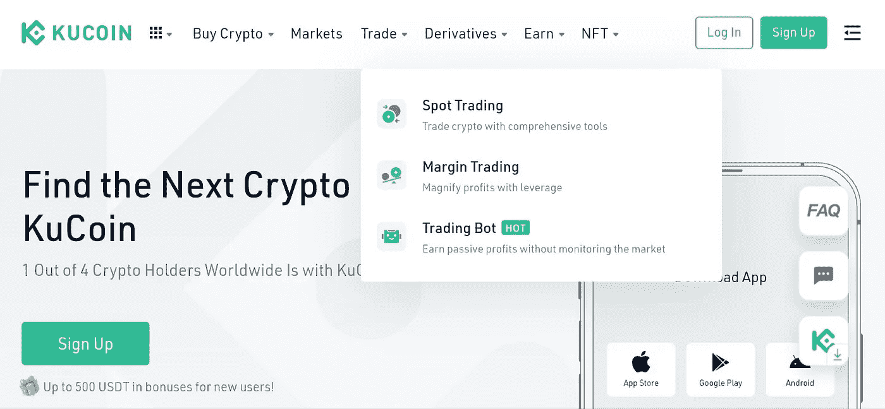
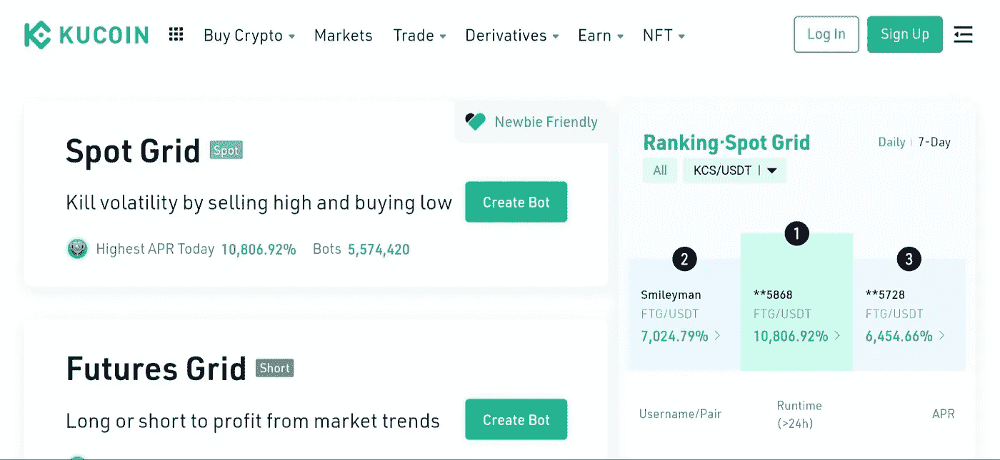
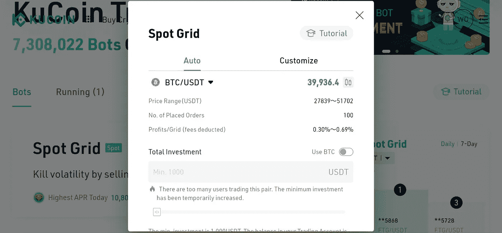

# 关于库币交易机器人你需要知道的一切

> 原文：<https://medium.com/coinmonks/everything-you-need-to-know-about-kucoin-trading-bot-cbdf0218e69f?source=collection_archive---------1----------------------->

你听过有人说他们错过了交易，因为他们太忙了，没有时间做分析和执行交易吗？或者，当你在温暖的床上和松软的枕头上享受最大的舒适时，你可能在早上醒来，意识到市场上发生了一些大的变动。错过利润没有坏处，对吗？市场在这里停留，所以你可以明天再试一次。只有当你承受损失时，它才是有害的。

但是，如果你能做这笔交易并获得所有你能获得的利润呢？嗯，这将意味着投入更多的时间或失去一些额外的利润睡眠。值得吗？这取决于利润的大小。

现在，如果我告诉你，你可以激活一个交易机器人能够执行和关闭自己的交易？听说过库币交易机器人吗？

什么是库币交易机器人？

●智能交易工具，代表您全天候自动执行 250 多种数字资产的交易策略。

●它自动跟踪市场波动并从中套利，而无需时刻关注市场。

●它有助于投资者轻松赚取被动收入，即使他们睡着了或在市场波动的情况下。

一开始，运行一个机器人听起来可能很复杂，我如何给机器人编程来运行交易或获利或进行近乎完美的交易？当市场下跌时，我想做空怎么办？这些可能只是你脑海中的一些想法，但不要担心，我会用最简单的语言详细解释你需要知道的一切。

KuCoin 交易 bot 有什么优势？

**a .减少重复性工作。**

交易机器人可以“组装和复制”重复性任务，帮助你轻松执行交易。例如，如果你每四个小时重新平衡你的投资组合，你可以使用一个智能重新平衡机器人，并对它进行编程，这样机器人就会自动平衡你的投资组合。

**b .抓住交易机会。**

交易时，时机很重要，你的每一笔交易都会对潜在利润产生巨大影响。例如，如果你想在达到某个阈值后执行交易，你需要坐在屏幕前观察不断变化的市场图表——可能需要几个小时，这样你就不会错过最佳时机。而使用交易机器人可以代表你监控市场持有量，并 24 小时不间断地执行交易。

**c .降低交易风险。**

在大多数情况下，市场是波动的。交易机器人非常适合跟踪和充分利用市场波动，因为它们将继续随着市场的流动进行套利。例如，在极端单边上涨的市场中，交易机器人不会错过利润；在单边下跌的市场中，它们可以帮助减少用户损失，进一步降低投资风险。

kucoin 上有 5 个交易机器人，用于不同的策略和交易模式

●现货网格:通过高买高卖获得被动收益

● DCA:通过持续投资降低你的平均进入价格

●期货网格:将现货网格引入期货市场

●聪明的再平衡:增加你的投资组合，即使你只是 HODL

●无限网格:点网格的衍生策略

现货网格策略 bot:网格交易是一种量化交易策略，通过这种策略，交易 BOT 可以在现货交易中自动进行买卖。它被设计成在设定的价格范围内以预设的时间间隔在市场上下单。网格交易是当订单高于或低于设定价格时，以递增和递减的价格创建订单网格。这样，它构建了一个交易网格。

KuCoin 现货网格 bot 在价格在特定范围内波动的震荡行情中表现最好。本质上，电网交易试图通过微小的价格变化来获利。通过量化交易，它帮助你理性交易，尽可能避免 FOMO。

DCA 战略机器人:DCA 基于这样一个概念，即你在不同的时间购买你的投资。

这是如何工作的:

假设你想在 12 个月内花 40，000 美元购买以太坊。你可以一次全部购买，在价格看起来更好的时候分批购买，或者你可以每月同一时间花 3333.33 美元，不管价格是多少。最后一个选择是成本平均法或 DCA。以太坊可能一个月卖 2000 美元，下个月卖 3500 美元，但你每个月还是要花同样的钱。自然地，你的 DCA 交易可以每天、每周或每月进行。这取决于你。

既然我们已经清楚地了解了 DCA 是什么，那么 DCA bot 是如何工作的呢？

DCA bot 将按照您指定的频率购买您的加密。正如我之前提到的，这可能是每小时，每天，每周，或每月，这取决于你怎么做。它会做到这一点，而不会感到无聊，所以你不必。你可以继续你的一天，让机器人去做它的事情。

期货网格策略 BOT:一般期货交易需要经验和技巧。然而，期货网格机器人大大降低了进入期货市场的门槛，为投资者提供人工智能参数，帮助他们开始交易，而无需掌握期货交易的深入知识。

顾名思义，期货网格 Bot 是网格交易和期货交易的结合，做多或做空都能为用户带来网格盈利。

机器人会把你的投资分成几个格子，在价格范围内不断低买高卖。期货网格就像一张渔网——通过跟踪合约价格，机器人不断从网格中获利。

统计数据显示，大多数投资者选择在期货市场做多。不管市场动态如何，如果有人想做空，期货网格机器人将是一个风险更小、利润更高的选择。与现货交易相比，期货网格机器人不仅可以为投资者赚取网格利润，还可以获得做多方支付的额外资金费用。

SMART REBALANCE BOT:SMART REBALANCE strategy 通过重组加密货币的投资组合，帮助霍德勒进一步增加他们的回报。聪明的再平衡策略是基于增加资产总量的想法，但同时保持投资组合的百分比不变。

在价格下跌期间，再平衡机器人会调整其位置，以保持你投资组合中的资产比例不变。因此，如果一项资产的价格下降，投资组合中其他代币的比率将被重新计算并轮换以填补亏损的资产。

假设你想将 40%的资金分配给 BTC，30%分配给 ETH，30%分配给 KCS，如果你只是简单地持有，这些代币的价值可能会随着时间的推移而变化，投资组合的比例很快将不再是 40% — 30% — 30%。为了更清楚，我们假设你的投资组合比例从 40% — 30% — 30%变为 45% — 30% — 25%，智能再平衡机器人将出售一些比特币，将其比例从 45%降至 40%，然后购买一些 KCS，使其回到 30%。这样，你现在拥有比以前更多的 KC，如果它的价格应该升值，以至于偏离 30%的比率，它将被出售，资金将用于购买更多的百分比低于初始比率的令牌。

无限网格策略 BOT:无限网格是现货网格的衍生策略，旨在避免错过价格泵。当所有基本面都指向上升时，这种策略是最成功的。

无限 bot 只有下限，没有上限。它将对资产的投资保持在一个不变的价格，例如，假设 BTC/USDT 的进入价格为 50，000，单个网格利润设置为 1%。

当价格上升到 1%的第一格时，BTC 持有的价值将为 50，500 USDT，因此机器人将出售 500 USDT 的比特币。因此，剩余的比特币仍然价值 5 万 USDT。同样，当价格跌破 1%时，会有更多的 BTC 被买入，从而使手中 BTC 的总价值保持在 50，000 USDT。

KuCoin 是世界上排名第一的 altcoin 交易所，提供各种各样的资产可供选择；600 多项顶级性能资产。Kucoin 通常被称为人民交易所，在全球最佳加密交易所中排名前五，为所有类别的投资者提供服务，Kucoin 目前拥有加密爱好者最佳交易所的称号。如果你是一个爱好者，这是一列你想跳上的火车。通过简单、安全和直接的方式购买密码，包括但不限于:sepa、信用卡/借记卡、paypal、本地银行转账、visa/mastercard 和超过 26 种以上的选项。但这还不是全部，KuCOIN 为用户提供了多种方式，通过赌博和贷款从闲置资产中获得被动收入。提升交易所中最好的交易机器人服务之一，用户可以在没有额外成本的情况下，在 kucoin 上运行交易机器人，获得更多被动收入。

[开始交易](https://www.kucoin.com/r/rf/r395ZQJ)

在 KUCOIN 上设置策略机器人:

你可以[注册一个 KuCoin 账户](https://www.kucoin.com/r/rf/r395ZQJ)，开始运营一个有利可图的交易机器人

[KUCOIN LANDING PAGE](http://kucoin.com)

## 在 kucoin 登陆页面，选择**交易** > >交易机器人

SELECT THE BOT YOU WANT TO RUN

YOU CAN USE THE AUTO SETTINGS WHICH IS ADVISABLE FOR NEWBIES, SELECT YOUR INVESTMENT AMOUNT AND CLICK OKAY TO CREATE YOUR BOT

# **或**

YOU CAN ALSO CHOOSE TO CUSTOMIZE THE BOT DEFAULT SETUP TO SUIT YOUR TRADING PLAN.

选择正确的机器人来完善你的交易计划并最大化你的利润对成功至关重要。

在 YouTube[上查看更多交易机器人教程](https://www.youtube.com/watch?v=hGbNo1633fk)

下一个

[找到适合自己的机器人](https://www.kucoin.com/zh-hans/blog/kucoin-trading-bot-now-supports-4-strategies-how-to-find-the-bot-fits-you-most?_cms_ts=1645602853&_cms_hash=4e338f2d79ba85ed9d9a8b43ac53d42adedc8e85713591a44ab2bdcdfe7a5fc5&type=3)

nb；如果管理得当，所有的交易策略都是好的，你应该只投资你能承受的损失，DYOR 会帮助你做出明智的决定。记住，交易策略只和屏幕后面的交易者一样好。

> 加入 Coinmonks [电报频道](https://t.me/coincodecap)和 [Youtube 频道](https://www.youtube.com/c/coinmonks/videos)了解加密交易和投资

# 另外，阅读

*   [如何在 Bitbns 上购买柴犬(SHIB)币？](https://coincodecap.com/buy-shiba-bitbns) | [购买弗洛基](https://coincodecap.com/buy-floki-inu-token)
*   [CoinFLEX 评论](https://coincodecap.com/coinflex-review) | [AEX 交易所评论](https://coincodecap.com/aex-exchange-review) | [UPbit 评论](https://coincodecap.com/upbit-review)
*   [十大最佳加密货币博客](https://coincodecap.com/best-cryptocurrency-blogs) | [YouHodler 评论](https://coincodecap.com/youhodler-review)
*   [AscendEx 保证金交易](https://coincodecap.com/ascendex-margin-trading) | [Bitfinex 赌注](https://coincodecap.com/bitfinex-staking)
*   [最好的卡达诺钱包](https://coincodecap.com/best-cardano-wallets) | [Bingbon 副本交易](https://coincodecap.com/bingbon-copy-trading)