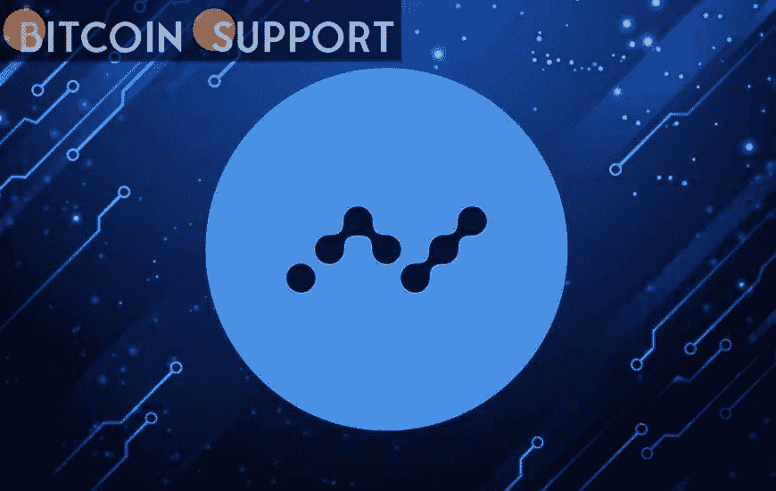

# 关于纳米你需要知道的一切

> 原文：<https://medium.com/coinmonks/everything-you-need-to-know-about-nano-db6d40a2c863?source=collection_archive---------59----------------------->

**Visit our website:-** [**https://bitcoinsupports.com/**](https://bitcoinsupports.com/)

It has been a long time since the cryptocurrency sector was initially introduced, and to be honest, the business has had a fantastic ride thus far, attracting potential investors from all over the world and successfully establishing itself in the global marketplace. Not only that, but as previously stated, the industry has recently experienced a boom in overall growth and appeal, allowing it to reach new heights!

Having said that, I believe the bulk of you are already familiar with the fundamentals of the industry, and I am sure you are anxious for us to get started with what we have today, but for those of you who are unfamiliar with the sector, it is best if we take a quick look at it first.

To begin, cryptocurrencies, as the name implies, are a type of online or virtual currency that can be used for a variety of reasons, including the purchase and sale of products and services, as well as trade and exchange through cryptocurrency exchanges available online.

To put it another way, crypto is a blockchain-based platform that is known for being completely decentralised. Because the crypto world is decentralised, it is more than capable of stepping outside of central authorities’ general control and jurisdiction, allowing it to operate freely without undue government interference.

Also, when the business was originally established, there were few currencies to pick from, and honestly, few people wanted to be a part of it since people were doubtful about the return on investment they might expect, as well as the safety of their money.

That is no longer the true, since we now have pools of currencies for investors to pick from, with newer ones being added every day and hundreds of new investors joining every hour.

To name a few of the many currencies accessible now in the market, Bitcoin, Cardano, Baby Doge, Ethereum, Dogecoin, Polkadot, Binance Coin, PancakeSwap, and EverGrow Coin are just a few of the most popular ones worth investing in.

Furthermore, it’s fascinating to see the industry’s rapid growth over the last few years, so let’s take a look at some of the major contributing factors responsible for this enormous success, such as portability, high profit margins, volatility, negligible response time, the assurance it provides, intuitive nature, and, of course, ease of use.

Due to the volatility of the crypto market, it is necessary to be aware that it is not always possible to foresee price changes and act accordingly, as price variations in the crypto market are nearly instantaneous, giving no time to plan. As a result, if dealing in online currencies, bear in mind that, while the business may provide you the possibility to make large profits and rapid money, if done incorrectly, you may also end up with major losses.

Not only that, but according to some of the field’s leading experts, crypto is rapidly progressing toward completely revolutionising the global payment system, and from where I stand, it appears that it has already begun to do so, as many merchants and businesses have begun to accept crypto as an official mode of payment from their customers.

You will have a lot better idea of what we have with us today, Nano, now that you have a basic background on the crypto realm. Continue reading if you want to learn more!

**Everything you need to know about Nanotechnology (XNO)**

Nano, or XNO as it is more commonly known, is a lightweight cryptocurrency that is billed as “digital money for the modern world” and is nothing more than a lightweight cryptocurrency that is said to be designed to facilitate practically instant and secure payments, all without any fees, thus addressing some of the major limitations of both modern virtual currencies and legacy financial infrastructure.

To put it another way, Nano is a virtual currency that bills itself as “a low latency payment platform with little resources.” Not only that, but each Nano address is known to have its own blockchain, and platform users may simply contribute the processing power required to validate their own transactions, allowing transactions to be performed without fees as previously described.

Before we go any further, it’s worth noting that Nano is said to have been established by Colin LeMahieu, a highly experienced software developer and engineer who has worked for a number of well-known tech companies, including AMD, Dell, and Qualcomm.

Furthermore, XNO is touted to be the Nano platform’s native utility token, which may be utilised for a variety of purposes on the platform itself. On a similar note, the project’s general development began in 2014 under the name RaiBlocks, with the coin (then known as XRB) launching the following year via a public faucet that allowed platform users to collect modest amounts of XRB after completing a captcha challenge.

Additionally, anyone with access to a phone or computer could solve captchas and receive RaiBlocks as a reward. Apart from that, it is said that the number of XRB people who receive every solved captcha varies over time. However, back in January 2018, RaiBlocks (XRB) was rebranded to Nano, as we know it now.

The new name was chosen to better represent the project’s general simplicity and quickness to its users. Nano is a peer-to-peer platform that uses a unique block-lattice data structure to let users to quickly transfer value to one another without the need for centralised intermediaries.

Furthermore, unlike several other platforms that rely on a massive mining network’s combined proof of work to achieve consensus, Nano employs a system known as Open Representative Voting (ORV), in which account holders vote for their “chosen representative,” who then works to securely confirm blocks of transactions.

This ORV is known to make Nano incredibly energy efficient, offering it as a more environmentally friendly alternative to virtual currencies based on proof of work.

Not only that, but in November 2021, Nano adopted a new ticker and standard symbol known as XNO and X in order to bring Nano into the real world and comply with the International Organization for Standardization’s widely recognised norms (ISO).

Moving on, what truly distinguishes Nano from other products on the market is that, as previously stated, Nano is supposed to be intended to be fast. Nano transactions are supposed to reach total finality in less than a second or so, compared to several minutes or even longer for many other major virtual currencies.

Because of its speed, Nano is well suited for commercial payments, as merchants and retailers no longer have to worry about transaction delays when receiving payments.

Finally, Nano’s unique design enables all of these advantages, and unlike many virtual currencies that are constructed on top of a distributed ledger known as a blockchain, Nano is known to be built on top of a comparable ledger technology known as a directed acyclic graph (DAG).

The aforementioned structure is incredibly dependable and, with the correct technology, can scale to enable 1,000 transactions per second, all without relying on an energy-intensive mining network to preserve its integrity, establishing nano as an environmentally friendly virtual payment option.

Now that we’ve discussed Nano extensively, some of you may be asking if it’s a good idea to invest in the platform. Let’s find out if that’s the case, shall we?

**Investing in Nanotechnology (XNO)**

Nano’s price is currently around 2.95 US dollars. Not only that, the value of Nano has increased by 15.85 percent in the last twenty-four hours, XNO is presently ranked #164 in the CoinMarketCap rankings.

It’s also worth noting that Nano’s current circulation supply is 133,248,297 XNO coins, with the token’s maximum lifetime supply also being 133,248,297 XNO coins.

You should have a good knowledge of the platform after reading this far, and you should be able to decide whether or not investing in Nano is the correct decision for you. Given everything it has to offer, as well as its recent performance and plans for the near future, I am confident that Nano will prove to be a rewarding investment in the near future, providing you with increased returns and the prospect of your existing investment increasing in value. But, once again, nothing is certain!

As we indicated from the outset, cryptocurrency is a highly volatile and uncertain market. As a result, it’s critical for you to understand that, like any other cryptocurrency, Nano comes with its own set of hazards, and you should only invest if you’re willing to take those chances and incur any and all losses if necessary.

If you’re wondering where you can get Nano, look no further. Allow me to assist you with this. Nano is currently available on all major cryptocurrency exchanges, however some of the most popular ones include Binance, OKX, Mandala Exchange, Huobi Global, and DigiiFinex, to mention a few.

**Visit our website:-** [**https://bitcoinsupports.com/**](https://bitcoinsupports.com/)

**Disclaimer: These are the writer’s opinions and should not be considered investment advice. Readers should do their own research.**

> 加入 Coinmonks [电报频道](https://t.me/coincodecap)和 [Youtube 频道](https://www.youtube.com/c/coinmonks/videos)了解加密交易和投资

# 此外，请阅读

*   [币安交易机器人](/coinmonks/binance-trading-bots-d0d57bb62c4c) | [OKEx 点评](/coinmonks/okex-review-6b369304110f) | [Atani 点评](https://coincodecap.com/atani-review)
*   [最佳加密交易信号电报](/coinmonks/best-crypto-signals-telegram-5785cdbc4b2b) | [MoonXBT 点评](/coinmonks/moonxbt-review-6e4ab26d037)
*   [如何在比特币上购买柴犬(SHIB)币？](https://coincodecap.com/buy-shiba-bitbns) | [买入 Floki](https://coincodecap.com/buy-floki-inu-token)
*   [CoinFLEX 点评](https://coincodecap.com/coinflex-review) | [AEX 交易所点评](https://coincodecap.com/aex-exchange-review) | [UPbit 点评](https://coincodecap.com/upbit-review)
*   [10 大最佳加密货币博客](https://coincodecap.com/best-cryptocurrency-blogs) | [有请《财富》点评](https://coincodecap.com/youhodler-review)
*   [上行保证金交易](https://coincodecap.com/ascendex-margin-trading) | [Bitfinex Staking](https://coincodecap.com/bitfinex-staking)