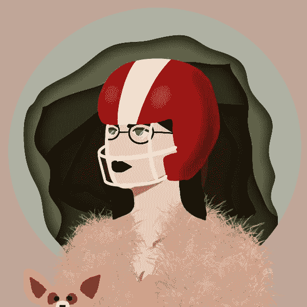

# 你需要知道的关于物质女性的一切&如何购买。

> 原文：<https://medium.com/coinmonks/everything-you-need-to-know-about-the-women-of-substance-nfts-how-to-buy-them-47efb0a6a3c0?source=collection_archive---------62----------------------->

Women of Substance #2904 (WoS)

***免责声明:*** *本博客仅用于一般教育目的。此处提供的信息不构成投资或交易建议。在承担财务风险之前，请寻求专业建议。*

拥有 NFT(用金钱或加密货币)让买家拥有几乎任何种类的数字产品的独家所有权。把它想象成一张受欢迎的棒球卡——它有约定的货币价值，但卡本身不能作为现金交易。NFT 是一种数字资产，表示对艺术或音乐等仅在线项目的所有权。该术语代表“不可替换的令牌”，这表明它是不可交换的。

# NFT 的物质女性是什么？

## NFTs。社区。奖学金。慈善机构。赋权。
乔布斯。机遇。

 [## 富有的女人

### 物质女性不仅仅是非物质女性的集合；这是一个庆祝有影响力的成就的社区…

womenofsubstancenft.com](https://womenofsubstancenft.com/) 

**Women of Substance** 是一个正在进行的项目，旨在庆祝有影响力的女性所取得的成就，同时为有抱负的 Web3 企业家提供支持。

由飞行员兼慈善家*菲律宾飞行员 Chezka* 创立的这一基金会将通过向慈善组织和那些需要帮助的人提供直接救济来确保她的旅程的连续性。此外，她还利用自己的平台激励他人，帮助有需要的社区实现积极的改变。她是内容创造者、母亲、飞行员、护士，也是物质女性背后的驱动力。

8,888 NFTs 由菲律宾艺术家**洛蒂**设计，由**网络 3 的活跃顾问**凯尔·勒诺开发。NFTs 于 2022 年 3 月启动。

# NFT 妇女组织是如何工作的？

除了拥有数字艺术品本身，物质女性非物质艺术还允许所有者成为慈善事业的倡导者。每一笔 NFT 的购买都有一部分用于慈善项目和他们自己的项目开发。他们让社区全程参与。在路线图中，根据薄荷糖的数量和将要完成的慈善项目，列出了一些重要的里程碑。

在其网站上，它展示了 Web3 中的重要女性的故事。它展示了雄心的光辉，毅力的价值，以及现实中的女性。每位女性将获得 2 份免费的 NFT。

# 如何购买 NFT 女性的物质？

如果你对从物质女性那里收集非物质财富感兴趣，你可以通过铸造页面[https://womenofsubstancenft.vercel.app/](https://womenofsubstancenft.vercel.app/)购买。要铸造 NFT，请访问[造币页面](https://womenofsubstance.vercel.app/)并连接您的 Solana 钱包。费用为 2 索尔，如果你被列入白名单，费用会降低。

# 外卖食品

就像你所做的任何购买一样，最好是*自己研究一下(DYOR)*NFT。“物质女性”是一个很有前途的 NFT 项目，它不想向月亮许诺什么，但他们只想保证慈善事业的实施，赋予所有人权力和机会，特别是对物质女性。

你有关于一个丰满女人的故事要分享吗？他们目前接受 60 秒的故事在他们的频道上播放；每位女性将获得 ***两(2)份免费 NFT。那么，为什么不点击下面的链接，分享你的故事，成为 Web3 中新兴的女性社区的一员呢？[https://docs . Google . com/forms/d/1 lnx 6 iuyp _ t 6 odusboriuq 1 ctqmk 2h _ _ lfe cf 6 mdwofq/view form？edit_requested=true](https://docs.google.com/forms/d/1lnx6IuYP_T6oDUSBOrIUQ1CtQMK2H__lFeCF6MDWOfQ/viewform?edit_requested=true)***

你也可以访问那里的不和谐服务器了解更多。

[https://discord.gg/4RfHtu28C9](https://discord.gg/4RfHtu28C9?fbclid=IwAR1HeOlX1AWedNEW6BvRyoLqOshCUJ0D7H_fsLyirDT7CXrYjMFzfarLCAg)

 [## 富有的女人

### 物质女性不仅仅是非物质女性的集合；这是一个庆祝有影响力的成就的社区…

womenofsubstancenft.com](https://womenofsubstancenft.com/) 

***关于作者***

Brayan Nelson 是一名业余爱好作家，目前是一名大学讲师，同时是 Elemints NFT 项目的实习生和精灵纷争服务器崛起的总版主。在 Medium 上，他写了他在 NFT 和元宇宙的联系和教育之旅。订阅他的时事通讯，成为第一个阅读他的博客故事的人。你也可以在 bnelsonsep3@gmail.com 通过电子邮件联系到他