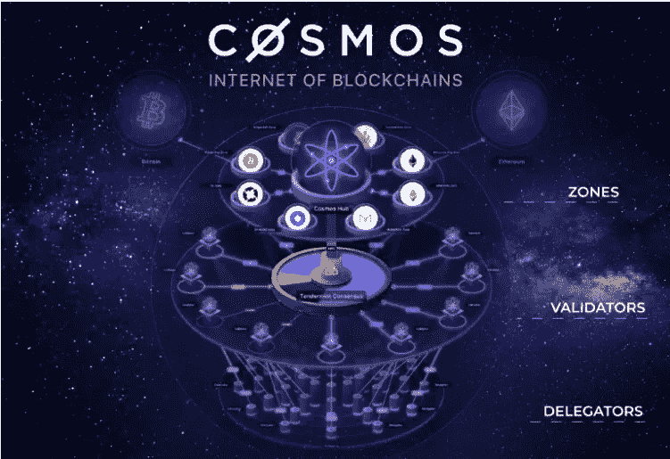
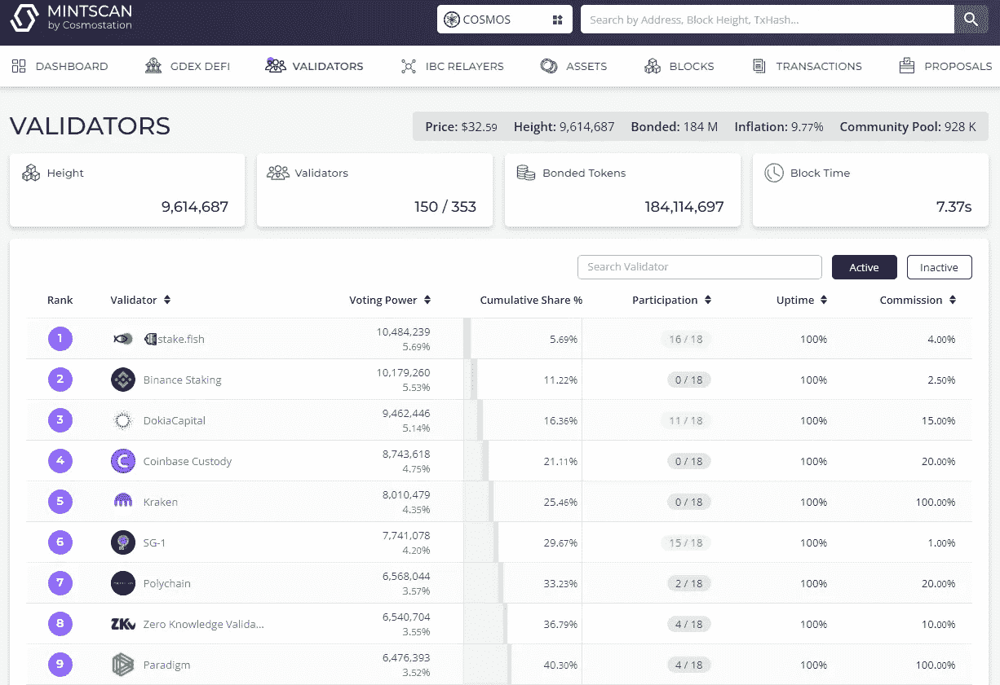
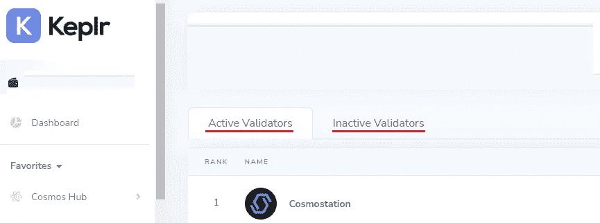
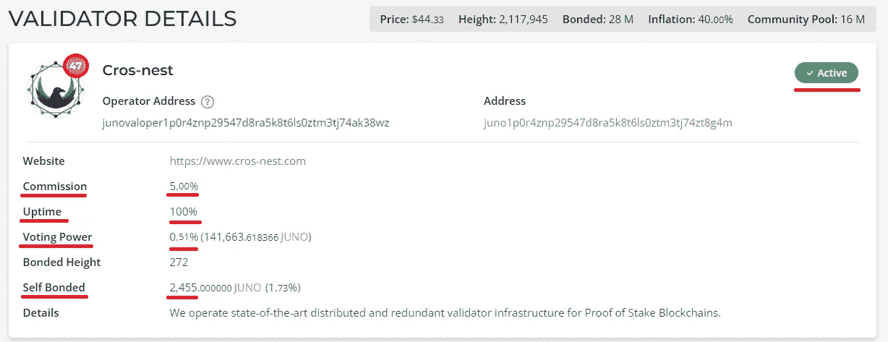
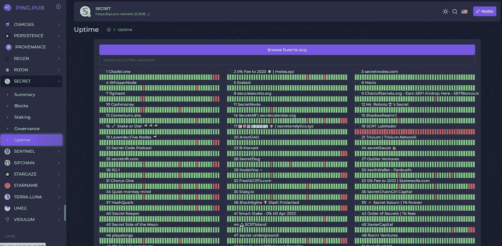
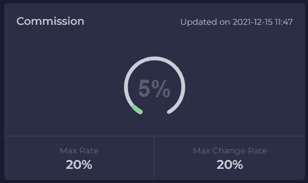
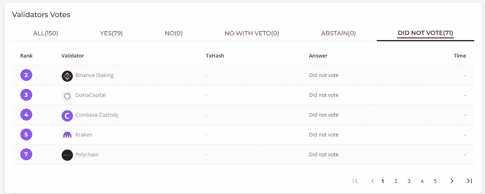
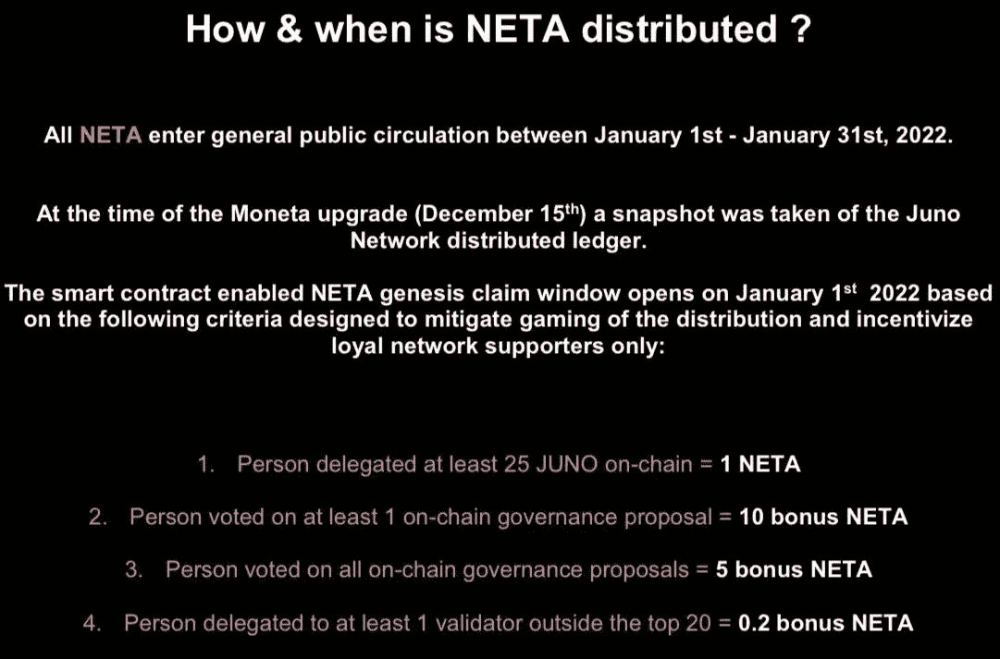
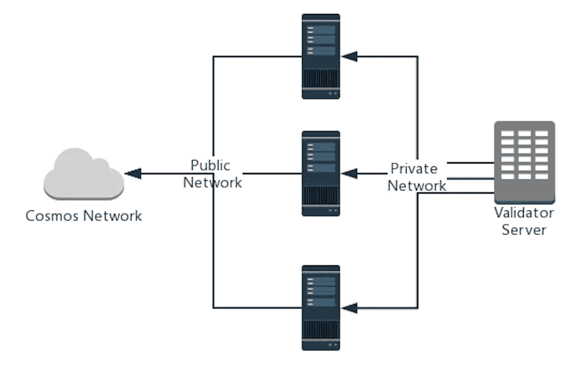

# 成功选择验证器所需要知道的一切

> 原文：<https://medium.com/coinmonks/everything-you-need-to-know-to-successfully-choose-your-validators-7e752900d489?source=collection_archive---------0----------------------->

> 了解如何选择最好的验证机来为您的代币下注，再也不会错过空投或奖励。

宇宙生态系统中的区块链都是基于股权技术的证明。因此，宇航员可以参与的最重要的活动之一就是用他们的硬币来保护网络。随着 IBC(Inter-block chain Communication protocol)和 Starport 等区块链工具的推出，我们看到了宇宙生态系统中 IBC 连接区块链的爆炸式增长，所有这些都提供了不同的赌注机会和体验。对于宇航员来说，最重要的是让他们了解自己在这些区块链中的代表角色。

> **TLDR:** 在选择验证者时，您希望委托给尽可能接近 100%正常运行时间的人，具有较低比例的投票权，5%以上的佣金，具有透明的严格事件政策，即出席、发声、活跃于社区并通过提供工具和服务参与区块链。

[Source](https://techstory.in/cosmos-everything-you-need-to-know/)

**了解验证器的功能** 利害关系证明区块链依靠验证器来保护网络。验证器的角色对于链的正确运行至关重要。验证者运行一个完整的节点服务器，并通过广播包含其加密签名的投票来产生新的块，从而参与共识协议。验证者用于参与共识和产生块的投票权重由他拥有的委托数量来表示。这就是为什么，当一个验证者停机时，委托给他的硬币会从一致投票中丢失，如果丢失了一个临界量，链就不能再成功地产生块。

通过参与一致投票，验证者向区块链提交新的区块，并作为交换获得奖励。这些奖励会在所有授权者之间分配。

如你所知，验证者的另一个重要方面是通过投票表决提案或为改善网络而起草自己的提案来参与分散网络的治理。

[Mintscan](https://www.mintscan.io/) is an explorer providing a list of all validators for all the main IBC chains

**活动集和非活动集** 不是所有的验证者都能获得奖励。您必须是授权人的有效验证者才能获得奖励。根据连锁店的不同，它们的数量通常在 50 到 150 之间，而其他 POS 技术的工作方式不同，允许数千个。活动集中的验证器由他们拥有的委托的数量决定，因此，是委托者控制谁应该在活动集中，谁不应该使用他们的委托的权重。可以委托给非活动的验证器来帮助它们进入活动集。非活动集是没有足够的委托来包含在活动集中的验证者的列表，因此，它们在非活动时不会获得奖励。

Using [Keplr wallet](https://www.keplr.app/) you can toggle the Inactive Validators list and delegate.

**了解授权人的职能** 授权人通过将他们的硬币交付给验证人来委托他们的共识投票权，验证人将使用这些权利参与大宗发行流程并在流程中获得奖励。这些奖励将在所有授权者之间分配。这是一项非托管活动，意味着委托人完全控制自己的资金。下注时，他们的硬币会留在钱包里。在锁定期间，令牌被绑定到验证器，并且不可用。当令牌从委托中取消堆叠/撤回时，它们会经历一个解除绑定期(在取消堆叠和再次使用之前令牌被冻结的冷却期)。在解除绑定期间，授权者不会获得奖励。根据链的不同，解绑期可在 14 至 28 天之间变化。

委托人还可以通过他们的 staking 界面对不同的提案进行投票来参与治理。你需要委托你的代币来投票。

委派者在区块链中具有最原始的角色。他们的责任是保持验证者的诚实，确保只有最好的和最认真的人才能进入活动集并留在那里，并以最好的方式传播他们的授权以加强网络。现在，没有足够的关于授权者角色的教育来让我们的区块链有效运作。人们认为这是一种在他们的密码上产生被动收入的方式，而完全忽略了协议赋予他们的主要角色。

这就是为什么我们仍然有低正常运行时间验证器控制着很大一部分投票权，0%佣金验证器蚕食了大部分授权，高层集中交易，没有贡献者比核心/活跃贡献者获得更多授权。

**如何选择验证器** 有很多变量可以用来比较验证器，选择适合自己的。您需要寻找的最重要的指标如下:

By clicking on a validator’s name on [Mintscan](https://www.mintscan.io/) validator lists, you can access the Validator profile

**正常运行时间** 正常运行时间性能是最容易使用的指标，显示在大多数块浏览器的验证器选项卡中。显然，接近 100%是最好的，但是授权者不应该被 90%到 100%之间的正常运行时间所拒绝，因为在验证者端有一些失控的停机时间是很常见的。最重要的是不要让它成为一种习惯。简单的经验法则是任何高于 90%的都是积极的，如果你用 100%正常运行时间验证器，你不会在这方面犯错误。但是，您需要注意其他参数。虽然正常运行时间很容易评估，但它不是唯一需要检查的东西，许多其他变量与正常运行时间性能一样重要。

[Ping.pub](https://ping.pub/) is another great explorer that let you monitor missed blocks / uptime in real time as well as many other statistics regarding validators.

**自我授权** 自我授权是验证者为了保护网络安全而从自己口袋里拿出的硬币数量。如果一个验证者在游戏中与他的委托人有利益关系，他会承受同样的风险和回报，你可以有一定的信心，他会为了他和他的委托人的最大利益而行动。

**多少才算够自我授权？** 没有神奇的数字，一些验证者由风险投资基金和大机构运营，他们自然会有数百万的自我授权，而其他人则由普通社区成员运营，他们不可能有数百万的自我授权。因此，这应该根据运营商的性质来看待。只要是一笔不小的数目，取决于经营者，在几千美元到几十万美元之间的任何东西都应该是你自我授权的对象。接近 0 从来都不是好兆头。

佣金是验证者对其服务收取的费用。它是基于百分比的，并从委托人的奖励中扣除。平均最低佣金率通常是 5%。许多连锁店开始执行 5%的最低佣金率，以确保保护连锁店的验证者的最低收入。好的验证并不便宜，而且根据链的不同，处于中间或较低排名的验证者没有任何利润，并且大部分是亏本运营。

区块链和区块链服务依赖于基础设施提供的验证器。因此，验证者创造利润来维护和升级他们的基础设施并不断扩展以满足不断增长的需求是至关重要的。

因此，我强烈建议将资金委托给佣金率在 5%到 10%之间的验证机构，远离那些佣金率为 0%或接近 0%的验证机构。一个 0%的验证者正在伤害网络，因为它迫使所有其他验证者亏本经营来竞争，使新来者难以加入网络，并吸引了超过其公平份额的容易抓住/不知情的委托者，从而促进了基于不健康营销实践的集中化。这就是为什么 0%验证者通常被排除在空投之外。

On [Ping.pub](https://ping.pub/) you can see the maximum a validator can change his commission.

**投票权** 投票权是委托给验证者的硬币占整个网络中委托的硬币总数的百分比，并通过所述验证者在达成一致时的投票权的权重来转换。如果拥有最高投票权的验证者中有足够大的比例出现故障，这个链条可能会停止运行。为了不造成单点故障，并促进权力下放，最基本的做法是在区块链的所有行为者之间分配授权。通常建议忽略一个集合中的前 20 个验证者，因为他们已经拥有足够的投票权，并委托给该集合中较低的验证者。建议委托给任何活动集的较低的 40%,以便以有利于网络的方式分割投票权。

**对区块链的贡献** 许多验证器为区块链运行不同类型的节点、中继器、创建工具、块探索者和其他智能契约贡献。总是鼓励支持那些支持区块链的人。这不是所有验证者都能做的事情，因为它需要特定的技能和大量的资金，因此，应该评估所有类型的贡献，技术贡献应该与社区贡献或其他类型的贡献一样重要，因为不是所有好的验证者都有大团队或无限的资金。

**对社区的贡献** 大多数时候，授权者希望他们的验证者与他们交流、创建社区、运行客户支持服务、教育、举办活动并到场解决和处理有关区块链的问题。

**治理投票** 你需要一个积极参与治理的验证者，这意味着他在区块链的问题上与社区一起投票，参与关于提案的对话，并提出旨在改善区块链和社区的提案。

In the Proposals section, [Mintscan](https://www.mintscan.io/) displays Validator votes on proposals (vote on the comos vega upgrade)

**硬&软削减保险:** 将令牌委托给验证器的风险表现为削减事件的形式。

**斜线是网络对验证器施加的惩罚，通常有两个原因:**

*   **停机时间** *(软削减)* 当验证器离线并且在一定时间内没有参与块签名时，就会发生这种情况。这种情况可能会导致 0.01%(可能有所不同)的赌注代币损失，并且在停机期间不会赢得新的奖励。
*   **双重签名** *(硬斜线)* 双重签名发生在验证器的唯一私钥被同时使用多次来签名新块的时候。如果同时运行两个使用相同私钥的节点，就会发生这种情况。惩罚是损失 5%的赌注资金、验证者的监禁时间和委托者令牌的解除绑定时间。在解除绑定期间，授权者停止获得奖励。

**苛刻的保险** 委托人需要小心，因为在术语的普通意义上没有“保险”这种东西。验证者通常会从现金中支付此类活动的费用。目前没有经过验证的方法来验证这种资金是否可用，所以作为委托人，您所能做的就是信任您的验证器。报道 0.1%的事件不像报道 5%的硬砍事件。由于缺乏透明度，验证人至少应该告知其委托人用作保险的资金的可用性和来源以及所述保险的性质和限制。我们足够幸运，我们有一个很好的验证者社区，到目前为止，除了一些例外，验证者一直坚定地遵守他们的承诺，并按照广告报道砍人事件。

**关于划伤保护的最佳实践有:**

*   确切地宣布所述保护的限制及其覆盖的范围。
*   提供一个公共钱包地址，委托人可以查询该地址，以了解验证者为了保护他们而留出了多少资金。
*   验证者应将其部分收益分配给所述公共地址，以筹集预防基金来应对此类事件。

声称有保护很容易，但如果验证者在面对砍杀事件时没有流动性，他不可能凭空创造货币来支付这样的保护。不要相信，核实。

**如何最大化获得空投的机会？** 在宇宙生态系统中押注硬币背后的一个主要金融吸引力是空投的潜力。在过去的几个月里，我们已经看到了许多有价值的空投，开始最大限度地增加代表团数量以获得尽可能多的空投是正常的。

**基于过去的空投，这里有一个最佳实践的列表，你可以遵循它来帮助你获得未来空投的资格:**

*   **不要入股集中交易(空投不包括集中验证)。**
*   不要和排名前 20 的验证者打赌(有时会给那些把他们的令牌委托给排名较低的验证者的人空投奖金)。
*   **不要与 0%验证者(通常被排除在空投之外)有利害关系。**
*   **对所有治理提案进行投票(通常会向投票的人提供空投奖金)**

> 将你的财富分散到几个链上，主要的是$Atom，$Osmo 和$Juno，并确保下注一定的最小值。考虑至少堆叠 25 $Atoms、25 $Juno 和 100 $Osmo。

Example : of how the [Neta](https://www.neta.money/) airdrop was distributed as a reference

验证机空投/令牌
我们看到的一个趋势是验证机令牌和空投的倍增，以增加授权和奖励社区。那种营销本来就没什么问题。但是，就像任何代币或空投一样，人们需要做他们的研究，评估它是否是一个空洞的承诺，或者它是否有真正的价值主张。尽管如此，授权者已经因为他们的授权而获得了区块链的奖励，因此，需要记住在活跃集的所有良好行为者之间传播授权的首要作用，并且在受到经济激励之前，首先基于他们的服务质量和贡献来选择他们的验证者。

**基础设施** 下一节将让你更好地理解你通常在验证者网站上找到的信息，当他们描述他们的基础设施和关于他们操作的细节时。

**什么是哨兵服务器？** 哨兵服务器是验证器节点用来访问互联网的公共节点。这使得验证器节点可以运行在私有服务器上，使其“隐藏”在公共网络之外。这种类型的架构用于降低网络上 DDoS(分布式拒绝服务攻击)的风险。

Image from Sophie Huang [article](/@kidinamoto/tech-choices-for-cosmos-validators-27c7242061ea)

**什么是密钥管理？与任何加密钱包一样，验证器也有私钥。有许多方法可以确保验证器密钥的安全性。对于验证者来说，备份他们的密钥并以安全的方式存储它们是非常重要的。**

流行的密钥管理方法是 KMS 和 HSM。

KMS 代表密钥管理服务，由 Tendermint 提供，允许私钥存储在不同的服务器上，并使用安全的加密方法来使用。

HSM 代表硬件安全模块，它将私钥存储在安全的物理驱动器中(YuhiHSM、Ledger 等)。)并在物理上和本地与服务器一起使用。这种方法是最安全的，但更难实现，因为许多验证者使用云托管或第三方数据中心，使得不可能访问他们的硬件来使用这种密钥管理方法。

尽管如此，能够访问密钥的人数和存储密钥的方法是很重要的，应该进行调查以评估验证器操作的安全性。

我的验证网站提到了冗余，那是什么？
大多数已知的冗余在于在不同的地理位置或数据中心运行备份验证器，以便不依赖于单一的服务提供商或位置。

**监控** 监控依赖于使用不同的工具来监视验证器硬件和服务性能，以防止出现问题，并在出现问题时得到通知。良好的监控是最大限度减少停机时间和快速避免问题的关键。

**结论** 我希望你喜欢阅读这篇长长的指南，并找到关于验证者和如何最好地分配你的资金的问题的答案。

虽然这篇文章更加深入和先进，但我将开始一个新的系列文章，旨在让以前不了解区块链的新用户加入 Cosmos 生态系统。这将是一套循序渐进的课程，从初学者的概念到更高级的指南，从安装 keplr，购买您的第一个$Atom，执行您的第一个连锁交易，到发现不同的 cosmos 应用程序和活动，如铸造您的第一个 NFT。

## 你可以点击此链接，将你的$SCRT 委托给[秘密网络](https://medium.com/u/2ed86f2ac861?source=post_page-----7e752900d489--------------------------------) [上的](https://wallet.keplr.app/#/secret/stake?tab=inactive-validators&modal=detail&validator=secretvaloper1jjlfeshltdy6ngnf5tg6aeaygsvf0kxg8wck04) [Artemis.red](https://artemis.red) 验证器来支持我。

## 谢谢你。