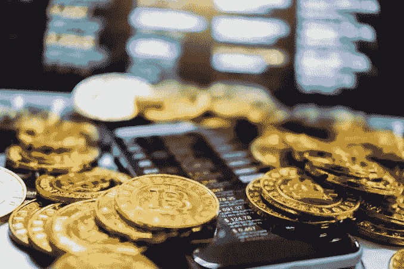

# 加密货币被动赚取的方式

> 原文：<https://medium.com/coinmonks/everything-you-should-know-about-taxes-in-the-united-states-7702c2f08858?source=collection_archive---------28----------------------->

最近很难，不是吗？这种全球性的流行病这次很难真正减少。我确信我们每个人都在寻找网上赚钱的方法，因为朝九晚五的工作只能提供这么多。因此，释放不可抗拒的收入观念。其中一种赚取利润的方式就是加密货币，我们已经听过很多次了。

但是你可能会承认现在加入派对已经太晚了。Nah … [**Crypto**](https://www.bityard.com/account/register?ru=AebNkR&f=Medium) 才刚刚开始。你入党还为时不晚。

如你所知，许多投资者在投资 crypto 时尝试了他们的运气，并设法收集了数十万甚至数百万美元的小额投资。相反，crypto 向他们展示了它的可变性。那些当时加入秘密投资的人是名副其实的不确定，只懂基础。大多数投资者要么错过了正确的时间，要么投资得有点太早。

因此，如果你在早期错过了 crypto，现在赚钱还不算太晚。在这篇作文中，我们将看看一些投资和策略，供新手使用 [**Crypto**](https://www.bityard.com/account/register?ru=AebNkR&f=Medium) 赚取不可抗拒的收入。

# 采矿:

用加密货币产生无抵抗性收入的第一种方法是挖掘密码。 [**挖掘**](https://coinmarketcap.com/alexandria/glossary/mining) 是使用计算机处理能力和算法解决棘手的精细问题并证明交易正确的过程，密码学专家展示了他们验证结果的辛勤工作的证明。这种大规模分散的权力意味着，在网络容量的某些情况下，没有任何一方拥有超过 51%或 49%或更低的份额，这可能会使他们改变交易，破坏或实现自己的主张。

极限加密货币，类似于 [**比特币**](https://www.bityard.com/en-US/trade/spot/BTCUSDT?ru=AebNkR&f=Medium)[**币安币**](https://www.bityard.com/en-US/trade/spot/BTCUSDT?ru=AebNkR&f=Medium)[**卡达诺**](https://www.bityard.com/en-US/trade/spot/ADAUSDT?ru=AebNkR&f=Medium)[**莱特币**](https://www.bityard.com/en-US/trade/spot/LTCUSDT?ru=AebNkR&f=Medium) 等等，还有无数更进一步，有固定的财阀势力或者一定数量的硬币会被发行。由于采矿的矿工人数增加，冲动下降了，获得纪念品的条件增加了。随着比特币变得越来越受欢迎，比特币价格上涨，采矿变得更加有利可图。

# 玩世界上第一个 NFT 在线游戏:

[**MIR4**](https://mir4global.com/) 自 2021 年 8 月 25 日全球上映以来，一直在制作字幕。它允许用户用真实世界的钱购买和兑换德拉科，这一事实激起了人们的兴趣。在 [**MIR4**](https://mir4global.com/) 中，Draco 是一种里程纪念型加密货币。玩家可以在德拉科的帮助下购买游戏中的特效。与其他游戏不同，MIR4 拥有自己的加密货币组合 WEMIX，吸毒者可以用它来存储和交易 Draco。你可以用这个组合包把 WEMIX Token 变成事实上的财阀。

用户还可以通过玩游戏赚取加密货币纪念品，就像其他 NFT 游戏一样，如 Axie Perpetuity 或 Factoryvs。不死生物。MIR4 中的玩家需要通过游戏中的非战斗矿来开采游戏中的货币暗钢。通过冶炼，玄铁可以交易成德拉科里程纪念品。你至少需要玄铁才能拥有 1 德拉科；汇率时刻就是这么重要。尽管如此，随着游戏的进行和黑暗力量被进一步诱杀，熔炼德拉科所需的黑暗力量在增加。

另外，你不需要投资一分钱就可以玩它。它是免费的，可以在手机和电脑上玩。

# 交易、购买和交易

[**加密**](https://www.bityard.com/account/register?ru=AebNkR&f=Medium) 交易是指通过 **CFD** 交易账户或通过类似[**比特币**](https://www.bityard.com/account/register?ru=AebNkR&f=Medium) 的交易所购买并交易初始币的行为。CFD 交易是一种衍生产品，允许你在不保留基础货币的情况下押注加密货币的价格。然而，如果你认为加密货币的价值会攀升，你可以做多或买入。然而，如果你觉得价值会下降，就做空或卖出。

当你在 [**BitYard**](https://www.bityard.com/account/register?ru=AebNkR&f=Medium) 上购买 **crypto** 时，你实际上是在购买硬币。开立一个比特币账户，存入一定数量的稳定币并购买，将 [**密码**](https://www.bityard.com/account/register?ru=AebNkR&f=Medium) 储存在你的钱包里，直到你准备出售。对于杠杆交易，这意味着它们只需缴纳最低保证金，就能获得对基础要求的全部敞口，即保证金。因为你投资的总规模仍然决定着你的盈利或亏损，影响力放大了盈利和亏损。

# 推荐和游戏测试员

许多密码交易所提供免费密码，作为欢迎新成员的额外津贴，以扩大他们的瘾君子基础。它这样做主要是为了吸引用户在它的点上交易。利用这个机会获得免费的纪念品是很时髦的。对于这一个，币安是数百万用户使用的最大的加密交换请求之一，并且是众所周知的时刻。

另外， [**投币游戏**](https://coinhunt.cc/) 是一款简单的策略游戏，如果你喜欢简单的策略游戏，你会喜欢的。关键是要找到打开宝箱的秘密钥匙。如果你设法在他们的游戏中收集到钥匙，你将定期获得免费的密码。此外，用户可以通过完善他们的便当每周赚取高达 20 美元。时髦的是，与其他娱乐场所不同， [**寻币游戏**](https://coinhunt.cc/) 用珍贵的加密货币或纪念品而不是空币来补偿你。

# 高产农业:

[**产农**](/@BitYard/yield-farming-explained-3e9d07fbf409) 是另一种分权财政，或 [DeFi](/bityard/top-10-defi-defi-2-0-tokens-and-projects-in-2022-e752929fed78?source=your_stories_page----------------------------------------) ，赚取不可抵抗的秘密收入的制度。分散交易所的动态操作使这成为可能，分散交易所主要是交易平台，用户依靠智能合约(可编程和音频执行的计算机合约)和投资者的组合来获得执行交易所需的流动性。然后，用户不与经纪人或其他交易商交易。相反，它们交易的是投资者(被称为流动性提供者)存入被称为流动性池的特殊智能合约的资金。反过来，流动性提供者从资金池中收取一定比例的交易费用。

# 贷款:

在加密业务的集中和分散部分，出借已经成为最受欢迎的加密服务之一。作为一名投资者，你可以向借款人推进你的数字手段，以获得赚取利息的机会。

你可以总结出四种主要的贷款策略:

*   [**点对点借贷。**](https://coinmarketcap.com/alexandria/glossary/peer-to-peer-p2p-lending)
*   [**分散放贷。**](https://coinmarketcap.com/alexandria/article/what-is-crypto-lending)
*   [**集中放款。**](https://coinmarketcap.com/alexandria/article/what-is-crypto-lending)
*   ****融资融券。****

**您可能感兴趣的其他文章:**

*   **[**2022 年十大 DeFi & DeFi 2.0 代币及项目**](/bityard/top-10-defi-defi-2-0-tokens-and-projects-in-2022-e752929fed78)**
*   ****

**__________________________**

**比特码交换:[**BitYard.com**](https://www.bityard.com/account/register?ru=AebNkR&f=Medium)**

**客户支持:**Support @ bityard . exchange****

**业务请求:levi@bityard.exchange**

****比特码电报社区****

**BitYard 新闻和事件—[https://t.me/BITYARDNEW](https://t.me/BITYARDNEWS)**

**英语—【https://t.me/BityardEnglish **

**越南语—【https://t.me/BitYardVietNamChat】T4**

**印度尼西亚语—[https://t.me/bityardindonesia](https://t.me/bityardindonesia)**

**菲律宾—[https://t.me/BityardPhilippines](https://t.me/BityardPhilippines)**

****BitYard 官方社交媒体****

**YouTube—[https://www.youtube.com/c/BityardOfficial/](https://www.youtube.com/c/BityardOfficial/)**

**https://www.facebook.com/Bityardofficial 脸书**

**推特—[https://twitter.com/Bityard_Global](https://twitter.com/Bityard_Global)**

**中—[https://medium.com/bityard](https://medium.com/bityard)**

****平台 BitYard 落户****

**coin codex—[https://coincodex.com/exchange/bityard](https://coincodex.com/exchange/bityard)**

**辣椒粉—[https://coinpaprika.com/exchanges/bityard/](https://coinpaprika.com/exchanges/bityard/)**

**神秘冒险—[https://cryptoadventure.com/discover/exchanges](https://cryptoadventure.com/discover/exchanges)**

> ***加入 Coinmonks* [*电报频道*](https://t.me/coincodecap) *和* [*Youtube 频道*](https://www.youtube.com/c/coinmonks/videos) *了解加密交易和投资***

# **另外，阅读**

*   **[Bybit vs 币安](https://coincodecap.com/bybit-binance-moonxbt)|[stealth x 回顾](/coinmonks/stealthex-review-396c67309988) | [Probit 回顾](https://coincodecap.com/probit-review)**
*   **[顶级付费加密货币和区块链课程](https://coincodecap.com/blockchain-courses)**
*   **[CBET 回顾](https://coincodecap.com/cbet-casino-review) | [库科恩 vs 比特币基地](https://coincodecap.com/kucoin-vs-coinbase)**
*   **[如何在加拿大购买加密货币？](https://coincodecap.com/how-to-buy-cryptocurrency-in-canada)**
*   **[无聊猿游艇俱乐部(BAYC)评论](https://coincodecap.com/bored-ape-yacht-club-bayc-review)**
*   **[5 款最佳加密交易终端](https://coincodecap.com/crypto-trading-terminals) | [最佳 DeFi 应用](https://coincodecap.com/best-defi-apps)**
*   **[在美国如何使用 BitMEX？](https://coincodecap.com/use-bitmex-in-usa) | [BitMEX 审查](https://coincodecap.com/bitmex-review)**
*   **[最佳期货交易信号](https://coincodecap.com/futures-trading-signals) | [流动性交易所评论](https://coincodecap.com/liquid-exchange-review)**
*   **[南非的加密交易所](https://coincodecap.com/crypto-exchanges-in-south-africa) | [BitMEX 加密信号](https://coincodecap.com/bitmex-crypto-signals)**
*   **[MoonXBT 副本交易](https://coincodecap.com/moonxbt-copy-trading) | [阿联酋的加密钱包](https://coincodecap.com/crypto-wallets-in-uae)**