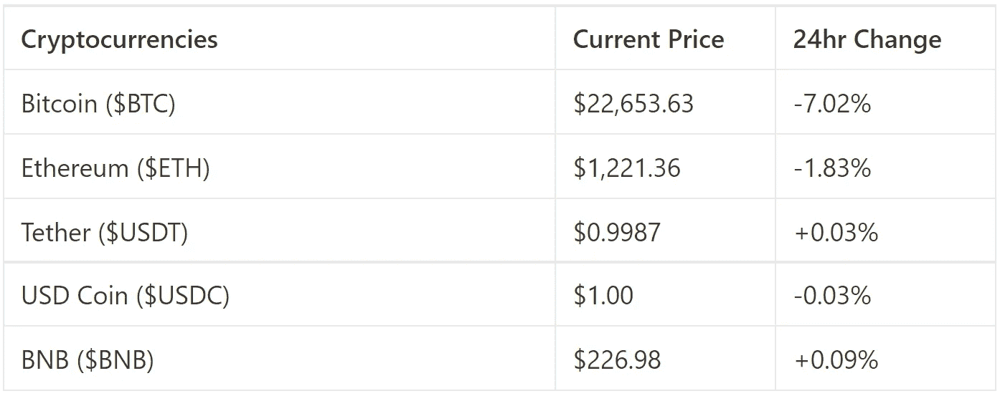
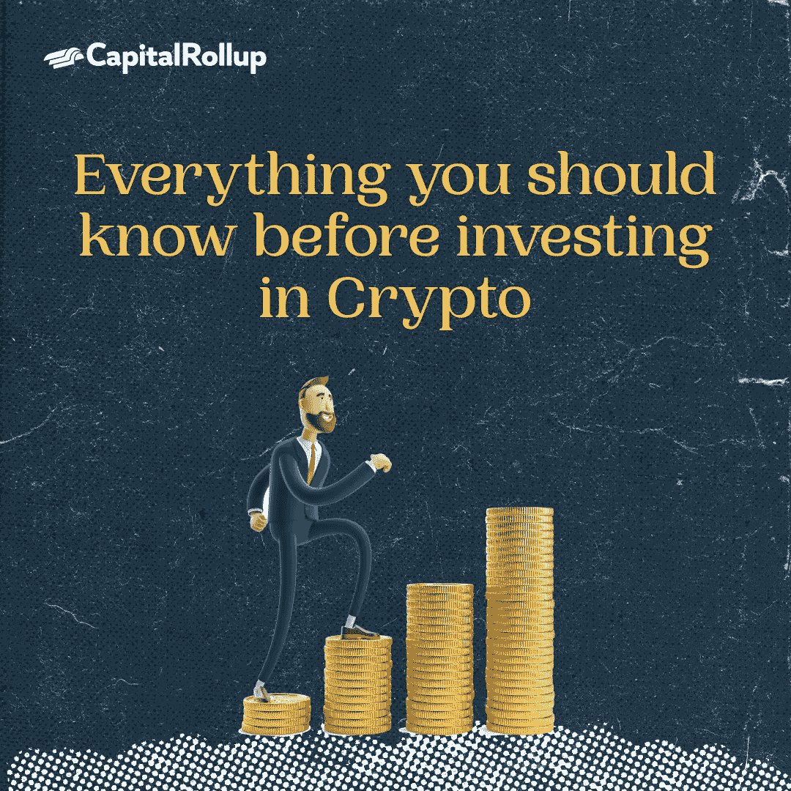

# 投资加密前你应该知道的一切

> 原文：<https://medium.com/coinmonks/everything-you-should-know-before-investing-in-crypto-669181c9fd52?source=collection_archive---------62----------------------->

欢迎来到最新一期的 CapitalRollup Digest！今天的文摘是 6 月 14 日的，大约需要 5 分钟。我们马上开始。

[Market Price Update](https://coinmarketcap.com/all/views/all/)

# **投资加密前你应该知道的一切**

几个月来，加密市场一直不景气，导致更多人减少了对加密资产的投资。目前价格分别为 29，509 美元和 1，749 美元，两大加密资产——比特币和以太坊已经从去年的历史高点下跌了 60%以上。

熊市通常是一个人们害怕承担风险的市场，一般来说，避免做出任何投资决定，因为价格行为是不可预测的，投资资本很容易遭受损失。

然而，从长远来看，熊市有时可能是投资和获得可观财务收益的最佳时机。那么，你如何知道投资加密熊市的正确时机呢？当没人想买资产的时候，你怎么买？

加密投资者经常使用的一个流行分析是“在每个人都害怕的时候买入，在情绪高涨的时候卖出”。这条[推文](https://twitter.com/CryptoNagato/status/1532487862343684104?s=20&t=tTvZk5a08FC0-fwSnUpILw)说你应该“当你妈妈让你给她买密码时获利，当你妈妈说:‘我很高兴你没有给我买密码’时回购”

现实是，没有购买加密资产的合适时机，没有办法保证投资何时会带来令人难以置信的回报，尤其是在熊市。然而，你可以通过确保在购买时做出最佳决定来帮助自己。

当你准备投资的时候，这里有一些提示可以指导你。

1.  在你开始投资之前，坚持一个你愿意损失的数额，然后放手。你可能会失去你所有的投资，所以开始或投资你不会退缩的钱是明智的。
2.  你想投资的资产的平均成本。不要一下子把你所有的投资都投入到资产中，确保你在不同的价位选择较小的规模。这样，如果价格上涨或下跌，你就能建立一个有利可图/安全的中点。
3.  应该买哪些硬币？蓝筹股和其他信念高、基本面强的资产。你应该投资多少？投资适合你的风险和信念的东西。
4.  不要试图在一次交易/购买中挽回所有的损失，如果你在追逐任何轻微的上涨，并寻求之前投资的回报，你可能会损失更多。

加密资产是不稳定的，它们可能很容易失去价值，也可能很容易获利。在投资之前，一定要 DYOR，记住这里写的不是财务建议。

# 琐事🤔

**以下哪一项是开始投资的方式？**

A.购买指数基金的一部分

B.将资金集中到一个由任何人管理的假基金中

C.自己购买原料库存

D.雇佣一个随机的人为你制定一个财务计划

在下一期的 CapitalRollup Digest 中找到答案。😉

最后一个小问题的答案是**B)**埃隆·马斯克

# 每日一词！

💡**街区**

加密货币的交易通过区块链技术完成。交易的细节存储在块中。每个块只能容纳一定数量的细节。

**一个句子中用到的术语:**
*—对于加密货币，你可以把* ***块*** *想象成一箱箱的收据*。

*   **社区更新📢**

我们将很快与 5 个行业领导者组织一个 Twitter 空间会议，在那里我们将讨论加密市场和 web3 上的一切。你可以期待它😎

# 我们今天在读什么📰

**投资加密货币前要知道的 7 件事。** [***阅读更多***](https://www.entrepreneur.com/article/423311)

**如何投资加密货币？** [***阅读更多***](https://money.usnews.com/investing/cryptocurrency/articles/how-to-invest-in-cryptocurrency)

与朋友一起学习和投资加密💰

当您邀请您的朋友开始使用 CapitalRollup 进行有利可图的投资时，您将获得独特的奖励。

💬对 CapitalRollup Digest 有什么反馈吗？ [**告诉我们！**](mailto:hi@capitalrollup.com)

> 加入 Coinmonks [电报频道](https://t.me/coincodecap)和 [Youtube 频道](https://www.youtube.com/c/coinmonks/videos)了解加密交易和投资

# 另外，阅读

*   [OKEx vs KuCoin](https://coincodecap.com/okex-kucoin) | [摄氏替代品](https://coincodecap.com/celsius-alternatives) | [如何购买 VeChain](https://coincodecap.com/buy-vechain)
*   [ProfitFarmers 点评](https://coincodecap.com/profitfarmers-review) | [如何使用 Cornix Trading Bot](https://coincodecap.com/cornix-trading-bot)
*   [如何匿名购买比特币](https://coincodecap.com/buy-bitcoin-anonymously) | [比特币现金钱包](https://coincodecap.com/bitcoin-cash-wallets)
*   [瓦济里克斯 NFT 评论](https://coincodecap.com/wazirx-nft-review)|[Bitsgap vs Pionex](https://coincodecap.com/bitsgap-vs-pionex)|[Tangem 评论](https://coincodecap.com/tangem-wallet-review)
*   [如何使用 Solidity 在以太坊上创建 DApp？](https://coincodecap.com/create-a-dapp-on-ethereum-using-solidity)