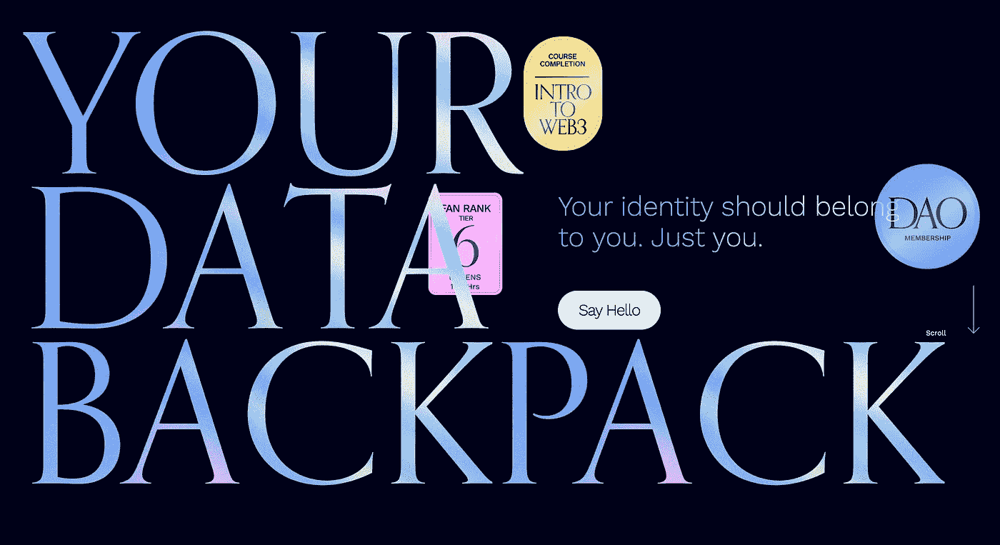
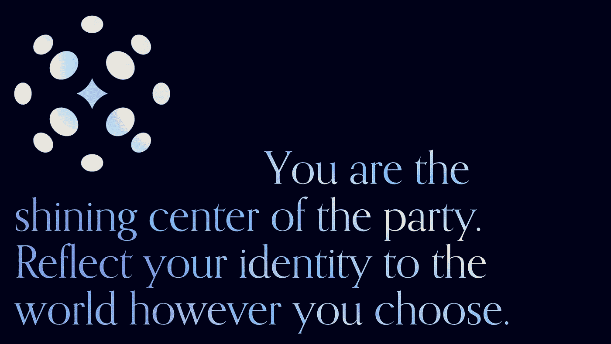
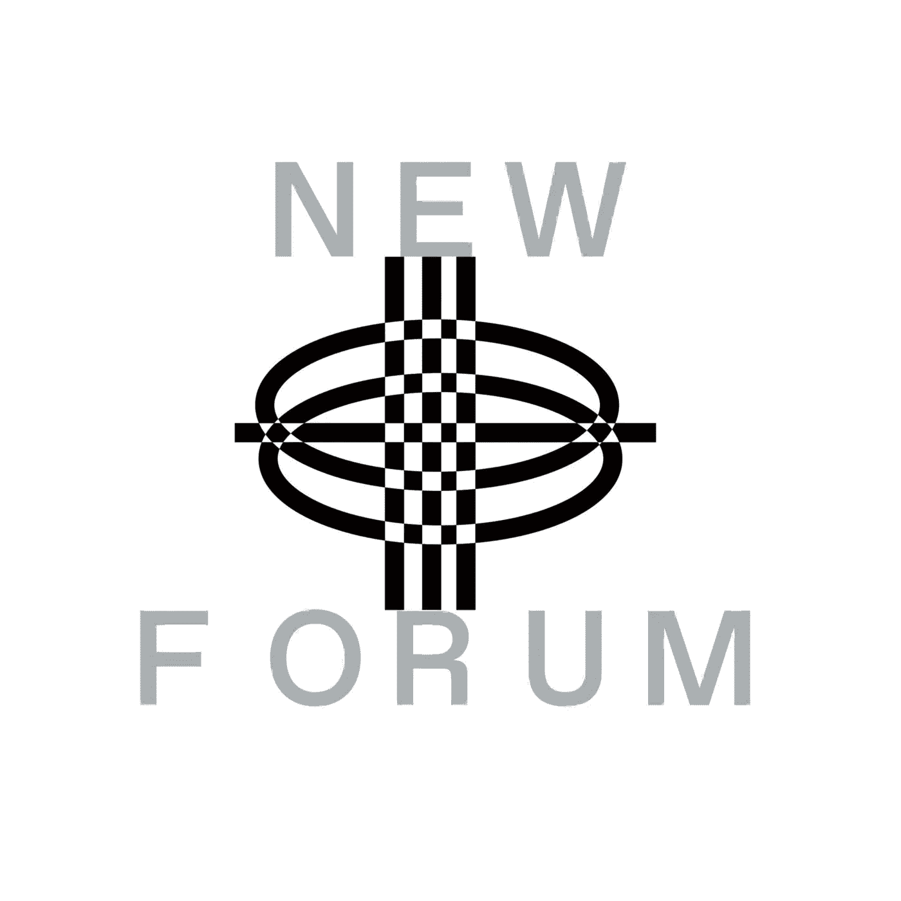

# Disco.xyz 的联合创始人兼首席执行官 Evin McMullen 解释了为什么私人可验证数据将推动元宇宙

> 原文：<https://medium.com/coinmonks/evin-mcmullen-co-founder-and-ceo-at-disco-xyz-1464c54b93c1?source=collection_archive---------4----------------------->

Evin McMullen | Co-Founder & CEO at [Disco.xyz](https://www.disco.xyz/)

我们非常荣幸地向大家介绍迪厅的联合创始人兼首席执行官 Evin McMullen。xyz，到我们的新论坛社区！在本期节目中，Evin 带来了她充满活力和清晰的观点，讨论了在保护元宇宙的数据和资产时密钥的重要性。

另外，在这一集的 NEWFORUM 中，Evin 在 Web3 和 all things Disco 中定义了隐私和同意！

# Evin 的故事是怎样的，她对技术的热情是如何发展的？

> “从我很小的时候起，我就对玩技术、构建技术、探索技术能做什么感到兴奋。当我还是个孩子的时候，那是在 Napster 时代；就在公众可访问的互联网的第一次迭代取得成果时，我了解到文件共享以及围绕数据和知识产权的自由限制……”——Evin

作为一名大学生，她对自由和开源软件感到兴奋；知识共享许可关于数据自由和可访问性的基于知识产权的辩论。艾文解释说，正是在那个时候，她拥有了有史以来绝对最好的计算机科学教授；她解释说，耶鲁大学的一位名叫伊丽莎白·斯塔克的女性，现在是比特币社区令人难以置信的领导者和首席执行官。

> “她向我们介绍了基于技术的创业世界，正是在这个旅程中，我遇到了比特币纸，了解了抗审查网络，因此正是这一系列经历开启了我对可能性的想象；如果人类能够在与周围世界互动的背景下携带或拥有并控制他们的数据，而不是让其他人拥有和控制这些数据，并代表他们管理体验……”——Evin

当归结到 Evins 自己的构建经验时，它在 Web2 和 Web3 团队中有不同的角色。她解释说，有些侧重于硬件，有些侧重于企业软件。她补充说，在整个过程中，她的团队很少在设计过程中优先考虑什么对用户最好。

> “相对于代表一些其他利益或企业利益的主张，什么对用户来说是最令人愉快和消除摩擦的呢……”—Evin

# **那么迪斯科的愿景是在什么时候实现的呢？**

艾文从工作中退了一步。然后，她决定要为每个人做点什么。她曾与令人难以置信的团队一起工作，看到了当他们让数据变得可移植、私有、独立于我们所有时会发生什么。虽然她有这种强烈的愿望，但她没有能力探索这意味着什么——当她如此专注于企业时，为每个人带来一些东西。

今年早些时候，她加入了一些朋友和前同事的队伍，几个新朋友和队友也加入了迪斯科船。

> “我们正在为元宇宙建立你的身份，在迪斯科，我们相信元宇宙的定义是你在任何数字或物理环境中展示的能力，并通过你选择分享的部分获得个性化的体验。”—艾文

# **什么是迪斯科？**

迪斯科给拥有自我主权身份的元宇宙带来乐趣。Disco 使用户能够享受与跨链和 Web2 的公共标识符相关联的细致入微的 web3 声誉，同时维护隐私和用户自主权。

在 disco，他们认为人就像一个 Disco 球或聚会的闪亮中心，应该能够向世界反映他们的数据和身份；人们不应该觉得自己是别人派对的一部分。相反，当人们出现在他们所属的参与空间和社区时，他们应该感到作为一个完整的人已经足够了。

Disco 认为，人们应该负责描述他们的数据，而不是某个随机制作应用程序的人。

她补充说，他们的想象力将他们带到了一个世界，在那里他们可以走进活动，并根据他们在家里的行为获得好处，并证明他们是社区的一部分，并享受在线、在线和亲自体验。

> “因此，当我们建立一个用户之旅，满足用户在他们自己的个人旅程中，不假设你知道什么旅程的第一步，我们希望人们采取；这意味着我们需要利用人们今天拥有的工具和他们今天对元宇宙和 Web3 中的可能性的理解来工作……”—Evin

目前，Disco 为以太坊社区的用户提供服务，这意味着他们手中已经有了以太坊兼容钱包(如 MetaMask)的私钥。一旦他们帮助这些用户成为他们自己的数据从一个应用程序到另一个应用程序的传输层。然后，他们将推出其他基础链，以实现可互操作性，如索拉纳、比特币、EVM 兼容链和其他区块链。

观看 Evin 的完整采访，了解更多有关 Disco 的用户体验以及 Disco 为 Web3 和元宇宙带来的所有创新可能性，包括数据保护、维护隐私、用户自主权以及密钥的重要性！

# **我们如何定义在 Web3 中维护隐私和用户自主权？**

Evin 提到她的团队大量谈论隐私，这就像是一种结束状态；隐私是指你的信息是否被披露给其他人，或者在多大程度上被披露。

然而，Disco 在数据方面的角色更活跃一些。艾文解释说，他们想坐在驾驶座上，这就是为什么她通常谈论同意。

Evin 将同意定义为一个人在处于控制地位时做出的影响其隐私的选择，当他们没有机会提供知情同意时，该隐私如何增加或减少。她补充说，当其他人就如何共享我们的数据做出选择时，我们的隐私可能会改变，但可能不会涉及我们的同意，她认为这是我们在 Web3 中探索的关键。

> “我对我们如何利用私人密钥的超能力来更好地控制我们的数据并在我们知情同意的情况下分享数据感到兴奋，而不是让其他人决定我们可以享受多少隐私，这是我们今天在 Web2 中的地位……”—Evin

# 为什么在元宇宙会有性侵犯的问题？

艾文回答了这个问题，他说，如果我们退一步，重新审视“同意意味着什么”的想法？在她思考的空间里同意；是欢迎互动的肯定邀请。

根据艾文的说法，如果一个人同意拥抱，这意味着他们会欢迎拥抱。如果他们不同意拥抱，那么如果你触摸他们并感到被侵犯，他们会感到厌恶。他们会感到不舒服。她补充说，我们这些拥有肉体的人能够很好地理解同意的概念。我们要么同意这种身体上的互动，要么不同意。

我们必须承认，艾文对同意的定义好得不能再好了。它直截了当地说得通。

> “在数字领域，我认为 Web2 教会了应用程序开发者，应用程序可以全天候访问你的数据。这就是监控资本主义经济的建立方式，但如果我们的数据代表了我们的延伸；描述我们的身体，由我们的身体制造，并为我们的身体所拥有，那么它值得我们给予我们的身体一定程度的同意和考虑。”—艾文

享受这一关于私钥、保护数据隐私和元宇宙资产的内容丰富、条理清晰的讨论。艾文讨论了迪斯科如何展望元宇宙的未来，让我们告诉你，它听起来像是我们都应该致力于看到的理想元宇宙。

她还定义了同意，以及私钥如何让我们更好地控制我们的数据，以及它如何使我们能够在知情同意的情况下共享数据。

最后，她帮助我们的社区理解了 DID 的含义；相当技术性的东西，但艾文很好地分解了它。

[加入社区](https://twitter.com/newforum_nco)了解 [@provenauthority](https://twitter.com/provenauthority) 并发现 web3 社区中的其他创始人和远见者！

✨follow·艾文·麦克马伦& Disco.xyz！✨

推特:[@ proven authority](https://twitter.com/provenauthority)|[@ disco XYZ](https://twitter.com/discoxyz)网址:[disco . XYZ](https://www.disco.xyz/)LinkedIn:[evin-MC Mullen](https://www.linkedin.com/in/evin-mcmullen/)|[disco . XYZ](https://www.linkedin.com/company/disco-xyz/)

#新论坛#网络 3 #隐私问题#社区#区块链#元宇宙

爱 x 新论坛

# Twitter @newforum_nco

不和谐[@加入](https://discord.gg/DHepA4WTkN)

# 新论坛

[NEWFORUM](https://newforum.notion.site/newforum/Welcome-to-NEWFORUM-48f9661398ec4ec6a1af37fcc96dc926) 由 [Newcoin Foundation](https://newcoin.org/) 提供支持，专注于促进分散化社交应用的扩展，也称为 Social 3.0，形成一个生态系统和一个由远见者、创造者和投资者组成的社区。它为思想者提供了一个安全的交流、传播和分享思想的空间，以确保一个新网络的自觉和道德发展，嵌入关怀、自由和创造力的价值观。✨每周新集！在 [Twitter](https://twitter.com/newforum_nco) 、 [Newlife](https://newlife.io/) 、 [Youtube](https://www.youtube.com/channel/UCWvHyau1nIJBffmaaj6FmbQ) 和 [LinkedIn](https://www.linkedin.com/showcase/newforum/) 上关注我们，了解 web3 的更多信息，认识生态系统！加入生态系统[不和](https://discord.gg/DHepA4WTkN)！

> 加入 Coinmonks [电报频道](https://t.me/coincodecap)和 [Youtube 频道](https://www.youtube.com/c/coinmonks/videos)了解加密交易和投资

# 另外，阅读

*   [十大最佳加密货币博客](https://coincodecap.com/best-cryptocurrency-blogs) | [YouHodler 评论](https://coincodecap.com/youhodler-review)
*   [AscendEx 保证金交易](https://coincodecap.com/ascendex-margin-trading) | [Bitfinex 赌注](https://coincodecap.com/bitfinex-staking)
*   [最好的卡达诺钱包](https://coincodecap.com/best-cardano-wallets) | [Bingbon 副本交易](https://coincodecap.com/bingbon-copy-trading)
*   [印度最佳 P2P 加密交易所](https://coincodecap.com/p2p-crypto-exchanges-in-india) | [柴犬钱包](https://coincodecap.com/baby-shiba-inu-wallets)
*   [八大加密附属计划](https://coincodecap.com/crypto-affiliate-programs) | [eToro vs 比特币基地](https://coincodecap.com/etoro-vs-coinbase)
*   [最佳以太坊钱包](https://coincodecap.com/best-ethereum-wallets) | [电报上的加密货币机器人](https://coincodecap.com/telegram-crypto-bots)