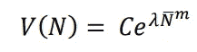
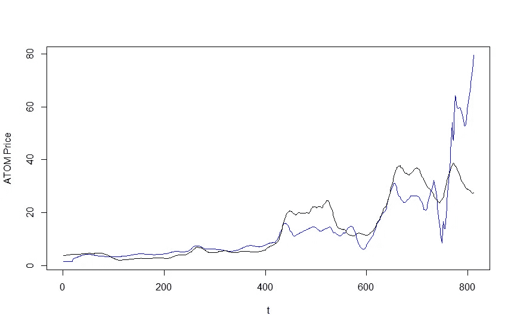
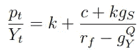
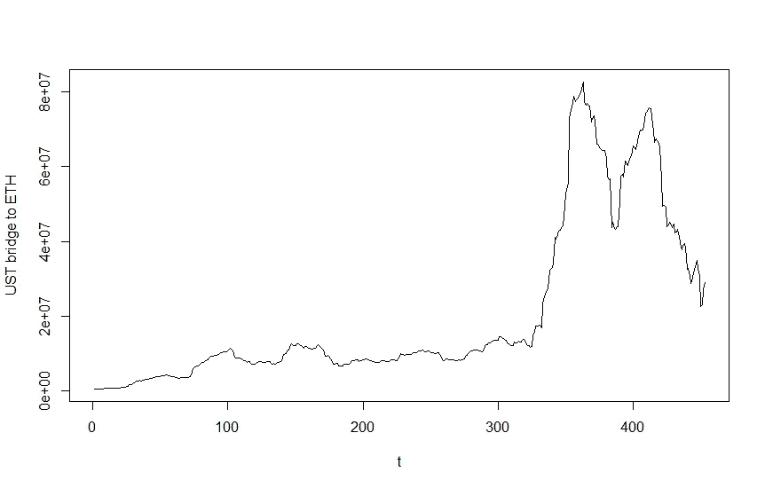

# EVMOS 估值

> 原文：<https://medium.com/coinmonks/evmos-valuation-875e1c355119?source=collection_archive---------1----------------------->

因此，Evmos network 将在几天后推出，尽管$EVMOS token rektdrop 仍需要一些时间。在他们的代币开始交易之前，让我们做一个有趣的练习，并计算出他们在发行时的价值。

Evmos 是一个集成了 EVM 和宇宙的网络，因此得名“Evmos”，它带来了两个最大的区块链平台之间真正的互操作性。目前，如果你想在 Uniswap 上使用$UST，你必须先将你的$UST 连接到以太网。但是随着 Evmos 的出现，您可以简单地访问 Evmos 网络，并通过相同的程序点击您的方式，因为它与两种生态系统都兼容。

那么应该如何给$EVMOS 估值呢？让我们先来看看令牌组学。

$EVMOS 代币供应量上限为 1B，初始供应量为 2 亿，并在 4 年内实行通货膨胀货币政策。'

令牌用于收费、投票、注册 ERC20 令牌、决定激励排放等。；尽管$EVMOS 与其他 L1 解决方案(如激励性排放票和 dAPP 商店)有一些独特的属性，但它仍然是一个 L1 令牌，应该相应地进行估值。

我将实现两个基本的估价模型:Viswanath 等人的 PoS 模型和 Alabi 的网络模型。

**网络模型**

这个网络模型有一个直接的含义——如果网络中的人越多，区块链网络就越有价值。

The Network Model, V(N) = value of the network, N = number of daily active addresses, other variables are just parameters

我在我的[过去](/@xmegaz/the-fundamental-valuation-framework-for-cryptoassets-part-1-5-luna-ca5f21e14664) [分析](/@xmegaz/the-fundamental-valuation-framework-for-cryptoassets-part-1-edee9e1f6938)中使用了这个模型，所以如果你想了解更多关于这个模型的内容，请参考链接。

因为$EVMOS 还没有发布，所以我无法拟合市值(MC)和活动地址(N)的参数；相反，我将找到宇宙生态系统的参数，或$ATOM，并使用该模型作为代理来评估$EVMOS。

black = $ATOM price (actual), blue = model price

用 20 日均线计算参数，我们得到上图。这些参数是:

c =-0.0590
λ= 0.0033
m = 3.0975，

现在我们只需要对 Evmos 链上的日活跃用户的估计，就可以得到 MC 值。

我们通常使用 netoid 函数来估计每日活跃用户数，但是我们同样没有$EVMOS 的历史数据。在做任何假设之前，让我们看看每个 L1&L2 连锁店的每日活跃用户。

宇宙原子= 27K
Terra = 30K
以太坊= 190K
Fantom = 14K
雪崩= 21K
多边形= 68K
乐观= 1K
仲裁= 3K
*(source = Nansen . ai)*

我已经包括了 L2 链，因为我认为在其他链上部署以太坊合同本质上类似于 L2。也许不会，但我们需要一个起点。

我以 3K 的身份在 Evmos 生态系统上决定了活动地址——它将从 EVM 链和宇宙链吸取需求，EVM 链不仅包括$ETH，还包括$FTM、$AVAX、...；因此，我相信 Evmos 网络的流量肯定会超过$ETH L2 解决方案，但让我们保守一点，使用 Arbitrium 的 3K。

应用 3K 有效地址的模型(或插入 N = 3K ),除以 1B 的总供应量，我们有

1 美元 EVMOS = 2.20 美元

作为我们的起始值。

如果$EVMOS 能抓住 2 万活跃用户(~ $AVAX)，它可能增长到

1 美元埃夫莫斯= 15.66 美元

**何 PoS 型号**

The PoS Model

*模型参数*

*Pt : token value(以美元计)
Yt : total tx(以美元计)
k:消费者持有量，速度的倒数
c:税率
gs:通胀赌注报酬率
rf:无风险率
gyQ:交易增长(风险中性 tx 增长率)*

PoS 模型有更多的参数，但是它们更容易计算参数。对于这些变量，我们不必使用历史数据和统计工具来拟合它们，我们可以简单地用算术方法计算它们。

新铸造的代币的 40%归赌注者所有，如果我们假设 50%的代币被下注，则每年的赌注报酬率应为

*GS*= 200 米* 40% / (1B * 50%) = 16%。

当然，上面的公式是极其错误的，因为 1) $EVMOS 有一个供应上限，2)通货膨胀赌注奖励随着时间的推移而减少，3)没有考虑到在起源的循环供应，等等。，但这些错误是有意保持模型的简化。

对于其他变量，我们有一些任意的数字:

*1/k*= 1/4*= $ ETH velocity*
*c*= 0.002%*= $ LUNA 税率*
*GS*= 16%
*RF*= 17.8%*=锚定存款利率*
*gyQ*= 2%*=随机选择【随机选择】*

这里最重要的变量是 *Yt* ，即以美元计量的交易量。我的意思是，几乎不可能估算一个甚至还没有启动的网络的 tx 量，所以我们只能求助于糟糕的代理。

下面是连接以太网的$UST 体积桥。

$UST bridged to $ETH, 30d MA

桥接量在 11 月和 1 月上升了两次，尽管出于不同的原因，但由于$MIM，此后一直在下降。最近的交易额约为 4000 万美元，让我们假设约 30%的 UST 交易额是通过 Evmos 网络进行的。

然后我们有总 tx

Yt = 1500 万美元，我们有所有的参数。

我们有

1 美元 EVMOS = 2.76 美元

当然，$UST 桥并不是发生在$EVMOS 上的唯一集成，因此，如果$EVMOS 的日交易量为 1 亿美元，那么

1 美元埃夫莫斯= 18.41 美元

综上所述，$EVMOS 的型号价格为

1 美元 EVMOS =短期 2.20 美元~ 2.76 美元

1 $EVMOS =中期 15.66 ~ 18.41 美元。

这些模型已经被许许多多没有根据的假设污染了，所以请对这些数字持保留态度。

无论如何，EVM-IBC 的整合是我们真正想要的真正的互操作性和区块链的真正的区块链，我真的很期待看到 EVMOS 生态系统玩这个游戏。

> 加入 Coinmonks [电报频道](https://t.me/coincodecap)和 [Youtube 频道](https://www.youtube.com/c/coinmonks/videos)了解加密交易和投资

# 另外，阅读

*   [3 商业评论](/coinmonks/3commas-review-an-excellent-crypto-trading-bot-2020-1313a58bec92) | [Pionex 评论](https://coincodecap.com/pionex-review-exchange-with-crypto-trading-bot) | [Coinrule 评论](/coinmonks/coinrule-review-2021-a-beginner-friendly-crypto-trading-bot-daf0504848ba)
*   [莱杰 vs n rave](/coinmonks/ledger-vs-ngrave-zero-7e40f0c1d694)|[莱杰 nano s vs x](/coinmonks/ledger-nano-s-vs-x-battery-hardware-price-storage-59a6663fe3b0) | [币安评论](/coinmonks/binance-review-ee10d3bf3b6e)
*   [Bybit Exchange 审查](/coinmonks/bybit-exchange-review-dbd570019b71) | [Bityard 审查](https://coincodecap.com/bityard-reivew) | [Jet-Bot 审查](https://coincodecap.com/jet-bot-review)
*   [3 commas vs crypto hopper](/coinmonks/3commas-vs-pionex-vs-cryptohopper-best-crypto-bot-6a98d2baa203)|[赚取加密利息](/coinmonks/earn-crypto-interest-b10b810fdda3)
*   最好的比特币[硬件钱包](/coinmonks/hardware-wallets-dfa1211730c6) | [BitBox02 回顾](/coinmonks/bitbox02-review-your-swiss-bitcoin-hardware-wallet-c36c88fff29)
*   [BlockFi vs 摄氏度](/coinmonks/blockfi-vs-celsius-vs-hodlnaut-8a1cc8c26630) | [Hodlnaut 审核](/coinmonks/hodlnaut-review-best-way-to-hodl-is-to-earn-interest-on-your-bitcoin-6658a8c19edf) | [KuCoin 审核](https://coincodecap.com/kucoin-review)
*   [Bitsgap 评审](/coinmonks/bitsgap-review-a-crypto-trading-bot-that-makes-easy-money-a5d88a336df2) | [Quadency 评审](/coinmonks/quadency-review-a-crypto-trading-automation-platform-3068eaa374e1) | [Bitbns 评审](/coinmonks/bitbns-review-38256a07e161)
*   [加密复制交易平台](/coinmonks/top-10-crypto-copy-trading-platforms-for-beginners-d0c37c7d698c) | [Coinmama 审核](/coinmonks/coinmama-review-ace5641bde6e)
*   [印度的加密交易所](/coinmonks/bitcoin-exchange-in-india-7f1fe79715c9) | [比特币储蓄账户](/coinmonks/bitcoin-savings-account-e65b13f92451)