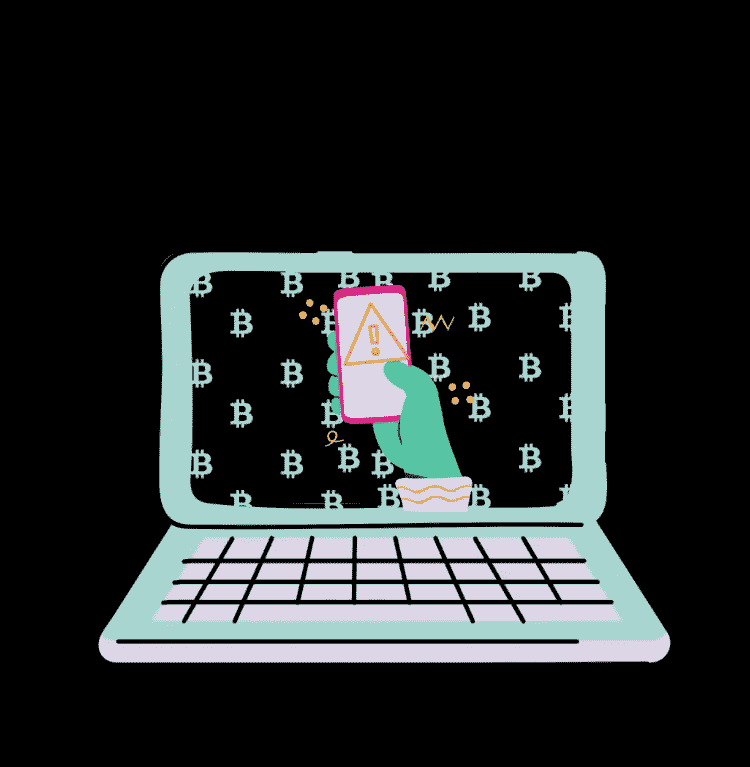
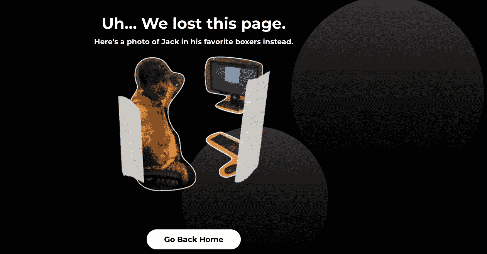

# 卓越的用户体验有助于比特币创新

> 原文：<https://medium.com/coinmonks/exceptional-user-experience-helps-bitcoin-innovation-f6e47bc06362?source=collection_archive---------62----------------------->

**作者:道杜·阿曼塔纳**

建立良好的用户体验并不容易，而且非常困难。我相信知识是我们如何衡量我们是谁，我们做什么，以及我们作为人类在互联网上想去哪里。比特币的采用没有什么不同；这个协议将如何在一个充斥着 Altcoins、Web3 和 NFTs 的 3 秒世界中脱颖而出？多年来，杰出的产品或服务未能成功，因为他们不知道如何有效地谈论他们所做的事情，或者在与产品互动时给用户带来平淡的体验。

数字和社交媒体已经将我们的世界重塑成一个微关注的世界。[北海巨妖](https://www.kraken.com/en-us/)、 [OpenNode](https://www.opennode.com/) 、 [CoinCorner](https://www.coincorner.com/) 或 [Strike](https://strike.me/) 有几秒钟的时间抓住用户的注意力，并保持足够长的时间以获得终身客户。这篇文章不是要抨击任何比特币公司或列举用户体验缺陷；相反，如果我们想成功地推动比特币的认知和增长，我将强调快速、高效和持续吸引观众的经验。比特币的创新水平仍处于早期阶段，我们目睹的所有这些创新只是其潜力的冰山一角。

## 掌握脱颖而出的艺术

作为一名寻求购买、出售或存储比特币的客户，加密货币组织将把你拉到多个方向，以找到满足你需求的最佳公司。掌握脱颖而出的艺术对用户体验至关重要，比特币基地就是一家在喧嚣中杀出一条血路的公司。它是加密货币投资者的首选交易所，拥有大量的加密货币，并且易于使用。该应用程序的一个突出特点是能够通过比特币基地赚取学习加密货币投资的免费比特币。

该公司在 2022 年超级碗期间推出了一则广告，“少说话，多比特币”。用户体验是书籍中的一个，它因其独特性而脱颖而出。基于经典的微软屏保 meme，它看到一个图像在屏幕上移动并从角落反弹。图像是一个二维码，向新注册用户提供价值 15 美元的免费比特币，观众可以扫描并被重定向到该公司的网站。

据 SportsProMedia.com 称，全球有 1.35 亿到 1.4 亿人观看了这场比赛；比特币基地网站无法满足需求，在广告播出后崩溃。一些人认为崩溃是一种烦恼或带宽不足。尽管如此，我认为这是一个天才的用户体验举措，现在已经因比特币基地和比特币的采用而载入史册。

## 讲故事和创新

Strike 的首席执行官杰克·马勒斯(Jack Mallers)登上了 2022 年比特币大会的舞台。他走上舞台，与观众一起讲述比特币将改变世界的创新故事。Strike 与全球最大的 PoS 提供商合作，支持使用比特币进行主权支付。这一举措让数百万使用 CashApp、Shopify、NCR 和 Blackhawk Network access 的人立即参与到一个联系更加紧密的比特币金融世界中。

该公告是商家与比特币网络互动能力和用户在美国各地私下购买能力的一项重大创新。现在，他们将能够利用比特币的廉价、即时和开放。让用户满意会让你的产品有需求，而这种需求会让比特币成为世界上第一大数字资产。

在创业公司中，东西总是会坏掉。当涉及到通过不受阻碍交易流程的中介或机构控制的支付轨道即时发送和接收资金时，创新是用户体验的游戏名称。如果这种体验是蹩脚的或无效的，Strike 这样的公司将失去说服用户购买其产品的动力。但是，对杰克来说，情况并非如此。马勒已经掌握了讲故事和创新改变世界的产品的能力，不需要在家里穿着拳击短裤就能完成。

正如创造了术语 UX 的雅各布·尼尔森所定义的，“用户体验是当一个人使用或预期使用一个产品、功能或服务时的情感反应。”无论是流行语还是移动应用用户界面上的碎页，用户体验都是浩瀚的。加密货币公司正通过在技术领域前所未有的规模上立足和创新，将这种体验提升到一个新的水平。

## **喜欢你刚刚读到的吗？请打碎👏如果你喜欢这个故事，请点击下面的按钮帮助其他人找到它！欢迎在下方留言评论。**

**如果你喜欢阅读这样的故事，并且想支持我成为一名作家，可以考虑** [**报名成为一名媒介会员**](https://dawdu.medium.com/membership) **。每月 5 美元，你可以无限制地阅读媒体上的故事。如果你** [**用我的**](https://dawdu.medium.com/membership) **链接注册，我会赚一小笔佣金。**

**关于作者**

Dawdu M. Amantanah 是一名技术密码作家，也是《比特币》杂志和《BlackBitcoinBillionaire》的特约编辑。他对加密货币、经济学、激进的企业家精神以及当时他认为有吸引力的任何东西都充满热情。

> 加入 Coinmonks [电报频道](https://t.me/coincodecap)和 [Youtube 频道](https://www.youtube.com/c/coinmonks/videos)了解加密交易和投资

# 另外，阅读

*   [SmithBot 评论](https://coincodecap.com/smithbot-review) | [4 款最佳免费开源交易机器人](https://coincodecap.com/free-open-source-trading-bots)
*   [比特币基地僵尸程序](/coinmonks/coinbase-bots-ac6359e897f3) | [AscendEX 审查](/coinmonks/ascendex-review-53e829cf75fa) | [OKEx 交易僵尸程序](/coinmonks/okex-trading-bots-234920f61e60)
*   [如何在印度购买比特币？](/coinmonks/buy-bitcoin-in-india-feb50ddfef94) | [瓦济克斯审查](/coinmonks/wazirx-review-5c811b074f5b)
*   [隐料斗替代品](/coinmonks/cryptohopper-alternatives-d67287b16d27) | [HitBTC 审查](/coinmonks/hitbtc-review-c5143c5d53c2)
*   [CBET 评论](https://coincodecap.com/cbet-casino-review) | [库科恩 vs 比特币基地](https://coincodecap.com/kucoin-vs-coinbase)
*   [折叠 App 审核](https://coincodecap.com/fold-app-review) | [Kucoin 交易机器人](/coinmonks/kucoin-trading-bot-automate-your-trades-8cf0ca2138e0) | [Probit 审核](https://coincodecap.com/probit-review)
*   [如何匿名购买比特币](https://coincodecap.com/buy-bitcoin-anonymously) | [比特币现金钱包](https://coincodecap.com/bitcoin-cash-wallets)