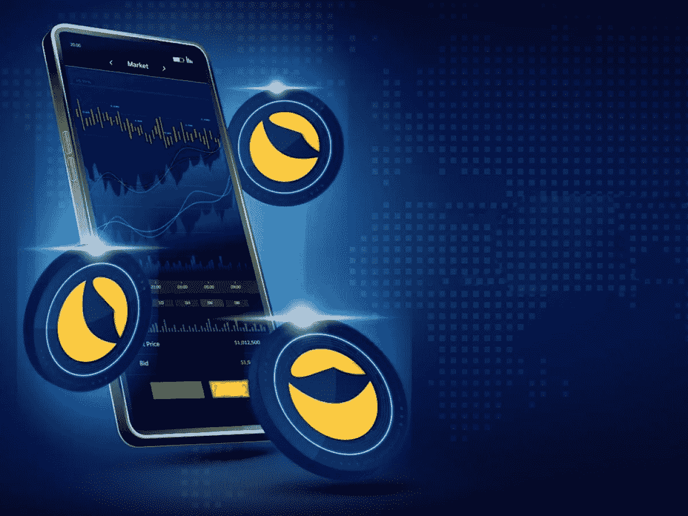

# 交易所通过空投、上市、回购和焚烧支持“Terra 2.0 复兴计划”

> 原文：<https://medium.com/coinmonks/exchanges-back-terra-2-0-revival-plan-via-airdrops-listing-buyback-and-burning-fa7c11790d4f?source=collection_archive---------51----------------------->

MEXC Global 已承诺进行为期一个月的回购和焚烧，以减少旧 Terra 市场的流通供应。

Terra (LUNA)的垮台震动了整个加密市场。然而，该项目没有计划停留下来，因为该项目获得了密码交易所的支持，以帮助其重建。

在周四的一份声明中，Terra 提供了在其新区块链 Terra 2.0 中空投新本地令牌的细节。代币的分发将于 2022 年 5 月 27 日进行，符合条件的 Terra Luna Classic (LUNC)、TerraUSD Classic (USTC)和 Anchor Protocol UST (aUST)的持有者将收到新代币。

币安和 FTX 指出，他们正在与 Terra 团队就即将到来的空投紧密合作。根据币安的说法，他们的目标是通过帮助 Terra 的恢复计划来帮助他们平台内受影响的用户。

另一方面，FTX 宣布将支持空投，并在迁移期间暂时停止卢纳和 UST 市场。除了币安和 FTX，Terra 团队表示，他们还与更多支持空投的合作伙伴密切合作。

除了空投之外，许多交易所，如 KuCoin，也表示支持 Terra 2.0，支持在其加密交易平台内迁移、上市和交易新的 Terra 令牌。

尽管一些人表示支持，但并非所有交易所都渴望上市新代币。在一份声明中，加密交易所 BitMEX 的发言人告诉 Cointelegraph，目前没有计划上市新的 Terra 令牌。

> *“我们根据多种因素列出现货交易的代币，包括我们对特定代币的托管解决方案。因此，我们在现阶段没有计划将露娜列为 Spot。”*

至于衍生品合约，该发言人表示，该交易所需要确保有一个“可靠的参考指数”，才能考虑新 LUNA token 的合约。

尽管 Terra 创始人 Do Kwon 反对烧毁 LUNA 的流通供应，但加密交易平台 MEXC Global 的用户投票决定在 Terra 的二级市场上发起回购和焚烧。利用从其平台内新的 LUNA/USDT 现货交易对中收取的交易费，MEXC 承诺进行为期一个月的回购和燃烧过程。

> 加入 Coinmonks [电报频道](https://t.me/coincodecap)和 [Youtube 频道](https://www.youtube.com/c/coinmonks/videos)了解加密交易和投资

# 另外，阅读

*   [Bookmap 点评](https://coincodecap.com/bookmap-review-2021-best-trading-software) | [美国 5 大最佳加密交易所](https://coincodecap.com/crypto-exchange-usa)
*   最佳加密[硬件钱包](/coinmonks/hardware-wallets-dfa1211730c6) | [Bitbns 评论](/coinmonks/bitbns-review-38256a07e161)
*   [新加坡十大最佳加密交易所](https://coincodecap.com/crypto-exchange-in-singapore) | [购买 AXS](https://coincodecap.com/buy-axs-token)
*   [红狗赌场评论](https://coincodecap.com/red-dog-casino-review) | [Swyftx 评论](https://coincodecap.com/swyftx-review) | [CoinGate 评论](https://coincodecap.com/coingate-review)
*   [投资印度的最佳密码](https://coincodecap.com/best-crypto-to-invest-in-india-in-2021)|[WazirX P2P](https://coincodecap.com/wazirx-p2p)|[Hi Dollar Review](https://coincodecap.com/hi-dollar-review)
*   [加拿大最佳加密交易机器人](https://coincodecap.com/5-best-crypto-trading-bots-in-canada) | [库币评论](https://coincodecap.com/kucoin-review)
*   [用于 Huobi 的加密交易信号](https://coincodecap.com/huobi-crypto-trading-signals) | [HitBTC 审查](/coinmonks/hitbtc-review-c5143c5d53c2)