# 离开舒适区——进入元宇宙！

> 原文：<https://medium.com/coinmonks/exit-the-comfort-zone-enter-the-metaverse-8f8e9a10bc0?source=collection_archive---------21----------------------->

我的元宇宙之旅始于 2021 年 12 月 4 日，一个令人昏昏欲睡的周六下午，在决定最终辞掉朝九晚五的工作后，我在 LinkedIn 上看到了一篇文章，作者是 [Cathy Hackl](https://www.linkedin.com/in/cathyhackl/) 、*、【元宇宙教母】、*，讨论了 2021 年末最热门话题的第一个综合课程(NFTs、数字土地、令牌化等)。)由该领域的*最佳专家*以及 [EveryRealm](https://everyrealm.com/) (前身为 RepublicRealm)领导。

我马上决定申请这份工作。

当然，你会认为我是个十足的傻瓜。

反正这只是个起点。

今天，我将与你们分享我对这次新的元宇宙冒险感兴趣的见解和数据:你们将通过一位年轻工程师的视角与我一起上船，这位工程师在跨国公司工作了 5 年，工资稳定且未定，爱上了区块链技术及其核心价值观和范式，并最终带着企业家的好奇心走向了新的未知之路。

系好安全带，因为我们就要进入元宇宙了！

# 介绍

术语“M **etaverse** ”成为 2021 年最流行的术语之一，特别是在脸书透露了他们的元改造(及其建立自己的元宇宙的目标)之后。我们已经在帮助大量的新企业，他们试图进入这个领域，乘着“浪潮”，声称要在元宇宙/web3 中运行或构建任何东西。

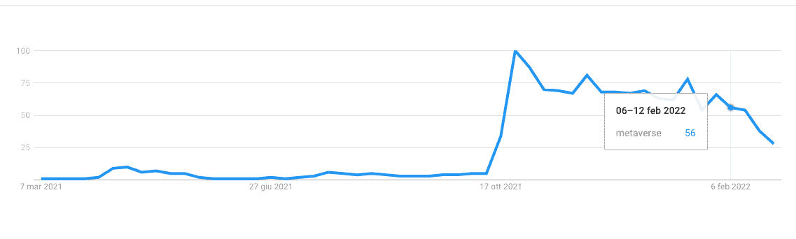

Google Trends — “Metaverse” — 3rd March 2022

看看 Google Trends，当你缩小来看这个词是如何在 10 月底达到令人印象深刻的峰值时，这一点尤其明显。

*在继续阅读之前，请在 Twitter 上关注我们，我们在那里发布对某些我们认为有趣的加密项目的分析和有趣的见解，比如这个。* [*@道辛*](https://twitter.com/daolectic)

如果谷歌趋势还不够，看看下面这张信息图:

网站“ [BusinessOfApps](https://www.businessofapps.com/news/rise-in-number-of-apps-adding-metaverse-to-their-description/) ”报道称，2022 年 1 月，有 27 个应用程序在其名称或描述中添加了“元宇宙”一词，比 2021 年 10 月更名的 11 个应用程序增加了 145%以上。在 2021 年 10 月底举行的脸书连接活动期间，脸书介绍了它的新名字以及它的下一个未来努力。脸书的新名字 Meta 不仅仅是一次品牌重塑，它代表了该公司重新强调以元宇宙的形式创造身临其境的体验。

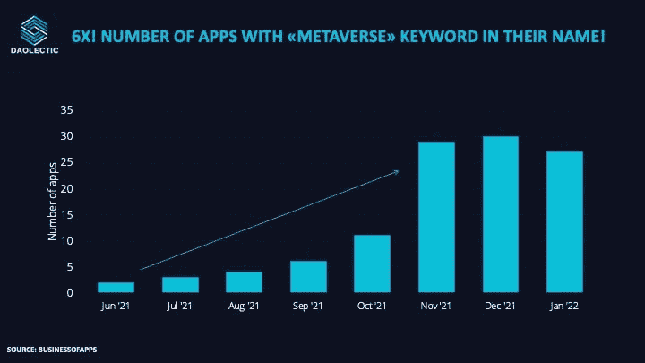

Number of mobile apps with Metaverse in the name

因此，本文的目的是透过市场噪音，准确描述元宇宙是什么，它是如何运作的，以及它的主要组成部分是什么。

在这个阶段，为了恰当地引入这个话题，有必要引用 ***马修·鲍尔*** 的话，他可能是在元宇宙工作的最有影响力的风投之一，他认为元宇宙是“[移动互联网的准继承者](https://www.matthewball.vc/all/forwardtothemetaverseprimer)”，因为它将反复改变互联网，而不是取代它。

*为什么桌子上有这样的异象？*

*哪些元素应该被认为是一个完整的概述？*

在进入调查的基本论文之前，有必要彻底了解与元宇宙概念相关的某些基本概念。

> ***网络出现在三个时代:***

**Web 1.0**(20 世纪 80 年代至 21 世纪初):互联网服务基于开放协议，如 TCP、IP、SMTP 和 HTTP(即互联网依赖于许多协议才能正常运行)。协议基本上是网络上两点之间连接、通信和传输数据的一组规则。

这为互联网环境的发展奠定了稳定、公平的基础。许多最大的在线网站都是在这个革新时期建立的。

**Web 2.0** 从 2000 年代中期到现在，企业在互联网的开放协议之上开发了第二层专有的封闭协议。这是一个集中化的时代，因为盈利性技术公司——最著名的是谷歌、苹果、脸书和亚马逊——已经迅速超越了开放协议的能力。例如，简单邮件传输协议(SMTP)是电子邮件的开放标准。虽然谷歌拥有 Gmail，微软拥有 Outlook，但没有一家公司控制着电子邮件的技术。

然而，在许多情况下，这些封闭的协议并不是技术提供商的根本业务:消费者并不向谷歌支付使用 Gmail 的费用；相反，Gmail 为谷歌的核心业务数据收集和广告收入做出了贡献。这是 Web 2.0 的世界。俗话说，“如果你不付钱，你就不是顾客，你是最终产品。”

Web 3.0(今天/不久的将来):Web 的最新版本，在这个版本中，社区被奖励和激励去维护和改善基础设施。Web3 与去中心化哲学相关，它寻求将权力放在社区而不是公司手中。

事实上，在 Web2.0 的现有现状下，网络所有者对谁获得网络访问权、收入如何分配、提供什么服务以及用户数据如何保护等关键问题拥有单方面的控制权。这使得企业家、艺术家和其他组织更难扩大他们的在线存在，因为他们必须担心集中式平台改变规则，窃取他们的观众或收入。

另一方面，分散意味着数据可能同时保存在许多地方。理想情况下，这将化解脸书(现为 Meta)和谷歌等互联网巨头现在维护的庞大数据集，防止它们通过更多的用户控制而过度丰富。

虽然分散的网络似乎是公共商品，但如果没有一个中央组织来做出选择和获取利益，它们的维护和发展就很难得到激励。加密货币有助于解决这个问题，它让人们更容易一起工作，而不必相互依赖，同时也为人们的贡献提供金钱。

***分散应用***

分散式应用程序或“dApps”是用智能合约语言编写的计算机程序(有时统称为“协议”)。

分散式应用程序与传统应用程序的区别是什么？

*   它们是**不可逆的**:dapp 将在托管协议的区块链期间持续存在，并且不能被恶意方更改或操纵。
*   **开放**:指的是任何计算机都可以加入网络，并且访问不限于特定的或预先定义的组。
*   点对点数字交易通过支付区块链实现。在比特币发明之前，数字支付依赖于银行和信用卡公司等集中的记录保管人。

***创造者的经济——NFT***

创作者经济是一个概念，指的是不断增长的创作者社区——艺术家、表演者和游戏开发者——他们直接与粉丝沟通，无需中间媒介就能互动，使他们能够建立自我维持的收入流。

可替代性是指一件商品的不可区分性和可互换性。例如，一美元纸币可以与任何其他一美元纸币互换。

艺术品、收藏品和房地产等独特产品的无形性是一种财产。

> 不可替代令牌(NFT)是一种不可替代的数字资产，因其独特性而增值。例如，NFT 可能代表一件独一无二的数字艺术品。

当有人获得了 NFT，它就获得了对它的完全控制。NFT 最初用于数字艺术、游戏、体育纪念品和收藏品。

NFT 为艺术家提供了新的收入来源，绕过了传统的把关人，让粉丝直接关注他们的成功。

这似乎是一个双赢的局面:

*   创作者不需要中间人(例如，过去在收取提成或费用的画廊出售作品的艺术家)
*   粉丝:他们获得他们支持的艺术家和创作者的所有权。

此外，NFT 还有一个明显的优势，那就是可以通过区块链技术进行追踪，允许艺术家从二次购买中赚取佣金(创作者>第一买家>第二买家)。

另一个可以使用 NFT 的领域是区块链博彩业。

基于区块链技术开发的游戏被称为基于区块链的游戏。与堡垒之夜、Roblox 或《我的世界》等流行游戏的一个重要区别是，这些游戏可能有真正的经济(没有欺诈的机会)，玩家真正拥有他们辛辛苦苦赚来的物品。

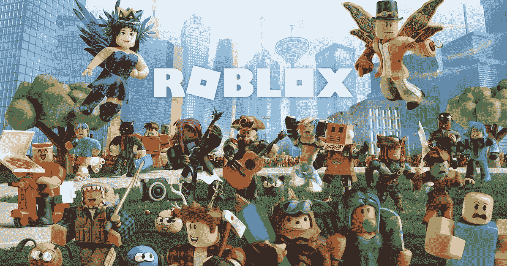

Roblox

区块链电子游戏中的物品——如工具、皮肤、升级、头像和经验值——是玩家拥有的非功能性物品，可以在现实世界中兑换货币，在二级市场上交易，以及在游戏间移动。此外，区块链博彩公司帮助创建了“玩到赚”模式(例如 Axie Infinity)。

在这篇文章的后面，我们将对区块链游戏有一个大致的了解。

***道斯***

Dao，即分散自治组织，是由成员拥有的在线社区，由共识而非集中领导来统治。Dao 是基于开放和包容原则的新型组织的新兴治理模式。

*   分散的:没有一个人或集中的实体有能力修改规则。
*   自主:没有人工干预，投票被收集，并根据智能合同中编码的逻辑做出判断。
*   组织:在分散的利益相关者社区中作为行动中心的组织。

Dao 是一种典型的“链上治理”实行传统公司治理的公司有具体规定特定规则的程序，例如如何选择董事会。

相反，DAO 中的公司治理规则嵌入在智能合约中(智能合约是在区块链网络上运行的永久性计算机程序)。智能合同与法律合同一样，都是义务，但它们是用自动自主运行的计算机代码来表达的。)

***DeFi***

DeFi 术语“分散金融”是指分散的金融应用，如储蓄、借贷和交换。

DeFi 改变消费金融的后端。DeFi 应用程序可以被视为新的管道和轨道，更易于使用、访问、审计、更新和扩展；这导致了金融包容性的提高:金融参与现在变得更加负担得起和容易获得。

所有这些听起来真的很强大，不是吗？

你现在处在正确的位置，可以更进一步。

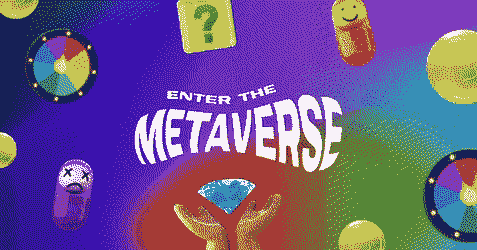

# 元宇宙

这就把我们带到了考试的关键。

首先，让我们从马修·鲍尔在其《元宇宙初级读本》中给出的定义开始:

> *《元宇宙》是一部******可互操作的网络实时渲染 3D 虚拟世界*** *其中可以同步体验******持久体验*** *通过一个* ***有效无限数量的用户*******

**在第一课中，EveryRealm 的首席执行官 Janine Yorio 用三个关键词介绍了这个术语:**

1.  *****身临其境*****
2.  *****互动*****
3.  *****社会*****

****身临其境**因为它允许用户通过从二维移动到三维虚拟世界来体验“立体”设置和内容，由增强现实(AR)、虚拟现实(VR)和加密货币实现。**

****互动**和**社交**因为它支持用户之间的虚拟互动:它是一个由链接的体验和服务、设备和项目、资源和基础设施组成的网络。**

**它在财富、社交、生产力、商业和娱乐方面(互联网+区块链+ AR/VR)为我们的数字生活和物理生活带来了更无缝的集成。**

***总之……增强现实和虚拟现实到底是什么？！***

**AR 和 VR 是进入元宇宙所必需的硬件的一部分，还有电话和触觉手套(所谓的面向消费者的设备)。**

*   **增强现实是一个术语，指的是在各种情况下使用增强现实:AR 可以通过使用移动设备或 AR 耳机上的摄像头将现实生活与叠加的图像或动画相结合，以向当前存在的自然世界添加图形、声音、触觉反馈甚至气味。全球增强现实(AR)市场预计将在未来几年内显著发展，因为它是更大的扩展现实(XR)业务的一个组成部分。**

****

*   **VR 完全是虚拟的。虚拟现实需要头戴设备，系统控制用户。**

**一般来说，这个概念代表了我们日常生活中发生的任何事情。想想优步应用程序如何通过位置数据通知你汽车的位置。更广泛地说，我们有理由推断，几乎可以肯定，每家企业都会有某种形式的元宇宙存在。如今几乎每个企业都有一个二维网站。它将在元宇宙有一个三维的对等物。**

****

**作为一名工程师，我认为有必要提及一些关键的统计数据:**

**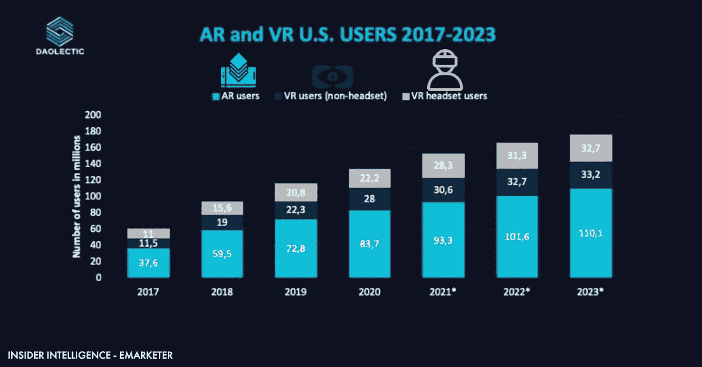**

**根据[Insider Intelligence/Emarketer](https://www.emarketer.com/content/us-virtual-augmented-reality-users-2021)的数据，从 2017 年到 2023 年，美国利用虚拟现实(VR)和增强现实(AR)的人数显示在这个统计数据中。到 2020 年**，美国**将有 8370 万**个人每月至少使用一次增强现实技术。据预测，2023 年**的可比数量将超过**1.1 亿用户！********

****而在市场规模方面呢？****

****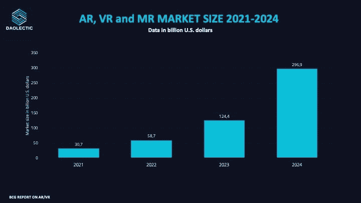****

****根据 [BCG 报告(波士顿咨询集团)](https://www.bcg.com/de-at/capabilities/digital-technology-data/emerging-technologies/augmented-virtual-reality)预测，全球增强现实(AR)、虚拟现实(VR)和混合现实(MR)市场将在 2021 年达到 307 亿美元，到 2024 年增长到 3000 亿美元以上。****

## ****元宇宙用例****

****元宇宙对各种背景和兴趣的人来说有各种各样的吸引力。****

****根据 2021 年末对互联网用户进行的一项研究，超过一半的受访者表示他们将加入元宇宙，以便利用 T2 的就业机会，如虚拟工作场所和网络。**艺术和现场娱乐**被 48%的受访者认为是加入元宇宙的主要原因，而**投资**加密货币和不可替代代币被 44%的人认为是主要原因。****

****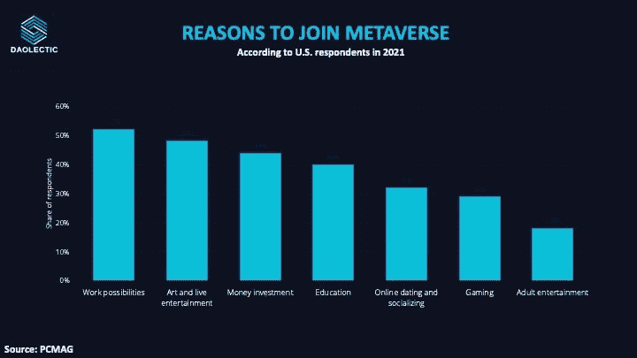****

****在深入研究元宇宙的商业可能性之前，有必要彻底了解元宇宙平台真正能实现的功能:****

****1) **游戏**:在元宇宙，游戏将变得更加身临其境(更适合位置感，更社会化，更具参与性)，并由数量呈指数增长的制作人开发。****

****如前所述，NFT 将被用作游戏中的资产，它们将为数字资产提供一种合法的机制来保持价值，并不仅在一个游戏中使用，而且可能在几个游戏中使用，甚至在游戏之外使用。这与元宇宙在游戏中出现的身份和所有权的概念是一致的，而不仅仅是在特定的游戏中。****

****星图，沙盒，分散地****

****2) **社交互动**:元宇宙使用了许多在游戏中实现虚拟世界的技术，将允许我们通过活动进行社交，而不仅仅是交换照片和新闻链接(社交媒体模式)。****

****3) **房产**:元宇宙有望成为个人对想看的房产进行预筛选，以及返回和查看房产增强信息的主要手段。****

****元宇宙的房地产是指“土地”财产。考虑到它们是在区块链开发的，不可替代代币(NFT)通常用于在 metaverses 中买卖“土地”。这是元宇宙的财产。人们觉得这种虚拟房地产很稀有，很有价值，值得花钱购买。因此，在早期用户中，拥有它已经成为一种声望象征。除了声望，所有权意味着对元宇宙社会的承诺。元宇宙房地产的发展对玩家如何与之互动有着巨大的影响。****

****4) **学习和教育**:元宇宙的教育将更具沉浸感和社会性。从传统学校教育到企业培训，再到基于技能的学习，一切都将受到影响(比如如何用增强现实来修理你的洗碗机)。****

****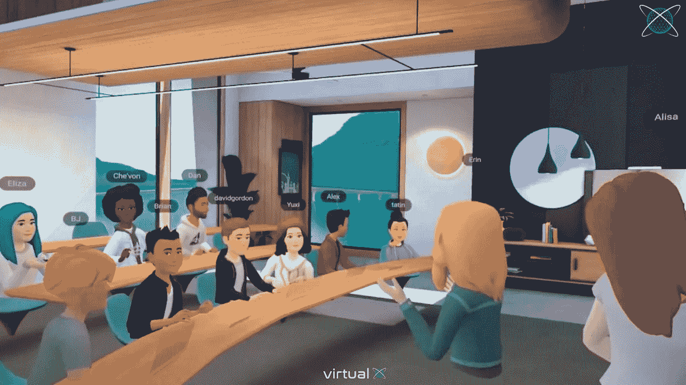****

****5) **协作**:我们已经使用 Zoom 或 Discord 等应用进行交流。然而，未来沉浸感的增加将允许员工以目前的技术难以实现的方式参与进来。****

****6) **现场音乐**:堡垒之夜和 Roblox 已经打破了现场音乐活动的记录，吸引了数千万粉丝。****

****7) **物理体验**:元宇宙还将包含物理场馆内的活动，我们将向其介绍元宇宙。因此，我们将能够以新颖的方式解释、修改和复制现实世界，这将节省我们的时间，并在我们的生活和事业中开辟新的机会。****

****今天的社交网络主要关注分享材料，而元宇宙将关注分享行为。****

****随着它的发展，融入了身临其境的学习、零售、教育、旅行和其他以前无法想象的用途，它将成为一个身临其境的数字舞台，在那里你可以与人一起参与活动，而不仅仅是被动地看着网站和应用程序。****

****在我们的一堂课中，我们有一个疯狂的机会去拥抱一次最先进的超时空的真实旅程。首席执行官阿图尔·瑟乔夫向我们解释了这个项目的愿景以及如何沉浸在这个空间中。****

****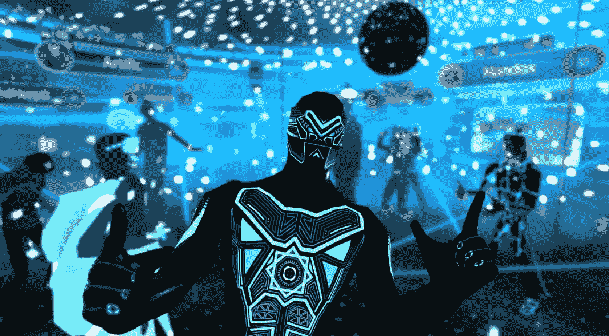****

****Somnium Space 是一个开放的社交虚拟现实世界，建立在以太坊区块链上，在这里可以购买土地，建造或进口物品，并立即享受或货币化资产。Somnium space 是一个由其用户群体明确塑造的宇宙。****

****我强烈推荐你看一下这个 YouTube 视频，在这个视频中阿图尔做了一个 TedX 演讲，同时处理了真实的和元宇宙的化身！****

****元宇宙平台的另一个例子是分散的土地是一个总部设在区块链的软件应用程序，旨在激励全球网络的用户管理一个共享的虚拟环境。****

****分散土地的用户可以购买和出售数字房地产，也可以在这个虚拟世界中探索、参与和玩游戏。随着时间的推移，该平台已经发展到包括交互式应用、在线支付和点对点对话。此外，开发者可以在分散土地的平台上通过定制虚拟房地产的动画和交互性进行创新。****

****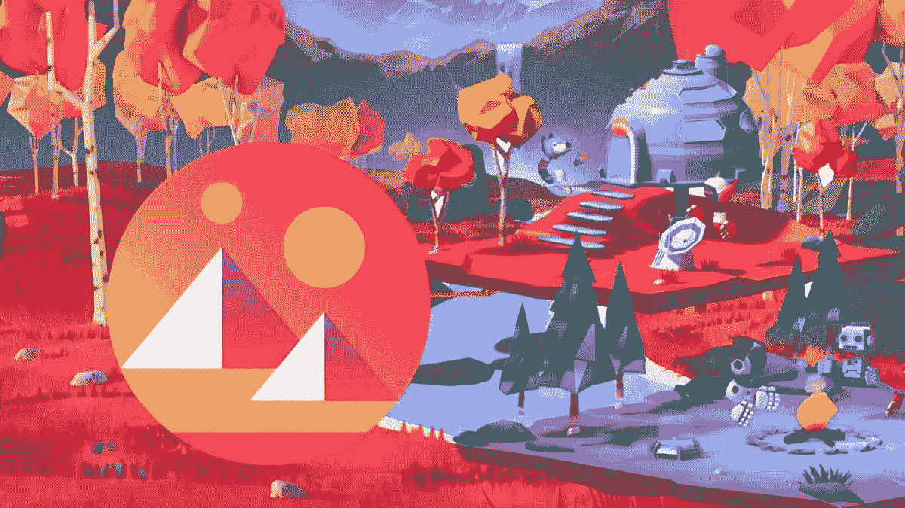****

****总而言之，今天的社交网络主要关注分享材料，而元宇宙将关注分享行为。随着它的发展，融入了身临其境的学习、零售、教育、旅行和其他以前无法想象的用途，它将成为一个身临其境的数字舞台，在这里你可以与人一起参与活动，而不仅仅是看网站和应用程序。****

# ****元宇宙的游戏角色:****

****在引入区块链驱动的游戏之前，用户更喜欢参与多人游戏。另一方面，区块链技术对在线游戏世界产生了巨大影响。当谈到 NFT 和加密货币等用例时，游戏产品的令牌化和用加密货币兑换货币的能力等功能令游戏玩家感到震惊。****

****元宇宙的游戏以“游戏赚钱”的概念为核心，这使得用户能够赢得虚拟游戏产品，然后他们可以出售这些产品来获得现实世界的金钱。元宇宙的用户可以请求他们的社交媒体朋友加入他们玩游戏，与元宇宙的其他成员互动，并且作为一个群体合作享受游戏。****

****因为元宇宙利用增强现实和虚拟现实技术来产生更有机的体验，玩家获得了与他们在现实世界中相同的真实体验。此外，元宇宙游戏平台的互操作性允许玩家将他们的游戏设备从一个地方移动到另一个地方，而不必进行大的改变。****

****这家大型科技公司正朝着 M&A 的方向发展，以拥抱这一新模式。在以 687 亿美元收购暴雪后，微软首席执行官塞特亚·纳德拉说****

*****“游戏是当今所有平台中最具活力和最激动人心的娱乐类别，并将在元宇宙平台的发展中发挥关键作用，”*****

****从 2021 年 11 月在美国游戏玩家中进行的一项民意调查结果中也可以看出这一趋势。十分之六的受访者正考虑参与游戏赚钱行为，以便在虚拟世界中赚钱。更重要的是，39%的受访者表示，他们将通过拥有虚拟财产并将其出租的方式来实现元宇宙体验的货币化。****

****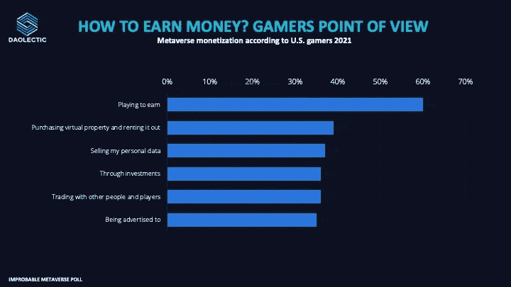****

****玩家可以出售他们的资产，也可以积累资产，直到他们从平台上获得奖励，这取决于游戏的独特规则。偏爱真钱游戏和加密货币空间的人是那些在全球范围内称赞 NFT 成功的人。除了可观的投资回报之外，这类游戏之所以受欢迎，是因为它们对现实生活中的事物进行了高质量的视觉再现，以及视觉上令人惊叹的视觉效果。****

# ****结论****

****在这一深入探索结束时，需要记住的关于元宇宙的最重要的见解如下:****

****元宇宙将开创一个现代社会互动和交流的新时代。****

****它由多层构成，每一层对这一新生态系统的发展都至关重要。因此，未来将有足够的空间让各种各样的商业参与者茁壮成长。****

****不会有一个占主导地位的元宇宙，但未来极有可能会有一个多元宇宙(众多的元诗句)。为了实现多元宇宙范式，有必要能够从一个元宇宙(平台)到另一个。****

****尽管 2021 年前后令人兴奋，但投资者仍对投资该地区持观望态度。****

****假设市场至少需要 2/3 年来完全“消化”这一新技术，并为其在一般市场中的广泛接受留出空间，这是现实的。****

****就我个人而言，与来自世界各地的几个人分享见解、信息、想法和不同的观点是一次很棒的经历。区块链和加密货币以及元宇宙的魅力在于它们是全球性的，将不同文化和国家的人们联系在一起。****

****企业应该接受由此产生的多样性，认识到各种互动平台对不同的社区成员更有意义。****

****区块链的成功越来越依赖于其社区的凝聚力和互动性，社区是生态系统的脸面。****

****总之，尽管今年产生了巨大的炒作，但有必要强调的是，元宇宙仍然是一个新生的市场，需要坚实的基础(即在这个生态系统的各个细分市场中拥有经验证的技术堆栈和商业模式的新兴公司)以及广泛的用户准备，才能被视为社交体验的新范式。****

# ****放弃****

****在任何情况下，这都不是财务建议，我研究的目标将永远是深入项目并从不同角度研究它们，我确实包括了基于我最近研究的类似项目的经验的个人意见。****

****我现在和将来都愿意接受讨论。****

******在 Twitter 上关注我们:******

******@道辛******

******在投资任何东西之前，请务必做好调查**。****

> *****加入 Coinmonks* [*电报频道*](https://t.me/coincodecap) *和* [*Youtube 频道*](https://www.youtube.com/c/coinmonks/videos) *了解加密交易和投资*****

# ****另外，阅读****

*   ****[Bookmap 点评](https://coincodecap.com/bookmap-review-2021-best-trading-software) | [美国 5 大最佳加密交易所](https://coincodecap.com/crypto-exchange-usa)****
*   ****最佳加密[硬件钱包](/coinmonks/hardware-wallets-dfa1211730c6) | [Bitbns 评论](/coinmonks/bitbns-review-38256a07e161)****
*   ****[新加坡十大最佳密码交易所](https://coincodecap.com/crypto-exchange-in-singapore) | [收购 AXS](https://coincodecap.com/buy-axs-token)****
*   ****[红狗赌场评论](https://coincodecap.com/red-dog-casino-review) | [Swyftx 评论](https://coincodecap.com/swyftx-review) | [CoinGate 评论](https://coincodecap.com/coingate-review)****
*   ****[投资印度的最佳加密软件](https://coincodecap.com/best-crypto-to-invest-in-india-in-2021)|[WazirX P2P](https://coincodecap.com/wazirx-p2p)|[Hi Dollar Review](https://coincodecap.com/hi-dollar-review)****
*   ****[加拿大最好的加密交易机器人](https://coincodecap.com/5-best-crypto-trading-bots-in-canada) | [库币评论](https://coincodecap.com/kucoin-review)****