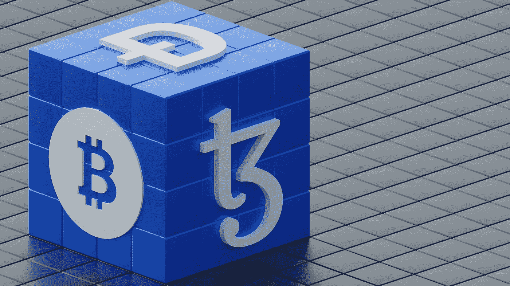

# 对比特币的期望

> 原文：<https://medium.com/coinmonks/expectations-on-bitcoin-91874b748237?source=collection_archive---------72----------------------->

## 属于投资者阶层的前 2%?

Photo by [Shubham Dhage](https://unsplash.com/@theshubhamdhage?utm_source=medium&utm_medium=referral) on [Unsplash](https://unsplash.com?utm_source=medium&utm_medium=referral)

在比特币和以太坊明显“死亡”后，许多人转向替代币，甚至更多人转向狗屎币。他们的期望是——现在仍然是——获得原始资本 10 倍或 100 倍的杠杆收益。
他们的预期基于**像 BTC 和**这样的价值硬币在过去所遵循的轨迹:今天是一个小投资——他们认为…