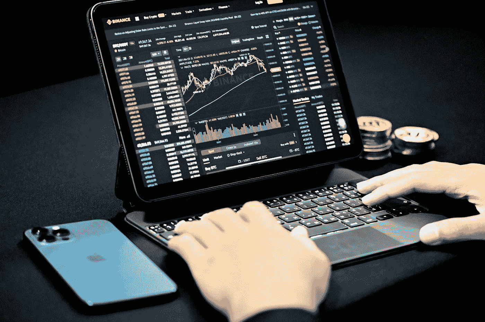
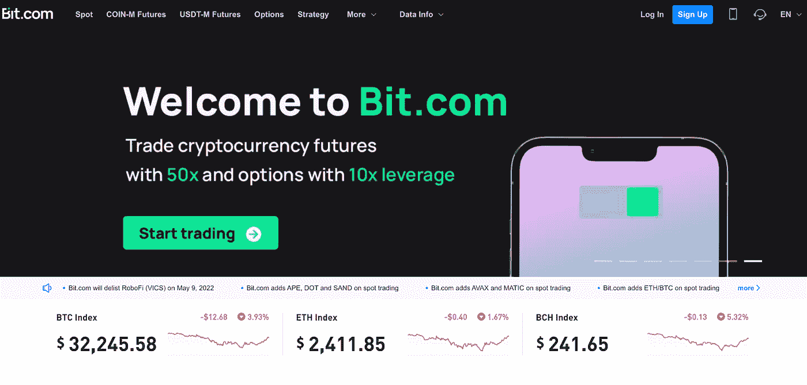

# 体验 Bit.com 统一保证金交易

> 原文：<https://medium.com/coinmonks/experience-unified-margin-trading-with-bit-com-8b1676e48697?source=collection_archive---------36----------------------->

将风险降至最低，从一个账户交易所有工具

Source: [www.unsplash.com](http://www.unsplash.com)

加密市场是高度不稳定的，为了盈利，他们需要小心谨慎，确保做出正确的决定。其中一个对个人交易过程有重大影响的决定是使用统一保证金账户。

统一保证金账户是一种加密交易功能，允许用户在一个账户内交易所有工具，如现货、保证金、期货、永久掉期和期权。一个良好的统一保证金账户与投资组合保证金模型相结合，使用户能够受益于行业领先的风险管理系统，优化资本利用率。具有统一保证金账户功能的交易所之一是 bit.com。

## 【Bit.com 统一保证金交易功能

Source: [www.bit.com](http://www.bit.com)

Bit.com 是一家成立于 2020 年的加密货币交易所，由总部位于新加坡的综合金融服务公司 Matrixport 提供支持。自成立以来，它一直支持 BTC、瑞士联邦理工学院和 BCH 的永久、期货和期权交易，尤其是在推出 BCH 期权方面的先锋地位。

它致力于提供价格发现、交易策略执行和流动性供应。它通过为我们的用户列出新的和令人兴奋的令牌，不断推动金融产品创新的边界。它基于最先进的 10，000 TPS 匹配引擎，往返延迟小于 50 毫秒。

Bit.com 推出了统一保证金功能，允许用户使用同一个账户进行现货、保证金、永久、期货和期权交易，而无需在多个账户之间转移资金。

作为一个安全、高性能的加密货币交易所，统一保证金的引入是 Bit.com 区别于其他加密交易所的独特之处。统一保证金(UM)是一种先进的交易和风险管理系统，采用单一账户解决方案提供现货、特征、保证金、永久和期权交易。

对于统一保证金账户，用户不同货币的资产以 USDT 值计算，每种货币(BTC、瑞士联邦储蓄银行、USDC 等)具有预定的[折减率](https://support.bit.com/hc/en-us/articles/4407171451545-4-Haircut-ratio)。).它们被用作所有交易产品下单和持仓的保证金。与传统交易系统相比，这一独特功能增强了用户的交易体验，优化了资本利用率。

使用统一保证金模型，即使结算货币的可用余额不足，用户也可以卖出一种货币或交易多种货币的衍生品。在这种情况下，只要 USDT 的总可用余额足够，系统将通过借贷来完成交易。此外，它支持合并头寸，因为用户将能够合并和抵消多个头寸之间的损益。在这种模式下，特定头寸的损失不一定会触发强制平仓，只有当整体账户风险非常严重时。

Bit.com 最初是一家期权交易所，在迅速发展成为全球第二大期权交易所后，现在正寻求多元化发展。统一保证金账户证明了 bit.com 致力于成为高性能加密货币交易所，同时为用户提供简单安全的交易体验。

Bit.com 的筹资效率有了显著提高。它为用户提供了广泛的金融工具，从其统一的保证金账户中进行选择，并提供 USDT 保证金期货。

USDT 保证金期货是一种加密货币衍生品，允许用户建立多头或空头头寸，并从基础资产价格的上涨/下跌中获利。

bit.com 已经支持 USDT 保证金永续掉期，USDT 保证金期货在 USDT 计价和结算。此外，USDT 保证金期货仅适用于统一保证金模式(UM)用户，不适用于经典模式用户。然而，用户可以[从经典模式迁移到统一保证金模式](https://support.bit.com/hc/en-us/articles/4407127176345-2-How-to-migrate-to-UM-Mode)以享受其独特的属性。

这些新的更新使用户更容易计算 pnl，提供更多的风险控制，并且更加用户友好。

Bit.com 自诩为领先的加密交易所，因为其独特的卖点是高流动性、50 倍杠杆、顶级安全性和增强的用户保护。

> 加入 Coinmonks [电报频道](https://t.me/coincodecap)和 [Youtube 频道](https://www.youtube.com/c/coinmonks/videos)了解加密交易和投资

# 另外，阅读

*   [最佳网上赌场](https://coincodecap.com/best-online-casinos) | [币安评论](/coinmonks/binance-review-ee10d3bf3b6e) | [BitMEX 评论](https://coincodecap.com/bitmex-review)
*   [麻雀交换评论](https://coincodecap.com/sparrow-exchange-review) | [纳什交换评论](https://coincodecap.com/nash-exchange-review)
*   [美国最佳加密交易机器人](https://coincodecap.com/crypto-trading-bots-in-the-us) | [经常性评论](https://coincodecap.com/changelly-review)
*   [在印度利用加密套利赚取被动收入](https://coincodecap.com/crypto-arbitrage-in-india)
*   [Godex.io 审核](/coinmonks/godex-io-review-7366086519fb) | [邀请审核](/coinmonks/invity-review-70f3030c0502) | [BitForex 审核](https://coincodecap.com/bitforex-review)