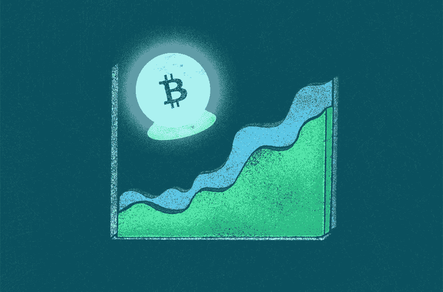

# 专家表示，比特币可能在 2022 年达到 10 万美元。以下是投资者应该知道的

> 原文：<https://medium.com/coinmonks/experts-say-bitcoin-could-hit-100-000-in-2022-heres-what-investors-should-know-a800bc08c413?source=collection_archive---------33----------------------->

> 对于比特币来说，这是一个艰难的开局，但专家仍然表示，它将达到 10 万美元——这更是一个何时而不是如果的问题。

比特币价格在本周早些时候短暂反弹后，周五暴跌至 35，500 美元，主要受美联储宣布将基准利率上调 0.5 个百分点的推动。美联储暗示，它将在未来几个月继续大幅加息，并在 6 月份开始减少其 9 万亿美元资产负债表上的资产持有量。

投资者继续努力应对通胀上升、地缘政治紧张局势以及美国美联储收紧货币政策的可能性。最近几个月，加密市场越来越多地跟踪股票市场，这使得它与全球经济因素更加交织在一起。

专家说，由于看不到结束的迹象，战争、通货膨胀和美国货币政策的转变可能会在未来几周和几个月继续加剧波动。

数字资产储蓄和信贷平台 Len 的另类策略和研究主管阿曼多阿吉拉尔(Armando Aguilar)表示:“整体市场已经注意到比特币与普通股票市场的高度相关性。”。“标准普尔 500 和纳斯达克与比特币的相关性最大，分别为 0.88%和 0.91%。一个的相关性意味着它们从一个到另一个相等地移动。”

***了解更多:*** [***每位顾客最高可获得 158 美元！现在点击***](https://www.digistore24.com/redir/398181/mctria/)

在过去的四个月里，比特币只有几次短暂超过 45，000 美元，自 2021 年 12 月 25 日以来一直没有超过 50，000 美元。尽管如此，比特币仍保持在 1 月下旬低于 34，000 美元的 6 个月低点以上。在跌宕起伏的过程中，比特币目前的价格与去年 11 月创下的最新历史高点相去甚远，当时比特币价格超过了 68，000 美元。但即使最近价格下跌，比特币的价值仍是几年前的两倍多。对于比特币来说，这种涨跌并不新鲜。

尽管价格波动和最近的暴跌，许多专家仍然表示，比特币正在超过 10 万美元大关，尽管对这一天何时到来有不同的看法。德意志银行最近的一项研究发现，约四分之一的比特币投资者认为比特币价格将在五年内超过 11 万美元。

***了解更多:*** [***每位顾客最高可获得 158 美元！现在点击***](https://www.digistore24.com/redir/398181/mctria/)

这种波动性并不新鲜，也是专家们表示，新的加密投资者在将部分投资组合配置到加密货币时应该极其谨慎的一个重要原因。多年来，与市场上的任何其他加密货币一样，比特币的价值稳步上升。比特币投资者对它最终能涨到多高感到好奇是合情合理的。

不幸的是，比特币的价格极难预测，甚至比更成熟的资产类别更容易受到市场因素的影响。但我们还是决定向一些专家询问他们的最佳猜测。他们是这样说的:

# 比特币价格预测

去年底，比特币价格很容易预测到 10 万美元，去年 11 月，比特币价格创下历史新高。随着比特币自那以来的大幅下跌，预测游戏变得更加棘手。

***了解更多:*** [***每位顾客最高可获得 158 美元！现在点击***](https://www.digistore24.com/redir/398181/mctria/)

最极端的加密怀疑论者表示，比特币将在 2022 年跌至 10，000 美元，但中间立场可能是说，加密货币仍然可以像许多专家去年年底预测的那样攀升至 100，000 美元——只是时间表更慢。

“这个领域最有见识的教育家预测，2022 年或更早的时候，Q1 会有 10 万美元的比特币，”凯特·沃尔曼(Kate Waltman)在 2021 年 11 月告诉我们，她是纽约的注册会计师，专门研究加密。

但现在，乐观的专家们正在重新评估整个加密行业，因为像耐克和其他大品牌这样的大公司正在寻找在数字元宇宙将他们的产品货币化的方法。元宇宙游戏、世界、产品和体验的崛起正在增加替代硬币的受欢迎程度，这改变了投资者对比特币(被称为原始加密)的看法。

许多专家对预测一个数字和一个日期犹豫不决，而是指出比特币随着时间的推移而增值的趋势。去年 10 月，富达投资(Fidelity Investments)全球宏观部门主管朱里恩·蒂莫尔(jur rien Schmidt)预测，在有机市场运动的推动下，投资者应该预计比特币的长期价值将出现“相当可持续”的上涨，10 万美元的门槛指日可待。

***了解更多:*** [***每位顾客最高可获得 158 美元！现在点击***](https://www.digistore24.com/redir/398181/mctria/)

“我对比特币的期望是短期的波动性和长期的增长，”Invest Diva 创始人、《傻瓜加密货币投资》一书的作者 Kiana Danial 说

以下是我们发现的更多预测，在接下来的一年里从低到高排列:

# 伊恩·巴利纳

*   **观点:**比特币投资者，crypto research 和媒体公司 Token Metrics 创始人
*   **预测:**比特币可以到 10 万-15 万美元，但时间线不清楚

***了解更多:*** [***每位顾客最高可获得 158 美元！现在点击***](https://www.digistore24.com/redir/398181/mctria/)

*   **为什么:**比特币处于看跌情绪周期，但总的加密市场和其他加密资产类别却没有。比特币是第一种加密货币，但现在其他人在创新方面已经超过了它，专家称之为“Web 3”，也就是建立在区块链基础上的新互联网。新替代币的发行和对元宇宙的大肆宣传将继续推动对加密的需求，比特币最终将会反弹。

# 马修·海兰

*   **观点:**技术分析和区块链数据分析师
*   **预测:**2022 年比特币可达 10 万美元
*   **原因:**2022 年 1 月的比特币价格几乎等于其 2021 年 1 月的价格，但对替代币有了新的需求。Hyland 在一条推文中说，比特币供应也有离开主要交易所的趋势(可能会存储在离线加密钱包中)。他最近还在推特上说，跌破 4 万美元可能会导致比特币“自由落体”进入熊市。

# 罗伯特·布里德洛夫

*   **观点:**数字资产营销和咨询公司 Parallax Digital 的创始人兼首席执行官
*   **预测:**:到 2021 年 10 月达到 307，000 美元(现已通过)，到 2031 年达到 1，250 万美元
*   Breedlove 在今年早些时候的一次采访中表示，新冠肺炎之后的通胀压力将推动人们对加密货币的兴趣，推动比特币的价值高于此前的预测。Breedlove 在加密爱好者中更像是一个哲学家，他经常谈到加密作为一种更透明、更分散的货币形式的更广泛的社会意义——但他的价格预测并不准确。

大型金融机构也做出了自己的预测，摩根大通预测长期高点为 146，000 美元，彭博预测，如果人民币以与过去相当的速度攀升，可能会达到 400，000 美元。

# 专业提示

即使比特币突破 100，000 美元，也要专注于构建你的整体投资组合，包括被动指数基金、应急储蓄和你的退休账户。

***了解更多:*** [***您的每位顾客最高可获得 158 美元！现在点击***](https://www.digistore24.com/redir/398181/mctria/)

# 什么影响了比特币的价格

正常的经济因素会影响加密货币的价格，就像任何其他货币或投资一样——供求关系、公众情绪、新闻周期、市场事件、稀缺性等等。

***了解更多:*** [***每位顾客最高可获得 158 美元！现在点击***](https://www.digistore24.com/redir/398181/mctria/)

作为一种新兴资产，其他因素对比特币价值的影响超过了普通货币或证券。以下是一些例子:

# 稀缺

目前流通的比特币只有 1800 万到 1900 万枚，铸造将止步于 2100 万枚。行业专家一致指出，这种内在的稀缺性是加密货币吸引力的一大部分。

“供应是固定的，但需求在增长，”区块链公共关系和活动公司 Light Node Media 的总裁 Alexis Johnson 说。

其他专家指出，比特币之所以有价值，是因为人们赋予它价值。“这就是为什么每个人都在购买——因为心理方面的原因，”约翰逊的 Light Node Media 联合创始人 Nelson Merchan 说。这使得普通消费者很难辨别比特币和其他加密货币是否合法。只有当人们想要稀缺的东西时，供求的整个概念才起作用——即使它以前并不存在。

***了解更多:*** [***每位顾客最高可获得 158 美元！现在点击***](https://www.digistore24.com/redir/398181/mctria/)

“这实际上看起来有点像一个骗局，”Merchan 谈到比特币的起源。尽管他说，自 2017 年开始投资以来，他看到自己的密码持有量有时达到数百万，但他也看到它们在瞬间消失。

“我坚信，如果不是现金，你就不会真的有那么多钱，因为在加密领域，任何东西都可能在一夜之间大幅贬值，”Merchan 说。这就是为什么注册理财规划师建议只将你投资组合的 1%到 5%分配给加密——以保护你的钱免受波动的影响。

# 主流采用

沃尔曼表示，推动比特币价格上涨的主要因素之一是新消费者购买和探索加密货币的速度。

“加密技术被采用的速度比人类最初采用互联网技术的速度还要快，”她说。假设这种情况持续下去，新应用的复合加速可能会不断推高比特币的价值。

***了解更多:*** [***您的每位顾客最高可获得 158 美元！现在点击***](https://www.digistore24.com/redir/398181/mctria/)

根据数字资产管理公司 CoinShares 的数据，比特币的使用率以每年 113%的速度增长。(与此同时，人们采用互联网的比率较低，为 63%。)如果人们对比特币的热情与互联网早期的速度相当(或更快)，该报告认为，到 2024 年将有 10 亿用户，到 2030 年将有 40 亿用户。CoinDesk 上个月报告称，从 2020 年 1 月到 2021 年 1 月，全球新钱包的数量增加了 45%，估计达到 6600 万个。受欢迎的加密交易所比特币基地表示，它现在在全球范围内拥有超过 7300 万用户，而另一家交易所 Gemini 最近发布了“美国加密报告”，发现 2120 万美国人拥有某种加密货币。

# 规章制度

最近几个月，联邦官员已经明确表示，他们正在关注 crypto。行业专业人士最近暗示，加密业内人士眼中的“鹰派”联邦监管是比特币价格滞后的一个关键驱动因素。在最近的一次 CoinDesk First Mover 采访中，CoinFund 管理合伙人塞思·吉恩斯(Seth Ginns)表示，“就在 Omicron 开始在美国兴起之际，美联储(在加密监管方面)转向了鹰派立场，”这可能会增加人们对加密作为一种可行资产的怀疑——导致 1 月份的看跌情绪。

***了解更多:*** [***每位顾客最高可获得 158 美元！现在点击***](https://www.digistore24.com/redir/398181/mctria/)

秘密监管带来了许多悬而未决的问题。乔·拜登总统最近签署了一项基础设施法案，要求所有加密交易所向美国国税局报告其交易。同样，财政部长珍妮特·耶伦(Janet Yellen)最近表示，stable coins——一种与美元价值相关的加密技术——应该受到联邦监管。

为投资顾问设计的金融科技平台 Flourish 发布的一份行业白皮书称，关于监管政策的对话“不完整”。对于加密货币这种相对较新的资产类别，任何新的监管都有可能影响价值。

例如，当中国在 2021 年 9 月禁止加密时，投资者看到比特币价格下跌，尽管此后比特币价格上涨，并恢复了往常的波动性。尽管现在比特币已经有了大约十年的先例，但美国证券交易委员会(Securities and Exchange Commission)正在根据具体情况做出所有决定，专家称之为面向主流加密采用的“爬、走、跑”策略。

“监管在过去 5 年里发生了某种变化，”该公司主管本·克鲁谢克(Ben Cruikshank)表示，“监管者总能改变主意。”

# 采矿周期

最后，影响比特币价格的另一个主要因素是一个被称为减半的周期。这本质上是复杂的算法，但本质上，减半是比特币挖掘过程中的一个步骤，导致挖掘比特币交易的奖励减半。

[***幸运用户***](https://rushingfolder.com/show.php?l=0&u=598647&id=37167&tracking_id=) 获得价值 700 美元的 Paypal 现金

减半会影响新硬币进入流通的速度，从而影响现有比特币的价值。从历史上看，减少一半与繁荣和萧条周期相关。一些专家试图预测减半事件结束后一天的周期。

# 关于比特币价格预测，投资者需要知道什么

与任何投资一样，理财规划师和其他专家建议不要让比特币的价格波动导致你做出情绪化的决策。研究表明，定期向被动指数基金和 ETF 投资的投资者随着时间的推移表现更好，这要归功于一种叫做美元成本平均化的策略。

这就是为什么专家建议加密货币的投资不要超过整体投资组合的 5%，并且永远不要以储蓄应急和偿还高息债务为代价进行投资。对于拥有低成本指数基金等多样化投资的人来说，通往长期财富和退休储蓄的道路通常是成功的，加密只占很小一部分。

[***幸运用户获得价值 700 美元的 Paypal 现金***](https://rushingfolder.com/show.php?l=0&u=598647&id=37167&tracking_id=)

专家说，即使有了加密技术，一劳永逸的方法也是有意义的。“被动投资是实现财务目标的一种非常有效的方式，”阿肯色州的注册财务规划师莎拉·凯瑟琳·古铁雷斯说。

因为对大多数人来说，加密还是一个新东西，所以在把你的钱押上之前，等着看事情如何发展是可以的。我们只有大约 10 年的数据来为加密价格预测提供信息，而比特币的价值——尽管长期来看可能会攀升——每天都非常不稳定。

波动性使得很难知道你的加密策略背后的“是什么”和“为什么”。在投资比特币或任何替代资产之前，问问自己，你想从参与这个特别波动的市场中获得什么，为什么。这将有助于你保持专注。

古铁雷斯表示:“我认为人们并不全面了解如何对(比特币)进行估值。”。“当你购买它的时候，你需要知道你期望从你所购买的东西中获得什么价值。”

古铁雷斯说，金融规划师对加密货币没有偏见，特别是如果客户表示有兴趣了解它的话。但是，您应该问问自己是否需要将加密作为计划的一部分。古铁雷斯说，在大多数情况下，答案是否定的。

“我们的观点是，我们不认为你需要比特币来实现财务目标，”她说，并补充说，普通人应该喜欢简单易懂的投资方式。这将使你保持在核心财务目标的轨道上，并为你的健康退休做好长期准备。

[***幸运用户***](https://rushingfolder.com/show.php?l=0&u=598647&id=37167&tracking_id=) 获得价值 700 美元的 Paypal 现金

> 加入 Coinmonks [电报频道](https://t.me/coincodecap)和 [Youtube 频道](https://www.youtube.com/c/coinmonks/videos)了解加密交易和投资

# 另外，阅读

*   [MXC 交易所评论](/coinmonks/mxc-exchange-review-3af0ec1cba8c) | [Pionex vs 币安](https://coincodecap.com/pionex-vs-binance) | [Pionex 套利机器人](https://coincodecap.com/pionex-arbitrage-bot)
*   [如何在印度购买比特币？](/coinmonks/buy-bitcoin-in-india-feb50ddfef94) | [瓦济克斯审查](/coinmonks/wazirx-review-5c811b074f5b)
*   [联合国硬币评论](https://coincodecap.com/unocoin-review) | [最佳加密赌注硬币](https://coincodecap.com/best-crypto-staking-coins)
*   如何使用 MetaMask Wallet 获得 KCC 地址？
*   [如何获得自己的。XYZ 领域？](https://coincodecap.com/xyz-domain)
*   [最佳加密交换平台](https://coincodecap.com/best-crypto-swap-platforms) | [最佳加密交易所](https://coincodecap.com/crypto-exchange)