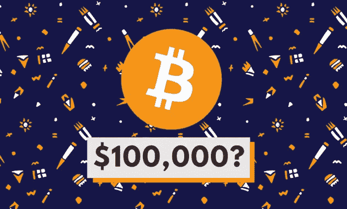

# 专家表示，比特币可能在 2022 年达到 10 万美元。以下是投资者应该知道的

> 原文：<https://medium.com/coinmonks/experts-say-bitcoin-could-hit-100-000-in-2022-heres-what-investors-should-know-bd582bc256eb?source=collection_archive---------60----------------------->

对于比特币来说，这是一个艰难的开局，但专家仍然表示，它将达到 10 万美元——这更多的是一个时间问题，而不是如果。

比特币的价格在短暂跌破最近的涨势后，周四继续在 43，500 美元附近徘徊。上周，金价自 3 月 2 日以来首次跳回到 45000 美元上方。上周，比特币价格持续上涨，一度突破 48000 美元大关。在 24 小时内，包括比特币在内的大多数加密货币都出现了亏损。总体而言，在美国美联储发表鹰派言论后，市场周三晚间下跌。美联储周三 3 月会议的纪要显示，计划每月缩减 950 亿美元的资产负债表，以对抗通胀。虽然比特币在过去七天下跌了 6%，但最近几周比特币一直在上涨。当前的飙升是在美联储本月早些时候宣布三年来首次加息以及乔·拜登总统关于加密货币的新行政命令之后。该命令指示政府机构协调监管加密货币的策略，专家表示，从长远来看，这可能会给加密市场带来更多稳定。

*如果你喜欢这篇文章的内容，请花一点时间点击我的个人资料上的关注按钮和这篇文章底部的掌声按钮。*

由于俄罗斯在乌克兰的战争，比特币最近也出现了额外的波动。专家说，这场战争看不到尽头，未来几天可能会继续引发更多波动。
在过去的三个月里，比特币只有几次短暂超过 45，000 美元，自 2021 年 12 月 25 日以来一直没有超过 50，000 美元。尽管如此，比特币仍保持在 1 月下旬低于 34，000 美元的 6 个月低点以上。在跌宕起伏的过程中，比特币目前的价格与去年 11 月创下的最新历史高点相去甚远，当时的价格超过了 68，000 美元。但即使最近价格下跌，比特币的价值仍是几年前的两倍多。对于比特币来说，这种涨跌并不新鲜。
尽管价格波动和最近的暴跌，许多专家仍然表示比特币正在突破 10 万美元大关，尽管对于这一时刻的确切时间有不同的看法。德意志银行最近的一项研究发现，约四分之一的比特币投资者认为比特币价格将在五年内超过 11 万美元。
波动性并不是什么新鲜事，这也是专家们表示，新的加密投资者在将部分投资组合配置到加密货币时应该极其谨慎的一个重要原因。多年来，与市场上的任何其他加密货币一样，比特币的价值稳步上升。比特币投资者对它最终能涨到多高感到好奇是合情合理的。

不幸的是，比特币的价格极难预测，甚至比更成熟的资产类别更容易受到市场因素的影响。

# 看看我的文章[当他们问你“为什么是比特币”](https://link.medium.com/WeAh0s8D7ob)

> 加入 Coinmonks [电报频道](https://t.me/coincodecap)和 [Youtube 频道](https://www.youtube.com/c/coinmonks/videos)了解加密交易和投资

# 另外，阅读

*   [3 商业评论](/coinmonks/3commas-review-an-excellent-crypto-trading-bot-2020-1313a58bec92) | [Pionex 评论](https://coincodecap.com/pionex-review-exchange-with-crypto-trading-bot) | [Coinrule 评论](/coinmonks/coinrule-review-2021-a-beginner-friendly-crypto-trading-bot-daf0504848ba)
*   [莱杰 vs n rave](/coinmonks/ledger-vs-ngrave-zero-7e40f0c1d694)|[莱杰 nano s vs x](/coinmonks/ledger-nano-s-vs-x-battery-hardware-price-storage-59a6663fe3b0) | [币安评论](/coinmonks/binance-review-ee10d3bf3b6e)
*   [Bybit Exchange 评论](/coinmonks/bybit-exchange-review-dbd570019b71) | [Bityard 评论](https://coincodecap.com/bityard-reivew) | [Jet-Bot 评论](https://coincodecap.com/jet-bot-review)
*   [3 commas vs crypto hopper](/coinmonks/3commas-vs-pionex-vs-cryptohopper-best-crypto-bot-6a98d2baa203)|[赚取秘密利息](/coinmonks/earn-crypto-interest-b10b810fdda3)
*   最好的比特币[硬件钱包](/coinmonks/hardware-wallets-dfa1211730c6) | [BitBox02 回顾](/coinmonks/bitbox02-review-your-swiss-bitcoin-hardware-wallet-c36c88fff29)